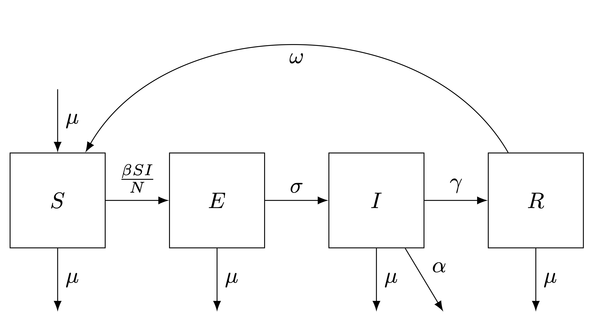

## Set-up
```{r}
# rm(list = ls())
library(wesanderson)
library(GillespieSSA)
library(tidyverse)
library(GA)
```

## Background

The traditionally held belief that most modern infectious diseases emerged when humans began living in larger agricultural settlements has been challenged by studies of modern hunter-gatherers. This study will investigate which emerging pathogens may persist in hunter-gatherer groups by constructing a compartment model of infectious disease transmission that accounts for demography and multi-band structure. This study will look to understand how the critical community size required to sustain an outbreak is affected by host population dynamics. We show that metapopulation structure increases the probability of a respiratory pathogen with waning immunity persisting after 3 years. The probability of persistence increases with the number of sub-populations but is largely determined by the duration of immunity. Understanding the origins of infectious diseases is an important area of research that will lead to improved strategies for reducing their global burden.

This report will cover the full analysis undertaken to generate the results used in my MSc project. A full description of the research project aims and methods can be found in the final paper in the [`Hunter_Gatherer_models`](https://github.com/matthewhoyle/Hunter_Gatherer_models) GitHub repository.  Some code used in this project was adapted from the tutorials attached to the `GillespieSSA` package. 

## Model Parameter estimation

### Agta Hunter-Gatherer Demography

Modern-day hunter-gatherers are often used to make inferences about pre-agricultural human populations. This study modeled the host population on a group of indigenous hunter-gatherers from the Northern Phillipines known as the Agta. Information regarding births, deaths and population size were obtain from a study conducted by Headland et al., (2011). Authors conducted a census-like survey of the Agta that followed $\sim$4,300 individuals over the period of 1950-2010. This date was first explored to understand Agta demography.


```{r}
agta_demo <- read.csv("Agta_Data/AgtaPopDynamics_Headland2007.csv")

ggplot(agta_demo, aes(x=Year)) +
  geom_line(aes(y=PopSize), colour = wes_palettes$Darjeeling1[1]) +
  geom_line(aes(y=Births), colour = wes_palettes$Darjeeling1[2]) +
  geom_line(aes(y=Deaths), colour = wes_palettes$Darjeeling1[3]) +
  theme_bw()
```

#### Population Size
```{r}
hist(agta_demo$PopSize)
summary(agta_demo$PopSize)
```

#### Births
```{r}
hist(agta_demo$Births)
summary(agta_demo$Births)
```

#### Deaths
```{r}
hist(agta_demo$Deaths)
summary(agta_demo$Deaths)
```

#### Birth/Death rate per person per day

Birth rate was estimated from this data by taking the mean of the annual number of births divided by two times the annual number of females. This was then scaled appropriately to obtain the daily mean birth rate per person. 

```{r warning=FALSE}
agta_demo <- agta_demo %>%
  mutate(Birth_rate = Births/(Female*2),
         Birth_rate_daily = (1 + Birth_rate) ^ (1/365) - 1,
         Death_rate = (Deaths/PopSize),
         Death_rate_daily = (1 + Death_rate) ^ (1/365) - 1,
         PopChange = (diff = PopSize - lag(PopSize, default = first(PopSize))),
         PopChange_rate = abs(PopChange)/PopSize,
         PopChange_rate_daily = (1 + PopChange_rate) ^ (1/365) - 1)
head(agta_demo)


hist(agta_demo$Birth_rate)
hist(agta_demo$Death_rate)

ggplot(agta_demo, aes(x=Year)) +
  geom_line(aes(y=Birth_rate), colour = wes_palettes$Darjeeling1[2]) +
  geom_line(aes(y=Death_rate), colour = wes_palettes$Darjeeling1[3]) +
  theme_bw()

demo_sum <- agta_demo %>%
  select(PopSize, Birth_rate, Birth_rate_daily, Death_rate, Death_rate_daily, PopChange_rate, PopChange_rate_daily) %>%
    summarise(across(
    .cols = is.numeric, 
    .fns = list(Mean = mean, SD = sd), na.rm = TRUE, 
    .names = "{col}_{fn}"
    ))
demo_sum 

demo_sum <- as.list(demo_sum)
```

### Agta Band Size

Data regarding camp size of Agta hunter-gatherers was obtained from a study of 615 individuals from 15 camps in in the municipality of Palanan, the Northern Philippines published by Dyble et al. (2021).

```{r}
# Import Camp data from Mark Dyble
camps.data <- read_csv("Agta_Data/camps.csv")

head(camps.data)
```


```{r}
# Explore camp size
hist(camps.data$camp_total)

camp.size <- camps.data %>%
  summarise(mean = mean(camp_total),
            sd = sd(camp_total),
            min = min(camp_total),
            max = max(camp_total),
            var = var(camp_total))
camp.size
```

### Pathogen X

For the purpose of this investigation we formulated a hypothetical respiratory pathogen, referred to as pathogen X. Taking into account the biological trade-offs between high transmissibility and high pathogenicity, pathogen X was decided to be highly infectious with a relatively low case fatality rate of 0.005. Transmission occurred via close contact with an infected individual. Infection was characterised by a latent period of 5.7 days followed by an infectious period of 5 days. Individuals who recovered from infection were immune for 100 days, after which immunity waned and individuals became susceptible to re-infection. Based on these characteristics, the parameters in table 1 were assumed and input into the final models.

**Parameter** | **Rate**              | **Value**
---           | ---                   | ---  
$\beta$       |  Transmission         | 0.6 
$\sigma$      |  Infectious           | 0.175 
$\gamma$      |  Recovery             | 0.2 
$\alpha$      |  Death from Infection | 0.001
$\omega$      |  Waning Immunity      | 0.01


## Single Population Model

To investigate the persistence of a hypothetical respiratory pathogen in hunter-gatherers, this study chose to simulate disease transmission using a compartment model approach as outlined in the introduction. Two models were constructed to investigate compare the effect of metapopulation structure on disease persistence. This first describes the transmission of a pathogen within a single population with demography and waning immunity to re-infection over time.


\
<center>





</center>
\
\
\

\begin{align*}
  \frac{{{\mathrm{d}}S}}{{{\mathrm{d}}t}} & = \underbrace {\mu N}_{{\mathrm{birth}}}~ - ~\underbrace {\frac{\beta SI}{N}}_{{\mathrm{infection}}}~~ + \underbrace {\omega R}_{{\mathrm{lost}}\,{\mathrm{immunity}}} - \underbrace {\mu S}_{{\mathrm{death}}} \\
  \frac{{{\mathrm{d}}E}}{{{\mathrm{d}}t}} & = \underbrace {\frac{\beta SI}{N}}_{{\mathrm{infection}}}~ - ~\underbrace {\sigma E}_{{\mathrm{latency}}} - \underbrace {\mu E}_{{\mathrm{death}}} \\
  \frac{{{\mathrm{d}}I}}{{{\mathrm{d}}t}} & = \underbrace {\sigma E}_{{\mathrm{latency}}} - \underbrace {\gamma I}_{{\mathrm{recovery}}} - ~\underbrace {\left( {\mu + \alpha } \right)I}_{{\mathrm{death}}} \\
  \frac{{{\mathrm{d}}R}}{{{\mathrm{d}}t}} & = \underbrace {\gamma I}_{{\mathrm{recovery}}} - \underbrace {\omega R}_{{\mathrm{lost}}\ {\mathrm{immunity}}} - \underbrace {\mu R}_{{\mathrm{death}}}
\end{align*}

\
\


Where transmission is frequency dependent, ${\frac{\beta SI}{N}}$, $\frac{1}{\sigma}$ is the duration of the latent phase, $\frac{1}{\gamma}$ is the duration of infection, $\frac{1}{\omega}$ is the duration of immunity and death from infection occurs at the rate $\alpha$. Individuals can be born into S and die naturally from any compartment at a rate of $\mu$.


### Model Set-up

Model was set up with a single randomly selected camp size with a single infected individual and parameters for pathogen X. 

```{r}
# Define Paramenters
N <-    sample(camps.data$camp_total, 1)    # Population size
initial_infected <-  1    # Initial infected
simName <- "SEIRS model"       # Simulation name
tf <- 365*3

#Collect parameters
parms <- list(
  beta = 0.6,
  sigma = 0.175,                          # E to I rate
  gamma = 0.2,                           # I to R rate
  omega = 1/100,                         # R to S rate
  mu = demo_sum$Birth_rate_daily_Mean,                            # Birth/death rate per person per day
  alpha = 1/1000) 

#Create the named initial state vector for the U-patch system.

x0 <- c(N - initial_infected, initial_infected, 0, 0, N)

names(x0) <- c("S","E","I", "R", "N")


# Define the state change matrix for a single patch
nu <- matrix(c( -1,  0,  0, +1, +1, -1,  0,  0,  0,  0, # S
                +1, -1,  0,  0,  0,  0, -1,  0,  0,  0, # E
                0, +1, -1,  0,  0,  0,  0, -1,  0, -1, # I
                0,  0, +1, -1,  0,  0,  0,  0, -1,  0, # R 
                0,  0,  0,  0, +1, -1 ,-1, -1, -1, -1), # N
             nrow=5,byrow=TRUE)

# Define propensity functions
a <-c(
        paste0("(beta*I/N)*S"), # Infection
        paste0("sigma*E"),                                       # Becomes infecious
        paste0("gamma*I"),                                       # Recovery from infection
        paste0("omega*R"),       # Loss of immunity
        paste0("mu*N"),                             # Births
        paste0("mu*S"),                                             # Deaths (S)
        paste0("mu*E"),                                             # Deaths (E)
        paste0("mu*I"),                                             # Deaths (I)
        paste0("mu*R"),                                             # Deaths (R)
        paste0("alpha*I")                                           # Deaths from infection
        
      )

```

Define functions to calculate R0 and expected number of susceptibles at equilibrium, and critical community size (Diekmann et al., 2012).

```{r}
 R0 <- function(parms) {
   (parms$sigma/(parms$sigma + parms$mu)) * (parms$beta/parms$gamma + parms$mu + parms$alpha)
 } 
  
EIE <- function(R0, parms) {
  y = ((R0 - 1) * parms$omega) / (parms$gamma * R0)
  return(y)
}

CCS <- function(infectious_period, R0) {
  x = infectious_period/(23*365)           # Avg life life expexctancy of 23 (Gurven et al. 2007)
  y = 1/((x^2)*((1-(1/R0))^2))
  return(y)
}
```

### Calculate Epidemic Statistics
The expected number of secondary cases from a single infected individual in an entirely susceptible population, also known as the basic reproduction number ($R_0$), was calculated for pathogen X in both the single and meta population model. In the single population SEIRS model, $R_0$ may be estimated~(Bjørnstad, 2023):

\begin{equation}       
    R_0 = \frac{\sigma}{\sigma + \mu}*\frac{\beta}{\gamma + \mu + \alpha}
\end{equation}

In the metapopulation model, the same equation was applied across the next-generation matrix and the eigenvalue calculated to infer $R_0$ across all patches. To provide an estimate for the number of individuals required to sustain endemic spread of pathogen X in a single population, I calculated the critical community size (CCS) (Diekmann, Heesterbeek, and Britton, 2012):

\begin{equation}        
    N_c = \frac{1}{\epsilon^2(1-\frac{1}{R_0})^2}
\end{equation}

Where $N_c$ is the CCS above which endemic spread may be sustained and $\epsilon$ is the ratio of the average length of the infectious period to the life expectancy of the host. The CCS represents the minimum population size required to prevent disease extinction. A crude average life expectancy of 23 years was used to describe Agta hunter-gatherers as published by~ Gurven and Kaplan (2007).

The expected proportion of infected individuals at endemic equilibrium, $I^*$, was also calculated in the single population model~(Keeling and Rohani, 2008):

\begin{equation}            
    I^* = \frac{(R_0 - 1)\omega}{\gamma R_0}
\end{equation}

```{r}

# Calculate R0, expected number of infecteds at equilibrium, magnitude of oscillation and CCS
R0_single <- R0(parms)
R0_single

EIE_single <- EIE(R0_single, parms) # proportion of expected infecteds at equilibrium
EIE_single

expexted_infecteds <- EIE_single*N # number of expected infecteds at equilibrium
expexted_infecteds

sqrt(N) # magnitude of oscillations 

CCS_single <- CCS(infectious_period = 5, R0 = R0_single) # Average life expectancy as per Kaplan (crude)
CCS_single
```
### Plot CCS by infectious period and R0

Parameter space of CCS equation was explored with infectious period ranging from 5 to 365 days and $R_0$ ranging from 1.1 to 5. 

```{r}
infectious_periods <- seq(5, 365, 10)

R0_seq <- seq(1.1,5,0.2)

x = infectious_periods

y = R0_seq

z = log10(outer(x, y, CCS))

persp3D(x, y, z,
        zlim = c(0,10),
        xlim = c(5, 365),
        ylim = c(1, 5),
        xlab = "Infectious Period (days)",
        ylab = "Basic Reproductive number (R0)",
        zlab = "log10(Critcal Community Size)",
        shade =  0.15, theta = 140, phi = 30, expand = 0.6,
        ticktype = "detailed")
```


### Run Single Population Model
```{r}
# Run simulations with the Direct method
set.seed(21)
out <- ssa(
  x0 = x0,
  a = a,
  nu = nu,
  parms = parms,
  tf = tf,
  method = ssa.d(),
  simName = simName,
  verbose = FALSE,
  consoleInterval = 1
) 


## Extra Plots
plot_data <- out$data %>%
  as_tibble() %>%
  pivot_longer(!t, names_to = "state", values_to = "count") %>%
  mutate(state = factor(state, levels = c("S", "E", "I", "R", "N"))) #%>%
  #filter(state != "N")

single_plot <- ggplot(data = plot_data, aes(x=t, y=count, colour=state))+
  geom_line(alpha=0.8)+
  labs(x="Time (Days)",
       y="Number of Individuals", 
       colour="State")+
  geom_hline(yintercept = expexted_infecteds, linetype = 'dashed') +
  theme_bw()

single_plot

#ggsave(filename = "single_plot.pdf", 
       #plot = single_plot,
       #device = "pdf",
       #width = 7, 
       #height = 3,
       #path = "/Users/matthewhoyle/Github_R_projects/Plots/Hunter_Gatherer_models")
```

```{r}
plot_data %>%
  filter(state == "I") %>%
  slice_max(count)
```
Outbreak peaked at day 25 with 14 infected individuals.

```{r}
## Run multiple simulations and saving output
num_sims <- 1000
sim_list <- list()
sim_list <- vector("list", length = num_sims)

for (i in 1:num_sims){
  
  N <-     sample(camps.data$camp_total, 1)    # Sample different patch sizes for each sim
  
  x0 <- c(N - initial_infected, initial_infected, 0, 0, N)

  names(x0) <- c("S","E","I", "R", "N")


  set.seed(i)
  out_100 <- ssa(
    x0 = x0,
    a = a,
    nu = nu,
    parms = parms,
    tf = tf,
    method = ssa.d(),
    simName = simName,
    verbose = FALSE,
    consoleInterval = 1
  )

  
# Extract Final time point from output data
  sim_data <- out_100$data %>%
    as_tibble() %>%
    slice_max(t) %>%
    distinct() %>%
    pivot_longer(!t, names_to = "state", values_to = "count") %>%
    pivot_wider(names_from = state, values_from = count) %>%
    mutate(persist = case_when(I > 0 ~ T, 
                               I == 0 ~ F),
           sim = i) %>%
    select(sim, I, N, persist)
  
  sim_list[[i]] <- sim_data
}

sim_output <- bind_rows(sim_list)
```

```{r}
# Summary table of endpoint data
sim_output <- sim_output %>%
  group_by(sim) %>%
  summarise(total_I = sum(I), 
            total_N = sum(N)) %>%
  mutate(percent_persist = total_I/(total_N)*100,
         persist = case_when(total_I > 0 ~ T, 
                               total_I == 0 ~ F))
head(sim_output)

# Make Summary Table of output
sim_summary <- sim_output %>%
  summarise(mean_infecteds = mean(total_I),
            sum_persist = (sum(persist, na.rm = T)/num_sims)*100, 
            mean_percent_infected = mean(percent_persist)) %>%
  mutate(omega = 1/100)
sim_summary
```

### Varying waining immunity {.tabset .tabset-fade .tabset-pills}
Waning immunity was thought to play an important role in the persistence of pathogen X so we incrementally increased the duration of immunity (by decreasing $\omega$) and calculated the probability of persistence after 3 years in 1000 stochastic simulations. Duration of immunity was increased from 1 day to a year.

#### 0 Days
```{r}
#Collect parameters
parms_0 <- parms
parms_0$omega <- 0


# Run simulations with the Direct method
set.seed(4)
out_0 <- ssa(
  x0 = x0,
  a = a,
  nu = nu,
  parms = parms_0,
  tf = tf,
  method = ssa.d(),
  simName = simName,
  verbose = FALSE,
  consoleInterval = 1
)


## Extra Plots
plot_data_0 <- out_0$data %>%
  as_tibble() %>%
  pivot_longer(!t, names_to = "state", values_to = "count") %>%
  mutate(state = factor(state, levels = c("S", "E", "I", "R", "N"))) #%>%
  #filter(state != "N")

plot_0 <- ggplot(data = plot_data_0, aes(x=t, y=count, colour=state))+
  geom_line()+
  labs(x="Time",
       y="Frequency")+
  theme_bw()
plot_0
```
```{r}
## Run multiple simulations and saving output
num_sims <- 1000
sim_list_0 <- list()
sim_list_0 <- vector("list", length = num_sims)

for (i in 1:num_sims){
  set.seed(i)
  
  N <-     sample(camps.data$camp_total, 1)    # Sample different patch sizes for each sim
  
  x0 <- c(N - initial_infected, initial_infected, 0, 0, N)

  names(x0) <- c("S","E","I", "R", "N")


  out_100_0 <- ssa(
    x0 = x0,
    a = a,
    nu = nu,
    parms = parms_0,
    tf = tf,
    method = ssa.d(),
    simName = simName,
    verbose = FALSE,
    consoleInterval = 1
  )

  
# Extract Final time point from output data
  sim_data_0 <- out_100_0$data %>%
    as_tibble() %>%
    slice_max(t) %>%
    distinct() %>%
    pivot_longer(!t, names_to = "state", values_to = "count") %>%
    pivot_wider(names_from = state, values_from = count) %>%
    mutate(persist = case_when(I > 0 ~ T, 
                               I == 0 ~ F),
           sim = i) %>%
    select(sim, I, N, persist)
  
  sim_list_0[[i]] <- sim_data_0
}

sim_output_0 <- bind_rows(sim_list_0)
```

```{r}
# Summary table of endpoint data
sim_output_0 <- sim_output_0 %>%
  group_by(sim) %>%
  summarise(total_I = sum(I), 
            total_N = sum(N)) %>%
  mutate(percent_persist = total_I/(total_N)*100,
         persist = case_when(total_I > 0 ~ T, 
                               total_I == 0 ~ F))
sim_output_0

# Make Summary Table of output
sim_summary_0 <- sim_output_0 %>%
  summarise(mean_infecteds = mean(total_I),
            sum_persist = (sum(persist, na.rm = T)/num_sims)*100,              mean_percent_infected = mean(percent_persist)) %>%
  mutate(omega = 0)
sim_summary_0
```


#### 1 Days
```{r}
#Collect parameters
parms_1 <- parms
parms_1$omega <- 1


# Run simulations with the Direct method
set.seed(4)
out_1 <- ssa(
  x0 = x0,
  a = a,
  nu = nu,
  parms = parms_1,
  tf = tf,
  method = ssa.d(),
  simName = simName,
  verbose = FALSE,
  consoleInterval = 1
)


## Extra Plots
plot_data_1 <- out_1$data %>%
  as_tibble() %>%
  pivot_longer(!t, names_to = "state", values_to = "count") %>%
  mutate(state = factor(state, levels = c("S", "E", "I", "R", "N"))) #%>%
  #filter(state != "N")

plot_1 <- ggplot(data = plot_data_1, aes(x=t, y=count, colour=state))+
  geom_line()+
  labs(x="Time",
       y="Frequency")+
  theme_bw()
plot_1
```
```{r}
## Run multiple simulations and saving output
num_sims <- 1000
sim_list_1 <- list()
sim_list_1 <- vector("list", length = num_sims)

for (i in 1:num_sims){
  set.seed(i)
  
  N <-     sample(camps.data$camp_total, 1)    # Sample different patch sizes for each sim
  
  x0 <- c(N - initial_infected, initial_infected, 0, 0, N)

  names(x0) <- c("S","E","I", "R", "N")


  out_100_1 <- ssa(
    x0 = x0,
    a = a,
    nu = nu,
    parms = parms_1,
    tf = tf,
    method = ssa.d(),
    simName = simName,
    verbose = FALSE,
    consoleInterval = 1
  )

  
# Extract Final time point from output data
  sim_data_1 <- out_100_1$data %>%
    as_tibble() %>%
    slice_max(t) %>%
    distinct() %>%
    pivot_longer(!t, names_to = "state", values_to = "count") %>%
    pivot_wider(names_from = state, values_from = count) %>%
    mutate(persist = case_when(I > 0 ~ T, 
                               I == 0 ~ F),
           sim = i) %>%
    select(sim, I, N, persist)
  
  sim_list_1[[i]] <- sim_data_1
}

sim_output_1 <- bind_rows(sim_list_1)
```

```{r}
# Summary table of endpoint data
sim_output_1 <- sim_output_1 %>%
  group_by(sim) %>%
  summarise(total_I = sum(I), 
            total_N = sum(N)) %>%
  mutate(percent_persist = total_I/(total_N)*100,
         persist = case_when(total_I > 0 ~ T, 
                               total_I == 0 ~ F))
sim_output_1

# Make Summary Table of output
sim_summary_1 <- sim_output_1 %>%
  summarise(mean_infecteds = mean(total_I),
            sum_persist = (sum(persist, na.rm = T)/num_sims)*100,              mean_percent_infected = mean(percent_persist)) %>%
  mutate(omega = 1)
sim_summary_1
```


#### 3 Days
```{r}
#Collect parameters
parms_3 <- parms
parms_3$omega <- 1/3


# Run simulations with the Direct method
set.seed(4)
out_3 <- ssa(
  x0 = x0,
  a = a,
  nu = nu,
  parms = parms_3,
  tf = tf,
  method = ssa.d(),
  simName = simName,
  verbose = FALSE,
  consoleInterval = 1
)


## Extra Plots
plot_data_3 <- out_3$data %>%
  as_tibble() %>%
  pivot_longer(!t, names_to = "state", values_to = "count") %>%
  mutate(state = factor(state, levels = c("S", "E", "I", "R", "N"))) #%>%
  #filter(state != "N")

plot_3 <- ggplot(data = plot_data_3, aes(x=t, y=count, colour=state))+
  geom_line()+
  labs(x="Time",
       y="Frequency")+
  theme_bw()
plot_3
```
```{r}
## Run multiple simulations and saving output
num_sims <- 1000
sim_list_3 <- list()
sim_list_3 <- vector("list", length = num_sims)

for (i in 1:num_sims){
  set.seed(i)
  
  N <-     sample(camps.data$camp_total, 1)    # Sample different patch sizes for each sim
  
  x0 <- c(N - initial_infected, initial_infected, 0, 0, N)

  names(x0) <- c("S","E","I", "R", "N")


  out_100_3 <- ssa(
    x0 = x0,
    a = a,
    nu = nu,
    parms = parms_3,
    tf = tf,
    method = ssa.d(),
    simName = simName,
    verbose = FALSE,
    consoleInterval = 1
  )

  
# Extract Final time point from output data
  sim_data_3 <- out_100_3$data %>%
    as_tibble() %>%
    slice_max(t) %>%
    distinct() %>%
    pivot_longer(!t, names_to = "state", values_to = "count") %>%
    pivot_wider(names_from = state, values_from = count) %>%
    mutate(persist = case_when(I > 0 ~ T, 
                               I == 0 ~ F),
           sim = i) %>%
    select(sim, I, N, persist)
  
  sim_list_3[[i]] <- sim_data_3
}

sim_output_3 <- bind_rows(sim_list_3)
```

```{r}
# Summary table of endpoint data
sim_output_3 <- sim_output_3 %>%
  group_by(sim) %>%
  summarise(total_I = sum(I), 
            total_N = sum(N)) %>%
  mutate(percent_persist = total_I/(total_N)*100,
         persist = case_when(total_I > 0 ~ T, 
                               total_I == 0 ~ F))
sim_output_3

# Make Summary Table of output
sim_summary_3 <- sim_output_3 %>%
  summarise(mean_infecteds = mean(total_I),
            sum_persist = (sum(persist, na.rm = T)/num_sims)*100,              mean_percent_infected = mean(percent_persist)) %>%
  mutate(omega = 1/3)
sim_summary_3
```

#### 7 Days
```{r}
#Collect parameters
parms_7 <- parms
parms_7$omega <- 1/7


# Run simulations with the Direct method
set.seed(4)
out_7 <- ssa(
  x0 = x0,
  a = a,
  nu = nu,
  parms = parms_7,
  tf = tf,
  method = ssa.d(),
  simName = simName,
  verbose = FALSE,
  consoleInterval = 1
)


## Extra Plots
plot_data_7 <- out_7$data %>%
  as_tibble() %>%
  pivot_longer(!t, names_to = "state", values_to = "count") %>%
  mutate(state = factor(state, levels = c("S", "E", "I", "R", "N"))) #%>%
  #filter(state != "N")

plot_7 <- ggplot(data = plot_data_7, aes(x=t, y=count, colour=state))+
  geom_line()+
  labs(x="Time",
       y="Frequency")+
  theme_bw()
plot_7
```
```{r}
## Run multiple simulations and saving output
num_sims <- 1000
sim_list_7 <- list()
sim_list_7 <- vector("list", length = num_sims)

for (i in 1:num_sims){
  set.seed(i)
  
  N <-     sample(camps.data$camp_total, 1)    # Sample different patch sizes for each sim
  
  x0 <- c(N - initial_infected, initial_infected, 0, 0, N)

  names(x0) <- c("S","E","I", "R", "N")


  out_100_7 <- ssa(
    x0 = x0,
    a = a,
    nu = nu,
    parms = parms_7,
    tf = tf,
    method = ssa.d(),
    simName = simName,
    verbose = FALSE,
    consoleInterval = 1
  )

  
# Extract Final time point from output data
  sim_data_7 <- out_100_7$data %>%
    as_tibble() %>%
    slice_max(t) %>%
    distinct() %>%
    pivot_longer(!t, names_to = "state", values_to = "count") %>%
    pivot_wider(names_from = state, values_from = count) %>%
    mutate(persist = case_when(I > 0 ~ T, 
                               I == 0 ~ F),
           sim = i) %>%
    select(sim, I, N, persist)
  
  sim_list_7[[i]] <- sim_data_7
}

sim_output_7 <- bind_rows(sim_list_7)
```

```{r}
# Summary table of endpoint data
sim_output_7 <- sim_output_7 %>%
  group_by(sim) %>%
  summarise(total_I = sum(I), 
            total_N = sum(N)) %>%
  mutate(percent_persist = total_I/(total_N)*100,
         persist = case_when(total_I > 0 ~ T, 
                               total_I == 0 ~ F))
sim_output_7

# Make Summary Table of output
sim_summary_7 <- sim_output_7 %>%
  summarise(mean_infecteds = mean(total_I),
            sum_persist = (sum(persist, na.rm = T)/num_sims)*100,              mean_percent_infected = mean(percent_persist)) %>%
  mutate(omega = 1/7)
sim_summary_7
```

#### 10 Days
```{r}
#Collect parameters
parms_10 <- parms
parms_10$omega <- 1/10


# Run simulations with the Direct method
set.seed(4)
out_10 <- ssa(
  x0 = x0,
  a = a,
  nu = nu,
  parms = parms_10,
  tf = tf,
  method = ssa.d(),
  simName = simName,
  verbose = FALSE,
  consoleInterval = 1
)


## Extra Plots
plot_data_10 <- out_10$data %>%
  as_tibble() %>%
  pivot_longer(!t, names_to = "state", values_to = "count") %>%
  mutate(state = factor(state, levels = c("S", "E", "I", "R", "N"))) #%>%
  #filter(state != "N")

plot_10 <- ggplot(data = plot_data_10, aes(x=t, y=count, colour=state))+
  geom_line()+
  labs(x="Time",
       y="Frequency")+
  theme_bw()
plot_10
```
```{r}
## Run multiple simulations and saving output
num_sims <- 1000
sim_list_10 <- list()
sim_list_10 <- vector("list", length = num_sims)

for (i in 1:num_sims){
  set.seed(i)
  
  N <-     sample(camps.data$camp_total, 1)    # Sample different patch sizes for each sim
  
  x0 <- c(N - initial_infected, initial_infected, 0, 0, N)

  names(x0) <- c("S","E","I", "R", "N")


  out_100_10 <- ssa(
    x0 = x0,
    a = a,
    nu = nu,
    parms = parms_10,
    tf = tf,
    method = ssa.d(),
    simName = simName,
    verbose = FALSE,
    consoleInterval = 1
  )

  
# Extract Final time point from output data
  sim_data_10 <- out_100_10$data %>%
    as_tibble() %>%
    slice_max(t) %>%
    distinct() %>%
    pivot_longer(!t, names_to = "state", values_to = "count") %>%
    pivot_wider(names_from = state, values_from = count) %>%
    mutate(persist = case_when(I > 0 ~ T, 
                               I == 0 ~ F),
           sim = i) %>%
    select(sim, I, N, persist)
  
  sim_list_10[[i]] <- sim_data_10
}

sim_output_10 <- bind_rows(sim_list_10)
```

```{r}
# Summary table of endpoint data
sim_output_10 <- sim_output_10 %>%
  group_by(sim) %>%
  summarise(total_I = sum(I), 
            total_N = sum(N)) %>%
  mutate(percent_persist = total_I/(total_N)*100,
         persist = case_when(total_I > 0 ~ T, 
                               total_I == 0 ~ F))
sim_output_10

# Make Summary Table of output
sim_summary_10 <- sim_output_10 %>%
  summarise(mean_infecteds = mean(total_I),
            sum_persist = (sum(persist, na.rm = T)/num_sims)*100,              mean_percent_infected = mean(percent_persist)) %>%
  mutate(omega = 1/10)
sim_summary_10
```

#### 20 Days
```{r}
#Collect parameters
parms_20 <- parms
parms_20$omega <- 1/20


# Run simulations with the Direct method
set.seed(4)
out_20 <- ssa(
  x0 = x0,
  a = a,
  nu = nu,
  parms = parms_20,
  tf = tf,
  method = ssa.d(),
  simName = simName,
  verbose = FALSE,
  consoleInterval = 1
)


## Extra Plots
plot_data_20 <- out_20$data %>%
  as_tibble() %>%
  pivot_longer(!t, names_to = "state", values_to = "count") %>%
  mutate(state = factor(state, levels = c("S", "E", "I", "R", "N"))) #%>%
  #filter(state != "N")

plot_20 <- ggplot(data = plot_data_20, aes(x=t, y=count, colour=state))+
  geom_line()+
  labs(x="Time",
       y="Frequency")+
  theme_bw()
plot_20
```
```{r}
## Run multiple simulations and saving output
num_sims <- 1000
sim_list_20 <- list()
sim_list_20 <- vector("list", length = num_sims)

for (i in 1:num_sims){
  set.seed(i)
  
  N <-     sample(camps.data$camp_total, 1)    # Sample different patch sizes for each sim
  
  x0 <- c(N - initial_infected, initial_infected, 0, 0, N)

  names(x0) <- c("S","E","I", "R", "N")


  out_100_20 <- ssa(
    x0 = x0,
    a = a,
    nu = nu,
    parms = parms_20,
    tf = tf,
    method = ssa.d(),
    simName = simName,
    verbose = FALSE,
    consoleInterval = 1
  )

  
# Extract Final time point from output data
  sim_data_20 <- out_100_20$data %>%
    as_tibble() %>%
    slice_max(t) %>%
    distinct() %>%
    pivot_longer(!t, names_to = "state", values_to = "count") %>%
    pivot_wider(names_from = state, values_from = count) %>%
    mutate(persist = case_when(I > 0 ~ T, 
                               I == 0 ~ F),
           sim = i) %>%
    select(sim, I, N, persist)
  
  sim_list_20[[i]] <- sim_data_20
}

sim_output_20 <- bind_rows(sim_list_20)
```

```{r}
# Summary table of endpoint data
sim_output_20 <- sim_output_20 %>%
  group_by(sim) %>%
  summarise(total_I = sum(I), 
            total_N = sum(N)) %>%
  mutate(percent_persist = total_I/(total_N)*100,
         persist = case_when(total_I > 0 ~ T, 
                               total_I == 0 ~ F))
sim_output_20

# Make Summary Table of output
sim_summary_20 <- sim_output_20 %>%
  summarise(mean_infecteds = mean(total_I),
            sum_persist = (sum(persist, na.rm = T)/num_sims)*100,              mean_percent_infected = mean(percent_persist)) %>%
  mutate(omega = 1/20)
sim_summary_20
```

#### 30 Days
```{r}
#Collect parameters
parms_30 <- parms
parms_30$omega <- 1/30


# Run simulations with the Direct method
set.seed(4)
out_30 <- ssa(
  x0 = x0,
  a = a,
  nu = nu,
  parms = parms_30,
  tf = tf,
  method = ssa.d(),
  simName = simName,
  verbose = FALSE,
  consoleInterval = 1
)


## Extra Plots
plot_data_30 <- out_30$data %>%
  as_tibble() %>%
  pivot_longer(!t, names_to = "state", values_to = "count") %>%
  mutate(state = factor(state, levels = c("S", "E", "I", "R", "N"))) #%>%
  #filter(state != "N")

plot_30 <- ggplot(data = plot_data_30, aes(x=t, y=count, colour=state))+
  geom_line()+
  labs(x="Time",
       y="Frequency")+
  theme_bw()
plot_30
```
```{r}
## Run multiple simulations and saving output
num_sims <- 1000
sim_list_30 <- list()
sim_list_30 <- vector("list", length = num_sims)

for (i in 1:num_sims){
  set.seed(i)
  
  N <-     sample(camps.data$camp_total, 1)    # Sample different patch sizes for each sim
  
  x0 <- c(N - initial_infected, initial_infected, 0, 0, N)

  names(x0) <- c("S","E","I", "R", "N")


  out_100_30 <- ssa(
    x0 = x0,
    a = a,
    nu = nu,
    parms = parms_30,
    tf = tf,
    method = ssa.d(),
    simName = simName,
    verbose = FALSE,
    consoleInterval = 1
  )

  
# Extract Final time point from output data
  sim_data_30 <- out_100_30$data %>%
    as_tibble() %>%
    slice_max(t) %>%
    distinct() %>%
    pivot_longer(!t, names_to = "state", values_to = "count") %>%
    pivot_wider(names_from = state, values_from = count) %>%
    mutate(persist = case_when(I > 0 ~ T, 
                               I == 0 ~ F),
           sim = i) %>%
    select(sim, I, N, persist)
  
  sim_list_30[[i]] <- sim_data_30
}

sim_output_30 <- bind_rows(sim_list_30)
```

```{r}
# Summary table of endpoint data
sim_output_30 <- sim_output_30 %>%
  group_by(sim) %>%
  summarise(total_I = sum(I), 
            total_N = sum(N)) %>%
  mutate(percent_persist = total_I/(total_N)*100,
         persist = case_when(total_I > 0 ~ T, 
                               total_I == 0 ~ F))
sim_output_30

# Make Summary Table of output
sim_summary_30 <- sim_output_30 %>%
  summarise(mean_infecteds = mean(total_I),
            sum_persist = (sum(persist, na.rm = T)/num_sims)*100,              mean_percent_infected = mean(percent_persist)) %>%
  mutate(omega = 1/30)
sim_summary_30
```

#### 40 Days
```{r}
#Collect parameters
parms_40 <- parms
parms_40$omega <- 1/40


# Run simulations with the Direct method
set.seed(4)
out_40 <- ssa(
  x0 = x0,
  a = a,
  nu = nu,
  parms = parms_40,
  tf = tf,
  method = ssa.d(),
  simName = simName,
  verbose = FALSE,
  consoleInterval = 1
)


## Extra Plots
plot_data_40 <- out_40$data %>%
  as_tibble() %>%
  pivot_longer(!t, names_to = "state", values_to = "count") %>%
  mutate(state = factor(state, levels = c("S", "E", "I", "R", "N"))) #%>%
  #filter(state != "N")

plot_40 <- ggplot(data = plot_data_40, aes(x=t, y=count, colour=state))+
  geom_line()+
  labs(x="Time",
       y="Frequency")+
  theme_bw()
plot_40
```
```{r}
## Run multiple simulations and saving output
num_sims <- 1000
sim_list_40 <- list()
sim_list_40 <- vector("list", length = num_sims)

for (i in 1:num_sims){
  set.seed(i)
  
  N <-     sample(camps.data$camp_total, 1)    # Sample different patch sizes for each sim
  
  x0 <- c(N - initial_infected, initial_infected, 0, 0, N)

  names(x0) <- c("S","E","I", "R", "N")


  out_100_40 <- ssa(
    x0 = x0,
    a = a,
    nu = nu,
    parms = parms_40,
    tf = tf,
    method = ssa.d(),
    simName = simName,
    verbose = FALSE,
    consoleInterval = 1
  )

  
# Extract Final time point from output data
  sim_data_40 <- out_100_40$data %>%
    as_tibble() %>%
    slice_max(t) %>%
    distinct() %>%
    pivot_longer(!t, names_to = "state", values_to = "count") %>%
    pivot_wider(names_from = state, values_from = count) %>%
    mutate(persist = case_when(I > 0 ~ T, 
                               I == 0 ~ F),
           sim = i) %>%
    select(sim, I, N, persist)
  
  sim_list_40[[i]] <- sim_data_40
}

sim_output_40 <- bind_rows(sim_list_40)
```

```{r}
# Summary table of endpoint data
sim_output_40 <- sim_output_40 %>%
  group_by(sim) %>%
  summarise(total_I = sum(I), 
            total_N = sum(N)) %>%
  mutate(percent_persist = total_I/(total_N)*100,
         persist = case_when(total_I > 0 ~ T, 
                               total_I == 0 ~ F))
sim_output_40

# Make Summary Table of output
sim_summary_40 <- sim_output_40 %>%
  summarise(mean_infecteds = mean(total_I),
            sum_persist = (sum(persist, na.rm = T)/num_sims)*100,              mean_percent_infected = mean(percent_persist)) %>%
  mutate(omega = 1/40)
sim_summary_40
```

#### 50 Days
```{r}
#Collect parameters
parms_50 <- parms
parms_50$omega <- 1/50


# Run simulations with the Direct method
set.seed(4)
out_50 <- ssa(
  x0 = x0,
  a = a,
  nu = nu,
  parms = parms_50,
  tf = tf,
  method = ssa.d(),
  simName = simName,
  verbose = FALSE,
  consoleInterval = 1
)


## Extra Plots
plot_data_50 <- out_50$data %>%
  as_tibble() %>%
  pivot_longer(!t, names_to = "state", values_to = "count") %>%
  mutate(state = factor(state, levels = c("S", "E", "I", "R", "N"))) #%>%
  #filter(state != "N")

plot_50 <- ggplot(data = plot_data_50, aes(x=t, y=count, colour=state))+
  geom_line()+
  labs(x="Time",
       y="Frequency")+
  theme_bw()
plot_50
```
```{r}
## Run multiple simulations and saving output
num_sims <- 1000
sim_list_50 <- list()
sim_list_50 <- vector("list", length = num_sims)

for (i in 1:num_sims){
  set.seed(i)
  
  N <-     sample(camps.data$camp_total, 1)    # Sample different patch sizes for each sim
  
  x0 <- c(N - initial_infected, initial_infected, 0, 0, N)

  names(x0) <- c("S","E","I", "R", "N")


  out_100_50 <- ssa(
    x0 = x0,
    a = a,
    nu = nu,
    parms = parms_50,
    tf = tf,
    method = ssa.d(),
    simName = simName,
    verbose = FALSE,
    consoleInterval = 1
  )

  
# Extract Final time point from output data
  sim_data_50 <- out_100_50$data %>%
    as_tibble() %>%
    slice_max(t) %>%
    distinct() %>%
    pivot_longer(!t, names_to = "state", values_to = "count") %>%
    pivot_wider(names_from = state, values_from = count) %>%
    mutate(persist = case_when(I > 0 ~ T, 
                               I == 0 ~ F),
           sim = i) %>%
    select(sim, I, N, persist)
  
  sim_list_50[[i]] <- sim_data_50
}

sim_output_50 <- bind_rows(sim_list_50)
```

```{r}
# Summary table of endpoint data
sim_output_50 <- sim_output_50 %>%
  group_by(sim) %>%
  summarise(total_I = sum(I), 
            total_N = sum(N)) %>%
  mutate(percent_persist = total_I/(total_N)*100,
         persist = case_when(total_I > 0 ~ T, 
                               total_I == 0 ~ F))
sim_output_50

# Make Summary Table of output
sim_summary_50 <- sim_output_50 %>%
  summarise(mean_infecteds = mean(total_I),
            sum_persist = (sum(persist, na.rm = T)/num_sims)*100,              mean_percent_infected = mean(percent_persist)) %>%
  mutate(omega = 1/50)
sim_summary_50
```

#### 60 Days
```{r}
#Collect parameters
parms_60 <- parms
parms_60$omega <- 1/60


# Run simulations with the Direct method
set.seed(4)
out_60 <- ssa(
  x0 = x0,
  a = a,
  nu = nu,
  parms = parms_60,
  tf = tf,
  method = ssa.d(),
  simName = simName,
  verbose = FALSE,
  consoleInterval = 1
)


## Extra Plots
plot_data_60 <- out_60$data %>%
  as_tibble() %>%
  pivot_longer(!t, names_to = "state", values_to = "count") %>%
  mutate(state = factor(state, levels = c("S", "E", "I", "R", "N"))) #%>%
  #filter(state != "N")

plot_60 <- ggplot(data = plot_data_60, aes(x=t, y=count, colour=state))+
  geom_line()+
  labs(x="Time",
       y="Frequency")+
  theme_bw()
plot_60
```
```{r}
## Run multiple simulations and saving output
num_sims <- 1000
sim_list_60 <- list()
sim_list_60 <- vector("list", length = num_sims)

for (i in 1:num_sims){
  set.seed(i)
  
  N <-     sample(camps.data$camp_total, 1)    # Sample different patch sizes for each sim
  
  x0 <- c(N - initial_infected, initial_infected, 0, 0, N)

  names(x0) <- c("S","E","I", "R", "N")


  out_100_60 <- ssa(
    x0 = x0,
    a = a,
    nu = nu,
    parms = parms_60,
    tf = tf,
    method = ssa.d(),
    simName = simName,
    verbose = FALSE,
    consoleInterval = 1
  )

  
# Extract Final time point from output data
  sim_data_60 <- out_100_60$data %>%
    as_tibble() %>%
    slice_max(t) %>%
    distinct() %>%
    pivot_longer(!t, names_to = "state", values_to = "count") %>%
    pivot_wider(names_from = state, values_from = count) %>%
    mutate(persist = case_when(I > 0 ~ T, 
                               I == 0 ~ F),
           sim = i) %>%
    select(sim, I, N, persist)
  
  sim_list_60[[i]] <- sim_data_60
}

sim_output_60 <- bind_rows(sim_list_60)
```

```{r}
# Summary table of endpoint data
sim_output_60 <- sim_output_60 %>%
  group_by(sim) %>%
  summarise(total_I = sum(I), 
            total_N = sum(N)) %>%
  mutate(percent_persist = total_I/(total_N)*100,
         persist = case_when(total_I > 0 ~ T, 
                               total_I == 0 ~ F))
sim_output_60

# Make Summary Table of output
sim_summary_60 <- sim_output_60 %>%
  summarise(mean_infecteds = mean(total_I),
            sum_persist = (sum(persist, na.rm = T)/num_sims)*100,              mean_percent_infected = mean(percent_persist)) %>%
  mutate(omega = 1/60)
sim_summary_60
```

#### 70 Days
```{r}
#Collect parameters
parms_70 <- parms
parms_70$omega <- 1/70


# Run simulations with the Direct method
set.seed(4)
out_70 <- ssa(
  x0 = x0,
  a = a,
  nu = nu,
  parms = parms_70,
  tf = tf,
  method = ssa.d(),
  simName = simName,
  verbose = FALSE,
  consoleInterval = 1
)


## Extra Plots
plot_data_70 <- out_70$data %>%
  as_tibble() %>%
  pivot_longer(!t, names_to = "state", values_to = "count") %>%
  mutate(state = factor(state, levels = c("S", "E", "I", "R", "N"))) #%>%
  #filter(state != "N")

plot_70 <- ggplot(data = plot_data_70, aes(x=t, y=count, colour=state))+
  geom_line()+
  labs(x="Time",
       y="Frequency")+
  theme_bw()
plot_70
```
```{r}
## Run multiple simulations and saving output
num_sims <- 1000
sim_list_70 <- list()
sim_list_70 <- vector("list", length = num_sims)

for (i in 1:num_sims){
  set.seed(i)
  
  N <-     sample(camps.data$camp_total, 1)    # Sample different patch sizes for each sim
  
  x0 <- c(N - initial_infected, initial_infected, 0, 0, N)

  names(x0) <- c("S","E","I", "R", "N")


  out_100_70 <- ssa(
    x0 = x0,
    a = a,
    nu = nu,
    parms = parms_70,
    tf = tf,
    method = ssa.d(),
    simName = simName,
    verbose = FALSE,
    consoleInterval = 1
  )

  
# Extract Final time point from output data
  sim_data_70 <- out_100_70$data %>%
    as_tibble() %>%
    slice_max(t) %>%
    distinct() %>%
    pivot_longer(!t, names_to = "state", values_to = "count") %>%
    pivot_wider(names_from = state, values_from = count) %>%
    mutate(persist = case_when(I > 0 ~ T, 
                               I == 0 ~ F),
           sim = i) %>%
    select(sim, I, N, persist)
  
  sim_list_70[[i]] <- sim_data_70
}

sim_output_70 <- bind_rows(sim_list_70)
```

```{r}
# Summary table of endpoint data
sim_output_70 <- sim_output_70 %>%
  group_by(sim) %>%
  summarise(total_I = sum(I), 
            total_N = sum(N)) %>%
  mutate(percent_persist = total_I/(total_N)*100,
         persist = case_when(total_I > 0 ~ T, 
                               total_I == 0 ~ F))
sim_output_70

# Make Summary Table of output
sim_summary_70 <- sim_output_70 %>%
  summarise(mean_infecteds = mean(total_I),
            sum_persist = (sum(persist)/num_sims)*100,
            mean_percent_infected = mean(percent_persist)) %>%
  mutate(omega = 1/70)
sim_summary_70
```

#### 80 Days
```{r}
#Collect parameters
parms_80 <- parms
parms_80$omega <- 1/80


# Run simulations with the Direct method
set.seed(4)
out_80 <- ssa(
  x0 = x0,
  a = a,
  nu = nu,
  parms = parms_80,
  tf = tf,
  method = ssa.d(),
  simName = simName,
  verbose = FALSE,
  consoleInterval = 1
)


## Extra Plots
plot_data_80 <- out_80$data %>%
  as_tibble() %>%
  pivot_longer(!t, names_to = "state", values_to = "count") %>%
  mutate(state = factor(state, levels = c("S", "E", "I", "R", "N"))) #%>%
  #filter(state != "N")

plot_80 <- ggplot(data = plot_data_80, aes(x=t, y=count, colour=state))+
  geom_line()+
  labs(x="Time",
       y="Frequency")+
  theme_bw()
plot_80
```
```{r}
## Run multiple simulations and saving output
num_sims <- 1000
sim_list_80 <- list()
sim_list_80 <- vector("list", length = num_sims)

for (i in 1:num_sims){
  set.seed(i)
  
  N <-     sample(camps.data$camp_total, 1)    # Sample different patch sizes for each sim
  
  x0 <- c(N - initial_infected, initial_infected, 0, 0, N)

  names(x0) <- c("S","E","I", "R", "N")


  out_100_80 <- ssa(
    x0 = x0,
    a = a,
    nu = nu,
    parms = parms_80,
    tf = tf,
    method = ssa.d(),
    simName = simName,
    verbose = FALSE,
    consoleInterval = 1
  )

  
# Extract Final time point from output data
  sim_data_80 <- out_100_80$data %>%
    as_tibble() %>%
    slice_max(t) %>%
    distinct() %>%
    pivot_longer(!t, names_to = "state", values_to = "count") %>%
    pivot_wider(names_from = state, values_from = count) %>%
    mutate(persist = case_when(I > 0 ~ T, 
                               I == 0 ~ F),
           sim = i) %>%
    select(sim, I, N, persist)
  
  sim_list_80[[i]] <- sim_data_80
}

sim_output_80 <- bind_rows(sim_list_80)
```

```{r}
# Summary table of endpoint data
sim_output_80 <- sim_output_80 %>%
  group_by(sim) %>%
  summarise(total_I = sum(I), 
            total_N = sum(N)) %>%
  mutate(percent_persist = total_I/(total_N)*100,
         persist = case_when(total_I > 0 ~ T, 
                               total_I == 0 ~ F))
sim_output_80

# Make Summary Table of output
sim_summary_80 <- sim_output_80 %>%
  summarise(mean_infecteds = mean(total_I),
            sum_persist = (sum(persist, na.rm = T)/num_sims)*100,              mean_percent_infected = mean(percent_persist)) %>%
  mutate(omega = 1/80)
sim_summary_80
```

#### 150 Days
```{r}
#Collect parameters
parms_150 <- parms
parms_150$omega <- 1/150


# Run simulations with the Direct method
set.seed(4)
out_150 <- ssa(
  x0 = x0,
  a = a,
  nu = nu,
  parms = parms_150,
  tf = tf,
  method = ssa.d(),
  simName = simName,
  verbose = FALSE,
  consoleInterval = 1
)


## Extra Plots
plot_data_150 <- out_150$data %>%
  as_tibble() %>%
  pivot_longer(!t, names_to = "state", values_to = "count") %>%
  mutate(state = factor(state, levels = c("S", "E", "I", "R", "N"))) #%>%
  #filter(state != "N")

plot_150 <- ggplot(data = plot_data_150, aes(x=t, y=count, colour=state))+
  geom_line()+
  labs(x="Time",
       y="Frequency")+
  theme_bw()
plot_150
```
```{r}
## Run multiple simulations and saving output
num_sims <- 1000
sim_list_150 <- list()
sim_list_150 <- vector("list", length = num_sims)

for (i in 1:num_sims){
  set.seed(i)
  
  N <-     sample(camps.data$camp_total, 1)    # Sample different patch sizes for each sim
  
  x0 <- c(N - initial_infected, initial_infected, 0, 0, N)

  names(x0) <- c("S","E","I", "R", "N")


  out_100_150 <- ssa(
    x0 = x0,
    a = a,
    nu = nu,
    parms = parms_150,
    tf = tf,
    method = ssa.d(),
    simName = simName,
    verbose = FALSE,
    consoleInterval = 1
  )

  
# Extract Final time point from output data
  sim_data_150 <- out_100_150$data %>%
    as_tibble() %>%
    slice_max(t) %>%
    distinct() %>%
    pivot_longer(!t, names_to = "state", values_to = "count") %>%
    pivot_wider(names_from = state, values_from = count) %>%
    mutate(persist = case_when(I > 0 ~ T, 
                               I == 0 ~ F),
           sim = i) %>%
    select(sim, I, N, persist)
  
  sim_list_150[[i]] <- sim_data_150
}

sim_output_150 <- bind_rows(sim_list_150)
```

```{r}
# Summary table of endpoint data
sim_output_150 <- sim_output_150 %>%
  group_by(sim) %>%
  summarise(total_I = sum(I), 
            total_N = sum(N)) %>%
  mutate(percent_persist = total_I/(total_N)*100,
         persist = case_when(total_I > 0 ~ T, 
                               total_I == 0 ~ F))
sim_output_150

# Make Summary Table of output
sim_summary_150 <- sim_output_150 %>%
  summarise(mean_infecteds = mean(total_I),
            sum_persist = (sum(persist, na.rm = T)/num_sims)*100,              mean_percent_infected = mean(percent_persist)) %>%
  mutate(omega = 1/150)
sim_summary_150
```

#### 180 Days
```{r}
#Collect parameters
parms_180 <- parms
parms_180$omega <- 1/180


# Run simulations with the Direct method
set.seed(4)
out_100 <- ssa(
  x0 = x0,
  a = a,
  nu = nu,
  parms = parms_180,
  tf = tf,
  method = ssa.d(),
  simName = simName,
  verbose = FALSE,
  consoleInterval = 1
)


## Extra Plots
plot_data_180 <- out_180$data %>%
  as_tibble() %>%
  pivot_longer(!t, names_to = "state", values_to = "count") %>%
  mutate(state = factor(state, levels = c("S", "E", "I", "R", "N"))) #%>%
  #filter(state != "N")

plot_180 <- ggplot(data = plot_data_180, aes(x=t, y=count, colour=state))+
  geom_line()+
  labs(x="Time",
       y="Frequency")+
  theme_bw()
plot_180
```
```{r}
## Run multiple simulations and saving output
num_sims <- 1000
sim_list_180 <- list()
sim_list_180 <- vector("list", length = num_sims)

for (i in 1:num_sims){
  set.seed(i)
  
  N <-     sample(camps.data$camp_total, 1)    # Sample different patch sizes for each sim
  
  x0 <- c(N - initial_infected, initial_infected, 0, 0, N)

  names(x0) <- c("S","E","I", "R", "N")


  out_100_180 <- ssa(
    x0 = x0,
    a = a,
    nu = nu,
    parms = parms_180,
    tf = tf,
    method = ssa.d(),
    simName = simName,
    verbose = FALSE,
    consoleInterval = 1
  )

  
# Extract Final time point from output data
  sim_data_180 <- out_100_180$data %>%
    as_tibble() %>%
    slice_max(t) %>%
    distinct() %>%
    pivot_longer(!t, names_to = "state", values_to = "count") %>%
    pivot_wider(names_from = state, values_from = count) %>%
    mutate(persist = case_when(I > 0 ~ T, 
                               I == 0 ~ F),
           sim = i) %>%
    select(sim, I, N, persist)
  
  sim_list_180[[i]] <- sim_data_180
}

sim_output_180 <- bind_rows(sim_list_180)
```

```{r}
# Summary table of endpoint data
sim_output_180 <- sim_output_180 %>%
  group_by(sim) %>%
  summarise(total_I = sum(I), 
            total_N = sum(N)) %>%
  mutate(percent_persist = total_I/(total_N)*100,
         persist = case_when(total_I > 0 ~ T, 
                               total_I == 0 ~ F))
sim_output_180

# Make Summary Table of output
sim_summary_180 <- sim_output_180 %>%
  summarise(mean_infecteds = mean(total_I),
            sum_persist = (sum(persist, na.rm = T)/num_sims)*100,              mean_percent_infected = mean(percent_persist)) %>%
  mutate(omega = 1/180)
sim_summary_180
```


#### 365 Days
```{r}
#Collect parameters
parms_365 <- parms
parms_365$omega <- 1/365


# Run simulations with the Direct method
set.seed(4)
out_365 <- ssa(
  x0 = x0,
  a = a,
  nu = nu,
  parms = parms_365,
  tf = tf,
  method = ssa.d(),
  simName = simName,
  verbose = FALSE,
  consoleInterval = 1
)


## Extra Plots
plot_data_365 <- out_365$data %>%
  as_tibble() %>%
  pivot_longer(!t, names_to = "state", values_to = "count") %>%
  mutate(state = factor(state, levels = c("S", "E", "I", "R", "N"))) #%>%
  #filter(state != "N")

plot_365 <- ggplot(data = plot_data_365, aes(x=t, y=count, colour=state))+
  geom_line()+
  labs(x="Time",
       y="Frequency")+
  theme_bw()
plot_365
```
```{r}
## Run multiple simulations and saving output
num_sims <- 1000
sim_list_365 <- list()
sim_list_365 <- vector("list", length = num_sims)

for (i in 1:num_sims){
  set.seed(i)
  
 N_a <-     sample(camps.data$camp_total, 1)    # Sample different patch sizes for each sim
  
  x0 <- c(N_a - initial_infected, initial_infected, 0, 0,N_a)

  names(x0) <- c("S","E","I", "R", "N")


  out_100_365 <- ssa(
    x0 = x0,
    a = a,
    nu = nu,
    parms = parms_365,
    tf = tf,
    method = ssa.d(),
    simName = simName,
    verbose = FALSE,
    consoleInterval = 1
  )

  
# Extract Final time point from output data
  sim_data_365 <- out_100_365$data %>%
    as_tibble() %>%
    slice_max(t) %>%
    distinct() %>%
    pivot_longer(!t, names_to = "state", values_to = "count") %>%
    pivot_wider(names_from = state, values_from = count) %>%
    mutate(persist = case_when(I > 0 ~ T, 
                               I == 0 ~ F),
           sim = i) %>%
    select(sim, I, N, persist)
  
  sim_list_365[[i]] <- sim_data_365
}

sim_output_365 <- bind_rows(sim_list_365)
```

```{r}
# Summary table of endpoint data
sim_output_365 <- sim_output_365 %>%
  group_by(sim) %>%
  summarise(total_I = sum(I), 
            total_N = sum(N)) %>%
  mutate(percent_persist = total_I/(total_N)*100,
         persist = case_when(total_I > 0 ~ T, 
                               total_I == 0 ~ F))
sim_output_365

# Make Summary Table of output
sim_summary_365 <- sim_output_365 %>%
  summarise(mean_infecteds = mean(total_I),
            sum_persist = (sum(persist, na.rm = T)/num_sims)*100,              mean_percent_infected = mean(percent_persist)) %>%
  mutate(omega = 1/365)
sim_summary_365
```


#### Results
```{r}
waning_results_single <- sim_summary %>%
  bind_rows(sim_summary_1) %>%
  bind_rows(sim_summary_3) %>%
  bind_rows(sim_summary_7) %>%
  bind_rows(sim_summary_10) %>%
  bind_rows(sim_summary_20) %>%
  bind_rows(sim_summary_30) %>%
  bind_rows(sim_summary_40) %>%
  bind_rows(sim_summary_50) %>%
  bind_rows(sim_summary_60) %>%
  bind_rows(sim_summary_70) %>%
  bind_rows(sim_summary_80) %>%
  bind_rows(sim_summary_100) %>%
  bind_rows(sim_summary_150) %>%
  bind_rows(sim_summary_365) %>%
  mutate(immunity_duration = 1/omega) %>%
  arrange(immunity_duration) %>%
  mutate(model="single",
         patches = 1)

write_csv(waning_results_single, file = "/Users/matthewhoyle/Github_R_projects/Hunter_Gatherer_models/Results/waning_results_single.csv")

waning_results_single

```

```{r}
ggplot(waning_results_single, aes(immunity_duration, sum_persist)) +
  geom_line()+
  geom_point()+
  theme_bw()
```


## 7-Patch Metapopulation Model 

Recent studies have suggested that pre-agricultural hunter-gatherers did not live in small isolated groups but fromed interconnected multi-camp networks. To investigate this we built a second population that accounts for metapopulation structure of hunter-gatherers. The second model follows an almost identical format as the single population model, but instead has been expanded to accommodate the metapopulation structure of multi-band hunter-gatherer groups:


\begin{align*}
\frac{{{\mathrm{d}}S}}{{{\mathrm{d}}t}} & = \underbrace {\mu_i N_i}_{{\mathrm{birth}}}~ - ~\underbrace {\biggl(\frac{\beta_{ii} I_i}{N_i} + \frac{\beta_{ji} I_j} {N_j} + ... \biggr)S_i}_{{\mathrm{infection}}}~~ + \underbrace {\omega_i R_i}_{{\mathrm{lost}}\,{\mathrm{immunity}}} - \underbrace {\mu_i S_i}_{{\mathrm{death}}} \\
\frac{{{\mathrm{d}}E}}{{{\mathrm{d}}t}} & = \underbrace {\biggl(\frac{\beta_{ii} I_i}{N_i} + \frac{\beta_{ji} I_j} {N_j} + ... \biggr)S_i}_{{\mathrm{infection}}}~ - ~\underbrace {\sigma_i E_i}_{{\mathrm{latency}}} - \underbrace {\mu_i E_i}_{{\mathrm{death}}} \\
\frac{{{\mathrm{d}}I}}{{{\mathrm{d}}t}} & = \underbrace {\sigma_i E_i}_{{\mathrm{latency}}} - \underbrace {\gamma_i I_i}_{{\mathrm{recovery}}} - ~\underbrace {\left( {\mu_i + \alpha_i } \right)I_i}_{{\mathrm{death}}} \\
\frac{{{\mathrm{d}}R}}{{{\mathrm{d}}t}} & = \underbrace {\gamma_i I_i}_{{\mathrm{recovery}}} - \underbrace {\omega_i R_i}_{{\mathrm{lost}}\ {\mathrm{immunity}}} - \underbrace {\mu_i R_i}_{{\mathrm{death}}}
\end{align*}

These coupled differential equations describe the within-patch SEIRS-type dynamics of the $i$th patch where the force of infection is driven by contact of susceptibles with infecteds within the $i$th patch and in the $j$th other patches. Both models assume that compartments are well-mixed and that the waiting times between compartments are exponentially distributed. 


### Model Set-up
We first modeled transmission in a metapopulation of 7 camps, as observed by Migliano et al. (2023), with one initially infected individual from a randomly selected patch. 

```{r}
# Define Paramenters
patchPopSize <-     sample(camps.data$camp_total, 7, replace = TRUE)    # Patch size
U <- length(patchPopSize)                    # Number of patches
initial_infected <-  as.vector(rmultinom(1, 1, rep(0.5, U)))   # Initial infected (initial infected patch randomly generated)
initial_infected_patch <- which(initial_infected > 0)
simName <- "SIRS metapopulation model"       # Simulation name
tf <- 365*3                                   # Final time

# Agta Hunter-Gatherer contact rates
within_pop_contact = 1
between_pop_contact = 0.5/U     # normalised by number of patches 

#Create the named initial state vector for the U-patch system.

x0_meta <- unlist(lapply(
  seq_len(U), 
  function(i){ 
    c(patchPopSize[i] - initial_infected[i], initial_infected[i], 0, 0, patchPopSize[i])
  }
))

names(x0_meta) <- unlist(lapply(seq_len(U), function(i) paste0(c("S","E","I", "R", "N"), i)))


# Define the state change matrix for a single patch
nu_meta <- matrix(c( -1,  0,  0, +1, +1, -1,  0,  0,  0,  0, # S
                     +1, -1,  0,  0,  0,  0, -1,  0,  0,  0, # E
                      0, +1, -1,  0,  0,  0,  0, -1,  0, -1, # I
                      0,  0, +1, -1,  0,  0,  0,  0, -1,  0, # R 
                      0,  0,  0,  0, +1, -1 ,-1, -1, -1, -1), # N
             nrow=5,byrow=TRUE)

# Define propensity functions
# Mass-action
a_meta <-
  unlist(lapply(
    seq_len(U),
    function(patch) {
      i <- patch
      patches <- 1:U
      #j <- if (patch == 1) U else patch - 1
      other_patches <- patches[-i]
      patch_beta <- c()
      for(k in (1:(U-1))){
        patch_beta[k] = paste0("+(beta_", other_patches[k],i, "*I", other_patches[k], "/N", other_patches[k], ")*S", i)
      }
      c(
        paste0("(beta_", i, i, "*I", i,"/N", i, ")*S",i, paste0(patch_beta, collapse="")), # Infection
        paste0("sigma*E", i),                                       # Becomes infecious
        paste0("gamma*I", i),                                       # Recovery from infection
        paste0("omega*R", i),       # Loss of immunity
        paste0("mu*N", i),                             # Births
        paste0("mu*S", i),                                             # Deaths (S)
        paste0("mu*E", i),                                             # Deaths (E)
        paste0("mu*I", i),                                             # Deaths (I)
        paste0("mu*R", i),                                             # Deaths (R)
        paste0("alpha*I", i)                                           # Deaths from infection
        
      )
    }
  ))

```


Define functions for calculating R0 from next-generation matrix
```{r}
# Calculate R0 from NGM

R0ngm <- function(nextgen_matrix) {
  eigenvalues = eigen(nextgen_matrix, only.values = T)
  R0 = max(abs(eigenvalues$values))
  return(R0)
}

beta.ngm <- function(beta_matrix) {
  eigenvalues = eigen(beta_matrix, only.values = T)
  beta_ngm = max(abs(eigenvalues$values))
  return(beta_ngm)
}
```


### Run Metapopulation Model
```{r}
#Collect parameters
parms_meta <- list(
  sigma = 0.175,                          # E to I rate
  gamma = 0.2,                           # I to R rate
  omega = 1/100,                         # R to S rate
  mu = demo_sum$Birth_rate_daily_Mean,                            # Birth/death rate per person per day
  alpha = 1/1000) 

# Define transmission terms and populate next-generation matrix
beta <- 0.6

nextgen_matrix <- matrix(nrow = U, ncol = U, data = 0)
beta_matrix <- matrix(nrow = U, ncol = U, data = 0)


for(i in 1:U){
  for(j in 1:U){
    parms_meta[[paste0("beta_",i,i)]] = within_pop_contact*beta
    nextgen_matrix[i,i] = within_pop_contact*beta*(1/parms_meta$gamma)
    parms_meta[[paste0("beta_",j,i)]] = between_pop_contact*beta
    nextgen_matrix[j,i] = between_pop_contact*beta*(1/parms_meta$gamma)
    nextgen_matrix[i,j] = between_pop_contact*beta*(1/parms_meta$gamma)
    parms_meta[[paste0("beta_",j,j)]] = within_pop_contact*beta
    nextgen_matrix[j,j] = within_pop_contact*beta*(1/parms_meta$gamma)
    beta_matrix[i,i] = within_pop_contact*beta
    beta_matrix[j,i] = between_pop_contact*beta
    beta_matrix[i,j] = between_pop_contact*beta
    beta_matrix[j,j] = within_pop_contact*beta
  }
  parms_meta[[paste0("N", i)]] = patchPopSize[i]
}
```


```{r}
# Run simulations with the Direct method
set.seed(25)
out_meta <- ssa(
  x0 = x0_meta,
  a = a_meta,
  nu = nu_meta,
  parms = parms_meta,
  tf = tf,
  method = ssa.d(),
  simName = simName,
  verbose = FALSE,
  consoleInterval = 1
)


## Plot
plot_data_meta <- out_meta$data %>%
  as_tibble() %>%
  pivot_longer(!t, names_to = "ID", values_to = "count") %>%
  separate(ID, 
           into = c("state", "patch"), 
           sep = "(?<=[A-Za-z])(?=[0-9])") %>%
  mutate(state = factor(state, levels = c("S", "E", "I", "R", "N"))) #%>%
  #filter(state != "N")

plot_meta <- ggplot(data = plot_data_meta, aes(x=t, y=count, colour=state))+
  geom_line(alpha=0.8)+
  facet_wrap(~factor(patch, levels = unique(patch)) ,ncol = 1, scales = "free_y")+
  labs(x="Time (Days)",
       y="Number of Individuals",
       colour="State")+
  theme_bw()
plot_meta

ggsave(filename = "meta_plot_7.pdf", 
       plot = plot_meta,
       device = "pdf",
       width = 7, 
       height = 8,
       path = "/Users/matthewhoyle/Github_R_projects/Plots/Hunter_Gatherer_models")
```

```{r}
## Table showing extinction/transmission info for each patch

extinct_data_meta <- out_meta$data %>%
  as_tibble() %>%
  slice_max(t) %>%
  distinct() %>%
  pivot_longer(!t, names_to = "ID", values_to = "count") %>%
  separate(ID, 
           into = c("state", "patch"), 
           sep = "(?<=[A-Za-z])(?=[0-9])") %>%
  mutate(state = factor(state, levels = c("S", "E", "I", "R", "N")),
         persist = case_when(state=="I" & count > 0 ~ T, 
                             state=="I" & count == 0 ~ F)) %>%
  drop_na() %>%
  select(patch, count, persist)
extinct_data_meta
```


```{r}
beta_meta <- beta.ngm(beta_matrix)
paste0("Beta for whole system = ", beta_meta)


R0_meta <- R0ngm(nextgen_matrix)
paste0("R0 = ", R0_meta)


paste0("Actual number of infecteds at end of sim = ", sum(extinct_data_meta$count))
 # Total number of infecteds at the end of sim across all patches

sim_endpoint_meta <- as_tibble(out_meta$data) %>%
  slice_max(t) %>%
  distinct()


paste0("Did simulation run reach final endpoint?")
if (sim_endpoint_meta$t >= tf) {
  print("Yes")
} else {
  print("No")}

```

```{r}
## Run multiple simulations and saving output
num_sims <- 1000
sim_list_meta <- list()
sim_list_meta <- vector("list", length = num_sims)

for (i in 1:num_sims){
  set.seed(i)
  
  patchPopSize <-     sample(camps.data$camp_total, 7, replace = TRUE)    # Sample different patch sizes for each sim
  x0_meta <- unlist(lapply(
  seq_len(U), 
  function(x){ 
    c(patchPopSize[x] - initial_infected[x], initial_infected[x], 0, 0, patchPopSize[x])
  }
))

names(x0_meta) <- unlist(lapply(seq_len(U), function(x) paste0(c("S","E","I", "R", "N"), x)))
  
  out_100_meta <- ssa(
    x0 = x0_meta,
    a = a_meta,
    nu = nu_meta,
    parms = parms_meta,
    tf = tf,
    method = ssa.d(),
    simName = simName,
    verbose = FALSE,
    consoleInterval = 1
  )

  
# Extract Final time point from output data
  sim_data_meta <- out_100_meta$data %>%
    as_tibble() %>%
    slice_max(t) %>%
    distinct() %>%
    pivot_longer(!t, names_to = "ID", values_to = "count") %>%
    separate(ID, 
             into = c("state", "patch"), 
             sep = "(?<=[A-Za-z])(?=[0-9])") %>%
    pivot_wider(names_from = state, values_from = count) %>%
    mutate(persist = case_when(I > 0 ~ T, 
                               I == 0 ~ F),
           sim = i) %>%
    select(sim, patch, I, N, persist)
  
  sim_list_meta[[i]] <- sim_data_meta
}

sim_output_meta <- bind_rows(sim_list_meta)
```

```{r}
# Summary table of endpoint data
sim_output_meta <- sim_output_meta %>%
  group_by(sim) %>%
  summarise(total_I = sum(I), 
            total_N = sum(N)) %>%
  mutate(percent_persist = total_I/(total_N)*100,
         persist = case_when(total_I > 0 ~ T, 
                               total_I == 0 ~ F))
sim_output_meta
```


```{r}
# Make Summary Table of output
sim_summary_meta <- sim_output_meta %>%
  summarise(mean_infecteds = mean(total_I),
            sum_persist = (sum(persist, na.rm = T)/num_sims)*100,
            mean_percent_infected = mean(percent_persist)) %>%
  mutate(omega = 1/100)
sim_summary_meta
```


### Varying waining immunity {.tabset .tabset-fade .tabset-pills}
#### 0 Days
```{r}
#Collect parameters
parms_meta_0 <- parms_meta
parms_meta_0$omega <- 0


# Run simulations with the Direct method
set.seed(4)
out_meta_0 <- ssa(
  x0 = x0_meta,
  a = a_meta,
  nu = nu_meta,
  parms = parms_meta_0,
  tf = tf,
  method = ssa.d(),
  simName = simName,
  verbose = FALSE,
  consoleInterval = 1
)


## Extra Plots
plot_data_meta_0 <- out_meta_0$data %>%
  as_tibble() %>%
  pivot_longer(!t, names_to = "ID", values_to = "count") %>%
  separate(ID, 
           into = c("state", "patch"), 
           sep = "(?<=[A-Za-z])(?=[0-9])") %>%
  mutate(state = factor(state, levels = c("S", "E", "I", "R", "N"))) #%>%
  #filter(state != "N")

plot_meta_0 <- ggplot(data = plot_data_meta_0, aes(x=t, y=count, colour=state))+
  geom_line()+
  facet_wrap(~factor(patch, levels = unique(patch)) ,ncol = 3, scales = "free_y")+
  labs(x="Time",
       y="Frequency")+
  theme_bw()
plot_meta_0
```
```{r}
## Run multiple simulations and saving output
num_sims <- 1000
sim_list_meta_0 <- list()
sim_list_meta_0 <- vector("list", length = num_sims)

for (i in 1:num_sims){
  set.seed(i)
  
  patchPopSize <-     sample(camps.data$camp_total, 7, replace = TRUE)    # Sample different patch sizes for each sim
  x0_meta <- unlist(
      lapply(
        seq_len(U),
        function(x){
          c(patchPopSize[x] - initial_infected[x], initial_infected[x], 0, 0, patchPopSize[x])
          }
        ))

names(x0_meta) <- unlist(lapply(seq_len(U), function(x) paste0(c("S","E","I", "R", "N"), x)))

  out_100_meta_0 <- ssa(
    x0 = x0_meta,
    a = a_meta,
    nu = nu_meta,
    parms = parms_meta_0,
    tf = tf,
    method = ssa.d(),
    simName = simName,
    verbose = FALSE,
    consoleInterval = 1
  )

  
# Extract Final time point from output data
  sim_data_meta_0 <- out_100_meta_0$data %>%
    as_tibble() %>%
    slice_max(t) %>%
    distinct() %>%
    pivot_longer(!t, names_to = "ID", values_to = "count") %>%
    separate(ID, 
             into = c("state", "patch"), 
             sep = "(?<=[A-Za-z])(?=[0-9])") %>%
    pivot_wider(names_from = state, values_from = count) %>%
    mutate(persist = case_when(I > 0 ~ T, 
                               I == 0 ~ F),
           sim = i) %>%
    select(sim, patch, I, N, persist)
  
  sim_list_meta_0[[i]] <- sim_data_meta_0
}

sim_output_meta_0 <- bind_rows(sim_list_meta_0)
```

```{r}
# Summary table of endpoint data
sim_output_meta_0 <- sim_output_meta_0 %>%
  group_by(sim) %>%
  summarise(total_I = sum(I), 
            total_N = sum(N)) %>%
  mutate(percent_persist = total_I/(total_N)*100,
         persist = case_when(total_I > 0 ~ T, 
                               total_I == 0 ~ F))
sim_output_meta_0

# Make Summary Table of output
sim_summary_meta_0 <- sim_output_meta_0 %>%
  summarise(mean_infecteds = mean(total_I),
            sum_persist = (sum(persist, na.rm = T)/num_sims)*100,
            mean_percent_infected = mean(percent_persist)) %>%
  mutate(omega = 0)
sim_summary_meta_0
```


#### 1 Day
```{r}
#Collect parameters
parms_meta_1 <- parms_meta
parms_meta_1$omega <- 1


# Run simulations with the Direct method
set.seed(4)
out_meta_1 <- ssa(
  x0 = x0_meta,
  a = a_meta,
  nu = nu_meta,
  parms = parms_meta_1,
  tf = tf,
  method = ssa.d(),
  simName = simName,
  verbose = FALSE,
  consoleInterval = 1
)


## Extra Plots
plot_data_meta_1 <- out_meta_1$data %>%
  as_tibble() %>%
  pivot_longer(!t, names_to = "ID", values_to = "count") %>%
  separate(ID, 
           into = c("state", "patch"), 
           sep = "(?<=[A-Za-z])(?=[0-9])") %>%
  mutate(state = factor(state, levels = c("S", "E", "I", "R", "N"))) #%>%
  #filter(state != "N")

plot_meta_1 <- ggplot(data = plot_data_meta_1, aes(x=t, y=count, colour=state))+
  geom_line()+
  facet_wrap(~factor(patch, levels = unique(patch)) ,ncol = 3, scales = "free_y")+
  labs(x="Time",
       y="Frequency")+
  theme_bw()
plot_meta_1
```
```{r}
## Run multiple simulations and saving output
num_sims <- 1000
sim_list_meta_1 <- list()
sim_list_meta_1 <- vector("list", length = num_sims)

for (i in 1:num_sims){
  set.seed(i)
  
  patchPopSize <-     sample(camps.data$camp_total, 7, replace = TRUE)    # Sample different patch sizes for each sim
  x0_meta <- unlist(
      lapply(
        seq_len(U),
        function(x){
          c(patchPopSize[x] - initial_infected[x], initial_infected[x], 0, 0, patchPopSize[x])
          }
        ))

names(x0_meta) <- unlist(lapply(seq_len(U), function(x) paste0(c("S","E","I", "R", "N"), x)))

  out_100_meta_1 <- ssa(
    x0 = x0_meta,
    a = a_meta,
    nu = nu_meta,
    parms = parms_meta_1,
    tf = tf,
    method = ssa.d(),
    simName = simName,
    verbose = FALSE,
    consoleInterval = 1
  )

  
# Extract Final time point from output data
  sim_data_meta_1 <- out_100_meta_1$data %>%
    as_tibble() %>%
    slice_max(t) %>%
    distinct() %>%
    pivot_longer(!t, names_to = "ID", values_to = "count") %>%
    separate(ID, 
             into = c("state", "patch"), 
             sep = "(?<=[A-Za-z])(?=[0-9])") %>%
    pivot_wider(names_from = state, values_from = count) %>%
    mutate(persist = case_when(I > 0 ~ T, 
                               I == 0 ~ F),
           sim = i) %>%
    select(sim, patch, I, N, persist)
  
  sim_list_meta_1[[i]] <- sim_data_meta_1
}

sim_output_meta_1 <- bind_rows(sim_list_meta_1)
```

```{r}
# Summary table of endpoint data
sim_output_meta_1 <- sim_output_meta_1 %>%
  group_by(sim) %>%
  summarise(total_I = sum(I), 
            total_N = sum(N)) %>%
  mutate(percent_persist = total_I/(total_N)*100,
         persist = case_when(total_I > 0 ~ T, 
                               total_I == 0 ~ F))
sim_output_meta_1

# Make Summary Table of output
sim_summary_meta_1 <- sim_output_meta_1 %>%
  summarise(mean_infecteds = mean(total_I),
            sum_persist = (sum(persist, na.rm = T)/num_sims)*100,              mean_percent_infected = mean(percent_persist)) %>%
  mutate(omega = 1)
sim_summary_meta_1
```


#### 3 Days
```{r}
#Collect parameters
parms_meta_3 <- parms_meta
parms_meta_3$omega <- 1/3


# Run simulations with the Direct method
set.seed(4)
out_meta_3 <- ssa(
  x0 = x0_meta,
  a = a_meta,
  nu = nu_meta,
  parms = parms_meta_3,
  tf = tf,
  method = ssa.d(),
  simName = simName,
  verbose = FALSE,
  consoleInterval = 1
)


## Extra Plots
plot_data_meta_3 <- out_meta_3$data %>%
  as_tibble() %>%
  pivot_longer(!t, names_to = "ID", values_to = "count") %>%
  separate(ID, 
           into = c("state", "patch"), 
           sep = "(?<=[A-Za-z])(?=[0-9])") %>%
  mutate(state = factor(state, levels = c("S", "E", "I", "R", "N"))) #%>%
  #filter(state != "N")

plot_meta_3 <- ggplot(data = plot_data_meta_3, aes(x=t, y=count, colour=state))+
  geom_line()+
  facet_wrap(~factor(patch, levels = unique(patch)) ,ncol = 3, scales = "free_y")+
  labs(x="Time",
       y="Frequency")+
  theme_bw()
plot_meta_3
```

```{r}
## Run multiple simulations and saving output
num_sims <- 1000
sim_list_meta_3 <- list()
sim_list_meta_3 <- vector("list", length = num_sims)

for (i in 1:num_sims){
  set.seed(i)
  
  patchPopSize <-     sample(camps.data$camp_total, 7, replace = TRUE)    # Sample different patch sizes for each sim
  x0_meta <- unlist(
      lapply(
        seq_len(U),
        function(x){
          c(patchPopSize[x] - initial_infected[x], initial_infected[x], 0, 0, patchPopSize[x])
          }
        ))

names(x0_meta) <- unlist(lapply(seq_len(U), function(x) paste0(c("S","E","I", "R", "N"), x)))

  out_100_meta_3 <- ssa(
    x0 = x0_meta,
    a = a_meta,
    nu = nu_meta,
    parms = parms_meta_3,
    tf = tf,
    method = ssa.d(),
    simName = simName,
    verbose = FALSE,
    consoleInterval = 1
  )

  
# Extract Final time point from output data
  sim_data_meta_3 <- out_100_meta_3$data %>%
    as_tibble() %>%
    slice_max(t) %>%
    distinct() %>%
    pivot_longer(!t, names_to = "ID", values_to = "count") %>%
    separate(ID, 
             into = c("state", "patch"), 
             sep = "(?<=[A-Za-z])(?=[0-9])") %>%
    pivot_wider(names_from = state, values_from = count) %>%
    mutate(persist = case_when(I > 0 ~ T, 
                               I == 0 ~ F),
           sim = i) %>%
    select(sim, patch, I, N, persist)
  
  sim_list_meta_3[[i]] <- sim_data_meta_3
}

sim_output_meta_3 <- bind_rows(sim_list_meta_3)
```

```{r}
# Summary table of endpoint data
sim_output_meta_3 <- sim_output_meta_3 %>%
  group_by(sim) %>%
  summarise(total_I = sum(I), 
            total_N = sum(N)) %>%
  mutate(percent_persist = total_I/(total_N)*100,
         persist = case_when(total_I > 0 ~ T, 
                               total_I == 0 ~ F))
sim_output_meta_3

# Make Summary Table of output
sim_summary_meta_3 <- sim_output_meta_3 %>%
  summarise(mean_infecteds = mean(total_I),
            sum_persist = (sum(persist, na.rm = T)/num_sims)*100,              mean_percent_infected = mean(percent_persist)) %>%
  mutate(omega = 1/3)
sim_summary_meta_3
```


#### 7 Days
```{r}
#Collect parameters
parms_meta_7 <- parms_meta
parms_meta_7$omega <- 1/7


# Run simulations with the Direct method
set.seed(4)
out_meta_7 <- ssa(
  x0 = x0_meta,
  a = a_meta,
  nu = nu_meta,
  parms = parms_meta_7,
  tf = tf,
  method = ssa.d(),
  simName = simName,
  verbose = FALSE,
  consoleInterval = 1
)


## Extra Plots
plot_data_meta_7 <- out_meta_7$data %>%
  as_tibble() %>%
  pivot_longer(!t, names_to = "ID", values_to = "count") %>%
  separate(ID, 
           into = c("state", "patch"), 
           sep = "(?<=[A-Za-z])(?=[0-9])") %>%
  mutate(state = factor(state, levels = c("S", "E", "I", "R", "N"))) #%>%
  #filter(state != "N")

plot_meta_7 <- ggplot(data = plot_data_meta_7, aes(x=t, y=count, colour=state))+
  geom_line()+
  facet_wrap(~factor(patch, levels = unique(patch)) ,ncol = 3, scales = "free_y")+
  labs(x="Time",
       y="Frequency")+
  theme_bw()
plot_meta_7
```

```{r}
## Run multiple simulations and saving output
num_sims <- 1000
sim_list_meta_7 <- list()
sim_list_meta_7 <- vector("list", length = num_sims)

for (i in 1:num_sims){
  set.seed(i)
  
  patchPopSize <-     sample(camps.data$camp_total, 7, replace = TRUE)    # Sample different patch sizes for each sim
  x0_meta <- unlist(
      lapply(
        seq_len(U),
        function(x){
          c(patchPopSize[x] - initial_infected[x], initial_infected[x], 0, 0, patchPopSize[x])
          }
        ))

names(x0_meta) <- unlist(lapply(seq_len(U), function(x) paste0(c("S","E","I", "R", "N"), x)))

  out_100_meta_7 <- ssa(
    x0 = x0_meta,
    a = a_meta,
    nu = nu_meta,
    parms = parms_meta_7,
    tf = tf,
    method = ssa.d(),
    simName = simName,
    verbose = FALSE,
    consoleInterval = 1
  )

  
# Extract Final time point from output data
  sim_data_meta_7 <- out_100_meta_7$data %>%
    as_tibble() %>%
    slice_max(t) %>%
    distinct() %>%
    pivot_longer(!t, names_to = "ID", values_to = "count") %>%
    separate(ID, 
             into = c("state", "patch"), 
             sep = "(?<=[A-Za-z])(?=[0-9])") %>%
    pivot_wider(names_from = state, values_from = count) %>%
    mutate(persist = case_when(I > 0 ~ T, 
                               I == 0 ~ F),
           sim = i) %>%
    select(sim, patch, I, N, persist)
  
  sim_list_meta_7[[i]] <- sim_data_meta_7
}

sim_output_meta_7 <- bind_rows(sim_list_meta_7)
```

```{r}
# Summary table of endpoint data
sim_output_meta_7 <- sim_output_meta_7 %>%
  group_by(sim) %>%
  summarise(total_I = sum(I), 
            total_N = sum(N)) %>%
  mutate(percent_persist = total_I/(total_N)*100,
         persist = case_when(total_I > 0 ~ T, 
                               total_I == 0 ~ F))
sim_output_meta_7

# Make Summary Table of output
sim_summary_meta_7 <- sim_output_meta_7 %>%
  summarise(mean_infecteds = mean(total_I),
            sum_persist = (sum(persist, na.rm = T)/num_sims)*100,              mean_percent_infected = mean(percent_persist)) %>%
  mutate(omega = 1/7)
sim_summary_meta_7
```


#### 10 Days

```{r}
#Collect parameters
parms_meta_10 <- parms_meta
parms_meta_10$omega <- 1/10

# Run simulations with the Direct method
set.seed(4)
out_meta_10 <- ssa(
  x0 = x0_meta,
  a = a_meta,
  nu = nu_meta,
  parms = parms_meta_10,
  tf = tf,
  method = ssa.d(),
  simName = simName,
  verbose = FALSE,
  consoleInterval = 1
)


## Extra Plots
plot_data_meta_10 <- out_meta_10$data %>%
  as_tibble() %>%
  pivot_longer(!t, names_to = "ID", values_to = "count") %>%
  separate(ID, 
           into = c("state", "patch"), 
           sep = "(?<=[A-Za-z])(?=[0-9])") %>%
  mutate(state = factor(state, levels = c("S", "E", "I", "R", "N"))) #%>%
  #filter(state != "N")

plot_meta_10 <- ggplot(data = plot_data_meta_10, aes(x=t, y=count, colour=state))+
  geom_line()+
  facet_wrap(~factor(patch, levels = unique(patch)) ,ncol = 3, scales = "free_y")+
  labs(x="Time",
       y="Frequency")+
  theme_bw()
plot_meta_10
```
```{r}
## Run multiple simulations and saving output
num_sims <- 1000
sim_list_meta_10 <- list()
sim_list_meta_10 <- vector("list", length = num_sims)

for (i in 1:num_sims){
  set.seed(i)
  
  patchPopSize <-     sample(camps.data$camp_total, 7, replace = TRUE)    # Sample different patch sizes for each sim
  x0_meta <- unlist(
      lapply(
        seq_len(U),
        function(x){
          c(patchPopSize[x] - initial_infected[x], initial_infected[x], 0, 0, patchPopSize[x])
          }
        ))

names(x0_meta) <- unlist(lapply(seq_len(U), function(x) paste0(c("S","E","I", "R", "N"), x)))

  out_100_meta_10 <- ssa(
    x0 = x0_meta,
    a = a_meta,
    nu = nu_meta,
    parms = parms_meta_10,
    tf = tf,
    method = ssa.d(),
    simName = simName,
    verbose = FALSE,
    consoleInterval = 1
  )

  
# Extract Final time point from output data
  sim_data_meta_10 <- out_100_meta_10$data %>%
    as_tibble() %>%
    slice_max(t) %>%
    distinct() %>%
    pivot_longer(!t, names_to = "ID", values_to = "count") %>%
    separate(ID, 
             into = c("state", "patch"), 
             sep = "(?<=[A-Za-z])(?=[0-9])") %>%
    pivot_wider(names_from = state, values_from = count) %>%
    mutate(persist = case_when(I > 0 ~ T, 
                               I == 0 ~ F),
           sim = i) %>%
    select(sim, patch, I, N, persist)
  
  sim_list_meta_10[[i]] <- sim_data_meta_10
}

sim_output_meta_10 <- bind_rows(sim_list_meta_10)
```

```{r}
# Summary table of endpoint data
sim_output_meta_10 <- sim_output_meta_10 %>%
  group_by(sim) %>%
  summarise(total_I = sum(I), 
            total_N = sum(N)) %>%
  mutate(percent_persist = total_I/(total_N)*100,
         persist = case_when(total_I > 0 ~ T, 
                               total_I == 0 ~ F))

# Make Summary Table of output
sim_summary_meta_10 <- sim_output_meta_10 %>%
  summarise(mean_infecteds = mean(total_I),
            sum_persist = (sum(persist, na.rm = T)/num_sims)*100,              mean_percent_infected = mean(percent_persist)) %>%
  mutate(omega = 1/14)
sim_summary_meta_10
```


#### 20 Days
```{r}
#Collect parameters
parms_meta_20 <- parms_meta
parms_meta_20$omega <- 1/20


# Run simulations with the Direct method
set.seed(4)
out_meta_20 <- ssa(
  x0 = x0_meta,
  a = a_meta,
  nu = nu_meta,
  parms = parms_meta_20,
  tf = tf,
  method = ssa.d(),
  simName = simName,
  verbose = FALSE,
  consoleInterval = 1
)


## Extra Plots
plot_data_meta_20 <- out_meta_20$data %>%
  as_tibble() %>%
  pivot_longer(!t, names_to = "ID", values_to = "count") %>%
  separate(ID, 
           into = c("state", "patch"), 
           sep = "(?<=[A-Za-z])(?=[0-9])") %>%
  mutate(state = factor(state, levels = c("S", "E", "I", "R", "N"))) #%>%
  #filter(state != "N")

plot_meta_20 <- ggplot(data = plot_data_meta_20, aes(x=t, y=count, colour=state))+
  geom_line()+
  facet_wrap(~factor(patch, levels = unique(patch)) ,ncol = 3, scales = "free_y")+
  labs(x="Time",
       y="Frequency")+
  theme_bw()
plot_meta_20
```
```{r}
## Run multiple simulations and saving output
num_sims <- 1000
sim_list_meta_20 <- list()
sim_list_meta_20 <- vector("list", length = num_sims)

for (i in 1:num_sims){
  set.seed(i)
  
  patchPopSize <-     sample(camps.data$camp_total, 7, replace = TRUE)    # Sample different patch sizes for each sim
  x0_meta <- unlist(
      lapply(
        seq_len(U),
        function(x){
          c(patchPopSize[x] - initial_infected[x], initial_infected[x], 0, 0, patchPopSize[x])
          }
        ))

names(x0_meta) <- unlist(lapply(seq_len(U), function(x) paste0(c("S","E","I", "R", "N"), x)))

  out_100_meta_20 <- ssa(
    x0 = x0_meta,
    a = a_meta,
    nu = nu_meta,
    parms = parms_meta_20,
    tf = tf,
    method = ssa.d(),
    simName = simName,
    verbose = FALSE,
    consoleInterval = 1
  )

  
# Extract Final time point from output data
  sim_data_meta_20 <- out_100_meta_20$data %>%
    as_tibble() %>%
    slice_max(t) %>%
    distinct() %>%
    pivot_longer(!t, names_to = "ID", values_to = "count") %>%
    separate(ID, 
             into = c("state", "patch"), 
             sep = "(?<=[A-Za-z])(?=[0-9])") %>%
    pivot_wider(names_from = state, values_from = count) %>%
    mutate(persist = case_when(I > 0 ~ T, 
                               I == 0 ~ F),
           sim = i) %>%
    select(sim, patch, I, N, persist)
  
  sim_list_meta_20[[i]] <- sim_data_meta_20
}

sim_output_meta_20 <- bind_rows(sim_list_meta_20)
```

```{r}
# Summary table of endpoint data
sim_output_meta_20 <- sim_output_meta_20 %>%
  group_by(sim) %>%
  summarise(total_I = sum(I), 
            total_N = sum(N)) %>%
  mutate(percent_persist = total_I/(total_N)*100,
         persist = case_when(total_I > 0 ~ T, 
                               total_I == 0 ~ F))
sim_output_meta_20

# Make Summary Table of output
sim_summary_meta_20 <- sim_output_meta_20 %>%
  summarise(mean_infecteds = mean(total_I),
            sum_persist = (sum(persist, na.rm = T)/num_sims)*100,              mean_percent_infected = mean(percent_persist)) %>%
  mutate(omega = 1/20)
sim_summary_meta_20
```


#### 30 Days
```{r}
#Collect parameters
parms_meta_30 <- parms_meta
parms_meta_30$omega <- 1/30


# Run simulations with the Direct method
set.seed(4)
out_meta_30 <- ssa(
  x0 = x0_meta,
  a = a_meta,
  nu = nu_meta,
  parms = parms_meta_30,
  tf = tf,
  method = ssa.d(),
  simName = simName,
  verbose = FALSE,
  consoleInterval = 1
)


## Extra Plots
plot_data_meta_30 <- out_meta_30$data %>%
  as_tibble() %>%
  pivot_longer(!t, names_to = "ID", values_to = "count") %>%
  separate(ID, 
           into = c("state", "patch"), 
           sep = "(?<=[A-Za-z])(?=[0-9])") %>%
  mutate(state = factor(state, levels = c("S", "E", "I", "R", "N"))) #%>%
  #filter(state != "N")

plot_meta_30 <- ggplot(data = plot_data_meta_30, aes(x=t, y=count, colour=state))+
  geom_line()+
  facet_wrap(~factor(patch, levels = unique(patch)) ,ncol = 3, scales = "free_y")+
  labs(x="Time",
       y="Frequency")+
  theme_bw()
plot_meta_30
```
```{r}
## Run multiple simulations and saving output
num_sims <- 1000
sim_list_meta_30 <- list()
sim_list_meta_30 <- vector("list", length = num_sims)

for (i in 1:num_sims){
  set.seed(i)
  
  patchPopSize <-     sample(camps.data$camp_total, 7, replace = TRUE)    # Sample different patch sizes for each sim
  x0_meta <- unlist(
      lapply(
        seq_len(U),
        function(x){
          c(patchPopSize[x] - initial_infected[x], initial_infected[x], 0, 0, patchPopSize[x])
          }
        ))

names(x0_meta) <- unlist(lapply(seq_len(U), function(x) paste0(c("S","E","I", "R", "N"), x)))

  out_100_meta_30 <- ssa(
    x0 = x0_meta,
    a = a_meta,
    nu = nu_meta,
    parms = parms_meta_30,
    tf = tf,
    method = ssa.d(),
    simName = simName,
    verbose = FALSE,
    consoleInterval = 1
  )

  
# Extract Final time point from output data
  sim_data_meta_30 <- out_100_meta_30$data %>%
    as_tibble() %>%
    slice_max(t) %>%
    distinct() %>%
    pivot_longer(!t, names_to = "ID", values_to = "count") %>%
    separate(ID, 
             into = c("state", "patch"), 
             sep = "(?<=[A-Za-z])(?=[0-9])") %>%
    pivot_wider(names_from = state, values_from = count) %>%
    mutate(persist = case_when(I > 0 ~ T, 
                               I == 0 ~ F),
           sim = i) %>%
    select(sim, patch, I, N, persist)
  
  sim_list_meta_30[[i]] <- sim_data_meta_30
}

sim_output_meta_30 <- bind_rows(sim_list_meta_30)
```

```{r}
# Summary table of endpoint data
sim_output_meta_30 <- sim_output_meta_30 %>%
  group_by(sim) %>%
  summarise(total_I = sum(I), 
            total_N = sum(N)) %>%
  mutate(percent_persist = total_I/(total_N)*100,
         persist = case_when(total_I > 0 ~ T, 
                               total_I == 0 ~ F))
sim_output_meta_30

# Make Summary Table of output
sim_summary_meta_30 <- sim_output_meta_30 %>%
  summarise(mean_infecteds = mean(total_I),
            sum_persist = (sum(persist, na.rm = T)/num_sims)*100,
            mean_percent_infected = mean(percent_persist)) %>%
  mutate(omega = 1/30)
sim_summary_meta_30
```


#### 40 Days
```{r}
#Collect parameters
parms_meta_40 <- parms_meta
parms_meta_40$omega <- 1/40


# Run simulations with the Direct method
set.seed(4)
out_meta_40 <- ssa(
  x0 = x0_meta,
  a = a_meta,
  nu = nu_meta,
  parms = parms_meta_40,
  tf = tf,
  method = ssa.d(),
  simName = simName,
  verbose = FALSE,
  consoleInterval = 1
)


## Extra Plots
plot_data_meta_40 <- out_meta_40$data %>%
  as_tibble() %>%
  pivot_longer(!t, names_to = "ID", values_to = "count") %>%
  separate(ID, 
           into = c("state", "patch"), 
           sep = "(?<=[A-Za-z])(?=[0-9])") %>%
  mutate(state = factor(state, levels = c("S", "E", "I", "R", "N"))) #%>%
  #filter(state != "N")

plot_meta_40 <- ggplot(data = plot_data_meta_40, aes(x=t, y=count, colour=state))+
  geom_line()+
  facet_wrap(~factor(patch, levels = unique(patch)) ,ncol = 3, scales = "free_y")+
  labs(x="Time",
       y="Frequency")+
  theme_bw()
plot_meta_40
```
```{r}
## Run multiple simulations and saving output
num_sims <- 1000
sim_list_meta_40 <- list()
sim_list_meta_40 <- vector("list", length = num_sims)

for (i in 1:num_sims){
  set.seed(i)
  
  patchPopSize <-     sample(camps.data$camp_total, 7, replace = TRUE)    # Sample different patch sizes for each sim
  x0_meta <- unlist(
      lapply(
        seq_len(U),
        function(x){
          c(patchPopSize[x] - initial_infected[x], initial_infected[x], 0, 0, patchPopSize[x])
          }
        ))

names(x0_meta) <- unlist(lapply(seq_len(U), function(x) paste0(c("S","E","I", "R", "N"), x)))

  out_100_meta_40 <- ssa(
    x0 = x0_meta,
    a = a_meta,
    nu = nu_meta,
    parms = parms_meta_40,
    tf = tf,
    method = ssa.d(),
    simName = simName,
    verbose = FALSE,
    consoleInterval = 1
  )

  
# Extract Final time point from output data
  sim_data_meta_40 <- out_100_meta_40$data %>%
    as_tibble() %>%
    slice_max(t) %>%
    distinct() %>%
    pivot_longer(!t, names_to = "ID", values_to = "count") %>%
    separate(ID, 
             into = c("state", "patch"), 
             sep = "(?<=[A-Za-z])(?=[0-9])") %>%
    pivot_wider(names_from = state, values_from = count) %>%
    mutate(persist = case_when(I > 0 ~ T, 
                               I == 0 ~ F),
           sim = i) %>%
    select(sim, patch, I, N, persist)
  
  sim_list_meta_40[[i]] <- sim_data_meta_40
}

sim_output_meta_40 <- bind_rows(sim_list_meta_40)
```

```{r}
# Summary table of endpoint data
sim_output_meta_40 <- sim_output_meta_40 %>%
  group_by(sim) %>%
  summarise(total_I = sum(I), 
            total_N = sum(N)) %>%
  mutate(percent_persist = total_I/(total_N)*100,
         persist = case_when(total_I > 0 ~ T, 
                               total_I == 0 ~ F))
sim_output_meta_40

# Make Summary Table of output
sim_summary_meta_40 <- sim_output_meta_40 %>%
  summarise(mean_infecteds = mean(total_I),
            sum_persist = (sum(persist, na.rm = T)/num_sims)*100,              mean_percent_infected = mean(percent_persist)) %>%
  mutate(omega = 1/40)
sim_summary_meta_40
```


#### 50 Days
```{r}
#Collect parameters
parms_meta_50 <- parms_meta
parms_meta_50$omega <- 1/50


# Run simulations with the Direct method
set.seed(4)
out_meta_50 <- ssa(
  x0 = x0_meta,
  a = a_meta,
  nu = nu_meta,
  parms = parms_meta_50,
  tf = tf,
  method = ssa.d(),
  simName = simName,
  verbose = FALSE,
  consoleInterval = 1
)


## Extra Plots
plot_data_meta_50 <- out_meta_50$data %>%
  as_tibble() %>%
  pivot_longer(!t, names_to = "ID", values_to = "count") %>%
  separate(ID, 
           into = c("state", "patch"), 
           sep = "(?<=[A-Za-z])(?=[0-9])") %>%
  mutate(state = factor(state, levels = c("S", "E", "I", "R", "N"))) #%>%
  #filter(state != "N")

plot_meta_50 <- ggplot(data = plot_data_meta_50, aes(x=t, y=count, colour=state))+
  geom_line()+
  facet_wrap(~factor(patch, levels = unique(patch)) ,ncol = 3, scales = "free_y")+
  labs(x="Time",
       y="Frequency")+
  theme_bw()
plot_meta_50
```
```{r}
## Run multiple simulations and saving output
num_sims <- 1000
sim_list_meta_50 <- list()
sim_list_meta_50 <- vector("list", length = num_sims)

for (i in 1:num_sims){
  set.seed(i)
  
  patchPopSize <-     sample(camps.data$camp_total, 7, replace = TRUE)    # Sample different patch sizes for each sim
  x0_meta <- unlist(
      lapply(
        seq_len(U),
        function(x){
          c(patchPopSize[x] - initial_infected[x], initial_infected[x], 0, 0, patchPopSize[x])
          }
        ))

names(x0_meta) <- unlist(lapply(seq_len(U), function(x) paste0(c("S","E","I", "R", "N"), x)))

  out_100_meta_50 <- ssa(
    x0 = x0_meta,
    a = a_meta,
    nu = nu_meta,
    parms = parms_meta_50,
    tf = tf,
    method = ssa.d(),
    simName = simName,
    verbose = FALSE,
    consoleInterval = 1
  )

  
# Extract Final time point from output data
  sim_data_meta_50 <- out_100_meta_50$data %>%
    as_tibble() %>%
    slice_max(t) %>%
    distinct() %>%
    pivot_longer(!t, names_to = "ID", values_to = "count") %>%
    separate(ID, 
             into = c("state", "patch"), 
             sep = "(?<=[A-Za-z])(?=[0-9])") %>%
    pivot_wider(names_from = state, values_from = count) %>%
    mutate(persist = case_when(I > 0 ~ T, 
                               I == 0 ~ F),
           sim = i) %>%
    select(sim, patch, I, N, persist)
  
  sim_list_meta_50[[i]] <- sim_data_meta_50
}

sim_output_meta_50 <- bind_rows(sim_list_meta_50)
```

```{r}
# Summary table of endpoint data
sim_output_meta_50 <- sim_output_meta_50 %>%
  group_by(sim) %>%
  summarise(total_I = sum(I), 
            total_N = sum(N)) %>%
  mutate(percent_persist = total_I/(total_N)*100,
         persist = case_when(total_I > 0 ~ T, 
                               total_I == 0 ~ F))
sim_output_meta_50

# Make Summary Table of output
sim_summary_meta_50 <- sim_output_meta_50 %>%
  summarise(mean_infecteds = mean(total_I),
            sum_persist = (sum(persist, na.rm = T)/num_sims)*100,              mean_percent_infected = mean(percent_persist)) %>%
  mutate(omega = 1/50)
sim_summary_meta_50
```


#### 60 Days
```{r}
#Collect parameters
parms_meta_60 <- parms_meta
parms_meta_60$omega <- 1/60


# Run simulations with the Direct method
set.seed(4)
out_meta_60 <- ssa(
  x0 = x0_meta,
  a = a_meta,
  nu = nu_meta,
  parms = parms_meta_60,
  tf = tf,
  method = ssa.d(),
  simName = simName,
  verbose = FALSE,
  consoleInterval = 1
)


## Extra Plots
plot_data_meta_60 <- out_meta_60$data %>%
  as_tibble() %>%
  pivot_longer(!t, names_to = "ID", values_to = "count") %>%
  separate(ID, 
           into = c("state", "patch"), 
           sep = "(?<=[A-Za-z])(?=[0-9])") %>%
  mutate(state = factor(state, levels = c("S", "E", "I", "R", "N"))) #%>%
  #filter(state != "N")

plot_meta_60 <- ggplot(data = plot_data_meta_60, aes(x=t, y=count, colour=state))+
  geom_line()+
  facet_wrap(~factor(patch, levels = unique(patch)) ,ncol = 3, scales = "free_y")+
  labs(x="Time",
       y="Frequency")+
  theme_bw()
plot_meta_60
```
```{r}
## Run multiple simulations and saving output
num_sims <- 1000
sim_list_meta_60 <- list()
sim_list_meta_60 <- vector("list", length = num_sims)

for (i in 1:num_sims){
  set.seed(i)
  
  patchPopSize <-     sample(camps.data$camp_total, 7, replace = TRUE)    # Sample different patch sizes for each sim
  x0_meta <- unlist(
      lapply(
        seq_len(U),
        function(x){
          c(patchPopSize[x] - initial_infected[x], initial_infected[x], 0, 0, patchPopSize[x])
          }
        ))

names(x0_meta) <- unlist(lapply(seq_len(U), function(x) paste0(c("S","E","I", "R", "N"), x)))

  out_100_meta_60 <- ssa(
    x0 = x0_meta,
    a = a_meta,
    nu = nu_meta,
    parms = parms_meta_60,
    tf = tf,
    method = ssa.d(),
    simName = simName,
    verbose = FALSE,
    consoleInterval = 1
  )

  
# Extract Final time point from output data
  sim_data_meta_60 <- out_100_meta_60$data %>%
    as_tibble() %>%
    slice_max(t) %>%
    distinct() %>%
    pivot_longer(!t, names_to = "ID", values_to = "count") %>%
    separate(ID, 
             into = c("state", "patch"), 
             sep = "(?<=[A-Za-z])(?=[0-9])") %>%
    pivot_wider(names_from = state, values_from = count) %>%
    mutate(persist = case_when(I > 0 ~ T, 
                               I == 0 ~ F),
           sim = i) %>%
    select(sim, patch, I, N, persist)
  
  sim_list_meta_60[[i]] <- sim_data_meta_60
}

sim_output_meta_60 <- bind_rows(sim_list_meta_60)
```

```{r}
# Summary table of endpoint data
sim_output_meta_60 <- sim_output_meta_60 %>%
  group_by(sim) %>%
  summarise(total_I = sum(I), 
            total_N = sum(N)) %>%
  mutate(percent_persist = total_I/(total_N)*100,
         persist = case_when(total_I > 0 ~ T, 
                               total_I == 0 ~ F))
sim_output_meta_60

# Make Summary Table of output
sim_summary_meta_60 <- sim_output_meta_60 %>%
  summarise(mean_infecteds = mean(total_I),
            sum_persist = (sum(persist, na.rm = T)/num_sims)*100,              mean_percent_infected = mean(percent_persist)) %>%
  mutate(omega = 1/60)
sim_summary_meta_60
```


#### 70 Days
```{r}
#Collect parameters
parms_meta_70 <- parms_meta
parms_meta_70$omega <- 1/70


# Run simulations with the Direct method
set.seed(4)
out_meta_70 <- ssa(
  x0 = x0_meta,
  a = a_meta,
  nu = nu_meta,
  parms = parms_meta_70,
  tf = tf,
  method = ssa.d(),
  simName = simName,
  verbose = FALSE,
  consoleInterval = 1
)


## Extra Plots
plot_data_meta_70 <- out_meta_70$data %>%
  as_tibble() %>%
  pivot_longer(!t, names_to = "ID", values_to = "count") %>%
  separate(ID, 
           into = c("state", "patch"), 
           sep = "(?<=[A-Za-z])(?=[0-9])") %>%
  mutate(state = factor(state, levels = c("S", "E", "I", "R", "N"))) #%>%
  #filter(state != "N")

plot_meta_70 <- ggplot(data = plot_data_meta_70, aes(x=t, y=count, colour=state))+
  geom_line()+
  facet_wrap(~factor(patch, levels = unique(patch)) ,ncol = 3, scales = "free_y")+
  labs(x="Time",
       y="Frequency")+
  theme_bw()
plot_meta_70
```
```{r}
## Run multiple simulations and saving output
num_sims <- 1000
sim_list_meta_70 <- list()
sim_list_meta_70 <- vector("list", length = num_sims)

for (i in 1:num_sims){
  set.seed(i)
  
  patchPopSize <-     sample(camps.data$camp_total, 7, replace = TRUE)    # Sample different patch sizes for each sim
  x0_meta <- unlist(
      lapply(
        seq_len(U),
        function(x){
          c(patchPopSize[x] - initial_infected[x], initial_infected[x], 0, 0, patchPopSize[x])
          }
        ))

names(x0_meta) <- unlist(lapply(seq_len(U), function(x) paste0(c("S","E","I", "R", "N"), x)))

  out_100_meta_70 <- ssa(
    x0 = x0_meta,
    a = a_meta,
    nu = nu_meta,
    parms = parms_meta_70,
    tf = tf,
    method = ssa.d(),
    simName = simName,
    verbose = FALSE,
    consoleInterval = 1
  )

  
# Extract Final time point from output data
  sim_data_meta_70 <- out_100_meta_70$data %>%
    as_tibble() %>%
    slice_max(t) %>%
    distinct() %>%
    pivot_longer(!t, names_to = "ID", values_to = "count") %>%
    separate(ID, 
             into = c("state", "patch"), 
             sep = "(?<=[A-Za-z])(?=[0-9])") %>%
    pivot_wider(names_from = state, values_from = count) %>%
    mutate(persist = case_when(I > 0 ~ T, 
                               I == 0 ~ F),
           sim = i) %>%
    select(sim, patch, I, N, persist)
  
  sim_list_meta_70[[i]] <- sim_data_meta_70
}

sim_output_meta_70 <- bind_rows(sim_list_meta_70)
```

```{r}
# Summary table of endpoint data
sim_output_meta_70 <- sim_output_meta_70 %>%
  group_by(sim) %>%
  summarise(total_I = sum(I), 
            total_N = sum(N)) %>%
  mutate(percent_persist = total_I/(total_N)*100,
         persist = case_when(total_I > 0 ~ T, 
                               total_I == 0 ~ F))
sim_output_meta_70

# Make Summary Table of output
sim_summary_meta_70 <- sim_output_meta_70 %>%
  summarise(mean_infecteds = mean(total_I),
            sum_persist = (sum(persist, na.rm = T)/num_sims)*100,              mean_percent_infected = mean(percent_persist)) %>%
  mutate(omega = 1/70)
sim_summary_meta_70
```


#### 80 Days
```{r}
#Collect parameters
parms_meta_80 <- parms_meta
parms_meta_80$omega <- 1/80


# Run simulations with the Direct method
set.seed(4)
out_meta_80 <- ssa(
  x0 = x0_meta,
  a = a_meta,
  nu = nu_meta,
  parms = parms_meta_80,
  tf = tf,
  method = ssa.d(),
  simName = simName,
  verbose = FALSE,
  consoleInterval = 1
)


## Extra Plots
plot_data_meta_80 <- out_meta_80$data %>%
  as_tibble() %>%
  pivot_longer(!t, names_to = "ID", values_to = "count") %>%
  separate(ID, 
           into = c("state", "patch"), 
           sep = "(?<=[A-Za-z])(?=[0-9])") %>%
  mutate(state = factor(state, levels = c("S", "E", "I", "R", "N"))) #%>%
  #filter(state != "N")

plot_meta_80 <- ggplot(data = plot_data_meta_80, aes(x=t, y=count, colour=state))+
  geom_line()+
  facet_wrap(~factor(patch, levels = unique(patch)) ,ncol = 3, scales = "free_y")+
  labs(x="Time",
       y="Frequency")+
  theme_bw()
plot_meta_80
```
```{r}
## Run multiple simulations and saving output
num_sims <- 1000
sim_list_meta_80 <- list()
sim_list_meta_80 <- vector("list", length = num_sims)

for (i in 1:num_sims){
  set.seed(i)
  
  patchPopSize <-     sample(camps.data$camp_total, 7, replace = TRUE)    # Sample different patch sizes for each sim
  x0_meta <- unlist(
      lapply(
        seq_len(U),
        function(x){
          c(patchPopSize[x] - initial_infected[x], initial_infected[x], 0, 0, patchPopSize[x])
          }
        ))

names(x0_meta) <- unlist(lapply(seq_len(U), function(x) paste0(c("S","E","I", "R", "N"), x)))

  out_100_meta_80 <- ssa(
    x0 = x0_meta,
    a = a_meta,
    nu = nu_meta,
    parms = parms_meta_80,
    tf = tf,
    method = ssa.d(),
    simName = simName,
    verbose = FALSE,
    consoleInterval = 1
  )

  
# Extract Final time point from output data
  sim_data_meta_80 <- out_100_meta_80$data %>%
    as_tibble() %>%
    slice_max(t) %>%
    distinct() %>%
    pivot_longer(!t, names_to = "ID", values_to = "count") %>%
    separate(ID, 
             into = c("state", "patch"), 
             sep = "(?<=[A-Za-z])(?=[0-9])") %>%
    pivot_wider(names_from = state, values_from = count) %>%
    mutate(persist = case_when(I > 0 ~ T, 
                               I == 0 ~ F),
           sim = i) %>%
    select(sim, patch, I, N, persist)
  
  sim_list_meta_80[[i]] <- sim_data_meta_80
}

sim_output_meta_80 <- bind_rows(sim_list_meta_80)
```

```{r}
# Summary table of endpoint data
sim_output_meta_80 <- sim_output_meta_80 %>%
  group_by(sim) %>%
  summarise(total_I = sum(I), 
            total_N = sum(N)) %>%
  mutate(percent_persist = total_I/(total_N)*100,
         persist = case_when(total_I > 0 ~ T, 
                               total_I == 0 ~ F))
sim_output_meta_80

# Make Summary Table of output
sim_summary_meta_80 <- sim_output_meta_80 %>%
  summarise(mean_infecteds = mean(total_I),
            sum_persist = (sum(persist, na.rm = T)/num_sims)*100,              mean_percent_infected = mean(percent_persist)) %>%
  mutate(omega = 1/80)
sim_summary_meta_80
```


#### 90 Days
```{r}
#Collect parameters
parms_meta_90 <- parms_meta
parms_meta_90$omega <- 1/90


# Run simulations with the Direct method
set.seed(4)
out_meta_90 <- ssa(
  x0 = x0_meta,
  a = a_meta,
  nu = nu_meta,
  parms = parms_meta_90,
  tf = tf,
  method = ssa.d(),
  simName = simName,
  verbose = FALSE,
  consoleInterval = 1
)


## Extra Plots
plot_data_meta_90 <- out_meta_90$data %>%
  as_tibble() %>%
  pivot_longer(!t, names_to = "ID", values_to = "count") %>%
  separate(ID, 
           into = c("state", "patch"), 
           sep = "(?<=[A-Za-z])(?=[0-9])") %>%
  mutate(state = factor(state, levels = c("S", "E", "I", "R", "N"))) #%>%
  #filter(state != "N")

plot_meta_90 <- ggplot(data = plot_data_meta_90, aes(x=t, y=count, colour=state))+
  geom_line()+
  facet_wrap(~factor(patch, levels = unique(patch)) ,ncol = 3, scales = "free_y")+
  labs(x="Time",
       y="Frequency")+
  theme_bw()
plot_meta_90
```
```{r}
## Run multiple simulations and saving output
num_sims <- 1000
sim_list_meta_90 <- list()
sim_list_meta_90 <- vector("list", length = num_sims)

for (i in 1:num_sims){
  set.seed(i)
  
  patchPopSize <-     sample(camps.data$camp_total, 7, replace = TRUE)    # Sample different patch sizes for each sim
  x0_meta <- unlist(
      lapply(
        seq_len(U),
        function(x){
          c(patchPopSize[x] - initial_infected[x], initial_infected[x], 0, 0, patchPopSize[x])
          }
        ))

names(x0_meta) <- unlist(lapply(seq_len(U), function(x) paste0(c("S","E","I", "R", "N"), x)))

  out_100_meta_90 <- ssa(
    x0 = x0_meta,
    a = a_meta,
    nu = nu_meta,
    parms = parms_meta_90,
    tf = tf,
    method = ssa.d(),
    simName = simName,
    verbose = FALSE,
    consoleInterval = 1
  )

  
# Extract Final time point from output data
  sim_data_meta_90 <- out_100_meta_90$data %>%
    as_tibble() %>%
    slice_max(t) %>%
    distinct() %>%
    pivot_longer(!t, names_to = "ID", values_to = "count") %>%
    separate(ID, 
             into = c("state", "patch"), 
             sep = "(?<=[A-Za-z])(?=[0-9])") %>%
    pivot_wider(names_from = state, values_from = count) %>%
    mutate(persist = case_when(I > 0 ~ T, 
                               I == 0 ~ F),
           sim = i) %>%
    select(sim, patch, I, N, persist)
  
  sim_list_meta_90[[i]] <- sim_data_meta_90
}

sim_output_meta_90 <- bind_rows(sim_list_meta_90)
```

```{r}
# Summary table of endpoint data
sim_output_meta_90 <- sim_output_meta_90 %>%
  group_by(sim) %>%
  summarise(total_I = sum(I), 
            total_N = sum(N)) %>%
  mutate(percent_persist = total_I/(total_N)*100,
         persist = case_when(total_I > 0 ~ T, 
                               total_I == 0 ~ F))
sim_output_meta_90

# Make Summary Table of output
sim_summary_meta_90 <- sim_output_meta_90 %>%
  summarise(mean_infecteds = mean(total_I),
            sum_persist = (sum(persist, na.rm = T)/num_sims)*100,              mean_percent_infected = mean(percent_persist)) %>%
  mutate(omega = 1/90)
sim_summary_meta_90
```


#### 180 Days
```{r}
#Collect parameters
parms_meta_180 <- parms_meta
parms_meta_180$omega <- 1/180


# Run simulations with the Direct method
set.seed(20)
out_meta_180 <- ssa(
  x0 = x0_meta,
  a = a_meta,
  nu = nu_meta,
  parms = parms_meta_180,
  tf = tf,
  method = ssa.d(),
  simName = simName,
  verbose = FALSE,
  consoleInterval = 1
)


## Extra Plots
plot_data_meta_180 <- out_meta_180$data %>%
  as_tibble() %>%
  pivot_longer(!t, names_to = "ID", values_to = "count") %>%
  separate(ID, 
           into = c("state", "patch"), 
           sep = "(?<=[A-Za-z])(?=[0-9])") %>%
  mutate(state = factor(state, levels = c("S", "E", "I", "R", "N"))) #%>%
  #filter(state != "N")

plot_meta_180 <- ggplot(data = plot_data_meta_180, aes(x=t, y=count, colour=state))+
  geom_line()+
  facet_wrap(~factor(patch, levels = unique(patch)) ,ncol = 3, scales = "free_y")+
  labs(x="Time",
       y="Frequency")+
  theme_bw()
plot_meta_180
```
```{r}
## Run multiple simulations and saving output
num_sims <- 1000
sim_list_meta_180 <- list()
sim_list_meta_180 <- vector("list", length = num_sims)

for (i in 1:num_sims){
  set.seed(i)
  
  patchPopSize <-     sample(camps.data$camp_total, 7, replace = TRUE)    # Sample different patch sizes for each sim
  x0_meta <- unlist(
      lapply(
        seq_len(U),
        function(x){
          c(patchPopSize[x] - initial_infected[x], initial_infected[x], 0, 0, patchPopSize[x])
          }
        ))

names(x0_meta) <- unlist(lapply(seq_len(U), function(x) paste0(c("S","E","I", "R", "N"), x)))

  out_100_meta_180 <- ssa(
    x0 = x0_meta,
    a = a_meta,
    nu = nu_meta,
    parms = parms_meta_180,
    tf = tf,
    method = ssa.d(),
    simName = simName,
    verbose = FALSE,
    consoleInterval = 1
  )

  
# Extract Final time point from output data
  sim_data_meta_180 <- out_100_meta_180$data %>%
    as_tibble() %>%
    slice_max(t) %>%
    distinct() %>%
    pivot_longer(!t, names_to = "ID", values_to = "count") %>%
    separate(ID, 
             into = c("state", "patch"), 
             sep = "(?<=[A-Za-z])(?=[0-9])") %>%
    pivot_wider(names_from = state, values_from = count) %>%
    mutate(persist = case_when(I > 0 ~ T, 
                               I == 0 ~ F),
           sim = i) %>%
    select(sim, patch, I, N, persist)
  
  sim_list_meta_180[[i]] <- sim_data_meta_180
}

sim_output_meta_180 <- bind_rows(sim_list_meta_180)
```

```{r}
# Summary table of endpoint data
sim_output_meta_180 <- sim_output_meta_180 %>%
  group_by(sim) %>%
  summarise(total_I = sum(I), 
            total_N = sum(N)) %>%
  mutate(percent_persist = total_I/(total_N)*100,
         persist = case_when(total_I > 0 ~ T, 
                               total_I == 0 ~ F))
sim_output_meta_180

# Make Summary Table of output
sim_summary_meta_180 <- sim_output_meta_180 %>%
  summarise(mean_infecteds = mean(total_I),
            sum_persist = (sum(persist, na.rm = T)/num_sims)*100,              mean_percent_infected = mean(percent_persist)) %>%
  mutate(omega = 1/180)
sim_summary_meta_180
```

#### 110 Days
```{r}
#Collect parameters
parms_meta_110 <- parms_meta
parms_meta_110$omega <- 1/110


# Run simulations with the Direct method
set.seed(4)
out_meta_110 <- ssa(
  x0 = x0_meta,
  a = a_meta,
  nu = nu_meta,
  parms = parms_meta_110,
  tf = tf,
  method = ssa.d(),
  simName = simName,
  verbose = FALSE,
  consoleInterval = 1
)


## Extra Plots
plot_data_meta_110 <- out_meta_110$data %>%
  as_tibble() %>%
  pivot_longer(!t, names_to = "ID", values_to = "count") %>%
  separate(ID, 
           into = c("state", "patch"), 
           sep = "(?<=[A-Za-z])(?=[0-9])") %>%
  mutate(state = factor(state, levels = c("S", "E", "I", "R", "N"))) #%>%
  #filter(state != "N")

plot_meta_110 <- ggplot(data = plot_data_meta_110, aes(x=t, y=count, colour=state))+
  geom_line()+
  facet_wrap(~factor(patch, levels = unique(patch)) ,ncol = 3, scales = "free_y")+
  labs(x="Time",
       y="Frequency")+
  theme_bw()
plot_meta_110
```
```{r}
## Run multiple simulations and saving output
num_sims <- 1000
sim_list_meta_110 <- list()
sim_list_meta_110 <- vector("list", length = num_sims)

for (i in 1:num_sims){
  set.seed(i)
  
  patchPopSize <-     sample(camps.data$camp_total, 7, replace = TRUE)    # Sample different patch sizes for each sim
  x0_meta <- unlist(
      lapply(
        seq_len(U),
        function(x){
          c(patchPopSize[x] - initial_infected[x], initial_infected[x], 0, 0, patchPopSize[x])
          }
        ))

names(x0_meta) <- unlist(lapply(seq_len(U), function(x) paste0(c("S","E","I", "R", "N"), x)))

  out_100_meta_110 <- ssa(
    x0 = x0_meta,
    a = a_meta,
    nu = nu_meta,
    parms = parms_meta_110,
    tf = tf,
    method = ssa.d(),
    simName = simName,
    verbose = FALSE,
    consoleInterval = 1
  )

  
# Extract Final time point from output data
  sim_data_meta_110 <- out_100_meta_110$data %>%
    as_tibble() %>%
    slice_max(t) %>%
    distinct() %>%
    pivot_longer(!t, names_to = "ID", values_to = "count") %>%
    separate(ID, 
             into = c("state", "patch"), 
             sep = "(?<=[A-Za-z])(?=[0-9])") %>%
    pivot_wider(names_from = state, values_from = count) %>%
    mutate(persist = case_when(I > 0 ~ T, 
                               I == 0 ~ F),
           sim = i) %>%
    select(sim, patch, I, N, persist)
  
  sim_list_meta_110[[i]] <- sim_data_meta_110
}

sim_output_meta_110 <- bind_rows(sim_list_meta_110)
```

```{r}
# Summary table of endpoint data
sim_output_meta_110 <- sim_output_meta_110 %>%
  group_by(sim) %>%
  summarise(total_I = sum(I), 
            total_N = sum(N)) %>%
  mutate(percent_persist = total_I/(total_N)*100,
         persist = case_when(total_I > 0 ~ T, 
                               total_I == 0 ~ F))
sim_output_meta_110

# Make Summary Table of output
sim_summary_meta_110 <- sim_output_meta_110 %>%
  summarise(mean_infecteds = mean(total_I),
            sum_persist = (sum(persist, na.rm = T)/num_sims)*100,              mean_percent_infected = mean(percent_persist)) %>%
  mutate(omega = 1/110)
sim_summary_meta_110
```

#### 120 Days
```{r}
#Collect parameters
parms_meta_120 <- parms_meta
parms_meta_120$omega <- 1/120


# Run simulations with the Direct method
set.seed(4)
out_meta_120 <- ssa(
  x0 = x0_meta,
  a = a_meta,
  nu = nu_meta,
  parms = parms_meta_120,
  tf = tf,
  method = ssa.d(),
  simName = simName,
  verbose = FALSE,
  consoleInterval = 1
)


## Extra Plots
plot_data_meta_120 <- out_meta_120$data %>%
  as_tibble() %>%
  pivot_longer(!t, names_to = "ID", values_to = "count") %>%
  separate(ID, 
           into = c("state", "patch"), 
           sep = "(?<=[A-Za-z])(?=[0-9])") %>%
  mutate(state = factor(state, levels = c("S", "E", "I", "R", "N"))) #%>%
  #filter(state != "N")

plot_meta_120 <- ggplot(data = plot_data_meta_120, aes(x=t, y=count, colour=state))+
  geom_line()+
  facet_wrap(~factor(patch, levels = unique(patch)) ,ncol = 3, scales = "free_y")+
  labs(x="Time",
       y="Frequency")+
  theme_bw()
plot_meta_120
```
```{r}
## Run multiple simulations and saving output
num_sims <- 1000
sim_list_meta_120 <- list()
sim_list_meta_120 <- vector("list", length = num_sims)

for (i in 1:num_sims){
  set.seed(i)
  
  patchPopSize <-     sample(camps.data$camp_total, 7, replace = TRUE)    # Sample different patch sizes for each sim
  x0_meta <- unlist(
      lapply(
        seq_len(U),
        function(x){
          c(patchPopSize[x] - initial_infected[x], initial_infected[x], 0, 0, patchPopSize[x])
          }
        ))

names(x0_meta) <- unlist(lapply(seq_len(U), function(x) paste0(c("S","E","I", "R", "N"), x)))

  out_100_meta_120 <- ssa(
    x0 = x0_meta,
    a = a_meta,
    nu = nu_meta,
    parms = parms_meta_120,
    tf = tf,
    method = ssa.d(),
    simName = simName,
    verbose = FALSE,
    consoleInterval = 1
  )

  
# Extract Final time point from output data
  sim_data_meta_120 <- out_100_meta_120$data %>%
    as_tibble() %>%
    slice_max(t) %>%
    distinct() %>%
    pivot_longer(!t, names_to = "ID", values_to = "count") %>%
    separate(ID, 
             into = c("state", "patch"), 
             sep = "(?<=[A-Za-z])(?=[0-9])") %>%
    pivot_wider(names_from = state, values_from = count) %>%
    mutate(persist = case_when(I > 0 ~ T, 
                               I == 0 ~ F),
           sim = i) %>%
    select(sim, patch, I, N, persist)
  
  sim_list_meta_120[[i]] <- sim_data_meta_120
}

sim_output_meta_120 <- bind_rows(sim_list_meta_120)
```

```{r}
# Summary table of endpoint data
sim_output_meta_120 <- sim_output_meta_120 %>%
  group_by(sim) %>%
  summarise(total_I = sum(I), 
            total_N = sum(N)) %>%
  mutate(percent_persist = total_I/(total_N)*100,
         persist = case_when(total_I > 0 ~ T, 
                               total_I == 0 ~ F))
sim_output_meta_120

# Make Summary Table of output
sim_summary_meta_120 <- sim_output_meta_120 %>%
  summarise(mean_infecteds = mean(total_I),
            sum_persist = (sum(persist, na.rm = T)/num_sims)*100,              mean_percent_infected = mean(percent_persist)) %>%
  mutate(omega = 1/120)
sim_summary_meta_120
```

#### 130 Days
```{r}
#Collect parameters
parms_meta_130 <- parms_meta
parms_meta_130$omega <- 1/130


# Run simulations with the Direct method
set.seed(4)
out_meta_130 <- ssa(
  x0 = x0_meta,
  a = a_meta,
  nu = nu_meta,
  parms = parms_meta_130,
  tf = tf,
  method = ssa.d(),
  simName = simName,
  verbose = FALSE,
  consoleInterval = 1
)


## Extra Plots
plot_data_meta_130 <- out_meta_130$data %>%
  as_tibble() %>%
  pivot_longer(!t, names_to = "ID", values_to = "count") %>%
  separate(ID, 
           into = c("state", "patch"), 
           sep = "(?<=[A-Za-z])(?=[0-9])") %>%
  mutate(state = factor(state, levels = c("S", "E", "I", "R", "N"))) #%>%
  #filter(state != "N")

plot_meta_130 <- ggplot(data = plot_data_meta_130, aes(x=t, y=count, colour=state))+
  geom_line()+
  facet_wrap(~factor(patch, levels = unique(patch)) ,ncol = 3, scales = "free_y")+
  labs(x="Time",
       y="Frequency")+
  theme_bw()
plot_meta_130
```
```{r}
## Run multiple simulations and saving output
num_sims <- 1000
sim_list_meta_130 <- list()
sim_list_meta_130 <- vector("list", length = num_sims)

for (i in 1:num_sims){
  set.seed(i)
  
  patchPopSize <-     sample(camps.data$camp_total, 7, replace = TRUE)    # Sample different patch sizes for each sim
  x0_meta <- unlist(
      lapply(
        seq_len(U),
        function(x){
          c(patchPopSize[x] - initial_infected[x], initial_infected[x], 0, 0, patchPopSize[x])
          }
        ))

names(x0_meta) <- unlist(lapply(seq_len(U), function(x) paste0(c("S","E","I", "R", "N"), x)))

  out_100_meta_130 <- ssa(
    x0 = x0_meta,
    a = a_meta,
    nu = nu_meta,
    parms = parms_meta_130,
    tf = tf,
    method = ssa.d(),
    simName = simName,
    verbose = FALSE,
    consoleInterval = 1
  )

  
# Extract Final time point from output data
  sim_data_meta_130 <- out_100_meta_130$data %>%
    as_tibble() %>%
    slice_max(t) %>%
    distinct() %>%
    pivot_longer(!t, names_to = "ID", values_to = "count") %>%
    separate(ID, 
             into = c("state", "patch"), 
             sep = "(?<=[A-Za-z])(?=[0-9])") %>%
    pivot_wider(names_from = state, values_from = count) %>%
    mutate(persist = case_when(I > 0 ~ T, 
                               I == 0 ~ F),
           sim = i) %>%
    select(sim, patch, I, N, persist)
  
  sim_list_meta_130[[i]] <- sim_data_meta_130
}

sim_output_meta_130 <- bind_rows(sim_list_meta_130)
```

```{r}
# Summary table of endpoint data
sim_output_meta_130 <- sim_output_meta_130 %>%
  group_by(sim) %>%
  summarise(total_I = sum(I), 
            total_N = sum(N)) %>%
  mutate(percent_persist = total_I/(total_N)*100,
         persist = case_when(total_I > 0 ~ T, 
                               total_I == 0 ~ F))
sim_output_meta_130

# Make Summary Table of output
sim_summary_meta_130 <- sim_output_meta_130 %>%
  summarise(mean_infecteds = mean(total_I),
            sum_persist = (sum(persist, na.rm = T)/num_sims)*100,              mean_percent_infected = mean(percent_persist)) %>%
  mutate(omega = 1/130)
sim_summary_meta_130
```


#### 150 Days
```{r}
#Collect parameters
parms_meta_150 <- parms_meta
parms_meta_150$omega <- 1/150


# Run simulations with the Direct method
set.seed(4)
out_meta_150 <- ssa(
  x0 = x0_meta,
  a = a_meta,
  nu = nu_meta,
  parms = parms_meta_150,
  tf = tf,
  method = ssa.d(),
  simName = simName,
  verbose = FALSE,
  consoleInterval = 1
)


## Extra Plots
plot_data_meta_150 <- out_meta_150$data %>%
  as_tibble() %>%
  pivot_longer(!t, names_to = "ID", values_to = "count") %>%
  separate(ID, 
           into = c("state", "patch"), 
           sep = "(?<=[A-Za-z])(?=[0-9])") %>%
  mutate(state = factor(state, levels = c("S", "E", "I", "R", "N"))) #%>%
  #filter(state != "N")

plot_meta_150 <- ggplot(data = plot_data_meta_150, aes(x=t, y=count, colour=state))+
  geom_line()+
  facet_wrap(~factor(patch, levels = unique(patch)) ,ncol = 3, scales = "free_y")+
  labs(x="Time",
       y="Frequency")+
  theme_bw()
plot_meta_150
```
```{r}
## Run multiple simulations and saving output
num_sims <- 1000
sim_list_meta_150 <- list()
sim_list_meta_150 <- vector("list", length = num_sims)

for (i in 1:num_sims){
  set.seed(i)
  
  patchPopSize <-     sample(camps.data$camp_total, 7, replace = TRUE)    # Sample different patch sizes for each sim
  x0_meta <- unlist(
      lapply(
        seq_len(U),
        function(x){
          c(patchPopSize[x] - initial_infected[x], initial_infected[x], 0, 0, patchPopSize[x])
          }
        ))

names(x0_meta) <- unlist(lapply(seq_len(U), function(x) paste0(c("S","E","I", "R", "N"), x)))

  out_100_meta_150 <- ssa(
    x0 = x0_meta,
    a = a_meta,
    nu = nu_meta,
    parms = parms_meta_150,
    tf = tf,
    method = ssa.d(),
    simName = simName,
    verbose = FALSE,
    consoleInterval = 1
  )

  
# Extract Final time point from output data
  sim_data_meta_150 <- out_100_meta_150$data %>%
    as_tibble() %>%
    slice_max(t) %>%
    distinct() %>%
    pivot_longer(!t, names_to = "ID", values_to = "count") %>%
    separate(ID, 
             into = c("state", "patch"), 
             sep = "(?<=[A-Za-z])(?=[0-9])") %>%
    pivot_wider(names_from = state, values_from = count) %>%
    mutate(persist = case_when(I > 0 ~ T, 
                               I == 0 ~ F),
           sim = i) %>%
    select(sim, patch, I, N, persist)
  
  sim_list_meta_150[[i]] <- sim_data_meta_150
}

sim_output_meta_150 <- bind_rows(sim_list_meta_150)
```

```{r}
# Summary table of endpoint data
sim_output_meta_150 <- sim_output_meta_150 %>%
  group_by(sim) %>%
  summarise(total_I = sum(I), 
            total_N = sum(N)) %>%
  mutate(percent_persist = total_I/(total_N)*100,
         persist = case_when(total_I > 0 ~ T, 
                               total_I == 0 ~ F))
sim_output_meta_150

# Make Summary Table of output
sim_summary_meta_150 <- sim_output_meta_150 %>%
  summarise(mean_infecteds = mean(total_I),
            sum_persist = (sum(persist, na.rm = T)/num_sims)*100,              mean_percent_infected = mean(percent_persist)) %>%
  mutate(omega = 1/150)
sim_summary_meta_150
```


#### 220 Days
```{r}
#Collect parameters
parms_meta_220 <- parms_meta
parms_meta_220$omega <- 1/220


# Run simulations with the Direct method
set.seed(4)
out_meta_220 <- ssa(
  x0 = x0_meta,
  a = a_meta,
  nu = nu_meta,
  parms = parms_meta_220,
  tf = tf,
  method = ssa.d(),
  simName = simName,
  verbose = FALSE,
  consoleInterval = 1
)


## Extra Plots
plot_data_meta_220 <- out_meta_220$data %>%
  as_tibble() %>%
  pivot_longer(!t, names_to = "ID", values_to = "count") %>%
  separate(ID, 
           into = c("state", "patch"), 
           sep = "(?<=[A-Za-z])(?=[0-9])") %>%
  mutate(state = factor(state, levels = c("S", "E", "I", "R", "N"))) #%>%
  #filter(state != "N")

plot_meta_220 <- ggplot(data = plot_data_meta_220, aes(x=t, y=count, colour=state))+
  geom_line()+
  facet_wrap(~factor(patch, levels = unique(patch)) ,ncol = 3, scales = "free_y")+
  labs(x="Time",
       y="Frequency")+
  theme_bw()
plot_meta_220
```
```{r}
## Run multiple simulations and saving output
num_sims <- 1000
sim_list_meta_220 <- list()
sim_list_meta_220 <- vector("list", length = num_sims)

for (i in 1:num_sims){
  set.seed(i)
  
  patchPopSize <-     sample(camps.data$camp_total, 7, replace = TRUE)    # Sample different patch sizes for each sim
  x0_meta <- unlist(
      lapply(
        seq_len(U),
        function(x){
          c(patchPopSize[x] - initial_infected[x], initial_infected[x], 0, 0, patchPopSize[x])
          }
        ))

names(x0_meta) <- unlist(lapply(seq_len(U), function(x) paste0(c("S","E","I", "R", "N"), x)))

  out_100_meta_220 <- ssa(
    x0 = x0_meta,
    a = a_meta,
    nu = nu_meta,
    parms = parms_meta_220,
    tf = tf,
    method = ssa.d(),
    simName = simName,
    verbose = FALSE,
    consoleInterval = 1
  )

  
# Extract Final time point from output data
  sim_data_meta_220 <- out_100_meta_220$data %>%
    as_tibble() %>%
    slice_max(t) %>%
    distinct() %>%
    pivot_longer(!t, names_to = "ID", values_to = "count") %>%
    separate(ID, 
             into = c("state", "patch"), 
             sep = "(?<=[A-Za-z])(?=[0-9])") %>%
    pivot_wider(names_from = state, values_from = count) %>%
    mutate(persist = case_when(I > 0 ~ T, 
                               I == 0 ~ F),
           sim = i) %>%
    select(sim, patch, I, N, persist)
  
  sim_list_meta_220[[i]] <- sim_data_meta_220
}

sim_output_meta_220 <- bind_rows(sim_list_meta_220)
```

```{r}
# Summary table of endpoint data
sim_output_meta_220 <- sim_output_meta_220 %>%
  group_by(sim) %>%
  summarise(total_I = sum(I), 
            total_N = sum(N)) %>%
  mutate(percent_persist = total_I/(total_N)*100,
         persist = case_when(total_I > 0 ~ T, 
                               total_I == 0 ~ F))
sim_output_meta_220

# Make Summary Table of output
sim_summary_meta_220 <- sim_output_meta_220 %>%
  summarise(mean_infecteds = mean(total_I),
            sum_persist = (sum(persist, na.rm = T)/num_sims)*100,              mean_percent_infected = mean(percent_persist)) %>%
  mutate(omega = 1/220)
sim_summary_meta_220
```


#### 270 Days
```{r}
#Collect parameters
parms_meta_270 <- parms_meta
parms_meta_270$omega <- 1/270


# Run simulations with the Direct method
set.seed(4)
out_meta_270 <- ssa(
  x0 = x0_meta,
  a = a_meta,
  nu = nu_meta,
  parms = parms_meta_270,
  tf = tf,
  method = ssa.d(),
  simName = simName,
  verbose = FALSE,
  consoleInterval = 1
)


## Extra Plots
plot_data_meta_270 <- out_meta_270$data %>%
  as_tibble() %>%
  pivot_longer(!t, names_to = "ID", values_to = "count") %>%
  separate(ID, 
           into = c("state", "patch"), 
           sep = "(?<=[A-Za-z])(?=[0-9])") %>%
  mutate(state = factor(state, levels = c("S", "E", "I", "R", "N"))) #%>%
  #filter(state != "N")

plot_meta_270 <- ggplot(data = plot_data_meta_270, aes(x=t, y=count, colour=state))+
  geom_line()+
  facet_wrap(~factor(patch, levels = unique(patch)) ,ncol = 3, scales = "free_y")+
  labs(x="Time",
       y="Frequency")+
  theme_bw()
plot_meta_270
```
```{r}
## Run multiple simulations and saving output
num_sims <- 1000
sim_list_meta_270 <- list()
sim_list_meta_270 <- vector("list", length = num_sims)

for (i in 1:num_sims){
  set.seed(i)
  
  patchPopSize <-     sample(camps.data$camp_total, 7, replace = TRUE)    # Sample different patch sizes for each sim
  x0_meta <- unlist(
      lapply(
        seq_len(U),
        function(x){
          c(patchPopSize[x] - initial_infected[x], initial_infected[x], 0, 0, patchPopSize[x])
          }
        ))

names(x0_meta) <- unlist(lapply(seq_len(U), function(x) paste0(c("S","E","I", "R", "N"), x)))

  out_100_meta_270 <- ssa(
    x0 = x0_meta,
    a = a_meta,
    nu = nu_meta,
    parms = parms_meta_270,
    tf = tf,
    method = ssa.d(),
    simName = simName,
    verbose = FALSE,
    consoleInterval = 1
  )

  
# Extract Final time point from output data
  sim_data_meta_270 <- out_100_meta_270$data %>%
    as_tibble() %>%
    slice_max(t) %>%
    distinct() %>%
    pivot_longer(!t, names_to = "ID", values_to = "count") %>%
    separate(ID, 
             into = c("state", "patch"), 
             sep = "(?<=[A-Za-z])(?=[0-9])") %>%
    pivot_wider(names_from = state, values_from = count) %>%
    mutate(persist = case_when(I > 0 ~ T, 
                               I == 0 ~ F),
           sim = i) %>%
    select(sim, patch, I, N, persist)
  
  sim_list_meta_270[[i]] <- sim_data_meta_270
}

sim_output_meta_270 <- bind_rows(sim_list_meta_270)
```

```{r}
# Summary table of endpoint data
sim_output_meta_270 <- sim_output_meta_270 %>%
  group_by(sim) %>%
  summarise(total_I = sum(I), 
            total_N = sum(N)) %>%
  mutate(percent_persist = total_I/(total_N)*100,
         persist = case_when(total_I > 0 ~ T, 
                               total_I == 0 ~ F))
sim_output_meta_270

# Make Summary Table of output
sim_summary_meta_270 <- sim_output_meta_270 %>%
  summarise(mean_infecteds = mean(total_I),
            sum_persist = (sum(persist, na.rm = T)/num_sims)*100,              mean_percent_infected = mean(percent_persist)) %>%
  mutate(omega = 1/270)
sim_summary_meta_270
```

#### 365 Days
```{r}
#Collect parameters
parms_meta_365 <- parms_meta
parms_meta_365$omega <- 1/365


# Run simulations with the Direct method
set.seed(4)
out_meta_365 <- ssa(
  x0 = x0_meta,
  a = a_meta,
  nu = nu_meta,
  parms = parms_meta_365,
  tf = tf,
  method = ssa.d(),
  simName = simName,
  verbose = FALSE,
  consoleInterval = 1
)


## Extra Plots
plot_data_meta_365 <- out_meta_365$data %>%
  as_tibble() %>%
  pivot_longer(!t, names_to = "ID", values_to = "count") %>%
  separate(ID, 
           into = c("state", "patch"), 
           sep = "(?<=[A-Za-z])(?=[0-9])") %>%
  mutate(state = factor(state, levels = c("S", "E", "I", "R", "N"))) #%>%
  #filter(state != "N")

plot_meta_365 <- ggplot(data = plot_data_meta_365, aes(x=t, y=count, colour=state))+
  geom_line()+
  facet_wrap(~factor(patch, levels = unique(patch)) ,ncol = 3, scales = "free_y")+
  labs(x="Time",
       y="Frequency")+
  theme_bw()
plot_meta_365
```
```{r}
## Run multiple simulations and saving output
num_sims <- 1000
sim_list_meta_365 <- list()
sim_list_meta_365 <- vector("list", length = num_sims)

for (i in 1:num_sims){
  set.seed(i)
  
  patchPopSize <-     sample(camps.data$camp_total, 7, replace = TRUE)    # Sample different patch sizes for each sim
  x0_meta <- unlist(
      lapply(
        seq_len(U),
        function(x){
          c(patchPopSize[x] - initial_infected[x], initial_infected[x], 0, 0, patchPopSize[x])
          }
        ))

names(x0_meta) <- unlist(lapply(seq_len(U), function(x) paste0(c("S","E","I", "R", "N"), x)))

  out_100_meta_365 <- ssa(
    x0 = x0_meta,
    a = a_meta,
    nu = nu_meta,
    parms = parms_meta_365,
    tf = tf,
    method = ssa.d(),
    simName = simName,
    verbose = FALSE,
    consoleInterval = 1
  )

  
# Extract Final time point from output data
  sim_data_meta_365 <- out_100_meta_365$data %>%
    as_tibble() %>%
    slice_max(t) %>%
    distinct() %>%
    pivot_longer(!t, names_to = "ID", values_to = "count") %>%
    separate(ID, 
             into = c("state", "patch"), 
             sep = "(?<=[A-Za-z])(?=[0-9])") %>%
    pivot_wider(names_from = state, values_from = count) %>%
    mutate(persist = case_when(I > 0 ~ T, 
                               I == 0 ~ F),
           sim = i) %>%
    select(sim, patch, I, N, persist)
  
  sim_list_meta_365[[i]] <- sim_data_meta_365
}

sim_output_meta_365 <- bind_rows(sim_list_meta_365)
```

```{r}
# Summary table of endpoint data
sim_output_meta_365 <- sim_output_meta_365 %>%
  group_by(sim) %>%
  summarise(total_I = sum(I), 
            total_N = sum(N)) %>%
  mutate(percent_persist = total_I/(total_N)*100,
         persist = case_when(total_I > 0 ~ T, 
                               total_I == 0 ~ F))
sim_output_meta_365

# Make Summary Table of output
sim_summary_meta_365 <- sim_output_meta_365 %>%
  summarise(mean_infecteds = mean(total_I),
            sum_persist = (sum(persist, na.rm = T)/num_sims)*100,              mean_percent_infected = mean(percent_persist)) %>%
  mutate(omega = 1/365)
sim_summary_meta_365
```

Single


#### Results
```{r}
waning_results_7 <- sim_summary_meta %>%
  bind_rows(sim_summary_meta_3) %>%
  bind_rows(sim_summary_meta_7) %>%
  bind_rows(sim_summary_meta_10) %>%
  bind_rows(sim_summary_meta_20) %>%
  bind_rows(sim_summary_meta_30) %>%
  bind_rows(sim_summary_meta_40) %>%
  bind_rows(sim_summary_meta_50) %>%
  bind_rows(sim_summary_meta_60) %>%
  bind_rows(sim_summary_meta_70) %>%
  bind_rows(sim_summary_meta_80) %>%
  bind_rows(sim_summary_meta_90) %>%
  bind_rows(sim_summary_meta_100) %>%
  bind_rows(sim_summary_meta_110) %>%
  bind_rows(sim_summary_meta_120) %>%
  bind_rows(sim_summary_meta_130) %>%
  bind_rows(sim_summary_meta_150) %>%
  bind_rows(sim_summary_meta_220) %>%
  bind_rows(sim_summary_meta_270) %>%
  bind_rows(sim_summary_meta_365) %>%
  mutate(immunity_duration = 1/omega) %>%
  arrange(immunity_duration) %>%
  mutate(model = "meta",
         patches = 7)

write_csv(waning_results_7, file = "/Users/matthewhoyle/Github_R_projects/Hunter_Gatherer_models/Results/waning_results_7.csv")

waning_results_7

```

```{r}
ggplot(waning_results_7, aes(immunity_duration, sum_persist)) +
  geom_line()+
  geom_point()+
  theme_bw()
```


## 3-Patch Metapopulation Model 

The same metapopulation SEIRS model was then used to model the dynamics of persistence in a 3-patch system and understand the effect of waning immunity.

###Set-up

```{r}
# Define Paramenters
patchPopSize_3 <-     sample(camps.data$camp_total, 3, replace = TRUE)    # Patch size
U <- length(patchPopSize_3)                    # Number of patches
initial_infected <-  as.vector(rmultinom(1, 1, rep(0.5, U)))   # Initial infected (initial infected patch randomly generated)
initial_infected_patch <- which(initial_infected > 0)
simName <- "SIRS metapopulation model"       # Simulation name
tf <- 365*3                                   # Final time

# Agta Hunter-Gatherer contact rates
within_pop_contact = 1
between_pop_contact = 0.5/U     # normalised by number of patches 

#Create the named initial state vector for the U-patch system.

x0_3_meta <- unlist(lapply(
  seq_len(U), 
  function(i){ 
    c(patchPopSize_3[i] - initial_infected[i], initial_infected[i], 0, 0, patchPopSize_3[i])
  }
))

names(x0_3_meta) <- unlist(lapply(seq_len(U), function(i) paste0(c("S","E","I", "R", "N"), i)))


# Define the state change matrix for a single patch
nu_3_meta <- matrix(c( -1,  0,  0, +1, +1, -1,  0,  0,  0,  0, # S
                     +1, -1,  0,  0,  0,  0, -1,  0,  0,  0, # E
                      0, +1, -1,  0,  0,  0,  0, -1,  0, -1, # I
                      0,  0, +1, -1,  0,  0,  0,  0, -1,  0, # R 
                      0,  0,  0,  0, +1, -1 ,-1, -1, -1, -1), # N
             nrow=5,byrow=TRUE)

# Define propensity functions
# Mass-action
a_3_meta <-
  unlist(lapply(
    seq_len(U),
    function(patch) {
      i <- patch
      patches <- 1:U
      #j <- if (patch == 1) U else patch - 1
      other_patches <- patches[-i]
      patch_beta <- c()
      for(k in (1:(U-1))){
        patch_beta[k] = paste0("+(beta_", other_patches[k],i, "*I", other_patches[k], "/N", other_patches[k], ")*S", i)
      }
      c(
        paste0("(beta_", i, i, "*I", i,"/N", i, ")*S",i, paste0(patch_beta, collapse="")), # Infection
        paste0("sigma*E", i),                                       # Becomes infecious
        paste0("gamma*I", i),                                       # Recovery from infection
        paste0("omega*R", i),       # Loss of immunity
        paste0("mu*N", i),                             # Births
        paste0("mu*S", i),                                             # Deaths (S)
        paste0("mu*E", i),                                             # Deaths (E)
        paste0("mu*I", i),                                             # Deaths (I)
        paste0("mu*R", i),                                             # Deaths (R)
        paste0("alpha*I", i)                                           # Deaths from infection
        
      )
    }
  ))

```


### Run Metapopulation Model
```{r}
#Collect parameters
parms_3_meta <- list(
  sigma = 0.175,                          # E to I rate
  gamma = 0.2,                           # I to R rate
  omega = 1/100,                         # R to S rate
  mu = demo_sum$Birth_rate_daily_Mean,                            # Birth/death rate per person per day
  alpha = 1/1000) 

# Define transmission terms and populate next-generation matrix
beta <- 0.6

nextgen_3_matrix <- matrix(nrow = U, ncol = U, data = 0)
beta_3_matrix <- matrix(nrow = U, ncol = U, data = 0)


for(i in 1:U){
  for(j in 1:U){
    parms_3_meta[[paste0("beta_",i,i)]] = within_pop_contact*beta
    nextgen_3_matrix[i,i] = within_pop_contact*beta*(1/parms_3_meta$gamma)
    parms_3_meta[[paste0("beta_",j,i)]] = between_pop_contact*beta
    nextgen_3_matrix[j,i] = between_pop_contact*beta*(1/parms_3_meta$gamma)
    nextgen_3_matrix[i,j] = between_pop_contact*beta*(1/parms_3_meta$gamma)
    parms_3_meta[[paste0("beta_",j,j)]] = within_pop_contact*beta
    nextgen_3_matrix[j,j] = within_pop_contact*beta*(1/parms_3_meta$gamma)
    beta_3_matrix[i,i] = within_pop_contact*beta
    beta_3_matrix[j,i] = between_pop_contact*beta
    beta_3_matrix[i,j] = between_pop_contact*beta
    beta_3_matrix[j,j] = within_pop_contact*beta
  }
  parms_3_meta[[paste0("N", i)]] = patchPopSize_3[i]
}
```


```{r}
# Run simulations with the Direct method
set.seed(25)
out_3_meta <- ssa(
  x0 = x0_3_meta,
  a = a_3_meta,
  nu = nu_3_meta,
  parms = parms_3_meta,
  tf = tf,
  method = ssa.d(),
  simName = simName,
  verbose = FALSE,
  consoleInterval = 1
)


## Plot
plot_data_3_meta <- out_3_meta$data %>%
  as_tibble() %>%
  pivot_longer(!t, names_to = "ID", values_to = "count") %>%
  separate(ID, 
           into = c("state", "patch"), 
           sep = "(?<=[A-Za-z])(?=[0-9])") %>%
  mutate(state = factor(state, levels = c("S", "E", "I", "R", "N"))) #%>%
  #filter(state != "N")

plot_3_meta <- ggplot(data = plot_data_3_meta, aes(x=t, y=count, colour=state))+
  geom_line(alpha=0.8)+
  facet_wrap(~factor(patch, levels = unique(patch)) ,ncol = 1, scales = "free_y")+
  labs(x="Time (Days)",
       y="Number of Individuals",
       colour="State")+
  theme_bw()
plot_3_meta

ggsave(filename = "meta_plot_3.pdf", 
       plot = plot_3_meta,
       device = "pdf",
       width = 7, 
       height = 8,
       path = "/Users/matthewhoyle/Github_R_projects/Plots/Hunter_Gatherer_models")
```

```{r}
## Table showing extinction/transmission info for each patch

extinct_data_3_meta <- out_3_meta$data %>%
  as_tibble() %>%
  slice_max(t) %>%
  distinct() %>%
  pivot_longer(!t, names_to = "ID", values_to = "count") %>%
  separate(ID, 
           into = c("state", "patch"), 
           sep = "(?<=[A-Za-z])(?=[0-9])") %>%
  mutate(state = factor(state, levels = c("S", "E", "I", "R", "N")),
         persist = case_when(state=="I" & count > 0 ~ T, 
                             state=="I" & count == 0 ~ F)) %>%
  drop_na() %>%
  select(patch, count, persist)
extinct_data_3_meta
```


```{r}
beta_3_meta <- beta.ngm(beta_3_matrix)
paste0("Beta for whole system = ", beta_3_meta)


R0_3_meta <- R0ngm(nextgen_3_matrix)
paste0("R0 = ", R0_3_meta)


paste0("Actual number of infecteds at end of sim = ", sum(extinct_data_3_meta$count))
 # Total number of infecteds at the end of sim across all patches

sim_endpoint_3_meta <- as_tibble(out_3_meta$data) %>%
  slice_max(t) %>%
  distinct()


paste0("Did simulation run reach final endpoint?")
if (sim_endpoint_3_meta$t >= tf) {
  print("Yes")
} else {
  print("No")}

```

```{r}
## Run multiple simulations and saving output
num_sims <- 1000
sim_list_3_meta <- list()
sim_list_3_meta <- vector("list", length = num_sims)

for (i in 1:num_sims){
  set.seed(i)
  
  patchPopSize_3 <-     sample(camps.data$camp_total, 7, replace = TRUE)    # Sample different patch sizes for each sim
  x0_3_meta <- unlist(lapply(
  seq_len(U), 
  function(x){ 
    c(patchPopSize_3[x] - initial_infected[x], initial_infected[x], 0, 0, patchPopSize_3[x])
  }
))

names(x0_3_meta) <- unlist(lapply(seq_len(U), function(x) paste0(c("S","E","I", "R", "N"), x)))
  
  out_100_3_meta <- ssa(
    x0 = x0_3_meta,
    a = a_3_meta,
    nu = nu_3_meta,
    parms = parms_3_meta,
    tf = tf,
    method = ssa.d(),
    simName = simName,
    verbose = FALSE,
    consoleInterval = 1
  )

  
# Extract Final time point from output data
  sim_data_3_meta <- out_100_3_meta$data %>%
    as_tibble() %>%
    slice_max(t) %>%
    distinct() %>%
    pivot_longer(!t, names_to = "ID", values_to = "count") %>%
    separate(ID, 
             into = c("state", "patch"), 
             sep = "(?<=[A-Za-z])(?=[0-9])") %>%
    pivot_wider(names_from = state, values_from = count) %>%
    mutate(persist = case_when(I > 0 ~ T, 
                               I == 0 ~ F),
           sim = i) %>%
    select(sim, patch, I, N, persist)
  
  sim_list_3_meta[[i]] <- sim_data_3_meta
}

sim_output_3_meta <- bind_rows(sim_list_3_meta)
```

```{r}
# Summary table of endpoint data
sim_output_3_meta <- sim_output_3_meta %>%
  group_by(sim) %>%
  summarise(total_I = sum(I), 
            total_N = sum(N)) %>%
  mutate(percent_persist = total_I/(total_N)*100,
         persist = case_when(total_I > 0 ~ T, 
                               total_I == 0 ~ F))
sim_output_3_meta
```


```{r}
# Make Summary Table of output
sim_summary_3_meta <- sim_output_3_meta %>%
  summarise(mean_infecteds = mean(total_I),
            sum_persist = (sum(persist, na.rm = T)/num_sims)*100,
            mean_percent_infected = mean(percent_persist)) %>%
  mutate(omega = 1/100)
sim_summary_3_meta
```

### Varying waining immunity {.tabset .tabset-fade .tabset-pills}
#### 0 Days
```{r}
#Collect parameters
parms_3_meta_0 <- parms_3_meta
parms_3_meta_0$omega <- 0


# Run simulations with the Direct method
set.seed(4)
out_3_meta_0 <- ssa(
  x0 = x0_3_meta,
  a = a_3_meta,
  nu = nu_3_meta,
  parms = parms_3_meta_0,
  tf = tf,
  method = ssa.d(),
  simName = simName,
  verbose = FALSE,
  consoleInterval = 1
)


## Extra Plots
plot_data_3_meta_0 <- out_3_meta_0$data %>%
  as_tibble() %>%
  pivot_longer(!t, names_to = "ID", values_to = "count") %>%
  separate(ID, 
           into = c("state", "patch"), 
           sep = "(?<=[A-Za-z])(?=[0-9])") %>%
  mutate(state = factor(state, levels = c("S", "E", "I", "R", "N"))) #%>%
  #filter(state != "N")

plot_3_meta_0 <- ggplot(data = plot_data_3_meta_0, aes(x=t, y=count, colour=state))+
  geom_line()+
  facet_wrap(~factor(patch, levels = unique(patch)) ,ncol = 3, scales = "free_y")+
  labs(x="Time",
       y="Frequency")+
  theme_bw()
plot_3_meta_0
```
```{r}
## Run multiple simulations and saving output
num_sims <- 1000
sim_list_3_meta_0 <- list()
sim_list_3_meta_0 <- vector("list", length = num_sims)

for (i in 1:num_sims){
  set.seed(i)
  
  patchPopSize_3 <-     sample(camps.data$camp_total, 3, replace = TRUE)    # Sample different patch sizes for each sim
  x0_3_meta <- unlist(
      lapply(
        seq_len(U),
        function(x){
          c(patchPopSize_3[x] - initial_infected[x], initial_infected[x], 0, 0, patchPopSize_3[x])
          }
        ))

names(x0_3_meta) <- unlist(lapply(seq_len(U), function(x) paste0(c("S","E","I", "R", "N"), x)))

  out_100_3_meta_0 <- ssa(
    x0 = x0_3_meta,
    a = a_3_meta,
    nu = nu_3_meta,
    parms = parms_3_meta_0,
    tf = tf,
    method = ssa.d(),
    simName = simName,
    verbose = FALSE,
    consoleInterval = 1
  )

  
# Extract Final time point from output data
  sim_data_3_meta_0 <- out_100_3_meta_0$data %>%
    as_tibble() %>%
    slice_max(t) %>%
    distinct() %>%
    pivot_longer(!t, names_to = "ID", values_to = "count") %>%
    separate(ID, 
             into = c("state", "patch"), 
             sep = "(?<=[A-Za-z])(?=[0-9])") %>%
    pivot_wider(names_from = state, values_from = count) %>%
    mutate(persist = case_when(I > 0 ~ T, 
                               I == 0 ~ F),
           sim = i) %>%
    select(sim, patch, I, N, persist)
  
  sim_list_3_meta_0[[i]] <- sim_data_3_meta_0
}

sim_output_3_meta_0 <- bind_rows(sim_list_3_meta_0)
```

```{r}
# Summary table of endpoint data
sim_output_3_meta_0 <- sim_output_3_meta_0 %>%
  group_by(sim) %>%
  summarise(total_I = sum(I), 
            total_N = sum(N)) %>%
  mutate(percent_persist = total_I/(total_N)*100,
         persist = case_when(total_I > 0 ~ T, 
                               total_I == 0 ~ F))
sim_output_3_meta_0

# Make Summary Table of output
sim_summary_3_meta_0 <- sim_output_3_meta_0 %>%
  summarise(mean_infecteds = mean(total_I),
            sum_persist = (sum(persist, na.rm = T)/num_sims)*100,
            mean_percent_infected = mean(percent_persist)) %>%
  mutate(omega = 0)
sim_summary_3_meta_0
```


#### 1 Day
```{r}
#Collect parameters
parms_3_meta_1 <- parms_3_meta
parms_3_meta_1$omega <- 1


# Run simulations with the Direct method
set.seed(4)
out_3_meta_1 <- ssa(
  x0 = x0_3_meta,
  a = a_3_meta,
  nu = nu_3_meta,
  parms = parms_3_meta_1,
  tf = tf,
  method = ssa.d(),
  simName = simName,
  verbose = FALSE,
  consoleInterval = 1
)


## Extra Plots
plot_data_3_meta_1 <- out_3_meta_1$data %>%
  as_tibble() %>%
  pivot_longer(!t, names_to = "ID", values_to = "count") %>%
  separate(ID, 
           into = c("state", "patch"), 
           sep = "(?<=[A-Za-z])(?=[0-9])") %>%
  mutate(state = factor(state, levels = c("S", "E", "I", "R", "N"))) #%>%
  #filter(state != "N")

plot_3_meta_1 <- ggplot(data = plot_data_3_meta_1, aes(x=t, y=count, colour=state))+
  geom_line()+
  facet_wrap(~factor(patch, levels = unique(patch)) ,ncol = 3, scales = "free_y")+
  labs(x="Time",
       y="Frequency")+
  theme_bw()
plot_3_meta_1
```
```{r}
## Run multiple simulations and saving output
num_sims <- 1000
sim_list_3_meta_1 <- list()
sim_list_3_meta_1 <- vector("list", length = num_sims)

for (i in 1:num_sims){
  set.seed(i)
  
  patchPopSize_3 <-     sample(camps.data$camp_total, 3, replace = TRUE)    # Sample different patch sizes for each sim
  x0_3_meta <- unlist(
      lapply(
        seq_len(U),
        function(x){
          c(patchPopSize_3[x] - initial_infected[x], initial_infected[x], 0, 0, patchPopSize_3[x])
          }
        ))

names(x0_3_meta) <- unlist(lapply(seq_len(U), function(x) paste0(c("S","E","I", "R", "N"), x)))

  out_100_3_meta_1 <- ssa(
    x0 = x0_3_meta,
    a = a_3_meta,
    nu = nu_3_meta,
    parms = parms_3_meta_1,
    tf = tf,
    method = ssa.d(),
    simName = simName,
    verbose = FALSE,
    consoleInterval = 1
  )

  
# Extract Final time point from output data
  sim_data_3_meta_1 <- out_100_3_meta_1$data %>%
    as_tibble() %>%
    slice_max(t) %>%
    distinct() %>%
    pivot_longer(!t, names_to = "ID", values_to = "count") %>%
    separate(ID, 
             into = c("state", "patch"), 
             sep = "(?<=[A-Za-z])(?=[0-9])") %>%
    pivot_wider(names_from = state, values_from = count) %>%
    mutate(persist = case_when(I > 0 ~ T, 
                               I == 0 ~ F),
           sim = i) %>%
    select(sim, patch, I, N, persist)
  
  sim_list_3_meta_1[[i]] <- sim_data_3_meta_1
}

sim_output_3_meta_1 <- bind_rows(sim_list_3_meta_1)
```

```{r}
# Summary table of endpoint data
sim_output_3_meta_1 <- sim_output_3_meta_1 %>%
  group_by(sim) %>%
  summarise(total_I = sum(I), 
            total_N = sum(N)) %>%
  mutate(percent_persist = total_I/(total_N)*100,
         persist = case_when(total_I > 0 ~ T, 
                               total_I == 0 ~ F))
sim_output_3_meta_1

# Make Summary Table of output
sim_summary_3_meta_1 <- sim_output_3_meta_1 %>%
  summarise(mean_infecteds = mean(total_I),
            sum_persist = (sum(persist, na.rm = T)/num_sims)*100,              mean_percent_infected = mean(percent_persist)) %>%
  mutate(omega = 1)
sim_summary_3_meta_1
```


#### 3 Days
```{r}
#Collect parameters
parms_3_meta_3 <- parms_3_meta
parms_3_meta_3$omega <- 1/3


# Run simulations with the Direct method
set.seed(4)
out_3_meta_3 <- ssa(
  x0 = x0_3_meta,
  a = a_3_meta,
  nu = nu_3_meta,
  parms = parms_3_meta_3,
  tf = tf,
  method = ssa.d(),
  simName = simName,
  verbose = FALSE,
  consoleInterval = 1
)


## Extra Plots
plot_data_3_meta_3 <- out_3_meta_3$data %>%
  as_tibble() %>%
  pivot_longer(!t, names_to = "ID", values_to = "count") %>%
  separate(ID, 
           into = c("state", "patch"), 
           sep = "(?<=[A-Za-z])(?=[0-9])") %>%
  mutate(state = factor(state, levels = c("S", "E", "I", "R", "N"))) #%>%
  #filter(state != "N")

plot_3_meta_3 <- ggplot(data = plot_data_3_meta_3, aes(x=t, y=count, colour=state))+
  geom_line()+
  facet_wrap(~factor(patch, levels = unique(patch)) ,ncol = 3, scales = "free_y")+
  labs(x="Time",
       y="Frequency")+
  theme_bw()
plot_3_meta_3
```

```{r}
## Run multiple simulations and saving output
num_sims <- 1000
sim_list_3_meta_3 <- list()
sim_list_3_meta_3 <- vector("list", length = num_sims)

for (i in 1:num_sims){
  set.seed(i)
  
  patchPopSize_3 <-     sample(camps.data$camp_total, 3, replace = TRUE)    # Sample different patch sizes for each sim
  x0_3_meta <- unlist(
      lapply(
        seq_len(U),
        function(x){
          c(patchPopSize_3[x] - initial_infected[x], initial_infected[x], 0, 0, patchPopSize_3[x])
          }
        ))

names(x0_3_meta) <- unlist(lapply(seq_len(U), function(x) paste0(c("S","E","I", "R", "N"), x)))

  out_100_3_meta_3 <- ssa(
    x0 = x0_3_meta,
    a = a_3_meta,
    nu = nu_3_meta,
    parms = parms_3_meta_3,
    tf = tf,
    method = ssa.d(),
    simName = simName,
    verbose = FALSE,
    consoleInterval = 1
  )

  
# Extract Final time point from output data
  sim_data_3_meta_3 <- out_100_3_meta_3$data %>%
    as_tibble() %>%
    slice_max(t) %>%
    distinct() %>%
    pivot_longer(!t, names_to = "ID", values_to = "count") %>%
    separate(ID, 
             into = c("state", "patch"), 
             sep = "(?<=[A-Za-z])(?=[0-9])") %>%
    pivot_wider(names_from = state, values_from = count) %>%
    mutate(persist = case_when(I > 0 ~ T, 
                               I == 0 ~ F),
           sim = i) %>%
    select(sim, patch, I, N, persist)
  
  sim_list_3_meta_3[[i]] <- sim_data_3_meta_3
}

sim_output_3_meta_3 <- bind_rows(sim_list_3_meta_3)
```

```{r}
# Summary table of endpoint data
sim_output_3_meta_3 <- sim_output_3_meta_3 %>%
  group_by(sim) %>%
  summarise(total_I = sum(I), 
            total_N = sum(N)) %>%
  mutate(percent_persist = total_I/(total_N)*100,
         persist = case_when(total_I > 0 ~ T, 
                               total_I == 0 ~ F))
sim_output_3_meta_3

# Make Summary Table of output
sim_summary_3_meta_3 <- sim_output_3_meta_3 %>%
  summarise(mean_infecteds = mean(total_I),
            sum_persist = (sum(persist, na.rm = T)/num_sims)*100,              mean_percent_infected = mean(percent_persist)) %>%
  mutate(omega = 1/3)
sim_summary_3_meta_3
```


#### 7 Days
```{r}
#Collect parameters
parms_3_meta_7 <- parms_3_meta
parms_3_meta_7$omega <- 1/7


# Run simulations with the Direct method
set.seed(4)
out_3_meta_7 <- ssa(
  x0 = x0_3_meta,
  a = a_3_meta,
  nu = nu_3_meta,
  parms = parms_3_meta_7,
  tf = tf,
  method = ssa.d(),
  simName = simName,
  verbose = FALSE,
  consoleInterval = 1
)


## Extra Plots
plot_data_3_meta_7 <- out_3_meta_7$data %>%
  as_tibble() %>%
  pivot_longer(!t, names_to = "ID", values_to = "count") %>%
  separate(ID, 
           into = c("state", "patch"), 
           sep = "(?<=[A-Za-z])(?=[0-9])") %>%
  mutate(state = factor(state, levels = c("S", "E", "I", "R", "N"))) #%>%
  #filter(state != "N")

plot_3_meta_7 <- ggplot(data = plot_data_3_meta_7, aes(x=t, y=count, colour=state))+
  geom_line()+
  facet_wrap(~factor(patch, levels = unique(patch)) ,ncol = 3, scales = "free_y")+
  labs(x="Time",
       y="Frequency")+
  theme_bw()
plot_3_meta_7
```

```{r}
## Run multiple simulations and saving output
num_sims <- 1000
sim_list_3_meta_7 <- list()
sim_list_3_meta_7 <- vector("list", length = num_sims)

for (i in 1:num_sims){
  set.seed(i)
  
  patchPopSize_3 <-     sample(camps.data$camp_total, 3, replace = TRUE)    # Sample different patch sizes for each sim
  x0_3_meta <- unlist(
      lapply(
        seq_len(U),
        function(x){
          c(patchPopSize_3[x] - initial_infected[x], initial_infected[x], 0, 0, patchPopSize_3[x])
          }
        ))

names(x0_3_meta) <- unlist(lapply(seq_len(U), function(x) paste0(c("S","E","I", "R", "N"), x)))

  out_100_3_meta_7 <- ssa(
    x0 = x0_3_meta,
    a = a_3_meta,
    nu = nu_3_meta,
    parms = parms_3_meta_7,
    tf = tf,
    method = ssa.d(),
    simName = simName,
    verbose = FALSE,
    consoleInterval = 1
  )

  
# Extract Final time point from output data
  sim_data_3_meta_7 <- out_100_3_meta_7$data %>%
    as_tibble() %>%
    slice_max(t) %>%
    distinct() %>%
    pivot_longer(!t, names_to = "ID", values_to = "count") %>%
    separate(ID, 
             into = c("state", "patch"), 
             sep = "(?<=[A-Za-z])(?=[0-9])") %>%
    pivot_wider(names_from = state, values_from = count) %>%
    mutate(persist = case_when(I > 0 ~ T, 
                               I == 0 ~ F),
           sim = i) %>%
    select(sim, patch, I, N, persist)
  
  sim_list_3_meta_7[[i]] <- sim_data_3_meta_7
}

sim_output_3_meta_7 <- bind_rows(sim_list_3_meta_7)
```

```{r}
# Summary table of endpoint data
sim_output_3_meta_7 <- sim_output_3_meta_7 %>%
  group_by(sim) %>%
  summarise(total_I = sum(I), 
            total_N = sum(N)) %>%
  mutate(percent_persist = total_I/(total_N)*100,
         persist = case_when(total_I > 0 ~ T, 
                               total_I == 0 ~ F))
sim_output_3_meta_7

# Make Summary Table of output
sim_summary_3_meta_7 <- sim_output_3_meta_7 %>%
  summarise(mean_infecteds = mean(total_I),
            sum_persist = (sum(persist, na.rm = T)/num_sims)*100,              mean_percent_infected = mean(percent_persist)) %>%
  mutate(omega = 1/7)
sim_summary_3_meta_7
```


#### 10 Days

```{r}
#Collect parameters
parms_3_meta_10 <- parms_3_meta
parms_3_meta_10$omega <- 1/10

# Run simulations with the Direct method
set.seed(4)
out_3_meta_10 <- ssa(
  x0 = x0_3_meta,
  a = a_3_meta,
  nu = nu_3_meta,
  parms = parms_3_meta_10,
  tf = tf,
  method = ssa.d(),
  simName = simName,
  verbose = FALSE,
  consoleInterval = 1
)


## Extra Plots
plot_data_3_meta_10 <- out_3_meta_10$data %>%
  as_tibble() %>%
  pivot_longer(!t, names_to = "ID", values_to = "count") %>%
  separate(ID, 
           into = c("state", "patch"), 
           sep = "(?<=[A-Za-z])(?=[0-9])") %>%
  mutate(state = factor(state, levels = c("S", "E", "I", "R", "N"))) #%>%
  #filter(state != "N")

plot_3_meta_10 <- ggplot(data = plot_data_3_meta_10, aes(x=t, y=count, colour=state))+
  geom_line()+
  facet_wrap(~factor(patch, levels = unique(patch)) ,ncol = 3, scales = "free_y")+
  labs(x="Time",
       y="Frequency")+
  theme_bw()
plot_3_meta_10
```
```{r}
## Run multiple simulations and saving output
num_sims <- 1000
sim_list_3_meta_10 <- list()
sim_list_3_meta_10 <- vector("list", length = num_sims)

for (i in 1:num_sims){
  set.seed(i)
  
  patchPopSize_3 <-     sample(camps.data$camp_total, 3, replace = TRUE)    # Sample different patch sizes for each sim
  x0_3_meta <- unlist(
      lapply(
        seq_len(U),
        function(x){
          c(patchPopSize_3[x] - initial_infected[x], initial_infected[x], 0, 0, patchPopSize_3[x])
          }
        ))

names(x0_3_meta) <- unlist(lapply(seq_len(U), function(x) paste0(c("S","E","I", "R", "N"), x)))

  out_100_3_meta_10 <- ssa(
    x0 = x0_3_meta,
    a = a_3_meta,
    nu = nu_3_meta,
    parms = parms_3_meta_10,
    tf = tf,
    method = ssa.d(),
    simName = simName,
    verbose = FALSE,
    consoleInterval = 1
  )

  
# Extract Final time point from output data
  sim_data_3_meta_10 <- out_100_3_meta_10$data %>%
    as_tibble() %>%
    slice_max(t) %>%
    distinct() %>%
    pivot_longer(!t, names_to = "ID", values_to = "count") %>%
    separate(ID, 
             into = c("state", "patch"), 
             sep = "(?<=[A-Za-z])(?=[0-9])") %>%
    pivot_wider(names_from = state, values_from = count) %>%
    mutate(persist = case_when(I > 0 ~ T, 
                               I == 0 ~ F),
           sim = i) %>%
    select(sim, patch, I, N, persist)
  
  sim_list_3_meta_10[[i]] <- sim_data_3_meta_10
}

sim_output_3_meta_10 <- bind_rows(sim_list_3_meta_10)
```

```{r}
# Summary table of endpoint data
sim_output_3_meta_10 <- sim_output_3_meta_10 %>%
  group_by(sim) %>%
  summarise(total_I = sum(I), 
            total_N = sum(N)) %>%
  mutate(percent_persist = total_I/(total_N)*100,
         persist = case_when(total_I > 0 ~ T, 
                               total_I == 0 ~ F))

# Make Summary Table of output
sim_summary_3_meta_10 <- sim_output_3_meta_10 %>%
  summarise(mean_infecteds = mean(total_I),
            sum_persist = (sum(persist, na.rm = T)/num_sims)*100,              mean_percent_infected = mean(percent_persist)) %>%
  mutate(omega = 1/14)
sim_summary_3_meta_10
```


#### 20 Days
```{r}
#Collect parameters
parms_3_meta_20 <- parms_3_meta
parms_3_meta_20$omega <- 1/20


# Run simulations with the Direct method
set.seed(4)
out_3_meta_20 <- ssa(
  x0 = x0_3_meta,
  a = a_3_meta,
  nu = nu_3_meta,
  parms = parms_3_meta_20,
  tf = tf,
  method = ssa.d(),
  simName = simName,
  verbose = FALSE,
  consoleInterval = 1
)


## Extra Plots
plot_data_3_meta_20 <- out_3_meta_20$data %>%
  as_tibble() %>%
  pivot_longer(!t, names_to = "ID", values_to = "count") %>%
  separate(ID, 
           into = c("state", "patch"), 
           sep = "(?<=[A-Za-z])(?=[0-9])") %>%
  mutate(state = factor(state, levels = c("S", "E", "I", "R", "N"))) #%>%
  #filter(state != "N")

plot_3_meta_20 <- ggplot(data = plot_data_3_meta_20, aes(x=t, y=count, colour=state))+
  geom_line()+
  facet_wrap(~factor(patch, levels = unique(patch)) ,ncol = 3, scales = "free_y")+
  labs(x="Time",
       y="Frequency")+
  theme_bw()
plot_3_meta_20
```
```{r}
## Run multiple simulations and saving output
num_sims <- 1000
sim_list_3_meta_20 <- list()
sim_list_3_meta_20 <- vector("list", length = num_sims)

for (i in 1:num_sims){
  set.seed(i)
  
  patchPopSize_3 <-     sample(camps.data$camp_total, 3, replace = TRUE)    # Sample different patch sizes for each sim
  x0_3_meta <- unlist(
      lapply(
        seq_len(U),
        function(x){
          c(patchPopSize_3[x] - initial_infected[x], initial_infected[x], 0, 0, patchPopSize_3[x])
          }
        ))

names(x0_3_meta) <- unlist(lapply(seq_len(U), function(x) paste0(c("S","E","I", "R", "N"), x)))

  out_100_3_meta_20 <- ssa(
    x0 = x0_3_meta,
    a = a_3_meta,
    nu = nu_3_meta,
    parms = parms_3_meta_20,
    tf = tf,
    method = ssa.d(),
    simName = simName,
    verbose = FALSE,
    consoleInterval = 1
  )

  
# Extract Final time point from output data
  sim_data_3_meta_20 <- out_100_3_meta_20$data %>%
    as_tibble() %>%
    slice_max(t) %>%
    distinct() %>%
    pivot_longer(!t, names_to = "ID", values_to = "count") %>%
    separate(ID, 
             into = c("state", "patch"), 
             sep = "(?<=[A-Za-z])(?=[0-9])") %>%
    pivot_wider(names_from = state, values_from = count) %>%
    mutate(persist = case_when(I > 0 ~ T, 
                               I == 0 ~ F),
           sim = i) %>%
    select(sim, patch, I, N, persist)
  
  sim_list_3_meta_20[[i]] <- sim_data_3_meta_20
}

sim_output_3_meta_20 <- bind_rows(sim_list_3_meta_20)
```

```{r}
# Summary table of endpoint data
sim_output_3_meta_20 <- sim_output_3_meta_20 %>%
  group_by(sim) %>%
  summarise(total_I = sum(I), 
            total_N = sum(N)) %>%
  mutate(percent_persist = total_I/(total_N)*100,
         persist = case_when(total_I > 0 ~ T, 
                               total_I == 0 ~ F))
sim_output_3_meta_20

# Make Summary Table of output
sim_summary_3_meta_20 <- sim_output_3_meta_20 %>%
  summarise(mean_infecteds = mean(total_I),
            sum_persist = (sum(persist, na.rm = T)/num_sims)*100,              mean_percent_infected = mean(percent_persist)) %>%
  mutate(omega = 1/20)
sim_summary_3_meta_20
```


#### 30 Days
```{r}
#Collect parameters
parms_3_meta_30 <- parms_3_meta
parms_3_meta_30$omega <- 1/30


# Run simulations with the Direct method
set.seed(4)
out_3_meta_30 <- ssa(
  x0 = x0_3_meta,
  a = a_3_meta,
  nu = nu_3_meta,
  parms = parms_3_meta_30,
  tf = tf,
  method = ssa.d(),
  simName = simName,
  verbose = FALSE,
  consoleInterval = 1
)


## Extra Plots
plot_data_3_meta_30 <- out_3_meta_30$data %>%
  as_tibble() %>%
  pivot_longer(!t, names_to = "ID", values_to = "count") %>%
  separate(ID, 
           into = c("state", "patch"), 
           sep = "(?<=[A-Za-z])(?=[0-9])") %>%
  mutate(state = factor(state, levels = c("S", "E", "I", "R", "N"))) #%>%
  #filter(state != "N")

plot_3_meta_30 <- ggplot(data = plot_data_3_meta_30, aes(x=t, y=count, colour=state))+
  geom_line()+
  facet_wrap(~factor(patch, levels = unique(patch)) ,ncol = 3, scales = "free_y")+
  labs(x="Time",
       y="Frequency")+
  theme_bw()
plot_3_meta_30
```
```{r}
## Run multiple simulations and saving output
num_sims <- 1000
sim_list_3_meta_30 <- list()
sim_list_3_meta_30 <- vector("list", length = num_sims)

for (i in 1:num_sims){
  set.seed(i)
  
  patchPopSize_3 <-     sample(camps.data$camp_total, 3, replace = TRUE)    # Sample different patch sizes for each sim
  x0_3_meta <- unlist(
      lapply(
        seq_len(U),
        function(x){
          c(patchPopSize_3[x] - initial_infected[x], initial_infected[x], 0, 0, patchPopSize_3[x])
          }
        ))

names(x0_3_meta) <- unlist(lapply(seq_len(U), function(x) paste0(c("S","E","I", "R", "N"), x)))

  out_100_3_meta_30 <- ssa(
    x0 = x0_3_meta,
    a = a_3_meta,
    nu = nu_3_meta,
    parms = parms_3_meta_30,
    tf = tf,
    method = ssa.d(),
    simName = simName,
    verbose = FALSE,
    consoleInterval = 1
  )

  
# Extract Final time point from output data
  sim_data_3_meta_30 <- out_100_3_meta_30$data %>%
    as_tibble() %>%
    slice_max(t) %>%
    distinct() %>%
    pivot_longer(!t, names_to = "ID", values_to = "count") %>%
    separate(ID, 
             into = c("state", "patch"), 
             sep = "(?<=[A-Za-z])(?=[0-9])") %>%
    pivot_wider(names_from = state, values_from = count) %>%
    mutate(persist = case_when(I > 0 ~ T, 
                               I == 0 ~ F),
           sim = i) %>%
    select(sim, patch, I, N, persist)
  
  sim_list_3_meta_30[[i]] <- sim_data_3_meta_30
}

sim_output_3_meta_30 <- bind_rows(sim_list_3_meta_30)
```

```{r}
# Summary table of endpoint data
sim_output_3_meta_30 <- sim_output_3_meta_30 %>%
  group_by(sim) %>%
  summarise(total_I = sum(I), 
            total_N = sum(N)) %>%
  mutate(percent_persist = total_I/(total_N)*100,
         persist = case_when(total_I > 0 ~ T, 
                               total_I == 0 ~ F))
sim_output_3_meta_30

# Make Summary Table of output
sim_summary_3_meta_30 <- sim_output_3_meta_30 %>%
  summarise(mean_infecteds = mean(total_I),
            sum_persist = (sum(persist, na.rm = T)/num_sims)*100,
            mean_percent_infected = mean(percent_persist)) %>%
  mutate(omega = 1/30)
sim_summary_3_meta_30
```


#### 40 Days
```{r}
#Collect parameters
parms_3_meta_40 <- parms_3_meta
parms_3_meta_40$omega <- 1/40


# Run simulations with the Direct method
set.seed(4)
out_3_meta_40 <- ssa(
  x0 = x0_3_meta,
  a = a_3_meta,
  nu = nu_3_meta,
  parms = parms_3_meta_40,
  tf = tf,
  method = ssa.d(),
  simName = simName,
  verbose = FALSE,
  consoleInterval = 1
)


## Extra Plots
plot_data_3_meta_40 <- out_3_meta_40$data %>%
  as_tibble() %>%
  pivot_longer(!t, names_to = "ID", values_to = "count") %>%
  separate(ID, 
           into = c("state", "patch"), 
           sep = "(?<=[A-Za-z])(?=[0-9])") %>%
  mutate(state = factor(state, levels = c("S", "E", "I", "R", "N"))) #%>%
  #filter(state != "N")

plot_3_meta_40 <- ggplot(data = plot_data_3_meta_40, aes(x=t, y=count, colour=state))+
  geom_line()+
  facet_wrap(~factor(patch, levels = unique(patch)) ,ncol = 3, scales = "free_y")+
  labs(x="Time",
       y="Frequency")+
  theme_bw()
plot_3_meta_40
```
```{r}
## Run multiple simulations and saving output
num_sims <- 1000
sim_list_3_meta_40 <- list()
sim_list_3_meta_40 <- vector("list", length = num_sims)

for (i in 1:num_sims){
  set.seed(i)
  
  patchPopSize_3 <-     sample(camps.data$camp_total, 3, replace = TRUE)    # Sample different patch sizes for each sim
  x0_3_meta <- unlist(
      lapply(
        seq_len(U),
        function(x){
          c(patchPopSize_3[x] - initial_infected[x], initial_infected[x], 0, 0, patchPopSize_3[x])
          }
        ))

names(x0_3_meta) <- unlist(lapply(seq_len(U), function(x) paste0(c("S","E","I", "R", "N"), x)))

  out_100_3_meta_40 <- ssa(
    x0 = x0_3_meta,
    a = a_3_meta,
    nu = nu_3_meta,
    parms = parms_3_meta_40,
    tf = tf,
    method = ssa.d(),
    simName = simName,
    verbose = FALSE,
    consoleInterval = 1
  )

  
# Extract Final time point from output data
  sim_data_3_meta_40 <- out_100_3_meta_40$data %>%
    as_tibble() %>%
    slice_max(t) %>%
    distinct() %>%
    pivot_longer(!t, names_to = "ID", values_to = "count") %>%
    separate(ID, 
             into = c("state", "patch"), 
             sep = "(?<=[A-Za-z])(?=[0-9])") %>%
    pivot_wider(names_from = state, values_from = count) %>%
    mutate(persist = case_when(I > 0 ~ T, 
                               I == 0 ~ F),
           sim = i) %>%
    select(sim, patch, I, N, persist)
  
  sim_list_3_meta_40[[i]] <- sim_data_3_meta_40
}

sim_output_3_meta_40 <- bind_rows(sim_list_3_meta_40)
```

```{r}
# Summary table of endpoint data
sim_output_3_meta_40 <- sim_output_3_meta_40 %>%
  group_by(sim) %>%
  summarise(total_I = sum(I), 
            total_N = sum(N)) %>%
  mutate(percent_persist = total_I/(total_N)*100,
         persist = case_when(total_I > 0 ~ T, 
                               total_I == 0 ~ F))
sim_output_3_meta_40

# Make Summary Table of output
sim_summary_3_meta_40 <- sim_output_3_meta_40 %>%
  summarise(mean_infecteds = mean(total_I),
            sum_persist = (sum(persist, na.rm = T)/num_sims)*100,              mean_percent_infected = mean(percent_persist)) %>%
  mutate(omega = 1/40)
sim_summary_3_meta_40
```


#### 50 Days
```{r}
#Collect parameters
parms_3_meta_50 <- parms_3_meta
parms_3_meta_50$omega <- 1/50


# Run simulations with the Direct method
set.seed(4)
out_3_meta_50 <- ssa(
  x0 = x0_3_meta,
  a = a_3_meta,
  nu = nu_3_meta,
  parms = parms_3_meta_50,
  tf = tf,
  method = ssa.d(),
  simName = simName,
  verbose = FALSE,
  consoleInterval = 1
)


## Extra Plots
plot_data_3_meta_50 <- out_3_meta_50$data %>%
  as_tibble() %>%
  pivot_longer(!t, names_to = "ID", values_to = "count") %>%
  separate(ID, 
           into = c("state", "patch"), 
           sep = "(?<=[A-Za-z])(?=[0-9])") %>%
  mutate(state = factor(state, levels = c("S", "E", "I", "R", "N"))) #%>%
  #filter(state != "N")

plot_3_meta_50 <- ggplot(data = plot_data_3_meta_50, aes(x=t, y=count, colour=state))+
  geom_line()+
  facet_wrap(~factor(patch, levels = unique(patch)) ,ncol = 3, scales = "free_y")+
  labs(x="Time",
       y="Frequency")+
  theme_bw()
plot_3_meta_50
```
```{r}
## Run multiple simulations and saving output
num_sims <- 1000
sim_list_3_meta_50 <- list()
sim_list_3_meta_50 <- vector("list", length = num_sims)

for (i in 1:num_sims){
  set.seed(i)
  
  patchPopSize_3 <-     sample(camps.data$camp_total, 3, replace = TRUE)    # Sample different patch sizes for each sim
  x0_3_meta <- unlist(
      lapply(
        seq_len(U),
        function(x){
          c(patchPopSize_3[x] - initial_infected[x], initial_infected[x], 0, 0, patchPopSize_3[x])
          }
        ))

names(x0_3_meta) <- unlist(lapply(seq_len(U), function(x) paste0(c("S","E","I", "R", "N"), x)))

  out_100_3_meta_50 <- ssa(
    x0 = x0_3_meta,
    a = a_3_meta,
    nu = nu_3_meta,
    parms = parms_3_meta_50,
    tf = tf,
    method = ssa.d(),
    simName = simName,
    verbose = FALSE,
    consoleInterval = 1
  )

  
# Extract Final time point from output data
  sim_data_3_meta_50 <- out_100_3_meta_50$data %>%
    as_tibble() %>%
    slice_max(t) %>%
    distinct() %>%
    pivot_longer(!t, names_to = "ID", values_to = "count") %>%
    separate(ID, 
             into = c("state", "patch"), 
             sep = "(?<=[A-Za-z])(?=[0-9])") %>%
    pivot_wider(names_from = state, values_from = count) %>%
    mutate(persist = case_when(I > 0 ~ T, 
                               I == 0 ~ F),
           sim = i) %>%
    select(sim, patch, I, N, persist)
  
  sim_list_3_meta_50[[i]] <- sim_data_3_meta_50
}

sim_output_3_meta_50 <- bind_rows(sim_list_3_meta_50)
```

```{r}
# Summary table of endpoint data
sim_output_3_meta_50 <- sim_output_3_meta_50 %>%
  group_by(sim) %>%
  summarise(total_I = sum(I), 
            total_N = sum(N)) %>%
  mutate(percent_persist = total_I/(total_N)*100,
         persist = case_when(total_I > 0 ~ T, 
                               total_I == 0 ~ F))
sim_output_3_meta_50

# Make Summary Table of output
sim_summary_3_meta_50 <- sim_output_3_meta_50 %>%
  summarise(mean_infecteds = mean(total_I),
            sum_persist = (sum(persist, na.rm = T)/num_sims)*100,              mean_percent_infected = mean(percent_persist)) %>%
  mutate(omega = 1/50)
sim_summary_3_meta_50
```


#### 60 Days
```{r}
#Collect parameters
parms_3_meta_60 <- parms_3_meta
parms_3_meta_60$omega <- 1/60


# Run simulations with the Direct method
set.seed(4)
out_3_meta_60 <- ssa(
  x0 = x0_3_meta,
  a = a_3_meta,
  nu = nu_3_meta,
  parms = parms_3_meta_60,
  tf = tf,
  method = ssa.d(),
  simName = simName,
  verbose = FALSE,
  consoleInterval = 1
)


## Extra Plots
plot_data_3_meta_60 <- out_3_meta_60$data %>%
  as_tibble() %>%
  pivot_longer(!t, names_to = "ID", values_to = "count") %>%
  separate(ID, 
           into = c("state", "patch"), 
           sep = "(?<=[A-Za-z])(?=[0-9])") %>%
  mutate(state = factor(state, levels = c("S", "E", "I", "R", "N"))) #%>%
  #filter(state != "N")

plot_3_meta_60 <- ggplot(data = plot_data_3_meta_60, aes(x=t, y=count, colour=state))+
  geom_line()+
  facet_wrap(~factor(patch, levels = unique(patch)) ,ncol = 3, scales = "free_y")+
  labs(x="Time",
       y="Frequency")+
  theme_bw()
plot_3_meta_60
```
```{r}
## Run multiple simulations and saving output
num_sims <- 1000
sim_list_3_meta_60 <- list()
sim_list_3_meta_60 <- vector("list", length = num_sims)

for (i in 1:num_sims){
  set.seed(i)
  
  patchPopSize_3 <-     sample(camps.data$camp_total, 3, replace = TRUE)    # Sample different patch sizes for each sim
  x0_3_meta <- unlist(
      lapply(
        seq_len(U),
        function(x){
          c(patchPopSize_3[x] - initial_infected[x], initial_infected[x], 0, 0, patchPopSize_3[x])
          }
        ))

names(x0_3_meta) <- unlist(lapply(seq_len(U), function(x) paste0(c("S","E","I", "R", "N"), x)))

  out_100_3_meta_60 <- ssa(
    x0 = x0_3_meta,
    a = a_3_meta,
    nu = nu_3_meta,
    parms = parms_3_meta_60,
    tf = tf,
    method = ssa.d(),
    simName = simName,
    verbose = FALSE,
    consoleInterval = 1
  )

  
# Extract Final time point from output data
  sim_data_3_meta_60 <- out_100_3_meta_60$data %>%
    as_tibble() %>%
    slice_max(t) %>%
    distinct() %>%
    pivot_longer(!t, names_to = "ID", values_to = "count") %>%
    separate(ID, 
             into = c("state", "patch"), 
             sep = "(?<=[A-Za-z])(?=[0-9])") %>%
    pivot_wider(names_from = state, values_from = count) %>%
    mutate(persist = case_when(I > 0 ~ T, 
                               I == 0 ~ F),
           sim = i) %>%
    select(sim, patch, I, N, persist)
  
  sim_list_3_meta_60[[i]] <- sim_data_3_meta_60
}

sim_output_3_meta_60 <- bind_rows(sim_list_3_meta_60)
```

```{r}
# Summary table of endpoint data
sim_output_3_meta_60 <- sim_output_3_meta_60 %>%
  group_by(sim) %>%
  summarise(total_I = sum(I), 
            total_N = sum(N)) %>%
  mutate(percent_persist = total_I/(total_N)*100,
         persist = case_when(total_I > 0 ~ T, 
                               total_I == 0 ~ F))
sim_output_3_meta_60

# Make Summary Table of output
sim_summary_3_meta_60 <- sim_output_3_meta_60 %>%
  summarise(mean_infecteds = mean(total_I),
            sum_persist = (sum(persist, na.rm = T)/num_sims)*100,              mean_percent_infected = mean(percent_persist)) %>%
  mutate(omega = 1/60)
sim_summary_3_meta_60
```


#### 70 Days
```{r}
#Collect parameters
parms_3_meta_70 <- parms_3_meta
parms_3_meta_70$omega <- 1/70


# Run simulations with the Direct method
set.seed(4)
out_3_meta_70 <- ssa(
  x0 = x0_3_meta,
  a = a_3_meta,
  nu = nu_3_meta,
  parms = parms_3_meta_70,
  tf = tf,
  method = ssa.d(),
  simName = simName,
  verbose = FALSE,
  consoleInterval = 1
)


## Extra Plots
plot_data_3_meta_70 <- out_3_meta_70$data %>%
  as_tibble() %>%
  pivot_longer(!t, names_to = "ID", values_to = "count") %>%
  separate(ID, 
           into = c("state", "patch"), 
           sep = "(?<=[A-Za-z])(?=[0-9])") %>%
  mutate(state = factor(state, levels = c("S", "E", "I", "R", "N"))) #%>%
  #filter(state != "N")

plot_3_meta_70 <- ggplot(data = plot_data_3_meta_70, aes(x=t, y=count, colour=state))+
  geom_line()+
  facet_wrap(~factor(patch, levels = unique(patch)) ,ncol = 3, scales = "free_y")+
  labs(x="Time",
       y="Frequency")+
  theme_bw()
plot_3_meta_70
```
```{r}
## Run multiple simulations and saving output
num_sims <- 1000
sim_list_3_meta_70 <- list()
sim_list_3_meta_70 <- vector("list", length = num_sims)

for (i in 1:num_sims){
  set.seed(i)
  
  patchPopSize_3 <-     sample(camps.data$camp_total, 3, replace = TRUE)    # Sample different patch sizes for each sim
  x0_3_meta <- unlist(
      lapply(
        seq_len(U),
        function(x){
          c(patchPopSize_3[x] - initial_infected[x], initial_infected[x], 0, 0, patchPopSize_3[x])
          }
        ))

names(x0_3_meta) <- unlist(lapply(seq_len(U), function(x) paste0(c("S","E","I", "R", "N"), x)))

  out_100_3_meta_70 <- ssa(
    x0 = x0_3_meta,
    a = a_3_meta,
    nu = nu_3_meta,
    parms = parms_3_meta_70,
    tf = tf,
    method = ssa.d(),
    simName = simName,
    verbose = FALSE,
    consoleInterval = 1
  )

  
# Extract Final time point from output data
  sim_data_3_meta_70 <- out_100_3_meta_70$data %>%
    as_tibble() %>%
    slice_max(t) %>%
    distinct() %>%
    pivot_longer(!t, names_to = "ID", values_to = "count") %>%
    separate(ID, 
             into = c("state", "patch"), 
             sep = "(?<=[A-Za-z])(?=[0-9])") %>%
    pivot_wider(names_from = state, values_from = count) %>%
    mutate(persist = case_when(I > 0 ~ T, 
                               I == 0 ~ F),
           sim = i) %>%
    select(sim, patch, I, N, persist)
  
  sim_list_3_meta_70[[i]] <- sim_data_3_meta_70
}

sim_output_3_meta_70 <- bind_rows(sim_list_3_meta_70)
```

```{r}
# Summary table of endpoint data
sim_output_3_meta_70 <- sim_output_3_meta_70 %>%
  group_by(sim) %>%
  summarise(total_I = sum(I), 
            total_N = sum(N)) %>%
  mutate(percent_persist = total_I/(total_N)*100,
         persist = case_when(total_I > 0 ~ T, 
                               total_I == 0 ~ F))
sim_output_3_meta_70

# Make Summary Table of output
sim_summary_3_meta_70 <- sim_output_3_meta_70 %>%
  summarise(mean_infecteds = mean(total_I),
            sum_persist = (sum(persist, na.rm = T)/num_sims)*100,              mean_percent_infected = mean(percent_persist)) %>%
  mutate(omega = 1/70)
sim_summary_3_meta_70
```


#### 80 Days
```{r}
#Collect parameters
parms_3_meta_80 <- parms_3_meta
parms_3_meta_80$omega <- 1/80


# Run simulations with the Direct method
set.seed(4)
out_3_meta_80 <- ssa(
  x0 = x0_3_meta,
  a = a_3_meta,
  nu = nu_3_meta,
  parms = parms_3_meta_80,
  tf = tf,
  method = ssa.d(),
  simName = simName,
  verbose = FALSE,
  consoleInterval = 1
)


## Extra Plots
plot_data_3_meta_80 <- out_3_meta_80$data %>%
  as_tibble() %>%
  pivot_longer(!t, names_to = "ID", values_to = "count") %>%
  separate(ID, 
           into = c("state", "patch"), 
           sep = "(?<=[A-Za-z])(?=[0-9])") %>%
  mutate(state = factor(state, levels = c("S", "E", "I", "R", "N"))) #%>%
  #filter(state != "N")

plot_3_meta_80 <- ggplot(data = plot_data_3_meta_80, aes(x=t, y=count, colour=state))+
  geom_line()+
  facet_wrap(~factor(patch, levels = unique(patch)) ,ncol = 3, scales = "free_y")+
  labs(x="Time",
       y="Frequency")+
  theme_bw()
plot_3_meta_80
```
```{r}
## Run multiple simulations and saving output
num_sims <- 1000
sim_list_3_meta_80 <- list()
sim_list_3_meta_80 <- vector("list", length = num_sims)

for (i in 1:num_sims){
  set.seed(i)
  
  patchPopSize_3 <-     sample(camps.data$camp_total, 3, replace = TRUE)    # Sample different patch sizes for each sim
  x0_3_meta <- unlist(
      lapply(
        seq_len(U),
        function(x){
          c(patchPopSize_3[x] - initial_infected[x], initial_infected[x], 0, 0, patchPopSize_3[x])
          }
        ))

names(x0_3_meta) <- unlist(lapply(seq_len(U), function(x) paste0(c("S","E","I", "R", "N"), x)))

  out_100_3_meta_80 <- ssa(
    x0 = x0_3_meta,
    a = a_3_meta,
    nu = nu_3_meta,
    parms = parms_3_meta_80,
    tf = tf,
    method = ssa.d(),
    simName = simName,
    verbose = FALSE,
    consoleInterval = 1
  )

  
# Extract Final time point from output data
  sim_data_3_meta_80 <- out_100_3_meta_80$data %>%
    as_tibble() %>%
    slice_max(t) %>%
    distinct() %>%
    pivot_longer(!t, names_to = "ID", values_to = "count") %>%
    separate(ID, 
             into = c("state", "patch"), 
             sep = "(?<=[A-Za-z])(?=[0-9])") %>%
    pivot_wider(names_from = state, values_from = count) %>%
    mutate(persist = case_when(I > 0 ~ T, 
                               I == 0 ~ F),
           sim = i) %>%
    select(sim, patch, I, N, persist)
  
  sim_list_3_meta_80[[i]] <- sim_data_3_meta_80
}

sim_output_3_meta_80 <- bind_rows(sim_list_3_meta_80)
```

```{r}
# Summary table of endpoint data
sim_output_3_meta_80 <- sim_output_3_meta_80 %>%
  group_by(sim) %>%
  summarise(total_I = sum(I), 
            total_N = sum(N)) %>%
  mutate(percent_persist = total_I/(total_N)*100,
         persist = case_when(total_I > 0 ~ T, 
                               total_I == 0 ~ F))
sim_output_3_meta_80

# Make Summary Table of output
sim_summary_3_meta_80 <- sim_output_3_meta_80 %>%
  summarise(mean_infecteds = mean(total_I),
            sum_persist = (sum(persist, na.rm = T)/num_sims)*100,              mean_percent_infected = mean(percent_persist)) %>%
  mutate(omega = 1/80)
sim_summary_3_meta_80
```


#### 90 Days
```{r}
#Collect parameters
parms_3_meta_90 <- parms_3_meta
parms_3_meta_90$omega <- 1/90


# Run simulations with the Direct method
set.seed(4)
out_3_meta_90 <- ssa(
  x0 = x0_3_meta,
  a = a_3_meta,
  nu = nu_3_meta,
  parms = parms_3_meta_90,
  tf = tf,
  method = ssa.d(),
  simName = simName,
  verbose = FALSE,
  consoleInterval = 1
)


## Extra Plots
plot_data_3_meta_90 <- out_3_meta_90$data %>%
  as_tibble() %>%
  pivot_longer(!t, names_to = "ID", values_to = "count") %>%
  separate(ID, 
           into = c("state", "patch"), 
           sep = "(?<=[A-Za-z])(?=[0-9])") %>%
  mutate(state = factor(state, levels = c("S", "E", "I", "R", "N"))) #%>%
  #filter(state != "N")

plot_3_meta_90 <- ggplot(data = plot_data_3_meta_90, aes(x=t, y=count, colour=state))+
  geom_line()+
  facet_wrap(~factor(patch, levels = unique(patch)) ,ncol = 3, scales = "free_y")+
  labs(x="Time",
       y="Frequency")+
  theme_bw()
plot_3_meta_90
```
```{r}
## Run multiple simulations and saving output
num_sims <- 1000
sim_list_3_meta_90 <- list()
sim_list_3_meta_90 <- vector("list", length = num_sims)

for (i in 1:num_sims){
  set.seed(i)
  
  patchPopSize_3 <-     sample(camps.data$camp_total, 3, replace = TRUE)    # Sample different patch sizes for each sim
  x0_3_meta <- unlist(
      lapply(
        seq_len(U),
        function(x){
          c(patchPopSize_3[x] - initial_infected[x], initial_infected[x], 0, 0, patchPopSize_3[x])
          }
        ))

names(x0_3_meta) <- unlist(lapply(seq_len(U), function(x) paste0(c("S","E","I", "R", "N"), x)))

  out_100_3_meta_90 <- ssa(
    x0 = x0_3_meta,
    a = a_3_meta,
    nu = nu_3_meta,
    parms = parms_3_meta_90,
    tf = tf,
    method = ssa.d(),
    simName = simName,
    verbose = FALSE,
    consoleInterval = 1
  )

  
# Extract Final time point from output data
  sim_data_3_meta_90 <- out_100_3_meta_90$data %>%
    as_tibble() %>%
    slice_max(t) %>%
    distinct() %>%
    pivot_longer(!t, names_to = "ID", values_to = "count") %>%
    separate(ID, 
             into = c("state", "patch"), 
             sep = "(?<=[A-Za-z])(?=[0-9])") %>%
    pivot_wider(names_from = state, values_from = count) %>%
    mutate(persist = case_when(I > 0 ~ T, 
                               I == 0 ~ F),
           sim = i) %>%
    select(sim, patch, I, N, persist)
  
  sim_list_3_meta_90[[i]] <- sim_data_3_meta_90
}

sim_output_3_meta_90 <- bind_rows(sim_list_3_meta_90)
```

```{r}
# Summary table of endpoint data
sim_output_3_meta_90 <- sim_output_3_meta_90 %>%
  group_by(sim) %>%
  summarise(total_I = sum(I), 
            total_N = sum(N)) %>%
  mutate(percent_persist = total_I/(total_N)*100,
         persist = case_when(total_I > 0 ~ T, 
                               total_I == 0 ~ F))
sim_output_3_meta_90

# Make Summary Table of output
sim_summary_3_meta_90 <- sim_output_3_meta_90 %>%
  summarise(mean_infecteds = mean(total_I),
            sum_persist = (sum(persist, na.rm = T)/num_sims)*100,              mean_percent_infected = mean(percent_persist)) %>%
  mutate(omega = 1/90)
sim_summary_3_meta_90
```


#### 180 Days
```{r}
#Collect parameters
parms_3_meta_180 <- parms_3_meta
parms_3_meta_180$omega <- 1/180


# Run simulations with the Direct method
set.seed(20)
out_3_meta_180 <- ssa(
  x0 = x0_3_meta,
  a = a_3_meta,
  nu = nu_3_meta,
  parms = parms_3_meta_180,
  tf = tf,
  method = ssa.d(),
  simName = simName,
  verbose = FALSE,
  consoleInterval = 1
)


## Extra Plots
plot_data_3_meta_180 <- out_3_meta_180$data %>%
  as_tibble() %>%
  pivot_longer(!t, names_to = "ID", values_to = "count") %>%
  separate(ID, 
           into = c("state", "patch"), 
           sep = "(?<=[A-Za-z])(?=[0-9])") %>%
  mutate(state = factor(state, levels = c("S", "E", "I", "R", "N"))) #%>%
  #filter(state != "N")

plot_3_meta_180 <- ggplot(data = plot_data_3_meta_180, aes(x=t, y=count, colour=state))+
  geom_line()+
  facet_wrap(~factor(patch, levels = unique(patch)) ,ncol = 3, scales = "free_y")+
  labs(x="Time",
       y="Frequency")+
  theme_bw()
plot_3_meta_180
```
```{r}
## Run multiple simulations and saving output
num_sims <- 1000
sim_list_3_meta_180 <- list()
sim_list_3_meta_180 <- vector("list", length = num_sims)

for (i in 1:num_sims){
  set.seed(i)
  
  patchPopSize_3 <-     sample(camps.data$camp_total, 3, replace = TRUE)    # Sample different patch sizes for each sim
  x0_3_meta <- unlist(
      lapply(
        seq_len(U),
        function(x){
          c(patchPopSize_3[x] - initial_infected[x], initial_infected[x], 0, 0, patchPopSize_3[x])
          }
        ))

names(x0_3_meta) <- unlist(lapply(seq_len(U), function(x) paste0(c("S","E","I", "R", "N"), x)))

  out_100_3_meta_180 <- ssa(
    x0 = x0_3_meta,
    a = a_3_meta,
    nu = nu_3_meta,
    parms = parms_3_meta_180,
    tf = tf,
    method = ssa.d(),
    simName = simName,
    verbose = FALSE,
    consoleInterval = 1
  )

  
# Extract Final time point from output data
  sim_data_3_meta_180 <- out_100_3_meta_180$data %>%
    as_tibble() %>%
    slice_max(t) %>%
    distinct() %>%
    pivot_longer(!t, names_to = "ID", values_to = "count") %>%
    separate(ID, 
             into = c("state", "patch"), 
             sep = "(?<=[A-Za-z])(?=[0-9])") %>%
    pivot_wider(names_from = state, values_from = count) %>%
    mutate(persist = case_when(I > 0 ~ T, 
                               I == 0 ~ F),
           sim = i) %>%
    select(sim, patch, I, N, persist)
  
  sim_list_3_meta_180[[i]] <- sim_data_3_meta_180
}

sim_output_3_meta_180 <- bind_rows(sim_list_3_meta_180)
```

```{r}
# Summary table of endpoint data
sim_output_3_meta_180 <- sim_output_3_meta_180 %>%
  group_by(sim) %>%
  summarise(total_I = sum(I), 
            total_N = sum(N)) %>%
  mutate(percent_persist = total_I/(total_N)*100,
         persist = case_when(total_I > 0 ~ T, 
                               total_I == 0 ~ F))
sim_output_3_meta_180

# Make Summary Table of output
sim_summary_3_meta_180 <- sim_output_3_meta_180 %>%
  summarise(mean_infecteds = mean(total_I),
            sum_persist = (sum(persist, na.rm = T)/num_sims)*100,              mean_percent_infected = mean(percent_persist)) %>%
  mutate(omega = 1/180)
sim_summary_3_meta_180
```

#### 110 Days
```{r}
#Collect parameters
parms_3_meta_110 <- parms_3_meta
parms_3_meta_110$omega <- 1/110


# Run simulations with the Direct method
set.seed(4)
out_3_meta_110 <- ssa(
  x0 = x0_3_meta,
  a = a_3_meta,
  nu = nu_3_meta,
  parms = parms_3_meta_110,
  tf = tf,
  method = ssa.d(),
  simName = simName,
  verbose = FALSE,
  consoleInterval = 1
)


## Extra Plots
plot_data_3_meta_110 <- out_3_meta_110$data %>%
  as_tibble() %>%
  pivot_longer(!t, names_to = "ID", values_to = "count") %>%
  separate(ID, 
           into = c("state", "patch"), 
           sep = "(?<=[A-Za-z])(?=[0-9])") %>%
  mutate(state = factor(state, levels = c("S", "E", "I", "R", "N"))) #%>%
  #filter(state != "N")

plot_3_meta_110 <- ggplot(data = plot_data_3_meta_110, aes(x=t, y=count, colour=state))+
  geom_line()+
  facet_wrap(~factor(patch, levels = unique(patch)) ,ncol = 3, scales = "free_y")+
  labs(x="Time",
       y="Frequency")+
  theme_bw()
plot_3_meta_110
```
```{r}
## Run multiple simulations and saving output
num_sims <- 1000
sim_list_3_meta_110 <- list()
sim_list_3_meta_110 <- vector("list", length = num_sims)

for (i in 1:num_sims){
  set.seed(i)
  
  patchPopSize_3 <-     sample(camps.data$camp_total, 3, replace = TRUE)    # Sample different patch sizes for each sim
  x0_3_meta <- unlist(
      lapply(
        seq_len(U),
        function(x){
          c(patchPopSize_3[x] - initial_infected[x], initial_infected[x], 0, 0, patchPopSize_3[x])
          }
        ))

names(x0_3_meta) <- unlist(lapply(seq_len(U), function(x) paste0(c("S","E","I", "R", "N"), x)))

  out_100_3_meta_110 <- ssa(
    x0 = x0_3_meta,
    a = a_3_meta,
    nu = nu_3_meta,
    parms = parms_3_meta_110,
    tf = tf,
    method = ssa.d(),
    simName = simName,
    verbose = FALSE,
    consoleInterval = 1
  )

  
# Extract Final time point from output data
  sim_data_3_meta_110 <- out_100_3_meta_110$data %>%
    as_tibble() %>%
    slice_max(t) %>%
    distinct() %>%
    pivot_longer(!t, names_to = "ID", values_to = "count") %>%
    separate(ID, 
             into = c("state", "patch"), 
             sep = "(?<=[A-Za-z])(?=[0-9])") %>%
    pivot_wider(names_from = state, values_from = count) %>%
    mutate(persist = case_when(I > 0 ~ T, 
                               I == 0 ~ F),
           sim = i) %>%
    select(sim, patch, I, N, persist)
  
  sim_list_3_meta_110[[i]] <- sim_data_3_meta_110
}

sim_output_3_meta_110 <- bind_rows(sim_list_3_meta_110)
```

```{r}
# Summary table of endpoint data
sim_output_3_meta_110 <- sim_output_3_meta_110 %>%
  group_by(sim) %>%
  summarise(total_I = sum(I), 
            total_N = sum(N)) %>%
  mutate(percent_persist = total_I/(total_N)*100,
         persist = case_when(total_I > 0 ~ T, 
                               total_I == 0 ~ F))
sim_output_3_meta_110

# Make Summary Table of output
sim_summary_3_meta_110 <- sim_output_3_meta_110 %>%
  summarise(mean_infecteds = mean(total_I),
            sum_persist = (sum(persist, na.rm = T)/num_sims)*100,              mean_percent_infected = mean(percent_persist)) %>%
  mutate(omega = 1/110)
sim_summary_3_meta_110
```

#### 120 Days
```{r}
#Collect parameters
parms_3_meta_120 <- parms_3_meta
parms_3_meta_120$omega <- 1/120


# Run simulations with the Direct method
set.seed(4)
out_3_meta_120 <- ssa(
  x0 = x0_3_meta,
  a = a_3_meta,
  nu = nu_3_meta,
  parms = parms_3_meta_120,
  tf = tf,
  method = ssa.d(),
  simName = simName,
  verbose = FALSE,
  consoleInterval = 1
)


## Extra Plots
plot_data_3_meta_120 <- out_3_meta_120$data %>%
  as_tibble() %>%
  pivot_longer(!t, names_to = "ID", values_to = "count") %>%
  separate(ID, 
           into = c("state", "patch"), 
           sep = "(?<=[A-Za-z])(?=[0-9])") %>%
  mutate(state = factor(state, levels = c("S", "E", "I", "R", "N"))) #%>%
  #filter(state != "N")

plot_3_meta_120 <- ggplot(data = plot_data_3_meta_120, aes(x=t, y=count, colour=state))+
  geom_line()+
  facet_wrap(~factor(patch, levels = unique(patch)) ,ncol = 3, scales = "free_y")+
  labs(x="Time",
       y="Frequency")+
  theme_bw()
plot_3_meta_120
```
```{r}
## Run multiple simulations and saving output
num_sims <- 1000
sim_list_3_meta_120 <- list()
sim_list_3_meta_120 <- vector("list", length = num_sims)

for (i in 1:num_sims){
  set.seed(i)
  
  patchPopSize_3 <-     sample(camps.data$camp_total, 3, replace = TRUE)    # Sample different patch sizes for each sim
  x0_3_meta <- unlist(
      lapply(
        seq_len(U),
        function(x){
          c(patchPopSize_3[x] - initial_infected[x], initial_infected[x], 0, 0, patchPopSize_3[x])
          }
        ))

names(x0_3_meta) <- unlist(lapply(seq_len(U), function(x) paste0(c("S","E","I", "R", "N"), x)))

  out_100_3_meta_120 <- ssa(
    x0 = x0_3_meta,
    a = a_3_meta,
    nu = nu_3_meta,
    parms = parms_3_meta_120,
    tf = tf,
    method = ssa.d(),
    simName = simName,
    verbose = FALSE,
    consoleInterval = 1
  )

  
# Extract Final time point from output data
  sim_data_3_meta_120 <- out_100_3_meta_120$data %>%
    as_tibble() %>%
    slice_max(t) %>%
    distinct() %>%
    pivot_longer(!t, names_to = "ID", values_to = "count") %>%
    separate(ID, 
             into = c("state", "patch"), 
             sep = "(?<=[A-Za-z])(?=[0-9])") %>%
    pivot_wider(names_from = state, values_from = count) %>%
    mutate(persist = case_when(I > 0 ~ T, 
                               I == 0 ~ F),
           sim = i) %>%
    select(sim, patch, I, N, persist)
  
  sim_list_3_meta_120[[i]] <- sim_data_3_meta_120
}

sim_output_3_meta_120 <- bind_rows(sim_list_3_meta_120)
```

```{r}
# Summary table of endpoint data
sim_output_3_meta_120 <- sim_output_3_meta_120 %>%
  group_by(sim) %>%
  summarise(total_I = sum(I), 
            total_N = sum(N)) %>%
  mutate(percent_persist = total_I/(total_N)*100,
         persist = case_when(total_I > 0 ~ T, 
                               total_I == 0 ~ F))
sim_output_3_meta_120

# Make Summary Table of output
sim_summary_3_meta_120 <- sim_output_3_meta_120 %>%
  summarise(mean_infecteds = mean(total_I),
            sum_persist = (sum(persist, na.rm = T)/num_sims)*100,              mean_percent_infected = mean(percent_persist)) %>%
  mutate(omega = 1/120)
sim_summary_3_meta_120
```

#### 130 Days
```{r}
#Collect parameters
parms_3_meta_130 <- parms_3_meta
parms_3_meta_130$omega <- 1/130


# Run simulations with the Direct method
set.seed(4)
out_3_meta_130 <- ssa(
  x0 = x0_3_meta,
  a = a_3_meta,
  nu = nu_3_meta,
  parms = parms_3_meta_130,
  tf = tf,
  method = ssa.d(),
  simName = simName,
  verbose = FALSE,
  consoleInterval = 1
)


## Extra Plots
plot_data_3_meta_130 <- out_3_meta_130$data %>%
  as_tibble() %>%
  pivot_longer(!t, names_to = "ID", values_to = "count") %>%
  separate(ID, 
           into = c("state", "patch"), 
           sep = "(?<=[A-Za-z])(?=[0-9])") %>%
  mutate(state = factor(state, levels = c("S", "E", "I", "R", "N"))) #%>%
  #filter(state != "N")

plot_3_meta_130 <- ggplot(data = plot_data_3_meta_130, aes(x=t, y=count, colour=state))+
  geom_line()+
  facet_wrap(~factor(patch, levels = unique(patch)) ,ncol = 3, scales = "free_y")+
  labs(x="Time",
       y="Frequency")+
  theme_bw()
plot_3_meta_130
```
```{r}
## Run multiple simulations and saving output
num_sims <- 1000
sim_list_3_meta_130 <- list()
sim_list_3_meta_130 <- vector("list", length = num_sims)

for (i in 1:num_sims){
  set.seed(i)
  
  patchPopSize_3 <-     sample(camps.data$camp_total, 3, replace = TRUE)    # Sample different patch sizes for each sim
  x0_3_meta <- unlist(
      lapply(
        seq_len(U),
        function(x){
          c(patchPopSize_3[x] - initial_infected[x], initial_infected[x], 0, 0, patchPopSize_3[x])
          }
        ))

names(x0_3_meta) <- unlist(lapply(seq_len(U), function(x) paste0(c("S","E","I", "R", "N"), x)))

  out_100_3_meta_130 <- ssa(
    x0 = x0_3_meta,
    a = a_3_meta,
    nu = nu_3_meta,
    parms = parms_3_meta_130,
    tf = tf,
    method = ssa.d(),
    simName = simName,
    verbose = FALSE,
    consoleInterval = 1
  )

  
# Extract Final time point from output data
  sim_data_3_meta_130 <- out_100_3_meta_130$data %>%
    as_tibble() %>%
    slice_max(t) %>%
    distinct() %>%
    pivot_longer(!t, names_to = "ID", values_to = "count") %>%
    separate(ID, 
             into = c("state", "patch"), 
             sep = "(?<=[A-Za-z])(?=[0-9])") %>%
    pivot_wider(names_from = state, values_from = count) %>%
    mutate(persist = case_when(I > 0 ~ T, 
                               I == 0 ~ F),
           sim = i) %>%
    select(sim, patch, I, N, persist)
  
  sim_list_3_meta_130[[i]] <- sim_data_3_meta_130
}

sim_output_3_meta_130 <- bind_rows(sim_list_3_meta_130)
```

```{r}
# Summary table of endpoint data
sim_output_3_meta_130 <- sim_output_3_meta_130 %>%
  group_by(sim) %>%
  summarise(total_I = sum(I), 
            total_N = sum(N)) %>%
  mutate(percent_persist = total_I/(total_N)*100,
         persist = case_when(total_I > 0 ~ T, 
                               total_I == 0 ~ F))
sim_output_3_meta_130

# Make Summary Table of output
sim_summary_3_meta_130 <- sim_output_3_meta_130 %>%
  summarise(mean_infecteds = mean(total_I),
            sum_persist = (sum(persist, na.rm = T)/num_sims)*100,              mean_percent_infected = mean(percent_persist)) %>%
  mutate(omega = 1/130)
sim_summary_3_meta_130
```


#### 150 Days
```{r}
#Collect parameters
parms_3_meta_150 <- parms_3_meta
parms_3_meta_150$omega <- 1/150


# Run simulations with the Direct method
set.seed(4)
out_3_meta_150 <- ssa(
  x0 = x0_3_meta,
  a = a_3_meta,
  nu = nu_3_meta,
  parms = parms_3_meta_150,
  tf = tf,
  method = ssa.d(),
  simName = simName,
  verbose = FALSE,
  consoleInterval = 1
)


## Extra Plots
plot_data_3_meta_150 <- out_3_meta_150$data %>%
  as_tibble() %>%
  pivot_longer(!t, names_to = "ID", values_to = "count") %>%
  separate(ID, 
           into = c("state", "patch"), 
           sep = "(?<=[A-Za-z])(?=[0-9])") %>%
  mutate(state = factor(state, levels = c("S", "E", "I", "R", "N"))) #%>%
  #filter(state != "N")

plot_3_meta_150 <- ggplot(data = plot_data_3_meta_150, aes(x=t, y=count, colour=state))+
  geom_line()+
  facet_wrap(~factor(patch, levels = unique(patch)) ,ncol = 3, scales = "free_y")+
  labs(x="Time",
       y="Frequency")+
  theme_bw()
plot_3_meta_150
```
```{r}
## Run multiple simulations and saving output
num_sims <- 1000
sim_list_3_meta_150 <- list()
sim_list_3_meta_150 <- vector("list", length = num_sims)

for (i in 1:num_sims){
  set.seed(i)
  
  patchPopSize_3 <-     sample(camps.data$camp_total, 3, replace = TRUE)    # Sample different patch sizes for each sim
  x0_3_meta <- unlist(
      lapply(
        seq_len(U),
        function(x){
          c(patchPopSize_3[x] - initial_infected[x], initial_infected[x], 0, 0, patchPopSize_3[x])
          }
        ))

names(x0_3_meta) <- unlist(lapply(seq_len(U), function(x) paste0(c("S","E","I", "R", "N"), x)))

  out_100_3_meta_150 <- ssa(
    x0 = x0_3_meta,
    a = a_3_meta,
    nu = nu_3_meta,
    parms = parms_3_meta_150,
    tf = tf,
    method = ssa.d(),
    simName = simName,
    verbose = FALSE,
    consoleInterval = 1
  )

  
# Extract Final time point from output data
  sim_data_3_meta_150 <- out_100_3_meta_150$data %>%
    as_tibble() %>%
    slice_max(t) %>%
    distinct() %>%
    pivot_longer(!t, names_to = "ID", values_to = "count") %>%
    separate(ID, 
             into = c("state", "patch"), 
             sep = "(?<=[A-Za-z])(?=[0-9])") %>%
    pivot_wider(names_from = state, values_from = count) %>%
    mutate(persist = case_when(I > 0 ~ T, 
                               I == 0 ~ F),
           sim = i) %>%
    select(sim, patch, I, N, persist)
  
  sim_list_3_meta_150[[i]] <- sim_data_3_meta_150
}

sim_output_3_meta_150 <- bind_rows(sim_list_3_meta_150)
```

```{r}
# Summary table of endpoint data
sim_output_3_meta_150 <- sim_output_3_meta_150 %>%
  group_by(sim) %>%
  summarise(total_I = sum(I), 
            total_N = sum(N)) %>%
  mutate(percent_persist = total_I/(total_N)*100,
         persist = case_when(total_I > 0 ~ T, 
                               total_I == 0 ~ F))
sim_output_3_meta_150

# Make Summary Table of output
sim_summary_3_meta_150 <- sim_output_3_meta_150 %>%
  summarise(mean_infecteds = mean(total_I),
            sum_persist = (sum(persist, na.rm = T)/num_sims)*100,              mean_percent_infected = mean(percent_persist)) %>%
  mutate(omega = 1/150)
sim_summary_3_meta_150
```


#### 220 Days
```{r}
#Collect parameters
parms_3_meta_220 <- parms_3_meta
parms_3_meta_220$omega <- 1/220


# Run simulations with the Direct method
set.seed(4)
out_3_meta_220 <- ssa(
  x0 = x0_3_meta,
  a = a_3_meta,
  nu = nu_3_meta,
  parms = parms_3_meta_220,
  tf = tf,
  method = ssa.d(),
  simName = simName,
  verbose = FALSE,
  consoleInterval = 1
)


## Extra Plots
plot_data_3_meta_220 <- out_3_meta_220$data %>%
  as_tibble() %>%
  pivot_longer(!t, names_to = "ID", values_to = "count") %>%
  separate(ID, 
           into = c("state", "patch"), 
           sep = "(?<=[A-Za-z])(?=[0-9])") %>%
  mutate(state = factor(state, levels = c("S", "E", "I", "R", "N"))) #%>%
  #filter(state != "N")

plot_3_meta_220 <- ggplot(data = plot_data_3_meta_220, aes(x=t, y=count, colour=state))+
  geom_line()+
  facet_wrap(~factor(patch, levels = unique(patch)) ,ncol = 3, scales = "free_y")+
  labs(x="Time",
       y="Frequency")+
  theme_bw()
plot_3_meta_220
```
```{r}
## Run multiple simulations and saving output
num_sims <- 1000
sim_list_3_meta_220 <- list()
sim_list_3_meta_220 <- vector("list", length = num_sims)

for (i in 1:num_sims){
  set.seed(i)
  
  patchPopSize_3 <-     sample(camps.data$camp_total, 3, replace = TRUE)    # Sample different patch sizes for each sim
  x0_3_meta <- unlist(
      lapply(
        seq_len(U),
        function(x){
          c(patchPopSize_3[x] - initial_infected[x], initial_infected[x], 0, 0, patchPopSize_3[x])
          }
        ))

names(x0_3_meta) <- unlist(lapply(seq_len(U), function(x) paste0(c("S","E","I", "R", "N"), x)))

  out_100_3_meta_220 <- ssa(
    x0 = x0_3_meta,
    a = a_3_meta,
    nu = nu_3_meta,
    parms = parms_3_meta_220,
    tf = tf,
    method = ssa.d(),
    simName = simName,
    verbose = FALSE,
    consoleInterval = 1
  )

  
# Extract Final time point from output data
  sim_data_3_meta_220 <- out_100_3_meta_220$data %>%
    as_tibble() %>%
    slice_max(t) %>%
    distinct() %>%
    pivot_longer(!t, names_to = "ID", values_to = "count") %>%
    separate(ID, 
             into = c("state", "patch"), 
             sep = "(?<=[A-Za-z])(?=[0-9])") %>%
    pivot_wider(names_from = state, values_from = count) %>%
    mutate(persist = case_when(I > 0 ~ T, 
                               I == 0 ~ F),
           sim = i) %>%
    select(sim, patch, I, N, persist)
  
  sim_list_3_meta_220[[i]] <- sim_data_3_meta_220
}

sim_output_3_meta_220 <- bind_rows(sim_list_3_meta_220)
```

```{r}
# Summary table of endpoint data
sim_output_3_meta_220 <- sim_output_3_meta_220 %>%
  group_by(sim) %>%
  summarise(total_I = sum(I), 
            total_N = sum(N)) %>%
  mutate(percent_persist = total_I/(total_N)*100,
         persist = case_when(total_I > 0 ~ T, 
                               total_I == 0 ~ F))
sim_output_3_meta_220

# Make Summary Table of output
sim_summary_3_meta_220 <- sim_output_3_meta_220 %>%
  summarise(mean_infecteds = mean(total_I),
            sum_persist = (sum(persist, na.rm = T)/num_sims)*100,              mean_percent_infected = mean(percent_persist)) %>%
  mutate(omega = 1/220)
sim_summary_3_meta_220
```


#### 270 Days
```{r}
#Collect parameters
parms_3_meta_270 <- parms_3_meta
parms_3_meta_270$omega <- 1/270


# Run simulations with the Direct method
set.seed(4)
out_3_meta_270 <- ssa(
  x0 = x0_3_meta,
  a = a_3_meta,
  nu = nu_3_meta,
  parms = parms_3_meta_270,
  tf = tf,
  method = ssa.d(),
  simName = simName,
  verbose = FALSE,
  consoleInterval = 1
)


## Extra Plots
plot_data_3_meta_270 <- out_3_meta_270$data %>%
  as_tibble() %>%
  pivot_longer(!t, names_to = "ID", values_to = "count") %>%
  separate(ID, 
           into = c("state", "patch"), 
           sep = "(?<=[A-Za-z])(?=[0-9])") %>%
  mutate(state = factor(state, levels = c("S", "E", "I", "R", "N"))) #%>%
  #filter(state != "N")

plot_3_meta_270 <- ggplot(data = plot_data_3_meta_270, aes(x=t, y=count, colour=state))+
  geom_line()+
  facet_wrap(~factor(patch, levels = unique(patch)) ,ncol = 3, scales = "free_y")+
  labs(x="Time",
       y="Frequency")+
  theme_bw()
plot_3_meta_270
```
```{r}
## Run multiple simulations and saving output
num_sims <- 1000
sim_list_3_meta_270 <- list()
sim_list_3_meta_270 <- vector("list", length = num_sims)

for (i in 1:num_sims){
  set.seed(i)
  
  patchPopSize_3 <-     sample(camps.data$camp_total, 3, replace = TRUE)    # Sample different patch sizes for each sim
  x0_3_meta <- unlist(
      lapply(
        seq_len(U),
        function(x){
          c(patchPopSize_3[x] - initial_infected[x], initial_infected[x], 0, 0, patchPopSize_3[x])
          }
        ))

names(x0_3_meta) <- unlist(lapply(seq_len(U), function(x) paste0(c("S","E","I", "R", "N"), x)))

  out_100_3_meta_270 <- ssa(
    x0 = x0_3_meta,
    a = a_3_meta,
    nu = nu_3_meta,
    parms = parms_3_meta_270,
    tf = tf,
    method = ssa.d(),
    simName = simName,
    verbose = FALSE,
    consoleInterval = 1
  )

  
# Extract Final time point from output data
  sim_data_3_meta_270 <- out_100_3_meta_270$data %>%
    as_tibble() %>%
    slice_max(t) %>%
    distinct() %>%
    pivot_longer(!t, names_to = "ID", values_to = "count") %>%
    separate(ID, 
             into = c("state", "patch"), 
             sep = "(?<=[A-Za-z])(?=[0-9])") %>%
    pivot_wider(names_from = state, values_from = count) %>%
    mutate(persist = case_when(I > 0 ~ T, 
                               I == 0 ~ F),
           sim = i) %>%
    select(sim, patch, I, N, persist)
  
  sim_list_3_meta_270[[i]] <- sim_data_3_meta_270
}

sim_output_3_meta_270 <- bind_rows(sim_list_3_meta_270)
```

```{r}
# Summary table of endpoint data
sim_output_3_meta_270 <- sim_output_3_meta_270 %>%
  group_by(sim) %>%
  summarise(total_I = sum(I), 
            total_N = sum(N)) %>%
  mutate(percent_persist = total_I/(total_N)*100,
         persist = case_when(total_I > 0 ~ T, 
                               total_I == 0 ~ F))
sim_output_3_meta_270

# Make Summary Table of output
sim_summary_3_meta_270 <- sim_output_3_meta_270 %>%
  summarise(mean_infecteds = mean(total_I),
            sum_persist = (sum(persist, na.rm = T)/num_sims)*100,              mean_percent_infected = mean(percent_persist)) %>%
  mutate(omega = 1/270)
sim_summary_3_meta_270
```

#### 365 Days
```{r}
#Collect parameters
parms_3_meta_365 <- parms_3_meta
parms_3_meta_365$omega <- 1/365


# Run simulations with the Direct method
set.seed(4)
out_3_meta_365 <- ssa(
  x0 = x0_3_meta,
  a = a_3_meta,
  nu = nu_3_meta,
  parms = parms_3_meta_365,
  tf = tf,
  method = ssa.d(),
  simName = simName,
  verbose = FALSE,
  consoleInterval = 1
)


## Extra Plots
plot_data_3_meta_365 <- out_3_meta_365$data %>%
  as_tibble() %>%
  pivot_longer(!t, names_to = "ID", values_to = "count") %>%
  separate(ID, 
           into = c("state", "patch"), 
           sep = "(?<=[A-Za-z])(?=[0-9])") %>%
  mutate(state = factor(state, levels = c("S", "E", "I", "R", "N"))) #%>%
  #filter(state != "N")

plot_3_meta_365 <- ggplot(data = plot_data_3_meta_365, aes(x=t, y=count, colour=state))+
  geom_line()+
  facet_wrap(~factor(patch, levels = unique(patch)) ,ncol = 3, scales = "free_y")+
  labs(x="Time",
       y="Frequency")+
  theme_bw()
plot_3_meta_365
```
```{r}
## Run multiple simulations and saving output
num_sims <- 1000
sim_list_3_meta_365 <- list()
sim_list_3_meta_365 <- vector("list", length = num_sims)

for (i in 1:num_sims){
  set.seed(i)
  
  patchPopSize_3 <-     sample(camps.data$camp_total, 3, replace = TRUE)    # Sample different patch sizes for each sim
  x0_3_meta <- unlist(
      lapply(
        seq_len(U),
        function(x){
          c(patchPopSize_3[x] - initial_infected[x], initial_infected[x], 0, 0, patchPopSize_3[x])
          }
        ))

names(x0_3_meta) <- unlist(lapply(seq_len(U), function(x) paste0(c("S","E","I", "R", "N"), x)))

  out_100_3_meta_365 <- ssa(
    x0 = x0_3_meta,
    a = a_3_meta,
    nu = nu_3_meta,
    parms = parms_3_meta_365,
    tf = tf,
    method = ssa.d(),
    simName = simName,
    verbose = FALSE,
    consoleInterval = 1
  )

  
# Extract Final time point from output data
  sim_data_3_meta_365 <- out_100_3_meta_365$data %>%
    as_tibble() %>%
    slice_max(t) %>%
    distinct() %>%
    pivot_longer(!t, names_to = "ID", values_to = "count") %>%
    separate(ID, 
             into = c("state", "patch"), 
             sep = "(?<=[A-Za-z])(?=[0-9])") %>%
    pivot_wider(names_from = state, values_from = count) %>%
    mutate(persist = case_when(I > 0 ~ T, 
                               I == 0 ~ F),
           sim = i) %>%
    select(sim, patch, I, N, persist)
  
  sim_list_3_meta_365[[i]] <- sim_data_3_meta_365
}

sim_output_3_meta_365 <- bind_rows(sim_list_3_meta_365)
```

```{r}
# Summary table of endpoint data
sim_output_3_meta_365 <- sim_output_3_meta_365 %>%
  group_by(sim) %>%
  summarise(total_I = sum(I), 
            total_N = sum(N)) %>%
  mutate(percent_persist = total_I/(total_N)*100,
         persist = case_when(total_I > 0 ~ T, 
                               total_I == 0 ~ F))
sim_output_3_meta_365

# Make Summary Table of output
sim_summary_3_meta_365 <- sim_output_3_meta_365 %>%
  summarise(mean_infecteds = mean(total_I),
            sum_persist = (sum(persist, na.rm = T)/num_sims)*100,              mean_percent_infected = mean(percent_persist)) %>%
  mutate(omega = 1/365)
sim_summary_3_meta_365
```


#### Results
```{r}
waning_results_3 <- sim_summary_3_meta %>%
  bind_rows(sim_summary_3_meta_3) %>%
  bind_rows(sim_summary_3_meta_7) %>%
  bind_rows(sim_summary_3_meta_10) %>%
  bind_rows(sim_summary_3_meta_20) %>%
  bind_rows(sim_summary_3_meta_30) %>%
  bind_rows(sim_summary_3_meta_40) %>%
  bind_rows(sim_summary_3_meta_50) %>%
  bind_rows(sim_summary_3_meta_60) %>%
  bind_rows(sim_summary_3_meta_70) %>%
  bind_rows(sim_summary_3_meta_80) %>%
  bind_rows(sim_summary_3_meta_90) %>%
  bind_rows(sim_summary_3_meta_180) %>%
  bind_rows(sim_summary_3_meta_110) %>%
  bind_rows(sim_summary_3_meta_120) %>%
  bind_rows(sim_summary_3_meta_130) %>%
  bind_rows(sim_summary_3_meta_150) %>%
  bind_rows(sim_summary_3_meta_220) %>%
  bind_rows(sim_summary_3_meta_270) %>%
  bind_rows(sim_summary_3_meta_365) %>%
  mutate(immunity_duration = 1/omega) %>%
  arrange(immunity_duration) %>%
  mutate(model = "meta",
         patches = 3)

write_csv(waning_results_3, file = "/Users/matthewhoyle/Github_R_projects/Hunter_Gatherer_models/Results/waning_results_3.csv")

waning_results_3

```

```{r}
ggplot(waning_results_3, aes(immunity_duration, sum_persist)) +
  geom_line()+
  geom_point()+
  theme_bw()
```


## 14 Metapopulation Model 

The same metapopulation SEIRS model was then used to model the dynamics of persistence in a 14-patch system and understand the effect of waning immunity.


###Set-up

```{r}
# Define Paramenters
patchPopSize_14 <-     sample(camps.data$camp_total, 14, replace = TRUE)    # Patch size
U <- length(patchPopSize_14)                    # Number of patches
initial_infected <-  as.vector(rmultinom(1, 1, rep(0.5, U)))   # Initial infected (initial infected patch randomly generated)
initial_infected_patch <- which(initial_infected > 0)
simName <- "SIRS metapopulation model"       # Simulation name
tf <- 365*3                                   # Final time

# Agta Hunter-Gatherer contact rates
within_pop_contact = 1
between_pop_contact = 0.5/U     # normalised by number of patches 

#Create the named initial state vector for the U-patch system.

x0_14_meta <- unlist(lapply(
  seq_len(U), 
  function(i){ 
    c(patchPopSize_14[i] - initial_infected[i], initial_infected[i], 0, 0, patchPopSize_14[i])
  }
))

names(x0_14_meta) <- unlist(lapply(seq_len(U), function(i) paste0(c("S","E","I", "R", "N"), i)))


# Define the state change matrix for a single patch
nu_14_meta <- matrix(c( -1,  0,  0, +1, +1, -1,  0,  0,  0,  0, # S
                     +1, -1,  0,  0,  0,  0, -1,  0,  0,  0, # E
                      0, +1, -1,  0,  0,  0,  0, -1,  0, -1, # I
                      0,  0, +1, -1,  0,  0,  0,  0, -1,  0, # R 
                      0,  0,  0,  0, +1, -1 ,-1, -1, -1, -1), # N
             nrow=5,byrow=TRUE)

# Define propensity functions
# Mass-action
a_14_meta <-
  unlist(lapply(
    seq_len(U),
    function(patch) {
      i <- patch
      patches <- 1:U
      #j <- if (patch == 1) U else patch - 1
      other_patches <- patches[-i]
      patch_beta <- c()
      for(k in (1:(U-1))){
        patch_beta[k] = paste0("+(beta_", other_patches[k],i, "*I", other_patches[k], "/N", other_patches[k], ")*S", i)
      }
      c(
        paste0("(beta_", i, i, "*I", i,"/N", i, ")*S",i, paste0(patch_beta, collapse="")), # Infection
        paste0("sigma*E", i),                                       # Becomes infecious
        paste0("gamma*I", i),                                       # Recovery from infection
        paste0("omega*R", i),       # Loss of immunity
        paste0("mu*N", i),                             # Births
        paste0("mu*S", i),                                             # Deaths (S)
        paste0("mu*E", i),                                             # Deaths (E)
        paste0("mu*I", i),                                             # Deaths (I)
        paste0("mu*R", i),                                             # Deaths (R)
        paste0("alpha*I", i)                                           # Deaths from infection
        
      )
    }
  ))

```


### Run Metapopulation Model
```{r}
#Collect parameters
parms_14_meta <- list(
  sigma = 0.175,                          # E to I rate
  gamma = 0.2,                           # I to R rate
  omega = 1/100,                         # R to S rate
  mu = demo_sum$Birth_rate_daily_Mean,                            # Birth/death rate per person per day
  alpha = 1/1000) 

# Define transmission terms and populate next-generation matrix
beta <- 0.6

nextgen_14_matrix <- matrix(nrow = U, ncol = U, data = 0)
beta_14_matrix <- matrix(nrow = U, ncol = U, data = 0)


for(i in 1:U){
  for(j in 1:U){
    parms_14_meta[[paste0("beta_",i,i)]] = within_pop_contact*beta
    nextgen_14_matrix[i,i] = within_pop_contact*beta*(1/parms_14_meta$gamma)
    parms_14_meta[[paste0("beta_",j,i)]] = between_pop_contact*beta
    nextgen_14_matrix[j,i] = between_pop_contact*beta*(1/parms_14_meta$gamma)
    nextgen_14_matrix[i,j] = between_pop_contact*beta*(1/parms_14_meta$gamma)
    parms_14_meta[[paste0("beta_",j,j)]] = within_pop_contact*beta
    nextgen_14_matrix[j,j] = within_pop_contact*beta*(1/parms_14_meta$gamma)
    beta_14_matrix[i,i] = within_pop_contact*beta
    beta_14_matrix[j,i] = between_pop_contact*beta
    beta_14_matrix[i,j] = between_pop_contact*beta
    beta_14_matrix[j,j] = within_pop_contact*beta
  }
  parms_14_meta[[paste0("N", i)]] = patchPopSize_14[i]
}
```


```{r}
# Run simulations with the Direct method
set.seed(25)
out_14_meta <- ssa(
  x0 = x0_14_meta,
  a = a_14_meta,
  nu = nu_14_meta,
  parms = parms_14_meta,
  tf = tf,
  method = ssa.d(),
  simName = simName,
  verbose = FALSE,
  consoleInterval = 1
)


## Plot
plot_data_14_meta <- out_14_meta$data %>%
  as_tibble() %>%
  pivot_longer(!t, names_to = "ID", values_to = "count") %>%
  separate(ID, 
           into = c("state", "patch"), 
           sep = "(?<=[A-Za-z])(?=[0-9])") %>%
  mutate(state = factor(state, levels = c("S", "E", "I", "R", "N"))) #%>%
  #filter(state != "N")

plot_14_meta <- ggplot(data = plot_data_14_meta, aes(x=t, y=count, colour=state))+
  geom_line(alpha=0.8)+
  facet_wrap(~factor(patch, levels = unique(patch)) ,ncol = 3, scales = "free_y")+
  labs(x="Time (Days)",
       y="Number of Individuals",
       colour="State")+
  theme_bw()
plot_14_meta

ggsave(filename = "meta_14_plot.pdf", 
       plot = plot_14_meta,
       device = "pdf",
       width = 7, 
       height = 8,
       path = "/Users/matthewhoyle/Github_R_projects/Plots/Hunter_Gatherer_models")
```

```{r}
## Table showing extinction/transmission info for each patch

extinct_data_14_meta <- out_14_meta$data %>%
  as_tibble() %>%
  slice_max(t) %>%
  distinct() %>%
  pivot_longer(!t, names_to = "ID", values_to = "count") %>%
  separate(ID, 
           into = c("state", "patch"), 
           sep = "(?<=[A-Za-z])(?=[0-9])") %>%
  mutate(state = factor(state, levels = c("S", "E", "I", "R", "N")),
         persist = case_when(state=="I" & count > 0 ~ T, 
                             state=="I" & count == 0 ~ F)) %>%
  drop_na() %>%
  select(patch, count, persist)
extinct_data_14_meta
```


```{r}
beta_14_meta <- beta.ngm(beta_14_matrix)
paste0("Beta for whole system = ", beta_14_meta)


R0_14_meta <- R0ngm(nextgen_14_matrix)
paste0("R0 = ", R0_14_meta)


paste0("Actual number of infecteds at end of sim = ", sum(extinct_data_14_meta$count))
 # Total number of infecteds at the end of sim across all patches

sim_endpoint_14_meta <- as_tibble(out_14_meta$data) %>%
  slice_max(t) %>%
  distinct()


paste0("Did simulation run reach final endpoint?")
if (sim_endpoint_14_meta$t >= tf) {
  print("Yes")
} else {
  print("No")}

```

```{r}
## Run multiple simulations and saving output
num_sims <- 1000
sim_list_14_meta <- list()
sim_list_14_meta <- vector("list", length = num_sims)

for (i in 1:num_sims){
  set.seed(i)
  
  patchPopSize_14 <-     sample(camps.data$camp_total, 14, replace = TRUE)    # Sample different patch sizes for each sim
  x0_14_meta <- unlist(lapply(
  seq_len(U), 
  function(x){ 
    c(patchPopSize_14[x] - initial_infected[x], initial_infected[x], 0, 0, patchPopSize_14[x])
  }
))

names(x0_14_meta) <- unlist(lapply(seq_len(U), function(x) paste0(c("S","E","I", "R", "N"), x)))
  
  out_100_14_meta <- ssa(
    x0 = x0_14_meta,
    a = a_14_meta,
    nu = nu_14_meta,
    parms = parms_14_meta,
    tf = tf,
    method = ssa.d(),
    simName = simName,
    verbose = FALSE,
    consoleInterval = 1
  )

  
# Extract Final time point from output data
  sim_data_14_meta <- out_100_14_meta$data %>%
    as_tibble() %>%
    slice_max(t) %>%
    distinct() %>%
    pivot_longer(!t, names_to = "ID", values_to = "count") %>%
    separate(ID, 
             into = c("state", "patch"), 
             sep = "(?<=[A-Za-z])(?=[0-9])") %>%
    pivot_wider(names_from = state, values_from = count) %>%
    mutate(persist = case_when(I > 0 ~ T, 
                               I == 0 ~ F),
           sim = i) %>%
    select(sim, patch, I, N, persist)
  
  sim_list_14_meta[[i]] <- sim_data_14_meta
}

sim_output_14_meta <- bind_rows(sim_list_14_meta)
```

```{r}
# Summary table of endpoint data
sim_output_14_meta <- sim_output_14_meta %>%
  group_by(sim) %>%
  summarise(total_I = sum(I), 
            total_N = sum(N)) %>%
  mutate(percent_persist = total_I/(total_N)*100,
         persist = case_when(total_I > 0 ~ T, 
                               total_I == 0 ~ F))
sim_output_14_meta
```


```{r}
# Make Summary Table of output
sim_summary_14_meta <- sim_output_14_meta %>%
  summarise(mean_infecteds = mean(total_I),
            sum_persist = (sum(persist, na.rm = T)/num_sims)*100,
            mean_percent_infected = mean(percent_persist)) %>%
  mutate(omega = 1/100)
sim_summary_14_meta
```

### Varying waining immunity {.tabset .tabset-fade .tabset-pills}
#### 0 Days
```{r}
#Collect parameters
parms_14_meta_0 <- parms_14_meta
parms_14_meta_0$omega <- 0


# Run simulations with the Direct method
set.seed(4)
out_14_meta_0 <- ssa(
  x0 = x0_14_meta,
  a = a_14_meta,
  nu = nu_14_meta,
  parms = parms_14_meta_0,
  tf = tf,
  method = ssa.d(),
  simName = simName,
  verbose = FALSE,
  consoleInterval = 1
)


## Extra Plots
plot_data_14_meta_0 <- out_14_meta_0$data %>%
  as_tibble() %>%
  pivot_longer(!t, names_to = "ID", values_to = "count") %>%
  separate(ID, 
           into = c("state", "patch"), 
           sep = "(?<=[A-Za-z])(?=[0-9])") %>%
  mutate(state = factor(state, levels = c("S", "E", "I", "R", "N"))) #%>%
  #filter(state != "N")

plot_14_meta_0 <- ggplot(data = plot_data_14_meta_0, aes(x=t, y=count, colour=state))+
  geom_line()+
  facet_wrap(~factor(patch, levels = unique(patch)) ,ncol = 3, scales = "free_y")+
  labs(x="Time",
       y="Frequency")+
  theme_bw()
plot_14_meta_0
```
```{r}
## Run multiple simulations and saving output
num_sims <- 1000
sim_list_14_meta_0 <- list()
sim_list_14_meta_0 <- vector("list", length = num_sims)

for (i in 1:num_sims){
  set.seed(i)
  
  patchPopSize_3 <-     sample(camps.data$camp_total, 14, replace = TRUE)    # Sample different patch sizes for each sim
  x0_14_meta <- unlist(
      lapply(
        seq_len(U),
        function(x){
          c(patchPopSize_3[x] - initial_infected[x], initial_infected[x], 0, 0, patchPopSize_3[x])
          }
        ))

names(x0_14_meta) <- unlist(lapply(seq_len(U), function(x) paste0(c("S","E","I", "R", "N"), x)))

  out_100_14_meta_0 <- ssa(
    x0 = x0_14_meta,
    a = a_14_meta,
    nu = nu_14_meta,
    parms = parms_14_meta_0,
    tf = tf,
    method = ssa.d(),
    simName = simName,
    verbose = FALSE,
    consoleInterval = 1
  )

  
# Extract Final time point from output data
  sim_data_14_meta_0 <- out_100_14_meta_0$data %>%
    as_tibble() %>%
    slice_max(t) %>%
    distinct() %>%
    pivot_longer(!t, names_to = "ID", values_to = "count") %>%
    separate(ID, 
             into = c("state", "patch"), 
             sep = "(?<=[A-Za-z])(?=[0-9])") %>%
    pivot_wider(names_from = state, values_from = count) %>%
    mutate(persist = case_when(I > 0 ~ T, 
                               I == 0 ~ F),
           sim = i) %>%
    select(sim, patch, I, N, persist)
  
  sim_list_14_meta_0[[i]] <- sim_data_14_meta_0
}

sim_output_14_meta_0 <- bind_rows(sim_list_14_meta_0)
```

```{r}
# Summary table of endpoint data
sim_output_14_meta_0 <- sim_output_14_meta_0 %>%
  group_by(sim) %>%
  summarise(total_I = sum(I), 
            total_N = sum(N)) %>%
  mutate(percent_persist = total_I/(total_N)*100,
         persist = case_when(total_I > 0 ~ T, 
                               total_I == 0 ~ F))
sim_output_14_meta_0

# Make Summary Table of output
sim_summary_14_meta_0 <- sim_output_14_meta_0 %>%
  summarise(mean_infecteds = mean(total_I),
            sum_persist = (sum(persist, na.rm = T)/num_sims)*100,
            mean_percent_infected = mean(percent_persist)) %>%
  mutate(omega = 0)
sim_summary_14_meta_0
```


#### 10 Days

```{r}
#Collect parameters
parms_14_meta_10 <- parms_14_meta
parms_14_meta_10$omega <- 1/10

# Run simulations with the Direct method
set.seed(4)
out_14_meta_10 <- ssa(
  x0 = x0_14_meta,
  a = a_14_meta,
  nu = nu_14_meta,
  parms = parms_14_meta_10,
  tf = tf,
  method = ssa.d(),
  simName = simName,
  verbose = FALSE,
  consoleInterval = 1
)


## Extra Plots
plot_data_14_meta_10 <- out_14_meta_10$data %>%
  as_tibble() %>%
  pivot_longer(!t, names_to = "ID", values_to = "count") %>%
  separate(ID, 
           into = c("state", "patch"), 
           sep = "(?<=[A-Za-z])(?=[0-9])") %>%
  mutate(state = factor(state, levels = c("S", "E", "I", "R", "N"))) #%>%
  #filter(state != "N")

plot_14_meta_10 <- ggplot(data = plot_data_14_meta_10, aes(x=t, y=count, colour=state))+
  geom_line()+
  facet_wrap(~factor(patch, levels = unique(patch)) ,ncol = 3, scales = "free_y")+
  labs(x="Time",
       y="Frequency")+
  theme_bw()
plot_14_meta_10
```
```{r}
## Run multiple simulations and saving output
num_sims <- 1000
sim_list_14_meta_10 <- list()
sim_list_14_meta_10 <- vector("list", length = num_sims)

for (i in 1:num_sims){
  set.seed(i)
  
  patchPopSize_3 <-     sample(camps.data$camp_total, 14, replace = TRUE)    # Sample different patch sizes for each sim
  x0_14_meta <- unlist(
      lapply(
        seq_len(U),
        function(x){
          c(patchPopSize_3[x] - initial_infected[x], initial_infected[x], 0, 0, patchPopSize_3[x])
          }
        ))

names(x0_14_meta) <- unlist(lapply(seq_len(U), function(x) paste0(c("S","E","I", "R", "N"), x)))

  out_100_14_meta_10 <- ssa(
    x0 = x0_14_meta,
    a = a_14_meta,
    nu = nu_14_meta,
    parms = parms_14_meta_10,
    tf = tf,
    method = ssa.d(),
    simName = simName,
    verbose = FALSE,
    consoleInterval = 1
  )

  
# Extract Final time point from output data
  sim_data_14_meta_10 <- out_100_14_meta_10$data %>%
    as_tibble() %>%
    slice_max(t) %>%
    distinct() %>%
    pivot_longer(!t, names_to = "ID", values_to = "count") %>%
    separate(ID, 
             into = c("state", "patch"), 
             sep = "(?<=[A-Za-z])(?=[0-9])") %>%
    pivot_wider(names_from = state, values_from = count) %>%
    mutate(persist = case_when(I > 0 ~ T, 
                               I == 0 ~ F),
           sim = i) %>%
    select(sim, patch, I, N, persist)
  
  sim_list_14_meta_10[[i]] <- sim_data_14_meta_10
}

sim_output_14_meta_10 <- bind_rows(sim_list_14_meta_10)
```

```{r}
# Summary table of endpoint data
sim_output_14_meta_10 <- sim_output_14_meta_10 %>%
  group_by(sim) %>%
  summarise(total_I = sum(I), 
            total_N = sum(N)) %>%
  mutate(percent_persist = total_I/(total_N)*100,
         persist = case_when(total_I > 0 ~ T, 
                               total_I == 0 ~ F))

# Make Summary Table of output
sim_summary_14_meta_10 <- sim_output_14_meta_10 %>%
  summarise(mean_infecteds = mean(total_I),
            sum_persist = (sum(persist, na.rm = T)/num_sims)*100,              mean_percent_infected = mean(percent_persist)) %>%
  mutate(omega = 1/10)
sim_summary_14_meta_10
```


#### 20 Days
```{r}
#Collect parameters
parms_14_meta_20 <- parms_14_meta
parms_14_meta_20$omega <- 1/20


# Run simulations with the Direct method
set.seed(4)
out_14_meta_20 <- ssa(
  x0 = x0_14_meta,
  a = a_14_meta,
  nu = nu_14_meta,
  parms = parms_14_meta_20,
  tf = tf,
  method = ssa.d(),
  simName = simName,
  verbose = FALSE,
  consoleInterval = 1
)


## Extra Plots
plot_data_14_meta_20 <- out_14_meta_20$data %>%
  as_tibble() %>%
  pivot_longer(!t, names_to = "ID", values_to = "count") %>%
  separate(ID, 
           into = c("state", "patch"), 
           sep = "(?<=[A-Za-z])(?=[0-9])") %>%
  mutate(state = factor(state, levels = c("S", "E", "I", "R", "N"))) #%>%
  #filter(state != "N")

plot_14_meta_20 <- ggplot(data = plot_data_14_meta_20, aes(x=t, y=count, colour=state))+
  geom_line()+
  facet_wrap(~factor(patch, levels = unique(patch)) ,ncol = 3, scales = "free_y")+
  labs(x="Time",
       y="Frequency")+
  theme_bw()
plot_14_meta_20
```
```{r}
## Run multiple simulations and saving output
num_sims <- 1000
sim_list_14_meta_20 <- list()
sim_list_14_meta_20 <- vector("list", length = num_sims)

for (i in 1:num_sims){
  set.seed(i)
  
  patchPopSize_3 <-     sample(camps.data$camp_total, 14, replace = TRUE)    # Sample different patch sizes for each sim
  x0_14_meta <- unlist(
      lapply(
        seq_len(U),
        function(x){
          c(patchPopSize_3[x] - initial_infected[x], initial_infected[x], 0, 0, patchPopSize_3[x])
          }
        ))

names(x0_14_meta) <- unlist(lapply(seq_len(U), function(x) paste0(c("S","E","I", "R", "N"), x)))

  out_100_14_meta_20 <- ssa(
    x0 = x0_14_meta,
    a = a_14_meta,
    nu = nu_14_meta,
    parms = parms_14_meta_20,
    tf = tf,
    method = ssa.d(),
    simName = simName,
    verbose = FALSE,
    consoleInterval = 1
  )

  
# Extract Final time point from output data
  sim_data_14_meta_20 <- out_100_14_meta_20$data %>%
    as_tibble() %>%
    slice_max(t) %>%
    distinct() %>%
    pivot_longer(!t, names_to = "ID", values_to = "count") %>%
    separate(ID, 
             into = c("state", "patch"), 
             sep = "(?<=[A-Za-z])(?=[0-9])") %>%
    pivot_wider(names_from = state, values_from = count) %>%
    mutate(persist = case_when(I > 0 ~ T, 
                               I == 0 ~ F),
           sim = i) %>%
    select(sim, patch, I, N, persist)
  
  sim_list_14_meta_20[[i]] <- sim_data_14_meta_20
}

sim_output_14_meta_20 <- bind_rows(sim_list_14_meta_20)
```

```{r}
# Summary table of endpoint data
sim_output_14_meta_20 <- sim_output_14_meta_20 %>%
  group_by(sim) %>%
  summarise(total_I = sum(I), 
            total_N = sum(N)) %>%
  mutate(percent_persist = total_I/(total_N)*100,
         persist = case_when(total_I > 0 ~ T, 
                               total_I == 0 ~ F))
sim_output_14_meta_20

# Make Summary Table of output
sim_summary_14_meta_20 <- sim_output_14_meta_20 %>%
  summarise(mean_infecteds = mean(total_I),
            sum_persist = (sum(persist, na.rm = T)/num_sims)*100,              mean_percent_infected = mean(percent_persist)) %>%
  mutate(omega = 1/20)
sim_summary_14_meta_20
```


#### 30 Days
```{r}
#Collect parameters
parms_14_meta_30 <- parms_14_meta
parms_14_meta_30$omega <- 1/30


# Run simulations with the Direct method
set.seed(4)
out_14_meta_30 <- ssa(
  x0 = x0_14_meta,
  a = a_14_meta,
  nu = nu_14_meta,
  parms = parms_14_meta_30,
  tf = tf,
  method = ssa.d(),
  simName = simName,
  verbose = FALSE,
  consoleInterval = 1
)


## Extra Plots
plot_data_14_meta_30 <- out_14_meta_30$data %>%
  as_tibble() %>%
  pivot_longer(!t, names_to = "ID", values_to = "count") %>%
  separate(ID, 
           into = c("state", "patch"), 
           sep = "(?<=[A-Za-z])(?=[0-9])") %>%
  mutate(state = factor(state, levels = c("S", "E", "I", "R", "N"))) #%>%
  #filter(state != "N")

plot_14_meta_30 <- ggplot(data = plot_data_14_meta_30, aes(x=t, y=count, colour=state))+
  geom_line()+
  facet_wrap(~factor(patch, levels = unique(patch)) ,ncol = 3, scales = "free_y")+
  labs(x="Time",
       y="Frequency")+
  theme_bw()
plot_14_meta_30
```
```{r}
## Run multiple simulations and saving output
num_sims <- 1000
sim_list_14_meta_30 <- list()
sim_list_14_meta_30 <- vector("list", length = num_sims)

for (i in 1:num_sims){
  set.seed(i)
  
  patchPopSize_3 <-     sample(camps.data$camp_total, 14, replace = TRUE)    # Sample different patch sizes for each sim
  x0_14_meta <- unlist(
      lapply(
        seq_len(U),
        function(x){
          c(patchPopSize_3[x] - initial_infected[x], initial_infected[x], 0, 0, patchPopSize_3[x])
          }
        ))

names(x0_14_meta) <- unlist(lapply(seq_len(U), function(x) paste0(c("S","E","I", "R", "N"), x)))

  out_100_14_meta_30 <- ssa(
    x0 = x0_14_meta,
    a = a_14_meta,
    nu = nu_14_meta,
    parms = parms_14_meta_30,
    tf = tf,
    method = ssa.d(),
    simName = simName,
    verbose = FALSE,
    consoleInterval = 1
  )

  
# Extract Final time point from output data
  sim_data_14_meta_30 <- out_100_14_meta_30$data %>%
    as_tibble() %>%
    slice_max(t) %>%
    distinct() %>%
    pivot_longer(!t, names_to = "ID", values_to = "count") %>%
    separate(ID, 
             into = c("state", "patch"), 
             sep = "(?<=[A-Za-z])(?=[0-9])") %>%
    pivot_wider(names_from = state, values_from = count) %>%
    mutate(persist = case_when(I > 0 ~ T, 
                               I == 0 ~ F),
           sim = i) %>%
    select(sim, patch, I, N, persist)
  
  sim_list_14_meta_30[[i]] <- sim_data_14_meta_30
}

sim_output_14_meta_30 <- bind_rows(sim_list_14_meta_30)
```

```{r}
# Summary table of endpoint data
sim_output_14_meta_30 <- sim_output_14_meta_30 %>%
  group_by(sim) %>%
  summarise(total_I = sum(I), 
            total_N = sum(N)) %>%
  mutate(percent_persist = total_I/(total_N)*100,
         persist = case_when(total_I > 0 ~ T, 
                               total_I == 0 ~ F))
sim_output_14_meta_30

# Make Summary Table of output
sim_summary_14_meta_30 <- sim_output_14_meta_30 %>%
  summarise(mean_infecteds = mean(total_I),
            sum_persist = (sum(persist, na.rm = T)/num_sims)*100,
            mean_percent_infected = mean(percent_persist)) %>%
  mutate(omega = 1/30)
sim_summary_14_meta_30
```


#### 40 Days
```{r}
#Collect parameters
parms_14_meta_40 <- parms_14_meta
parms_14_meta_40$omega <- 1/40


# Run simulations with the Direct method
set.seed(4)
out_14_meta_40 <- ssa(
  x0 = x0_14_meta,
  a = a_14_meta,
  nu = nu_14_meta,
  parms = parms_14_meta_40,
  tf = tf,
  method = ssa.d(),
  simName = simName,
  verbose = FALSE,
  consoleInterval = 1
)


## Extra Plots
plot_data_14_meta_40 <- out_14_meta_40$data %>%
  as_tibble() %>%
  pivot_longer(!t, names_to = "ID", values_to = "count") %>%
  separate(ID, 
           into = c("state", "patch"), 
           sep = "(?<=[A-Za-z])(?=[0-9])") %>%
  mutate(state = factor(state, levels = c("S", "E", "I", "R", "N"))) #%>%
  #filter(state != "N")

plot_14_meta_40 <- ggplot(data = plot_data_14_meta_40, aes(x=t, y=count, colour=state))+
  geom_line()+
  facet_wrap(~factor(patch, levels = unique(patch)) ,ncol = 3, scales = "free_y")+
  labs(x="Time",
       y="Frequency")+
  theme_bw()
plot_14_meta_40
```
```{r}
## Run multiple simulations and saving output
num_sims <- 1000
sim_list_14_meta_40 <- list()
sim_list_14_meta_40 <- vector("list", length = num_sims)

for (i in 1:num_sims){
  set.seed(i)
  
  patchPopSize_3 <-     sample(camps.data$camp_total, 14, replace = TRUE)    # Sample different patch sizes for each sim
  x0_14_meta <- unlist(
      lapply(
        seq_len(U),
        function(x){
          c(patchPopSize_3[x] - initial_infected[x], initial_infected[x], 0, 0, patchPopSize_3[x])
          }
        ))

names(x0_14_meta) <- unlist(lapply(seq_len(U), function(x) paste0(c("S","E","I", "R", "N"), x)))

  out_100_14_meta_40 <- ssa(
    x0 = x0_14_meta,
    a = a_14_meta,
    nu = nu_14_meta,
    parms = parms_14_meta_40,
    tf = tf,
    method = ssa.d(),
    simName = simName,
    verbose = FALSE,
    consoleInterval = 1
  )

  
# Extract Final time point from output data
  sim_data_14_meta_40 <- out_100_14_meta_40$data %>%
    as_tibble() %>%
    slice_max(t) %>%
    distinct() %>%
    pivot_longer(!t, names_to = "ID", values_to = "count") %>%
    separate(ID, 
             into = c("state", "patch"), 
             sep = "(?<=[A-Za-z])(?=[0-9])") %>%
    pivot_wider(names_from = state, values_from = count) %>%
    mutate(persist = case_when(I > 0 ~ T, 
                               I == 0 ~ F),
           sim = i) %>%
    select(sim, patch, I, N, persist)
  
  sim_list_14_meta_40[[i]] <- sim_data_14_meta_40
}

sim_output_14_meta_40 <- bind_rows(sim_list_14_meta_40)
```

```{r}
# Summary table of endpoint data
sim_output_14_meta_40 <- sim_output_14_meta_40 %>%
  group_by(sim) %>%
  summarise(total_I = sum(I), 
            total_N = sum(N)) %>%
  mutate(percent_persist = total_I/(total_N)*100,
         persist = case_when(total_I > 0 ~ T, 
                               total_I == 0 ~ F))
sim_output_14_meta_40

# Make Summary Table of output
sim_summary_14_meta_40 <- sim_output_14_meta_40 %>%
  summarise(mean_infecteds = mean(total_I),
            sum_persist = (sum(persist, na.rm = T)/num_sims)*100,              mean_percent_infected = mean(percent_persist)) %>%
  mutate(omega = 1/40)
sim_summary_14_meta_40
```


#### 50 Days
```{r}
#Collect parameters
parms_14_meta_50 <- parms_14_meta
parms_14_meta_50$omega <- 1/50


# Run simulations with the Direct method
set.seed(4)
out_14_meta_50 <- ssa(
  x0 = x0_14_meta,
  a = a_14_meta,
  nu = nu_14_meta,
  parms = parms_14_meta_50,
  tf = tf,
  method = ssa.d(),
  simName = simName,
  verbose = FALSE,
  consoleInterval = 1
)


## Extra Plots
plot_data_14_meta_50 <- out_14_meta_50$data %>%
  as_tibble() %>%
  pivot_longer(!t, names_to = "ID", values_to = "count") %>%
  separate(ID, 
           into = c("state", "patch"), 
           sep = "(?<=[A-Za-z])(?=[0-9])") %>%
  mutate(state = factor(state, levels = c("S", "E", "I", "R", "N"))) #%>%
  #filter(state != "N")

plot_14_meta_50 <- ggplot(data = plot_data_14_meta_50, aes(x=t, y=count, colour=state))+
  geom_line()+
  facet_wrap(~factor(patch, levels = unique(patch)) ,ncol = 3, scales = "free_y")+
  labs(x="Time",
       y="Frequency")+
  theme_bw()
plot_14_meta_50
```
```{r}
## Run multiple simulations and saving output
num_sims <- 1000
sim_list_14_meta_50 <- list()
sim_list_14_meta_50 <- vector("list", length = num_sims)

for (i in 1:num_sims){
  set.seed(i)
  
  patchPopSize_3 <-     sample(camps.data$camp_total, 14, replace = TRUE)    # Sample different patch sizes for each sim
  x0_14_meta <- unlist(
      lapply(
        seq_len(U),
        function(x){
          c(patchPopSize_3[x] - initial_infected[x], initial_infected[x], 0, 0, patchPopSize_3[x])
          }
        ))

names(x0_14_meta) <- unlist(lapply(seq_len(U), function(x) paste0(c("S","E","I", "R", "N"), x)))

  out_100_14_meta_50 <- ssa(
    x0 = x0_14_meta,
    a = a_14_meta,
    nu = nu_14_meta,
    parms = parms_14_meta_50,
    tf = tf,
    method = ssa.d(),
    simName = simName,
    verbose = FALSE,
    consoleInterval = 1
  )

  
# Extract Final time point from output data
  sim_data_14_meta_50 <- out_100_14_meta_50$data %>%
    as_tibble() %>%
    slice_max(t) %>%
    distinct() %>%
    pivot_longer(!t, names_to = "ID", values_to = "count") %>%
    separate(ID, 
             into = c("state", "patch"), 
             sep = "(?<=[A-Za-z])(?=[0-9])") %>%
    pivot_wider(names_from = state, values_from = count) %>%
    mutate(persist = case_when(I > 0 ~ T, 
                               I == 0 ~ F),
           sim = i) %>%
    select(sim, patch, I, N, persist)
  
  sim_list_14_meta_50[[i]] <- sim_data_14_meta_50
}

sim_output_14_meta_50 <- bind_rows(sim_list_14_meta_50)
```

```{r}
# Summary table of endpoint data
sim_output_14_meta_50 <- sim_output_14_meta_50 %>%
  group_by(sim) %>%
  summarise(total_I = sum(I), 
            total_N = sum(N)) %>%
  mutate(percent_persist = total_I/(total_N)*100,
         persist = case_when(total_I > 0 ~ T, 
                               total_I == 0 ~ F))
sim_output_14_meta_50

# Make Summary Table of output
sim_summary_14_meta_50 <- sim_output_14_meta_50 %>%
  summarise(mean_infecteds = mean(total_I),
            sum_persist = (sum(persist, na.rm = T)/num_sims)*100,              mean_percent_infected = mean(percent_persist)) %>%
  mutate(omega = 1/50)
sim_summary_14_meta_50
```


#### 60 Days
```{r}
#Collect parameters
parms_14_meta_60 <- parms_14_meta
parms_14_meta_60$omega <- 1/60


# Run simulations with the Direct method
set.seed(4)
out_14_meta_60 <- ssa(
  x0 = x0_14_meta,
  a = a_14_meta,
  nu = nu_14_meta,
  parms = parms_14_meta_60,
  tf = tf,
  method = ssa.d(),
  simName = simName,
  verbose = FALSE,
  consoleInterval = 1
)


## Extra Plots
plot_data_14_meta_60 <- out_14_meta_60$data %>%
  as_tibble() %>%
  pivot_longer(!t, names_to = "ID", values_to = "count") %>%
  separate(ID, 
           into = c("state", "patch"), 
           sep = "(?<=[A-Za-z])(?=[0-9])") %>%
  mutate(state = factor(state, levels = c("S", "E", "I", "R", "N"))) #%>%
  #filter(state != "N")

plot_14_meta_60 <- ggplot(data = plot_data_14_meta_60, aes(x=t, y=count, colour=state))+
  geom_line()+
  facet_wrap(~factor(patch, levels = unique(patch)) ,ncol = 3, scales = "free_y")+
  labs(x="Time",
       y="Frequency")+
  theme_bw()
plot_14_meta_60
```
```{r}
## Run multiple simulations and saving output
num_sims <- 1000
sim_list_14_meta_60 <- list()
sim_list_14_meta_60 <- vector("list", length = num_sims)

for (i in 1:num_sims){
  set.seed(i)
  
  patchPopSize_3 <-     sample(camps.data$camp_total, 14, replace = TRUE)    # Sample different patch sizes for each sim
  x0_14_meta <- unlist(
      lapply(
        seq_len(U),
        function(x){
          c(patchPopSize_3[x] - initial_infected[x], initial_infected[x], 0, 0, patchPopSize_3[x])
          }
        ))

names(x0_14_meta) <- unlist(lapply(seq_len(U), function(x) paste0(c("S","E","I", "R", "N"), x)))

  out_100_14_meta_60 <- ssa(
    x0 = x0_14_meta,
    a = a_14_meta,
    nu = nu_14_meta,
    parms = parms_14_meta_60,
    tf = tf,
    method = ssa.d(),
    simName = simName,
    verbose = FALSE,
    consoleInterval = 1
  )

  
# Extract Final time point from output data
  sim_data_14_meta_60 <- out_100_14_meta_60$data %>%
    as_tibble() %>%
    slice_max(t) %>%
    distinct() %>%
    pivot_longer(!t, names_to = "ID", values_to = "count") %>%
    separate(ID, 
             into = c("state", "patch"), 
             sep = "(?<=[A-Za-z])(?=[0-9])") %>%
    pivot_wider(names_from = state, values_from = count) %>%
    mutate(persist = case_when(I > 0 ~ T, 
                               I == 0 ~ F),
           sim = i) %>%
    select(sim, patch, I, N, persist)
  
  sim_list_14_meta_60[[i]] <- sim_data_14_meta_60
}

sim_output_14_meta_60 <- bind_rows(sim_list_14_meta_60)
```

```{r}
# Summary table of endpoint data
sim_output_14_meta_60 <- sim_output_14_meta_60 %>%
  group_by(sim) %>%
  summarise(total_I = sum(I), 
            total_N = sum(N)) %>%
  mutate(percent_persist = total_I/(total_N)*100,
         persist = case_when(total_I > 0 ~ T, 
                               total_I == 0 ~ F))
sim_output_14_meta_60

# Make Summary Table of output
sim_summary_14_meta_60 <- sim_output_14_meta_60 %>%
  summarise(mean_infecteds = mean(total_I),
            sum_persist = (sum(persist, na.rm = T)/num_sims)*100,              mean_percent_infected = mean(percent_persist)) %>%
  mutate(omega = 1/60)
sim_summary_14_meta_60
```


#### 70 Days
```{r}
#Collect parameters
parms_14_meta_70 <- parms_14_meta
parms_14_meta_70$omega <- 1/70


# Run simulations with the Direct method
set.seed(4)
out_14_meta_70 <- ssa(
  x0 = x0_14_meta,
  a = a_14_meta,
  nu = nu_14_meta,
  parms = parms_14_meta_70,
  tf = tf,
  method = ssa.d(),
  simName = simName,
  verbose = FALSE,
  consoleInterval = 1
)


## Extra Plots
plot_data_14_meta_70 <- out_14_meta_70$data %>%
  as_tibble() %>%
  pivot_longer(!t, names_to = "ID", values_to = "count") %>%
  separate(ID, 
           into = c("state", "patch"), 
           sep = "(?<=[A-Za-z])(?=[0-9])") %>%
  mutate(state = factor(state, levels = c("S", "E", "I", "R", "N"))) #%>%
  #filter(state != "N")

plot_14_meta_70 <- ggplot(data = plot_data_14_meta_70, aes(x=t, y=count, colour=state))+
  geom_line()+
  facet_wrap(~factor(patch, levels = unique(patch)) ,ncol = 3, scales = "free_y")+
  labs(x="Time",
       y="Frequency")+
  theme_bw()
plot_14_meta_70
```
```{r}
## Run multiple simulations and saving output
num_sims <- 1000
sim_list_14_meta_70 <- list()
sim_list_14_meta_70 <- vector("list", length = num_sims)

for (i in 1:num_sims){
  set.seed(i)
  
  patchPopSize_3 <-     sample(camps.data$camp_total, 14, replace = TRUE)    # Sample different patch sizes for each sim
  x0_14_meta <- unlist(
      lapply(
        seq_len(U),
        function(x){
          c(patchPopSize_3[x] - initial_infected[x], initial_infected[x], 0, 0, patchPopSize_3[x])
          }
        ))

names(x0_14_meta) <- unlist(lapply(seq_len(U), function(x) paste0(c("S","E","I", "R", "N"), x)))

  out_100_14_meta_70 <- ssa(
    x0 = x0_14_meta,
    a = a_14_meta,
    nu = nu_14_meta,
    parms = parms_14_meta_70,
    tf = tf,
    method = ssa.d(),
    simName = simName,
    verbose = FALSE,
    consoleInterval = 1
  )

  
# Extract Final time point from output data
  sim_data_14_meta_70 <- out_100_14_meta_70$data %>%
    as_tibble() %>%
    slice_max(t) %>%
    distinct() %>%
    pivot_longer(!t, names_to = "ID", values_to = "count") %>%
    separate(ID, 
             into = c("state", "patch"), 
             sep = "(?<=[A-Za-z])(?=[0-9])") %>%
    pivot_wider(names_from = state, values_from = count) %>%
    mutate(persist = case_when(I > 0 ~ T, 
                               I == 0 ~ F),
           sim = i) %>%
    select(sim, patch, I, N, persist)
  
  sim_list_14_meta_70[[i]] <- sim_data_14_meta_70
}

sim_output_14_meta_70 <- bind_rows(sim_list_14_meta_70)
```

```{r}
# Summary table of endpoint data
sim_output_14_meta_70 <- sim_output_14_meta_70 %>%
  group_by(sim) %>%
  summarise(total_I = sum(I), 
            total_N = sum(N)) %>%
  mutate(percent_persist = total_I/(total_N)*100,
         persist = case_when(total_I > 0 ~ T, 
                               total_I == 0 ~ F))
sim_output_14_meta_70

# Make Summary Table of output
sim_summary_14_meta_70 <- sim_output_14_meta_70 %>%
  summarise(mean_infecteds = mean(total_I),
            sum_persist = (sum(persist, na.rm = T)/num_sims)*100,              mean_percent_infected = mean(percent_persist)) %>%
  mutate(omega = 1/70)
sim_summary_14_meta_70
```


#### 80 Days
```{r}
#Collect parameters
parms_14_meta_80 <- parms_14_meta
parms_14_meta_80$omega <- 1/80


# Run simulations with the Direct method
set.seed(4)
out_14_meta_80 <- ssa(
  x0 = x0_14_meta,
  a = a_14_meta,
  nu = nu_14_meta,
  parms = parms_14_meta_80,
  tf = tf,
  method = ssa.d(),
  simName = simName,
  verbose = FALSE,
  consoleInterval = 1
)


## Extra Plots
plot_data_14_meta_80 <- out_14_meta_80$data %>%
  as_tibble() %>%
  pivot_longer(!t, names_to = "ID", values_to = "count") %>%
  separate(ID, 
           into = c("state", "patch"), 
           sep = "(?<=[A-Za-z])(?=[0-9])") %>%
  mutate(state = factor(state, levels = c("S", "E", "I", "R", "N"))) #%>%
  #filter(state != "N")

plot_14_meta_80 <- ggplot(data = plot_data_14_meta_80, aes(x=t, y=count, colour=state))+
  geom_line()+
  facet_wrap(~factor(patch, levels = unique(patch)) ,ncol = 3, scales = "free_y")+
  labs(x="Time",
       y="Frequency")+
  theme_bw()
plot_14_meta_80
```
```{r}
## Run multiple simulations and saving output
num_sims <- 1000
sim_list_14_meta_80 <- list()
sim_list_14_meta_80 <- vector("list", length = num_sims)

for (i in 1:num_sims){
  set.seed(i)
  
  patchPopSize_3 <-     sample(camps.data$camp_total, 14, replace = TRUE)    # Sample different patch sizes for each sim
  x0_14_meta <- unlist(
      lapply(
        seq_len(U),
        function(x){
          c(patchPopSize_3[x] - initial_infected[x], initial_infected[x], 0, 0, patchPopSize_3[x])
          }
        ))

names(x0_14_meta) <- unlist(lapply(seq_len(U), function(x) paste0(c("S","E","I", "R", "N"), x)))

  out_100_14_meta_80 <- ssa(
    x0 = x0_14_meta,
    a = a_14_meta,
    nu = nu_14_meta,
    parms = parms_14_meta_80,
    tf = tf,
    method = ssa.d(),
    simName = simName,
    verbose = FALSE,
    consoleInterval = 1
  )

  
# Extract Final time point from output data
  sim_data_14_meta_80 <- out_100_14_meta_80$data %>%
    as_tibble() %>%
    slice_max(t) %>%
    distinct() %>%
    pivot_longer(!t, names_to = "ID", values_to = "count") %>%
    separate(ID, 
             into = c("state", "patch"), 
             sep = "(?<=[A-Za-z])(?=[0-9])") %>%
    pivot_wider(names_from = state, values_from = count) %>%
    mutate(persist = case_when(I > 0 ~ T, 
                               I == 0 ~ F),
           sim = i) %>%
    select(sim, patch, I, N, persist)
  
  sim_list_14_meta_80[[i]] <- sim_data_14_meta_80
}

sim_output_14_meta_80 <- bind_rows(sim_list_14_meta_80)
```

```{r}
# Summary table of endpoint data
sim_output_14_meta_80 <- sim_output_14_meta_80 %>%
  group_by(sim) %>%
  summarise(total_I = sum(I), 
            total_N = sum(N)) %>%
  mutate(percent_persist = total_I/(total_N)*100,
         persist = case_when(total_I > 0 ~ T, 
                               total_I == 0 ~ F))
sim_output_14_meta_80

# Make Summary Table of output
sim_summary_14_meta_80 <- sim_output_14_meta_80 %>%
  summarise(mean_infecteds = mean(total_I),
            sum_persist = (sum(persist, na.rm = T)/num_sims)*100,              mean_percent_infected = mean(percent_persist)) %>%
  mutate(omega = 1/80)
sim_summary_14_meta_80
```


#### 90 Days
```{r}
#Collect parameters
parms_14_meta_90 <- parms_14_meta
parms_14_meta_90$omega <- 1/90


# Run simulations with the Direct method
set.seed(4)
out_14_meta_90 <- ssa(
  x0 = x0_14_meta,
  a = a_14_meta,
  nu = nu_14_meta,
  parms = parms_14_meta_90,
  tf = tf,
  method = ssa.d(),
  simName = simName,
  verbose = FALSE,
  consoleInterval = 1
)


## Extra Plots
plot_data_14_meta_90 <- out_14_meta_90$data %>%
  as_tibble() %>%
  pivot_longer(!t, names_to = "ID", values_to = "count") %>%
  separate(ID, 
           into = c("state", "patch"), 
           sep = "(?<=[A-Za-z])(?=[0-9])") %>%
  mutate(state = factor(state, levels = c("S", "E", "I", "R", "N"))) #%>%
  #filter(state != "N")

plot_14_meta_90 <- ggplot(data = plot_data_14_meta_90, aes(x=t, y=count, colour=state))+
  geom_line()+
  facet_wrap(~factor(patch, levels = unique(patch)) ,ncol = 3, scales = "free_y")+
  labs(x="Time",
       y="Frequency")+
  theme_bw()
plot_14_meta_90
```
```{r}
## Run multiple simulations and saving output
num_sims <- 1000
sim_list_14_meta_90 <- list()
sim_list_14_meta_90 <- vector("list", length = num_sims)

for (i in 1:num_sims){
  set.seed(i)
  
  patchPopSize_3 <-     sample(camps.data$camp_total, 14, replace = TRUE)    # Sample different patch sizes for each sim
  x0_14_meta <- unlist(
      lapply(
        seq_len(U),
        function(x){
          c(patchPopSize_3[x] - initial_infected[x], initial_infected[x], 0, 0, patchPopSize_3[x])
          }
        ))

names(x0_14_meta) <- unlist(lapply(seq_len(U), function(x) paste0(c("S","E","I", "R", "N"), x)))

  out_100_14_meta_90 <- ssa(
    x0 = x0_14_meta,
    a = a_14_meta,
    nu = nu_14_meta,
    parms = parms_14_meta_90,
    tf = tf,
    method = ssa.d(),
    simName = simName,
    verbose = FALSE,
    consoleInterval = 1
  )

  
# Extract Final time point from output data
  sim_data_14_meta_90 <- out_100_14_meta_90$data %>%
    as_tibble() %>%
    slice_max(t) %>%
    distinct() %>%
    pivot_longer(!t, names_to = "ID", values_to = "count") %>%
    separate(ID, 
             into = c("state", "patch"), 
             sep = "(?<=[A-Za-z])(?=[0-9])") %>%
    pivot_wider(names_from = state, values_from = count) %>%
    mutate(persist = case_when(I > 0 ~ T, 
                               I == 0 ~ F),
           sim = i) %>%
    select(sim, patch, I, N, persist)
  
  sim_list_14_meta_90[[i]] <- sim_data_14_meta_90
}

sim_output_14_meta_90 <- bind_rows(sim_list_14_meta_90)
```

```{r}
# Summary table of endpoint data
sim_output_14_meta_90 <- sim_output_14_meta_90 %>%
  group_by(sim) %>%
  summarise(total_I = sum(I), 
            total_N = sum(N)) %>%
  mutate(percent_persist = total_I/(total_N)*100,
         persist = case_when(total_I > 0 ~ T, 
                               total_I == 0 ~ F))
sim_output_14_meta_90

# Make Summary Table of output
sim_summary_14_meta_90 <- sim_output_14_meta_90 %>%
  summarise(mean_infecteds = mean(total_I),
            sum_persist = (sum(persist, na.rm = T)/num_sims)*100,              mean_percent_infected = mean(percent_persist)) %>%
  mutate(omega = 1/90)
sim_summary_14_meta_90
```


#### 180 Days
```{r}
#Collect parameters
parms_14_meta_180 <- parms_14_meta
parms_14_meta_180$omega <- 1/180


# Run simulations with the Direct method
set.seed(20)
out_14_meta_180 <- ssa(
  x0 = x0_14_meta,
  a = a_14_meta,
  nu = nu_14_meta,
  parms = parms_14_meta_180,
  tf = tf,
  method = ssa.d(),
  simName = simName,
  verbose = FALSE,
  consoleInterval = 1
)


## Extra Plots
plot_data_14_meta_180 <- out_14_meta_180$data %>%
  as_tibble() %>%
  pivot_longer(!t, names_to = "ID", values_to = "count") %>%
  separate(ID, 
           into = c("state", "patch"), 
           sep = "(?<=[A-Za-z])(?=[0-9])") %>%
  mutate(state = factor(state, levels = c("S", "E", "I", "R", "N"))) #%>%
  #filter(state != "N")

plot_14_meta_180 <- ggplot(data = plot_data_14_meta_180, aes(x=t, y=count, colour=state))+
  geom_line()+
  facet_wrap(~factor(patch, levels = unique(patch)) ,ncol = 3, scales = "free_y")+
  labs(x="Time",
       y="Frequency")+
  theme_bw()
plot_14_meta_180
```
```{r}
## Run multiple simulations and saving output
num_sims <- 1000
sim_list_14_meta_180 <- list()
sim_list_14_meta_180 <- vector("list", length = num_sims)

for (i in 1:num_sims){
  set.seed(i)
  
  patchPopSize_3 <-     sample(camps.data$camp_total, 14, replace = TRUE)    # Sample different patch sizes for each sim
  x0_14_meta <- unlist(
      lapply(
        seq_len(U),
        function(x){
          c(patchPopSize_3[x] - initial_infected[x], initial_infected[x], 0, 0, patchPopSize_3[x])
          }
        ))

names(x0_14_meta) <- unlist(lapply(seq_len(U), function(x) paste0(c("S","E","I", "R", "N"), x)))

  out_100_14_meta_180 <- ssa(
    x0 = x0_14_meta,
    a = a_14_meta,
    nu = nu_14_meta,
    parms = parms_14_meta_180,
    tf = tf,
    method = ssa.d(),
    simName = simName,
    verbose = FALSE,
    consoleInterval = 1
  )

  
# Extract Final time point from output data
  sim_data_14_meta_180 <- out_100_14_meta_180$data %>%
    as_tibble() %>%
    slice_max(t) %>%
    distinct() %>%
    pivot_longer(!t, names_to = "ID", values_to = "count") %>%
    separate(ID, 
             into = c("state", "patch"), 
             sep = "(?<=[A-Za-z])(?=[0-9])") %>%
    pivot_wider(names_from = state, values_from = count) %>%
    mutate(persist = case_when(I > 0 ~ T, 
                               I == 0 ~ F),
           sim = i) %>%
    select(sim, patch, I, N, persist)
  
  sim_list_14_meta_180[[i]] <- sim_data_14_meta_180
}

sim_output_14_meta_180 <- bind_rows(sim_list_14_meta_180)
```

```{r}
# Summary table of endpoint data
sim_output_14_meta_180 <- sim_output_14_meta_180 %>%
  group_by(sim) %>%
  summarise(total_I = sum(I), 
            total_N = sum(N)) %>%
  mutate(percent_persist = total_I/(total_N)*100,
         persist = case_when(total_I > 0 ~ T, 
                               total_I == 0 ~ F))
sim_output_14_meta_180

# Make Summary Table of output
sim_summary_14_meta_180 <- sim_output_14_meta_180 %>%
  summarise(mean_infecteds = mean(total_I),
            sum_persist = (sum(persist, na.rm = T)/num_sims)*100,              mean_percent_infected = mean(percent_persist)) %>%
  mutate(omega = 1/180)
sim_summary_14_meta_180
```

#### 110 Days
```{r}
#Collect parameters
parms_14_meta_110 <- parms_14_meta
parms_14_meta_110$omega <- 1/110


# Run simulations with the Direct method
set.seed(4)
out_14_meta_110 <- ssa(
  x0 = x0_14_meta,
  a = a_14_meta,
  nu = nu_14_meta,
  parms = parms_14_meta_110,
  tf = tf,
  method = ssa.d(),
  simName = simName,
  verbose = FALSE,
  consoleInterval = 1
)


## Extra Plots
plot_data_14_meta_110 <- out_14_meta_110$data %>%
  as_tibble() %>%
  pivot_longer(!t, names_to = "ID", values_to = "count") %>%
  separate(ID, 
           into = c("state", "patch"), 
           sep = "(?<=[A-Za-z])(?=[0-9])") %>%
  mutate(state = factor(state, levels = c("S", "E", "I", "R", "N"))) #%>%
  #filter(state != "N")

plot_14_meta_110 <- ggplot(data = plot_data_14_meta_110, aes(x=t, y=count, colour=state))+
  geom_line()+
  facet_wrap(~factor(patch, levels = unique(patch)) ,ncol = 3, scales = "free_y")+
  labs(x="Time",
       y="Frequency")+
  theme_bw()
plot_14_meta_110
```
```{r}
## Run multiple simulations and saving output
num_sims <- 1000
sim_list_14_meta_110 <- list()
sim_list_14_meta_110 <- vector("list", length = num_sims)

for (i in 1:num_sims){
  set.seed(i)
  
  patchPopSize_3 <-     sample(camps.data$camp_total, 14, replace = TRUE)    # Sample different patch sizes for each sim
  x0_14_meta <- unlist(
      lapply(
        seq_len(U),
        function(x){
          c(patchPopSize_3[x] - initial_infected[x], initial_infected[x], 0, 0, patchPopSize_3[x])
          }
        ))

names(x0_14_meta) <- unlist(lapply(seq_len(U), function(x) paste0(c("S","E","I", "R", "N"), x)))

  out_100_14_meta_110 <- ssa(
    x0 = x0_14_meta,
    a = a_14_meta,
    nu = nu_14_meta,
    parms = parms_14_meta_110,
    tf = tf,
    method = ssa.d(),
    simName = simName,
    verbose = FALSE,
    consoleInterval = 1
  )

  
# Extract Final time point from output data
  sim_data_14_meta_110 <- out_100_14_meta_110$data %>%
    as_tibble() %>%
    slice_max(t) %>%
    distinct() %>%
    pivot_longer(!t, names_to = "ID", values_to = "count") %>%
    separate(ID, 
             into = c("state", "patch"), 
             sep = "(?<=[A-Za-z])(?=[0-9])") %>%
    pivot_wider(names_from = state, values_from = count) %>%
    mutate(persist = case_when(I > 0 ~ T, 
                               I == 0 ~ F),
           sim = i) %>%
    select(sim, patch, I, N, persist)
  
  sim_list_14_meta_110[[i]] <- sim_data_14_meta_110
}

sim_output_14_meta_110 <- bind_rows(sim_list_14_meta_110)
```

```{r}
# Summary table of endpoint data
sim_output_14_meta_110 <- sim_output_14_meta_110 %>%
  group_by(sim) %>%
  summarise(total_I = sum(I), 
            total_N = sum(N)) %>%
  mutate(percent_persist = total_I/(total_N)*100,
         persist = case_when(total_I > 0 ~ T, 
                               total_I == 0 ~ F))
sim_output_14_meta_110

# Make Summary Table of output
sim_summary_14_meta_110 <- sim_output_14_meta_110 %>%
  summarise(mean_infecteds = mean(total_I),
            sum_persist = (sum(persist, na.rm = T)/num_sims)*100,              mean_percent_infected = mean(percent_persist)) %>%
  mutate(omega = 1/110)
sim_summary_14_meta_110
```

#### 120 Days
```{r}
#Collect parameters
parms_14_meta_120 <- parms_14_meta
parms_14_meta_120$omega <- 1/120


# Run simulations with the Direct method
set.seed(4)
out_14_meta_120 <- ssa(
  x0 = x0_14_meta,
  a = a_14_meta,
  nu = nu_14_meta,
  parms = parms_14_meta_120,
  tf = tf,
  method = ssa.d(),
  simName = simName,
  verbose = FALSE,
  consoleInterval = 1
)


## Extra Plots
plot_data_14_meta_120 <- out_14_meta_120$data %>%
  as_tibble() %>%
  pivot_longer(!t, names_to = "ID", values_to = "count") %>%
  separate(ID, 
           into = c("state", "patch"), 
           sep = "(?<=[A-Za-z])(?=[0-9])") %>%
  mutate(state = factor(state, levels = c("S", "E", "I", "R", "N"))) #%>%
  #filter(state != "N")

plot_14_meta_120 <- ggplot(data = plot_data_14_meta_120, aes(x=t, y=count, colour=state))+
  geom_line()+
  facet_wrap(~factor(patch, levels = unique(patch)) ,ncol = 3, scales = "free_y")+
  labs(x="Time",
       y="Frequency")+
  theme_bw()
plot_14_meta_120
```
```{r}
## Run multiple simulations and saving output
num_sims <- 1000
sim_list_14_meta_120 <- list()
sim_list_14_meta_120 <- vector("list", length = num_sims)

for (i in 1:num_sims){
  set.seed(i)
  
  patchPopSize_3 <-     sample(camps.data$camp_total, 14, replace = TRUE)    # Sample different patch sizes for each sim
  x0_14_meta <- unlist(
      lapply(
        seq_len(U),
        function(x){
          c(patchPopSize_3[x] - initial_infected[x], initial_infected[x], 0, 0, patchPopSize_3[x])
          }
        ))

names(x0_14_meta) <- unlist(lapply(seq_len(U), function(x) paste0(c("S","E","I", "R", "N"), x)))

  out_100_14_meta_120 <- ssa(
    x0 = x0_14_meta,
    a = a_14_meta,
    nu = nu_14_meta,
    parms = parms_14_meta_120,
    tf = tf,
    method = ssa.d(),
    simName = simName,
    verbose = FALSE,
    consoleInterval = 1
  )

  
# Extract Final time point from output data
  sim_data_14_meta_120 <- out_100_14_meta_120$data %>%
    as_tibble() %>%
    slice_max(t) %>%
    distinct() %>%
    pivot_longer(!t, names_to = "ID", values_to = "count") %>%
    separate(ID, 
             into = c("state", "patch"), 
             sep = "(?<=[A-Za-z])(?=[0-9])") %>%
    pivot_wider(names_from = state, values_from = count) %>%
    mutate(persist = case_when(I > 0 ~ T, 
                               I == 0 ~ F),
           sim = i) %>%
    select(sim, patch, I, N, persist)
  
  sim_list_14_meta_120[[i]] <- sim_data_14_meta_120
}

sim_output_14_meta_120 <- bind_rows(sim_list_14_meta_120)
```

```{r}
# Summary table of endpoint data
sim_output_14_meta_120 <- sim_output_14_meta_120 %>%
  group_by(sim) %>%
  summarise(total_I = sum(I), 
            total_N = sum(N)) %>%
  mutate(percent_persist = total_I/(total_N)*100,
         persist = case_when(total_I > 0 ~ T, 
                               total_I == 0 ~ F))
sim_output_14_meta_120

# Make Summary Table of output
sim_summary_14_meta_120 <- sim_output_14_meta_120 %>%
  summarise(mean_infecteds = mean(total_I),
            sum_persist = (sum(persist, na.rm = T)/num_sims)*100,              mean_percent_infected = mean(percent_persist)) %>%
  mutate(omega = 1/120)
sim_summary_14_meta_120
```

#### 130 Days
```{r}
#Collect parameters
parms_14_meta_130 <- parms_14_meta
parms_14_meta_130$omega <- 1/130


# Run simulations with the Direct method
set.seed(4)
out_14_meta_130 <- ssa(
  x0 = x0_14_meta,
  a = a_14_meta,
  nu = nu_14_meta,
  parms = parms_14_meta_130,
  tf = tf,
  method = ssa.d(),
  simName = simName,
  verbose = FALSE,
  consoleInterval = 1
)


## Extra Plots
plot_data_14_meta_130 <- out_14_meta_130$data %>%
  as_tibble() %>%
  pivot_longer(!t, names_to = "ID", values_to = "count") %>%
  separate(ID, 
           into = c("state", "patch"), 
           sep = "(?<=[A-Za-z])(?=[0-9])") %>%
  mutate(state = factor(state, levels = c("S", "E", "I", "R", "N"))) #%>%
  #filter(state != "N")

plot_14_meta_130 <- ggplot(data = plot_data_14_meta_130, aes(x=t, y=count, colour=state))+
  geom_line()+
  facet_wrap(~factor(patch, levels = unique(patch)) ,ncol = 3, scales = "free_y")+
  labs(x="Time",
       y="Frequency")+
  theme_bw()
plot_14_meta_130
```
```{r}
## Run multiple simulations and saving output
num_sims <- 1000
sim_list_14_meta_130 <- list()
sim_list_14_meta_130 <- vector("list", length = num_sims)

for (i in 1:num_sims){
  set.seed(i)
  
  patchPopSize_3 <-     sample(camps.data$camp_total, 14, replace = TRUE)    # Sample different patch sizes for each sim
  x0_14_meta <- unlist(
      lapply(
        seq_len(U),
        function(x){
          c(patchPopSize_3[x] - initial_infected[x], initial_infected[x], 0, 0, patchPopSize_3[x])
          }
        ))

names(x0_14_meta) <- unlist(lapply(seq_len(U), function(x) paste0(c("S","E","I", "R", "N"), x)))

  out_100_14_meta_130 <- ssa(
    x0 = x0_14_meta,
    a = a_14_meta,
    nu = nu_14_meta,
    parms = parms_14_meta_130,
    tf = tf,
    method = ssa.d(),
    simName = simName,
    verbose = FALSE,
    consoleInterval = 1
  )

  
# Extract Final time point from output data
  sim_data_14_meta_130 <- out_100_14_meta_130$data %>%
    as_tibble() %>%
    slice_max(t) %>%
    distinct() %>%
    pivot_longer(!t, names_to = "ID", values_to = "count") %>%
    separate(ID, 
             into = c("state", "patch"), 
             sep = "(?<=[A-Za-z])(?=[0-9])") %>%
    pivot_wider(names_from = state, values_from = count) %>%
    mutate(persist = case_when(I > 0 ~ T, 
                               I == 0 ~ F),
           sim = i) %>%
    select(sim, patch, I, N, persist)
  
  sim_list_14_meta_130[[i]] <- sim_data_14_meta_130
}

sim_output_14_meta_130 <- bind_rows(sim_list_14_meta_130)
```

```{r}
# Summary table of endpoint data
sim_output_14_meta_130 <- sim_output_14_meta_130 %>%
  group_by(sim) %>%
  summarise(total_I = sum(I), 
            total_N = sum(N)) %>%
  mutate(percent_persist = total_I/(total_N)*100,
         persist = case_when(total_I > 0 ~ T, 
                               total_I == 0 ~ F))
sim_output_14_meta_130

# Make Summary Table of output
sim_summary_14_meta_130 <- sim_output_14_meta_130 %>%
  summarise(mean_infecteds = mean(total_I),
            sum_persist = (sum(persist, na.rm = T)/num_sims)*100,              mean_percent_infected = mean(percent_persist)) %>%
  mutate(omega = 1/130)
sim_summary_14_meta_130
```


#### 150 Days
```{r}
#Collect parameters
parms_14_meta_150 <- parms_14_meta
parms_14_meta_150$omega <- 1/150


# Run simulations with the Direct method
set.seed(4)
out_14_meta_150 <- ssa(
  x0 = x0_14_meta,
  a = a_14_meta,
  nu = nu_14_meta,
  parms = parms_14_meta_150,
  tf = tf,
  method = ssa.d(),
  simName = simName,
  verbose = FALSE,
  consoleInterval = 1
)


## Extra Plots
plot_data_14_meta_150 <- out_14_meta_150$data %>%
  as_tibble() %>%
  pivot_longer(!t, names_to = "ID", values_to = "count") %>%
  separate(ID, 
           into = c("state", "patch"), 
           sep = "(?<=[A-Za-z])(?=[0-9])") %>%
  mutate(state = factor(state, levels = c("S", "E", "I", "R", "N"))) #%>%
  #filter(state != "N")

plot_14_meta_150 <- ggplot(data = plot_data_14_meta_150, aes(x=t, y=count, colour=state))+
  geom_line()+
  facet_wrap(~factor(patch, levels = unique(patch)) ,ncol = 3, scales = "free_y")+
  labs(x="Time",
       y="Frequency")+
  theme_bw()
plot_14_meta_150
```
```{r}
## Run multiple simulations and saving output
num_sims <- 1000
sim_list_14_meta_150 <- list()
sim_list_14_meta_150 <- vector("list", length = num_sims)

for (i in 1:num_sims){
  set.seed(i)
  
  patchPopSize_3 <-     sample(camps.data$camp_total, 14, replace = TRUE)    # Sample different patch sizes for each sim
  x0_14_meta <- unlist(
      lapply(
        seq_len(U),
        function(x){
          c(patchPopSize_3[x] - initial_infected[x], initial_infected[x], 0, 0, patchPopSize_3[x])
          }
        ))

names(x0_14_meta) <- unlist(lapply(seq_len(U), function(x) paste0(c("S","E","I", "R", "N"), x)))

  out_100_14_meta_150 <- ssa(
    x0 = x0_14_meta,
    a = a_14_meta,
    nu = nu_14_meta,
    parms = parms_14_meta_150,
    tf = tf,
    method = ssa.d(),
    simName = simName,
    verbose = FALSE,
    consoleInterval = 1
  )

  
# Extract Final time point from output data
  sim_data_14_meta_150 <- out_100_14_meta_150$data %>%
    as_tibble() %>%
    slice_max(t) %>%
    distinct() %>%
    pivot_longer(!t, names_to = "ID", values_to = "count") %>%
    separate(ID, 
             into = c("state", "patch"), 
             sep = "(?<=[A-Za-z])(?=[0-9])") %>%
    pivot_wider(names_from = state, values_from = count) %>%
    mutate(persist = case_when(I > 0 ~ T, 
                               I == 0 ~ F),
           sim = i) %>%
    select(sim, patch, I, N, persist)
  
  sim_list_14_meta_150[[i]] <- sim_data_14_meta_150
}

sim_output_14_meta_150 <- bind_rows(sim_list_14_meta_150)
```

```{r}
# Summary table of endpoint data
sim_output_14_meta_150 <- sim_output_14_meta_150 %>%
  group_by(sim) %>%
  summarise(total_I = sum(I), 
            total_N = sum(N)) %>%
  mutate(percent_persist = total_I/(total_N)*100,
         persist = case_when(total_I > 0 ~ T, 
                               total_I == 0 ~ F))
sim_output_14_meta_150

# Make Summary Table of output
sim_summary_14_meta_150 <- sim_output_14_meta_150 %>%
  summarise(mean_infecteds = mean(total_I),
            sum_persist = (sum(persist, na.rm = T)/num_sims)*100,              mean_percent_infected = mean(percent_persist)) %>%
  mutate(omega = 1/150)
sim_summary_14_meta_150
```


#### 220 Days
```{r}
#Collect parameters
parms_14_meta_220 <- parms_14_meta
parms_14_meta_220$omega <- 1/220


# Run simulations with the Direct method
set.seed(4)
out_14_meta_220 <- ssa(
  x0 = x0_14_meta,
  a = a_14_meta,
  nu = nu_14_meta,
  parms = parms_14_meta_220,
  tf = tf,
  method = ssa.d(),
  simName = simName,
  verbose = FALSE,
  consoleInterval = 1
)


## Extra Plots
plot_data_14_meta_220 <- out_14_meta_220$data %>%
  as_tibble() %>%
  pivot_longer(!t, names_to = "ID", values_to = "count") %>%
  separate(ID, 
           into = c("state", "patch"), 
           sep = "(?<=[A-Za-z])(?=[0-9])") %>%
  mutate(state = factor(state, levels = c("S", "E", "I", "R", "N"))) #%>%
  #filter(state != "N")

plot_14_meta_220 <- ggplot(data = plot_data_14_meta_220, aes(x=t, y=count, colour=state))+
  geom_line()+
  facet_wrap(~factor(patch, levels = unique(patch)) ,ncol = 3, scales = "free_y")+
  labs(x="Time",
       y="Frequency")+
  theme_bw()
plot_14_meta_220
```
```{r}
## Run multiple simulations and saving output
num_sims <- 1000
sim_list_14_meta_220 <- list()
sim_list_14_meta_220 <- vector("list", length = num_sims)

for (i in 1:num_sims){
  set.seed(i)
  
  patchPopSize_3 <-     sample(camps.data$camp_total, 14, replace = TRUE)    # Sample different patch sizes for each sim
  x0_14_meta <- unlist(
      lapply(
        seq_len(U),
        function(x){
          c(patchPopSize_3[x] - initial_infected[x], initial_infected[x], 0, 0, patchPopSize_3[x])
          }
        ))

names(x0_14_meta) <- unlist(lapply(seq_len(U), function(x) paste0(c("S","E","I", "R", "N"), x)))

  out_100_14_meta_220 <- ssa(
    x0 = x0_14_meta,
    a = a_14_meta,
    nu = nu_14_meta,
    parms = parms_14_meta_220,
    tf = tf,
    method = ssa.d(),
    simName = simName,
    verbose = FALSE,
    consoleInterval = 1
  )

  
# Extract Final time point from output data
  sim_data_14_meta_220 <- out_100_14_meta_220$data %>%
    as_tibble() %>%
    slice_max(t) %>%
    distinct() %>%
    pivot_longer(!t, names_to = "ID", values_to = "count") %>%
    separate(ID, 
             into = c("state", "patch"), 
             sep = "(?<=[A-Za-z])(?=[0-9])") %>%
    pivot_wider(names_from = state, values_from = count) %>%
    mutate(persist = case_when(I > 0 ~ T, 
                               I == 0 ~ F),
           sim = i) %>%
    select(sim, patch, I, N, persist)
  
  sim_list_14_meta_220[[i]] <- sim_data_14_meta_220
}

sim_output_14_meta_220 <- bind_rows(sim_list_14_meta_220)
```

```{r}
# Summary table of endpoint data
sim_output_14_meta_220 <- sim_output_14_meta_220 %>%
  group_by(sim) %>%
  summarise(total_I = sum(I), 
            total_N = sum(N)) %>%
  mutate(percent_persist = total_I/(total_N)*100,
         persist = case_when(total_I > 0 ~ T, 
                               total_I == 0 ~ F))
sim_output_14_meta_220

# Make Summary Table of output
sim_summary_14_meta_220 <- sim_output_14_meta_220 %>%
  summarise(mean_infecteds = mean(total_I),
            sum_persist = (sum(persist, na.rm = T)/num_sims)*100,              mean_percent_infected = mean(percent_persist)) %>%
  mutate(omega = 1/220)
sim_summary_14_meta_220
```


#### 270 Days
```{r}
#Collect parameters
parms_14_meta_270 <- parms_14_meta
parms_14_meta_270$omega <- 1/270


# Run simulations with the Direct method
set.seed(4)
out_14_meta_270 <- ssa(
  x0 = x0_14_meta,
  a = a_14_meta,
  nu = nu_14_meta,
  parms = parms_14_meta_270,
  tf = tf,
  method = ssa.d(),
  simName = simName,
  verbose = FALSE,
  consoleInterval = 1
)


## Extra Plots
plot_data_14_meta_270 <- out_14_meta_270$data %>%
  as_tibble() %>%
  pivot_longer(!t, names_to = "ID", values_to = "count") %>%
  separate(ID, 
           into = c("state", "patch"), 
           sep = "(?<=[A-Za-z])(?=[0-9])") %>%
  mutate(state = factor(state, levels = c("S", "E", "I", "R", "N"))) #%>%
  #filter(state != "N")

plot_14_meta_270 <- ggplot(data = plot_data_14_meta_270, aes(x=t, y=count, colour=state))+
  geom_line()+
  facet_wrap(~factor(patch, levels = unique(patch)) ,ncol = 3, scales = "free_y")+
  labs(x="Time",
       y="Frequency")+
  theme_bw()
plot_14_meta_270
```
```{r}
## Run multiple simulations and saving output
num_sims <- 1000
sim_list_14_meta_270 <- list()
sim_list_14_meta_270 <- vector("list", length = num_sims)

for (i in 1:num_sims){
  set.seed(i)
  
  patchPopSize_3 <-     sample(camps.data$camp_total, 14, replace = TRUE)    # Sample different patch sizes for each sim
  x0_14_meta <- unlist(
      lapply(
        seq_len(U),
        function(x){
          c(patchPopSize_3[x] - initial_infected[x], initial_infected[x], 0, 0, patchPopSize_3[x])
          }
        ))

names(x0_14_meta) <- unlist(lapply(seq_len(U), function(x) paste0(c("S","E","I", "R", "N"), x)))

  out_100_14_meta_270 <- ssa(
    x0 = x0_14_meta,
    a = a_14_meta,
    nu = nu_14_meta,
    parms = parms_14_meta_270,
    tf = tf,
    method = ssa.d(),
    simName = simName,
    verbose = FALSE,
    consoleInterval = 1
  )

  
# Extract Final time point from output data
  sim_data_14_meta_270 <- out_100_14_meta_270$data %>%
    as_tibble() %>%
    slice_max(t) %>%
    distinct() %>%
    pivot_longer(!t, names_to = "ID", values_to = "count") %>%
    separate(ID, 
             into = c("state", "patch"), 
             sep = "(?<=[A-Za-z])(?=[0-9])") %>%
    pivot_wider(names_from = state, values_from = count) %>%
    mutate(persist = case_when(I > 0 ~ T, 
                               I == 0 ~ F),
           sim = i) %>%
    select(sim, patch, I, N, persist)
  
  sim_list_14_meta_270[[i]] <- sim_data_14_meta_270
}

sim_output_14_meta_270 <- bind_rows(sim_list_14_meta_270)
```

```{r}
# Summary table of endpoint data
sim_output_14_meta_270 <- sim_output_14_meta_270 %>%
  group_by(sim) %>%
  summarise(total_I = sum(I), 
            total_N = sum(N)) %>%
  mutate(percent_persist = total_I/(total_N)*100,
         persist = case_when(total_I > 0 ~ T, 
                               total_I == 0 ~ F))
sim_output_14_meta_270

# Make Summary Table of output
sim_summary_14_meta_270 <- sim_output_14_meta_270 %>%
  summarise(mean_infecteds = mean(total_I),
            sum_persist = (sum(persist, na.rm = T)/num_sims)*100,              mean_percent_infected = mean(percent_persist)) %>%
  mutate(omega = 1/270)
sim_summary_14_meta_270
```

#### 365 Days
```{r}
#Collect parameters
parms_14_meta_365 <- parms_14_meta
parms_14_meta_365$omega <- 1/365


# Run simulations with the Direct method
set.seed(4)
out_14_meta_365 <- ssa(
  x0 = x0_14_meta,
  a = a_14_meta,
  nu = nu_14_meta,
  parms = parms_14_meta_365,
  tf = tf,
  method = ssa.d(),
  simName = simName,
  verbose = FALSE,
  consoleInterval = 1
)


## Extra Plots
plot_data_14_meta_365 <- out_14_meta_365$data %>%
  as_tibble() %>%
  pivot_longer(!t, names_to = "ID", values_to = "count") %>%
  separate(ID, 
           into = c("state", "patch"), 
           sep = "(?<=[A-Za-z])(?=[0-9])") %>%
  mutate(state = factor(state, levels = c("S", "E", "I", "R", "N"))) #%>%
  #filter(state != "N")

plot_14_meta_365 <- ggplot(data = plot_data_14_meta_365, aes(x=t, y=count, colour=state))+
  geom_line()+
  facet_wrap(~factor(patch, levels = unique(patch)) ,ncol = 3, scales = "free_y")+
  labs(x="Time",
       y="Frequency")+
  theme_bw()
plot_14_meta_365
```
```{r}
## Run multiple simulations and saving output
num_sims <- 1000
sim_list_14_meta_365 <- list()
sim_list_14_meta_365 <- vector("list", length = num_sims)

for (i in 1:num_sims){
  set.seed(i)
  
  patchPopSize_3 <-     sample(camps.data$camp_total, 14, replace = TRUE)    # Sample different patch sizes for each sim
  x0_14_meta <- unlist(
      lapply(
        seq_len(U),
        function(x){
          c(patchPopSize_3[x] - initial_infected[x], initial_infected[x], 0, 0, patchPopSize_3[x])
          }
        ))

names(x0_14_meta) <- unlist(lapply(seq_len(U), function(x) paste0(c("S","E","I", "R", "N"), x)))

  out_100_14_meta_365 <- ssa(
    x0 = x0_14_meta,
    a = a_14_meta,
    nu = nu_14_meta,
    parms = parms_14_meta_365,
    tf = tf,
    method = ssa.d(),
    simName = simName,
    verbose = FALSE,
    consoleInterval = 1
  )

  
# Extract Final time point from output data
  sim_data_14_meta_365 <- out_100_14_meta_365$data %>%
    as_tibble() %>%
    slice_max(t) %>%
    distinct() %>%
    pivot_longer(!t, names_to = "ID", values_to = "count") %>%
    separate(ID, 
             into = c("state", "patch"), 
             sep = "(?<=[A-Za-z])(?=[0-9])") %>%
    pivot_wider(names_from = state, values_from = count) %>%
    mutate(persist = case_when(I > 0 ~ T, 
                               I == 0 ~ F),
           sim = i) %>%
    select(sim, patch, I, N, persist)
  
  sim_list_14_meta_365[[i]] <- sim_data_14_meta_365
}

sim_output_14_meta_365 <- bind_rows(sim_list_14_meta_365)
```

```{r}
# Summary table of endpoint data
sim_output_14_meta_365 <- sim_output_14_meta_365 %>%
  group_by(sim) %>%
  summarise(total_I = sum(I), 
            total_N = sum(N)) %>%
  mutate(percent_persist = total_I/(total_N)*100,
         persist = case_when(total_I > 0 ~ T, 
                               total_I == 0 ~ F))
sim_output_14_meta_365

# Make Summary Table of output
sim_summary_14_meta_365 <- sim_output_14_meta_365 %>%
  summarise(mean_infecteds = mean(total_I),
            sum_persist = (sum(persist, na.rm = T)/num_sims)*100,              mean_percent_infected = mean(percent_persist)) %>%
  mutate(omega = 1/365)
sim_summary_14_meta_365
```


#### Results
```{r}
waning_results_14 <- sim_summary_14_meta %>%
  bind_rows(sim_summary_14_meta_10) %>%
  bind_rows(sim_summary_14_meta_20) %>%
  bind_rows(sim_summary_14_meta_30) %>%
  bind_rows(sim_summary_14_meta_40) %>%
  bind_rows(sim_summary_14_meta_50) %>%
  bind_rows(sim_summary_14_meta_60) %>%
  bind_rows(sim_summary_14_meta_70) %>%
  bind_rows(sim_summary_14_meta_80) %>%
  bind_rows(sim_summary_14_meta_90) %>%
  bind_rows(sim_summary_14_meta_180) %>%
  bind_rows(sim_summary_14_meta_110) %>%
  bind_rows(sim_summary_14_meta_120) %>%
  bind_rows(sim_summary_14_meta_130) %>%
  bind_rows(sim_summary_14_meta_150) %>%
  bind_rows(sim_summary_14_meta_220) %>%
  bind_rows(sim_summary_14_meta_270) %>%
  bind_rows(sim_summary_14_meta_365) %>%
  mutate(immunity_duration = 1/omega) %>%
  arrange(immunity_duration) %>%
  mutate(model = "meta",
         patches = 14)

write_csv(waning_results_14, file = "/Users/matthewhoyle/Github_R_projects/Hunter_Gatherer_models/Results/waning_results_14.csv")

waning_results_14

```

```{r}
ggplot(waning_results_14, aes(immunity_duration, sum_persist)) +
  geom_line()+
  geom_point()+
  theme_bw()
```


## Combined Results

Results from sinale and metapopulation models were comined into one data frame and visualised. 

```{r}
combined_waning <- waning_results %>%
  bind_rows(waning_results_single) %>%
  bind_rows(waning_results_7) %>%
  bind_rows(waning_results_3) %>%
  bind_rows(waning_results_14)

head(combined_waning)


#write_csv(combined_waning, file = "/Users/matthewhoyle/Github_R_projects/Hunter_Gatherer_models/Results/combined_waning_results.csv")

```


```{r}
pal <- wes_palette(4, name = "Zissou1", type = "continuous")

combined_plot <- ggplot(combined_waning, aes(immunity_duration, sum_persist, colour = as.factor(patches)))+
  geom_line(alpha=0.7, size=1)+
  geom_point(alpha=0.5, size=2)+
  geom_segment(x = -Inf, y = 50, xend = 141.5, yend = 50, linetype = "dashed", colour = "grey") +
  geom_segment(x = 5, y = 50, xend = 5, yend = -Inf, linetype = "dashed", colour = "grey") +
  geom_segment(x = 42.5, y = 50, xend = 42.5, yend = -Inf, linetype = "dashed", colour = "grey") +
  geom_segment(x = 91.5, y = 50, xend = 91.5, yend = -Inf, linetype = "dashed", colour = "grey") +
  geom_segment(x = 141.5, y = 50, xend = 141.5, yend = -Inf, linetype = "dashed", colour = "grey") +
  scale_y_continuous(breaks = seq(0, 100, 10)) +
  scale_x_continuous(breaks = seq(0, 360, 50)) +
  labs(x = "Duration of immunity (days)",
       y = "Probability of persistence after 3 years (%)", 
       colour = "No. Patches")+
  scale_color_discrete(type = pal,
                       labels = c("1", "3", "7", "14"))+
  theme_bw()

combined_plot

ggsave(filename = "combined_plot_patches.pdf", plot = combined_plot, device = "pdf", width = 7, height = 5, path = "/Users/matthewhoyle/Github_R_projects/Hunter_Gatherer_models/Plots")
```

```{r}
ggplot(combined_waning, aes(immunity_duration, mean_percent_infected, colour = as.factor(patches)))+
  geom_line()+
  geom_point() +
  labs(x = "Duration of immunity",
       y = "Proportion infected at endpoint (%)", 
       colour = "Patches")+
  scale_color_discrete(type = pal,
                       labels = c("1", "3", "7", "14"))+
  theme_bw()
```


## 3-Patch Single Population

3 more single population models were ran to understand if the increased probability of persistence was being caused by increasing population size. These models were the same as the initial single poulation model, but instead $N$ was increased to the sum of 3, 7, or 14 randomly sampled campsizes from Dyble et al. (2021).

### Model Set-up

Model was set up with a single randomly selected camp size with a single infected individual and parameters for pathogen X. 

```{r}
# Define Paramenters
N_a <-    sum(sample(camps.data$camp_total, 3))    # Total Population size of three camps
initial_infected <-  1    # Initial infected
simName <- "SEIRS model"       # Simulation name
tf <- 365*3

#Collect parameters
parms <- list(
  beta = 0.6,
  sigma = 0.175,                          # E to I rate
  gamma = 0.2,                           # I to R rate
  omega = 1/100,                         # R to S rate
  mu = demo_sum$Birth_rate_daily_Mean,                            # Birth/death rate per person per day
  alpha = 1/1000) 

#Create the named initial state vector for the U-patch system.

x0_a <- c(N_a - initial_infected, initial_infected, 0, 0, N_a)

names(x0_a) <- c("S","E","I", "R", "N")


# Define the state change matrix for a single patch
nu <- matrix(c( -1,  0,  0, +1, +1, -1,  0,  0,  0,  0, # S
                +1, -1,  0,  0,  0,  0, -1,  0,  0,  0, # E
                0, +1, -1,  0,  0,  0,  0, -1,  0, -1, # I
                0,  0, +1, -1,  0,  0,  0,  0, -1,  0, # R 
                0,  0,  0,  0, +1, -1 ,-1, -1, -1, -1), # N
             nrow=5,byrow=TRUE)

# Define propensity functions
a <-c(
        paste0("(beta*I/N)*S"), # Infection
        paste0("sigma*E"),                                       # Becomes infecious
        paste0("gamma*I"),                                       # Recovery from infection
        paste0("omega*R"),       # Loss of immunity
        paste0("mu*N"),                             # Births
        paste0("mu*S"),                                             # Deaths (S)
        paste0("mu*E"),                                             # Deaths (E)
        paste0("mu*I"),                                             # Deaths (I)
        paste0("mu*R"),                                             # Deaths (R)
        paste0("alpha*I")                                           # Deaths from infection
        
      )

```


### Run Single Population Model
```{r}

EIE_single <- EIE(R0_single, parms) # proportion of expected infecteds at equilibrium
EIE_single

expexted_infecteds <- EIE_single*N_a # number of expected infecteds at equilibrium
expexted_infecteds

sqrt(N_a) # magnitude of oscillations 
```

```{r}
# Run simulations with the Direct method
set.seed(21)
out_a <- ssa(
  x0 = x0_a,
  a = a,
  nu = nu,
  parms = parms,
  tf = tf,
  method = ssa.d(),
  simName = simName,
  verbose = FALSE,
  consoleInterval = 1
) 


## Extra Plots
plot_data_a <- out_a$data %>%
  as_tibble() %>%
  pivot_longer(!t, names_to = "state", values_to = "count") %>%
  mutate(state = factor(state, levels = c("S", "E", "I", "R", "N"))) #%>%
  #filter(state != "N")

single_plot_a <- ggplot(data = plot_data_a, aes(x=t, y=count, colour=state))+
  geom_line(alpha=0.8)+
  labs(x="Time (Days)",
       y="Number of Individuals", 
       colour="State")+
  geom_hline(yintercept = expexted_infecteds, linetype = 'dashed') +
  theme_bw()

single_plot_a
```

```{r}
plot_data_a %>%
  filter(state == "I") %>%
  slice_max(count)
```
Outbreak peaked at day 32 with 31 infected individuals.

```{r}
## Run multiple simulations and saving output
num_sims <- 1000
sim_list_a <- list()
sim_list_a <- vector("list", length = num_sims)

for (i in 1:num_sims){
  
  N_a <-     sum(sample(camps.data$camp_total, 3))    # Sample different patch sizes for each sim
  
  x0_a <- c(N_a - initial_infected, initial_infected, 0, 0, N_a)

  names(x0_a) <- c("S","E","I", "R", "N")


  set.seed(i)
  out_100_a <- ssa(
    x0 = x0_a,
    a = a,
    nu = nu,
    parms = parms,
    tf = tf,
    method = ssa.d(),
    simName = simName,
    verbose = FALSE,
    consoleInterval = 1
  )

  
# Extract Final time point from output data
  sim_data_a <- out_100_a$data %>%
    as_tibble() %>%
    slice_max(t) %>%
    distinct() %>%
    pivot_longer(!t, names_to = "state", values_to = "count") %>%
    pivot_wider(names_from = state, values_from = count) %>%
    mutate(persist = case_when(I > 0 ~ T, 
                               I == 0 ~ F),
           sim = i) %>%
    select(sim, I, N, persist)
  
  sim_list_a[[i]] <- sim_data_a
}

sim_output_a <- bind_rows(sim_list_a)
```

```{r}
# Summary table of endpoint data
sim_output_a <- sim_output_a %>%
  group_by(sim) %>%
  summarise(total_I = sum(I), 
            total_N = sum(N)) %>%
  mutate(percent_persist = total_I/(total_N)*100,
         persist = case_when(total_I > 0 ~ T, 
                               total_I == 0 ~ F))
head(sim_output_a)

# Make Summary Table of output
sim_summary_a <- sim_output_a %>%
  summarise(mean_infecteds = mean(total_I),
            sum_persist = (sum(persist, na.rm = T)/num_sims)*100, 
            mean_percent_infected = mean(percent_persist)) %>%
  mutate(omega = 1/100)
sim_summary_a
```

### Varying waining immunity {.tabset .tabset-fade .tabset-pills}
Waning immunity was thought to play an important role in the persistence of pathogen X so we incrementally increased the duration of immunity (by decreasing $\omega$) and calculated the probability of persistence after 3 years in 1000 stochastic simulations. Duration of immunity was increased from 1 day to a year.

#### 0 Days
```{r}
#Collect parameters
parms_0 <- parms
parms_0$omega <- 0

## Run multiple simulations and saving output
num_sims <- 1000
sim_list_0_a <- list()
sim_list_0_a <- vector("list", length = num_sims)

for (i in 1:num_sims){
  set.seed(i)
  
  N_a <-     sum(sample(camps.data$camp_total, 3))    # Sample different patch sizes for each sim
  
  x0_a <- c(N_a - initial_infected, initial_infected, 0, 0, N_a)

  names(x0_a) <- c("S","E","I", "R", "N")


  out_100_0_a <- ssa(
    x0 = x0_a,
    a = a,
    nu = nu,
    parms = parms_0,
    tf = tf,
    method = ssa.d(),
    simName = simName,
    verbose = FALSE,
    consoleInterval = 1
  )

  
# Extract Final time point from output data
  sim_data_0_a <- out_100_0_a$data %>%
    as_tibble() %>%
    slice_max(t) %>%
    distinct() %>%
    pivot_longer(!t, names_to = "state", values_to = "count") %>%
    pivot_wider(names_from = state, values_from = count) %>%
    mutate(persist = case_when(I > 0 ~ T, 
                               I == 0 ~ F),
           sim = i) %>%
    select(sim, I, N, persist)
  
  sim_list_0_a[[i]] <- sim_data_0_a
}

sim_output_0_a <- bind_rows(sim_list_0_a)
```

```{r}
# Summary table of endpoint data
sim_output_0_a <- sim_output_0_a %>%
  group_by(sim) %>%
  summarise(total_I = sum(I), 
            total_N = sum(N)) %>%
  mutate(percent_persist = total_I/(total_N)*100,
         persist = case_when(total_I > 0 ~ T, 
                               total_I == 0 ~ F))
sim_output_0_a

# Make Summary Table of output
sim_summary_0_a <- sim_output_0_a %>%
  summarise(mean_infecteds = mean(total_I),
            sum_persist = (sum(persist, na.rm = T)/num_sims)*100,              mean_percent_infected = mean(percent_persist)) %>%
  mutate(omega = 0)
sim_summary_0_a
```


#### 1 Days
```{r}
#Collect parameters
parms_1 <- parms
parms_1$omega <- 1

## Run multiple simulations and saving output
num_sims <- 1000
sim_list_1_a <- list()
sim_list_1_a <- vector("list", length = num_sims)

for (i in 1:num_sims){
  set.seed(i)
  
  N_a <-     sum(sample(camps.data$camp_total, 3))    # Sample different patch sizes for each sim
  
  x0_a <- c(N_a - initial_infected, initial_infected, 0, 0, N_a)

  names(x0_a) <- c("S","E","I", "R", "N")


  out_100_1_a <- ssa(
    x0 = x0_a,
    a = a,
    nu = nu,
    parms = parms_1,
    tf = tf,
    method = ssa.d(),
    simName = simName,
    verbose = FALSE,
    consoleInterval = 1
  )

  
# Extract Final time point from output data
  sim_data_1_a <- out_100_1_a$data %>%
    as_tibble() %>%
    slice_max(t) %>%
    distinct() %>%
    pivot_longer(!t, names_to = "state", values_to = "count") %>%
    pivot_wider(names_from = state, values_from = count) %>%
    mutate(persist = case_when(I > 0 ~ T, 
                               I == 0 ~ F),
           sim = i) %>%
    select(sim, I, N, persist)
  
  sim_list_1_a[[i]] <- sim_data_1_a
}

sim_output_1_a <- bind_rows(sim_list_1_a)
```

```{r}
# Summary table of endpoint data
sim_output_1_a <- sim_output_1_a %>%
  group_by(sim) %>%
  summarise(total_I = sum(I), 
            total_N = sum(N)) %>%
  mutate(percent_persist = total_I/(total_N)*100,
         persist = case_when(total_I > 0 ~ T, 
                               total_I == 0 ~ F))
sim_output_1_a

# Make Summary Table of output
sim_summary_1_a <- sim_output_1_a %>%
  summarise(mean_infecteds = mean(total_I),
            sum_persist = (sum(persist, na.rm = T)/num_sims)*100,              mean_percent_infected = mean(percent_persist)) %>%
  mutate(omega = 1)
sim_summary_1_a
```


#### 3 Days
```{r}
#Collect parameters
parms_3 <- parms
parms_3$omega <- 1/3

## Run multiple simulations and saving output
num_sims <- 1000
sim_list_3_a <- list()
sim_list_3_a <- vector("list", length = num_sims)

for (i in 1:num_sims){
  set.seed(i)
  
  N_a <-     sum(sample(camps.data$camp_total, 3))    # Sample different patch sizes for each sim
  
  x0_a <- c(N_a - initial_infected, initial_infected, 0, 0, N_a)

  names(x0_a) <- c("S","E","I", "R", "N")


  out_100_3_a <- ssa(
    x0 = x0_a,
    a = a,
    nu = nu,
    parms = parms_3,
    tf = tf,
    method = ssa.d(),
    simName = simName,
    verbose = FALSE,
    consoleInterval = 1
  )

  
# Extract Final time point from output data
  sim_data_3_a <- out_100_3_a$data %>%
    as_tibble() %>%
    slice_max(t) %>%
    distinct() %>%
    pivot_longer(!t, names_to = "state", values_to = "count") %>%
    pivot_wider(names_from = state, values_from = count) %>%
    mutate(persist = case_when(I > 0 ~ T, 
                               I == 0 ~ F),
           sim = i) %>%
    select(sim, I, N, persist)
  
  sim_list_3_a[[i]] <- sim_data_3_a
}

sim_output_3_a <- bind_rows(sim_list_3_a)
```

```{r}
# Summary table of endpoint data
sim_output_3_a <- sim_output_3_a %>%
  group_by(sim) %>%
  summarise(total_I = sum(I), 
            total_N = sum(N)) %>%
  mutate(percent_persist = total_I/(total_N)*100,
         persist = case_when(total_I > 0 ~ T, 
                               total_I == 0 ~ F))
sim_output_3_a

# Make Summary Table of output
sim_summary_3_a <- sim_output_3_a %>%
  summarise(mean_infecteds = mean(total_I),
            sum_persist = (sum(persist, na.rm = T)/num_sims)*100,              mean_percent_infected = mean(percent_persist)) %>%
  mutate(omega = 1/3)
sim_summary_3_a
```

#### 7 Days
```{r}
#Collect parameters
parms_7 <- parms
parms_7$omega <- 1/7

## Run multiple simulations and saving output
num_sims <- 1000
sim_list_7_a <- list()
sim_list_7_a <- vector("list", length = num_sims)

for (i in 1:num_sims){
  set.seed(i)
  
  N_a <-     sum(sample(camps.data$camp_total, 3))   # Sample different patch sizes for each sim
  
  x0_a <- c(N_a - initial_infected, initial_infected, 0, 0, N_a)

  names(x0_a) <- c("S","E","I", "R", "N")


  out_100_7_a <- ssa(
    x0 = x0_a,
    a = a,
    nu = nu,
    parms = parms_7,
    tf = tf,
    method = ssa.d(),
    simName = simName,
    verbose = FALSE,
    consoleInterval = 1
  )

  
# Extract Final time point from output data
  sim_data_7_a <- out_100_7_a$data %>%
    as_tibble() %>%
    slice_max(t) %>%
    distinct() %>%
    pivot_longer(!t, names_to = "state", values_to = "count") %>%
    pivot_wider(names_from = state, values_from = count) %>%
    mutate(persist = case_when(I > 0 ~ T, 
                               I == 0 ~ F),
           sim = i) %>%
    select(sim, I, N, persist)
  
  sim_list_7_a[[i]] <- sim_data_7_a
}

sim_output_7_a <- bind_rows(sim_list_7_a)
```

```{r}
# Summary table of endpoint data
sim_output_7_a <- sim_output_7_a %>%
  group_by(sim) %>%
  summarise(total_I = sum(I), 
            total_N = sum(N)) %>%
  mutate(percent_persist = total_I/(total_N)*100,
         persist = case_when(total_I > 0 ~ T, 
                               total_I == 0 ~ F))
sim_output_7_a

# Make Summary Table of output
sim_summary_7_a <- sim_output_7_a %>%
  summarise(mean_infecteds = mean(total_I),
            sum_persist = (sum(persist, na.rm = T)/num_sims)*100,              mean_percent_infected = mean(percent_persist)) %>%
  mutate(omega = 1/7)
sim_summary_7_a
```

#### 10 Days
```{r}
#Collect parameters
parms_10 <- parms
parms_10$omega <- 1/10


## Run multiple simulations and saving output
num_sims <- 1000
sim_list_10_a <- list()
sim_list_10_a <- vector("list", length = num_sims)

for (i in 1:num_sims){
  set.seed(i)
  
  N_a <-     sum(sample(camps.data$camp_total, 3))    # Sample different patch sizes for each sim
  
  x0_a <- c(N_a - initial_infected, initial_infected, 0, 0, N_a)

  names(x0_a) <- c("S","E","I", "R", "N")


  out_100_10_a <- ssa(
    x0 = x0_a,
    a = a,
    nu = nu,
    parms = parms_10,
    tf = tf,
    method = ssa.d(),
    simName = simName,
    verbose = FALSE,
    consoleInterval = 1
  )

  
# Extract Final time point from output data
  sim_data_10_a <- out_100_10_a$data %>%
    as_tibble() %>%
    slice_max(t) %>%
    distinct() %>%
    pivot_longer(!t, names_to = "state", values_to = "count") %>%
    pivot_wider(names_from = state, values_from = count) %>%
    mutate(persist = case_when(I > 0 ~ T, 
                               I == 0 ~ F),
           sim = i) %>%
    select(sim, I, N, persist)
  
  sim_list_10_a[[i]] <- sim_data_10_a
}

sim_output_10_a <- bind_rows(sim_list_10_a)
```

```{r}
# Summary table of endpoint data
sim_output_10_a <- sim_output_10_a %>%
  group_by(sim) %>%
  summarise(total_I = sum(I), 
            total_N = sum(N)) %>%
  mutate(percent_persist = total_I/(total_N)*100,
         persist = case_when(total_I > 0 ~ T, 
                               total_I == 0 ~ F))
sim_output_10_a

# Make Summary Table of output
sim_summary_10_a <- sim_output_10_a %>%
  summarise(mean_infecteds = mean(total_I),
            sum_persist = (sum(persist, na.rm = T)/num_sims)*100,              mean_percent_infected = mean(percent_persist)) %>%
  mutate(omega = 1/10)
sim_summary_10_a
```

#### 20 Days
```{r}
#Collect parameters
parms_20 <- parms
parms_20$omega <- 1/20

## Run multiple simulations and saving output
num_sims <- 1000
sim_list_20_a <- list()
sim_list_20_a <- vector("list", length = num_sims)

for (i in 1:num_sims){
  set.seed(i)
  
  N_a <-     sum(sample(camps.data$camp_total, 3))    # Sample different patch sizes for each sim
  
  x0_a <- c(N_a - initial_infected, initial_infected, 0, 0, N_a)

  names(x0_a) <- c("S","E","I", "R", "N")


  out_100_20_a <- ssa(
    x0 = x0_a,
    a = a,
    nu = nu,
    parms = parms_20,
    tf = tf,
    method = ssa.d(),
    simName = simName,
    verbose = FALSE,
    consoleInterval = 1
  )

  
# Extract Final time point from output data
  sim_data_20_a <- out_100_20_a$data %>%
    as_tibble() %>%
    slice_max(t) %>%
    distinct() %>%
    pivot_longer(!t, names_to = "state", values_to = "count") %>%
    pivot_wider(names_from = state, values_from = count) %>%
    mutate(persist = case_when(I > 0 ~ T, 
                               I == 0 ~ F),
           sim = i) %>%
    select(sim, I, N, persist)
  
  sim_list_20_a[[i]] <- sim_data_20_a
}

sim_output_20_a <- bind_rows(sim_list_20_a)
```

```{r}
# Summary table of endpoint data
sim_output_20_a <- sim_output_20_a %>%
  group_by(sim) %>%
  summarise(total_I = sum(I), 
            total_N = sum(N)) %>%
  mutate(percent_persist = total_I/(total_N)*100,
         persist = case_when(total_I > 0 ~ T, 
                               total_I == 0 ~ F))
sim_output_20_a

# Make Summary Table of output
sim_summary_20_a <- sim_output_20_a %>%
  summarise(mean_infecteds = mean(total_I),
            sum_persist = (sum(persist, na.rm = T)/num_sims)*100,              mean_percent_infected = mean(percent_persist)) %>%
  mutate(omega = 1/20)
sim_summary_20_a
```

#### 30 Days
```{r}
#Collect parameters
parms_30 <- parms
parms_30$omega <- 1/30

## Run multiple simulations and saving output
num_sims <- 1000
sim_list_30_a <- list()
sim_list_30_a <- vector("list", length = num_sims)

for (i in 1:num_sims){
  set.seed(i)
  
  N_a <-     sum(sample(camps.data$camp_total, 3))    # Sample different patch sizes for each sim
  
  x0_a <- c(N_a - initial_infected, initial_infected, 0, 0, N_a)

  names(x0_a) <- c("S","E","I", "R", "N")


  out_100_30_a <- ssa(
    x0 = x0_a,
    a = a,
    nu = nu,
    parms = parms_30,
    tf = tf,
    method = ssa.d(),
    simName = simName,
    verbose = FALSE,
    consoleInterval = 1
  )

  
# Extract Final time point from output data
  sim_data_30_a <- out_100_30_a$data %>%
    as_tibble() %>%
    slice_max(t) %>%
    distinct() %>%
    pivot_longer(!t, names_to = "state", values_to = "count") %>%
    pivot_wider(names_from = state, values_from = count) %>%
    mutate(persist = case_when(I > 0 ~ T, 
                               I == 0 ~ F),
           sim = i) %>%
    select(sim, I, N, persist)
  
  sim_list_30_a[[i]] <- sim_data_30_a
}

sim_output_30_a <- bind_rows(sim_list_30_a)
```

```{r}
# Summary table of endpoint data
sim_output_30_a <- sim_output_30_a %>%
  group_by(sim) %>%
  summarise(total_I = sum(I), 
            total_N = sum(N)) %>%
  mutate(percent_persist = total_I/(total_N)*100,
         persist = case_when(total_I > 0 ~ T, 
                               total_I == 0 ~ F))
sim_output_30_a

# Make Summary Table of output
sim_summary_30_a <- sim_output_30_a %>%
  summarise(mean_infecteds = mean(total_I),
            sum_persist = (sum(persist, na.rm = T)/num_sims)*100,              mean_percent_infected = mean(percent_persist)) %>%
  mutate(omega = 1/30)
sim_summary_30_a
```

#### 40 Days
```{r}
#Collect parameters
parms_40 <- parms
parms_40$omega <- 1/40


## Run multiple simulations and saving output
num_sims <- 1000
sim_list_40_a <- list()
sim_list_40_a <- vector("list", length = num_sims)

for (i in 1:num_sims){
  set.seed(i)
  
  N_a <-     sum(sample(camps.data$camp_total, 3))    # Sample different patch sizes for each sim
  
  x0_a <- c(N_a - initial_infected, initial_infected, 0, 0, N_a)

  names(x0_a) <- c("S","E","I", "R", "N")


  out_100_40_a <- ssa(
    x0 = x0_a,
    a = a,
    nu = nu,
    parms = parms_40,
    tf = tf,
    method = ssa.d(),
    simName = simName,
    verbose = FALSE,
    consoleInterval = 1
  )

  
# Extract Final time point from output data
  sim_data_40_a <- out_100_40_a$data %>%
    as_tibble() %>%
    slice_max(t) %>%
    distinct() %>%
    pivot_longer(!t, names_to = "state", values_to = "count") %>%
    pivot_wider(names_from = state, values_from = count) %>%
    mutate(persist = case_when(I > 0 ~ T, 
                               I == 0 ~ F),
           sim = i) %>%
    select(sim, I, N, persist)
  
  sim_list_40_a[[i]] <- sim_data_40_a
}

sim_output_40_a <- bind_rows(sim_list_40_a)
```

```{r}
# Summary table of endpoint data
sim_output_40_a <- sim_output_40_a %>%
  group_by(sim) %>%
  summarise(total_I = sum(I), 
            total_N = sum(N)) %>%
  mutate(percent_persist = total_I/(total_N)*100,
         persist = case_when(total_I > 0 ~ T, 
                               total_I == 0 ~ F))
sim_output_40_a

# Make Summary Table of output
sim_summary_40_a <- sim_output_40_a %>%
  summarise(mean_infecteds = mean(total_I),
            sum_persist = (sum(persist, na.rm = T)/num_sims)*100,              mean_percent_infected = mean(percent_persist)) %>%
  mutate(omega = 1/40)
sim_summary_40_a
```

#### 50 Days
```{r}
#Collect parameters
parms_50 <- parms
parms_50$omega <- 1/50


## Run multiple simulations and saving output
num_sims <- 1000
sim_list_50_a <- list()
sim_list_50_a <- vector("list", length = num_sims)

for (i in 1:num_sims){
  set.seed(i)
  
  N_a <-     sum(sample(camps.data$camp_total, 3))    # Sample different patch sizes for each sim
  
  x0_a <- c(N_a - initial_infected, initial_infected, 0, 0, N_a)

  names(x0_a) <- c("S","E","I", "R", "N")


  out_100_50_a <- ssa(
    x0 = x0_a,
    a = a,
    nu = nu,
    parms = parms_50,
    tf = tf,
    method = ssa.d(),
    simName = simName,
    verbose = FALSE,
    consoleInterval = 1
  )

  
# Extract Final time point from output data
  sim_data_50_a <- out_100_50_a$data %>%
    as_tibble() %>%
    slice_max(t) %>%
    distinct() %>%
    pivot_longer(!t, names_to = "state", values_to = "count") %>%
    pivot_wider(names_from = state, values_from = count) %>%
    mutate(persist = case_when(I > 0 ~ T, 
                               I == 0 ~ F),
           sim = i) %>%
    select(sim, I, N, persist)
  
  sim_list_50_a[[i]] <- sim_data_50_a
}

sim_output_50_a <- bind_rows(sim_list_50_a)
```

```{r}
# Summary table of endpoint data
sim_output_50_a <- sim_output_50_a %>%
  group_by(sim) %>%
  summarise(total_I = sum(I), 
            total_N = sum(N)) %>%
  mutate(percent_persist = total_I/(total_N)*100,
         persist = case_when(total_I > 0 ~ T, 
                               total_I == 0 ~ F))
sim_output_50_a

# Make Summary Table of output
sim_summary_50_a <- sim_output_50_a %>%
  summarise(mean_infecteds = mean(total_I),
            sum_persist = (sum(persist, na.rm = T)/num_sims)*100,              mean_percent_infected = mean(percent_persist)) %>%
  mutate(omega = 1/50)
sim_summary_50_a
```

#### 60 Days
```{r}
#Collect parameters
parms_60 <- parms
parms_60$omega <- 1/60


## Run multiple simulations and saving output
num_sims <- 1000
sim_list_60_a <- list()
sim_list_60_a <- vector("list", length = num_sims)

for (i in 1:num_sims){
  set.seed(i)
  
  N_a <-     sum(sample(camps.data$camp_total, 3))    # Sample different patch sizes for each sim
  
  x0_a <- c(N_a - initial_infected, initial_infected, 0, 0, N_a)

  names(x0_a) <- c("S","E","I", "R", "N")


  out_100_60_a <- ssa(
    x0 = x0_a,
    a = a,
    nu = nu,
    parms = parms_60,
    tf = tf,
    method = ssa.d(),
    simName = simName,
    verbose = FALSE,
    consoleInterval = 1
  )

  
# Extract Final time point from output data
  sim_data_60_a <- out_100_60_a$data %>%
    as_tibble() %>%
    slice_max(t) %>%
    distinct() %>%
    pivot_longer(!t, names_to = "state", values_to = "count") %>%
    pivot_wider(names_from = state, values_from = count) %>%
    mutate(persist = case_when(I > 0 ~ T, 
                               I == 0 ~ F),
           sim = i) %>%
    select(sim, I, N, persist)
  
  sim_list_60_a[[i]] <- sim_data_60_a
}

sim_output_60_a <- bind_rows(sim_list_60_a)
```

```{r}
# Summary table of endpoint data
sim_output_60_a <- sim_output_60_a %>%
  group_by(sim) %>%
  summarise(total_I = sum(I), 
            total_N = sum(N)) %>%
  mutate(percent_persist = total_I/(total_N)*100,
         persist = case_when(total_I > 0 ~ T, 
                               total_I == 0 ~ F))
sim_output_60_a

# Make Summary Table of output
sim_summary_60_a <- sim_output_60_a %>%
  summarise(mean_infecteds = mean(total_I),
            sum_persist = (sum(persist, na.rm = T)/num_sims)*100,              mean_percent_infected = mean(percent_persist)) %>%
  mutate(omega = 1/60)
sim_summary_60_a
```

#### 70 Days
```{r}
#Collect parameters
parms_70 <- parms
parms_70$omega <- 1/70


## Run multiple simulations and saving output
num_sims <- 1000
sim_list_70_a <- list()
sim_list_70_a <- vector("list", length = num_sims)

for (i in 1:num_sims){
  set.seed(i)
  
  N_a <-     sum(sample(camps.data$camp_total, 3))    # Sample different patch sizes for each sim
  
  x0_a <- c(N_a - initial_infected, initial_infected, 0, 0, N_a)

  names(x0_a) <- c("S","E","I", "R", "N")


  out_100_70_a <- ssa(
    x0 = x0_a,
    a = a,
    nu = nu,
    parms = parms_70,
    tf = tf,
    method = ssa.d(),
    simName = simName,
    verbose = FALSE,
    consoleInterval = 1
  )

  
# Extract Final time point from output data
  sim_data_70_a <- out_100_70_a$data %>%
    as_tibble() %>%
    slice_max(t) %>%
    distinct() %>%
    pivot_longer(!t, names_to = "state", values_to = "count") %>%
    pivot_wider(names_from = state, values_from = count) %>%
    mutate(persist = case_when(I > 0 ~ T, 
                               I == 0 ~ F),
           sim = i) %>%
    select(sim, I, N, persist)
  
  sim_list_70_a[[i]] <- sim_data_70_a
}

sim_output_70_a <- bind_rows(sim_list_70_a)
```

```{r}
# Summary table of endpoint data
sim_output_70_a <- sim_output_70_a %>%
  group_by(sim) %>%
  summarise(total_I = sum(I), 
            total_N = sum(N)) %>%
  mutate(percent_persist = total_I/(total_N)*100,
         persist = case_when(total_I > 0 ~ T, 
                               total_I == 0 ~ F))
sim_output_70_a

# Make Summary Table of output
sim_summary_70_a <- sim_output_70_a %>%
  summarise(mean_infecteds = mean(total_I),
            sum_persist = (sum(persist)/num_sims)*100,
            mean_percent_infected = mean(percent_persist)) %>%
  mutate(omega = 1/70)
sim_summary_70_a
```

#### 80 Days
```{r}
#Collect parameters
parms_80 <- parms
parms_80$omega <- 1/80


## Run multiple simulations and saving output
num_sims <- 1000
sim_list_80_a <- list()
sim_list_80_a <- vector("list", length = num_sims)

for (i in 1:num_sims){
  set.seed(i)
  
  N_a <-     sum(sample(camps.data$camp_total, 3))    # Sample different patch sizes for each sim
  
  x0_a <- c(N_a - initial_infected, initial_infected, 0, 0, N_a)

  names(x0_a) <- c("S","E","I", "R", "N")


  out_100_80_a <- ssa(
    x0 = x0_a,
    a = a,
    nu = nu,
    parms = parms_80,
    tf = tf,
    method = ssa.d(),
    simName = simName,
    verbose = FALSE,
    consoleInterval = 1
  )

  
# Extract Final time point from output data
  sim_data_80_a <- out_100_80_a$data %>%
    as_tibble() %>%
    slice_max(t) %>%
    distinct() %>%
    pivot_longer(!t, names_to = "state", values_to = "count") %>%
    pivot_wider(names_from = state, values_from = count) %>%
    mutate(persist = case_when(I > 0 ~ T, 
                               I == 0 ~ F),
           sim = i) %>%
    select(sim, I, N, persist)
  
  sim_list_80_a[[i]] <- sim_data_80_a
}

sim_output_80_a <- bind_rows(sim_list_80_a)
```

```{r}
# Summary table of endpoint data
sim_output_80_a <- sim_output_80_a %>%
  group_by(sim) %>%
  summarise(total_I = sum(I), 
            total_N = sum(N)) %>%
  mutate(percent_persist = total_I/(total_N)*100,
         persist = case_when(total_I > 0 ~ T, 
                               total_I == 0 ~ F))
sim_output_80_a

# Make Summary Table of output
sim_summary_80_a <- sim_output_80_a %>%
  summarise(mean_infecteds = mean(total_I),
            sum_persist = (sum(persist, na.rm = T)/num_sims)*100,              mean_percent_infected = mean(percent_persist)) %>%
  mutate(omega = 1/80)
sim_summary_80_a
```

#### 150 Days
```{r}
#Collect parameters
parms_150 <- parms
parms_150$omega <- 1/150


## Run multiple simulations and saving output
num_sims <- 1000
sim_list_150_a <- list()
sim_list_150_a <- vector("list", length = num_sims)

for (i in 1:num_sims){
  set.seed(i)
  
  N_a <-     sum(sample(camps.data$camp_total, 3))    # Sample different patch sizes for each sim
  
  x0_a <- c(N_a - initial_infected, initial_infected, 0, 0, N_a)

  names(x0_a) <- c("S","E","I", "R", "N")


  out_100_150_a <- ssa(
    x0 = x0_a,
    a = a,
    nu = nu,
    parms = parms_150,
    tf = tf,
    method = ssa.d(),
    simName = simName,
    verbose = FALSE,
    consoleInterval = 1
  )

  
# Extract Final time point from output data
  sim_data_150_a <- out_100_150_a$data %>%
    as_tibble() %>%
    slice_max(t) %>%
    distinct() %>%
    pivot_longer(!t, names_to = "state", values_to = "count") %>%
    pivot_wider(names_from = state, values_from = count) %>%
    mutate(persist = case_when(I > 0 ~ T, 
                               I == 0 ~ F),
           sim = i) %>%
    select(sim, I, N, persist)
  
  sim_list_150_a[[i]] <- sim_data_150_a
}

sim_output_150_a <- bind_rows(sim_list_150_a)
```

```{r}
# Summary table of endpoint data
sim_output_150_a <- sim_output_150_a %>%
  group_by(sim) %>%
  summarise(total_I = sum(I), 
            total_N = sum(N)) %>%
  mutate(percent_persist = total_I/(total_N)*100,
         persist = case_when(total_I > 0 ~ T, 
                               total_I == 0 ~ F))
sim_output_150_a

# Make Summary Table of output
sim_summary_150_a <- sim_output_150_a %>%
  summarise(mean_infecteds = mean(total_I),
            sum_persist = (sum(persist, na.rm = T)/num_sims)*100,              mean_percent_infected = mean(percent_persist)) %>%
  mutate(omega = 1/150)
sim_summary_150_a
```

#### 180 Days
```{r}
#Collect parameters
parms_180 <- parms
parms_180$omega <- 1/180


## Run multiple simulations and saving output
num_sims <- 1000
sim_list_180_a <- list()
sim_list_180_a <- vector("list", length = num_sims)

for (i in 1:num_sims){
  set.seed(i)
  
  N_a <-     sum(sample(camps.data$camp_total, 3))    # Sample different patch sizes for each sim
  
  x0_a <- c(N_a - initial_infected, initial_infected, 0, 0, N_a)

  names(x0_a) <- c("S","E","I", "R", "N")


  out_100_180_a <- ssa(
    x0 = x0_a,
    a = a,
    nu = nu,
    parms = parms_180,
    tf = tf,
    method = ssa.d(),
    simName = simName,
    verbose = FALSE,
    consoleInterval = 1
  )

  
# Extract Final time point from output data
  sim_data_180_a <- out_100_180_a$data %>%
    as_tibble() %>%
    slice_max(t) %>%
    distinct() %>%
    pivot_longer(!t, names_to = "state", values_to = "count") %>%
    pivot_wider(names_from = state, values_from = count) %>%
    mutate(persist = case_when(I > 0 ~ T, 
                               I == 0 ~ F),
           sim = i) %>%
    select(sim, I, N, persist)
  
  sim_list_180_a[[i]] <- sim_data_180_a
}

sim_output_180_a <- bind_rows(sim_list_180_a)
```

```{r}
# Summary table of endpoint data
sim_output_180_a <- sim_output_180_a %>%
  group_by(sim) %>%
  summarise(total_I = sum(I), 
            total_N = sum(N)) %>%
  mutate(percent_persist = total_I/(total_N)*100,
         persist = case_when(total_I > 0 ~ T, 
                               total_I == 0 ~ F))
sim_output_180_a

# Make Summary Table of output
sim_summary_180_a <- sim_output_180_a %>%
  summarise(mean_infecteds = mean(total_I),
            sum_persist = (sum(persist, na.rm = T)/num_sims)*100,              mean_percent_infected = mean(percent_persist)) %>%
  mutate(omega = 1/180)
sim_summary_180_a
```


#### 365 Days
```{r}
#Collect parameters
parms_365 <- parms
parms_365$omega <- 1/365


## Run multiple simulations and saving output
num_sims <- 1000
sim_list_365_a <- list()
sim_list_365_a <- vector("list", length = num_sims)

for (i in 1:num_sims){
  set.seed(i)
  
  N_a <-     sum(sample(camps.data$camp_total, 3))    # Sample different patch sizes for each sim
  
  x0_a <- c(N_a - initial_infected, initial_infected, 0, 0, N_a)

  names(x0_a) <- c("S","E","I", "R", "N")


  out_100_365_a <- ssa(
    x0 = x0_a,
    a = a,
    nu = nu,
    parms = parms_365,
    tf = tf,
    method = ssa.d(),
    simName = simName,
    verbose = FALSE,
    consoleInterval = 1
  )

  
# Extract Final time point from output data
  sim_data_365_a <- out_100_365_a$data %>%
    as_tibble() %>%
    slice_max(t) %>%
    distinct() %>%
    pivot_longer(!t, names_to = "state", values_to = "count") %>%
    pivot_wider(names_from = state, values_from = count) %>%
    mutate(persist = case_when(I > 0 ~ T, 
                               I == 0 ~ F),
           sim = i) %>%
    select(sim, I, N, persist)
  
  sim_list_365_a[[i]] <- sim_data_365_a
}

sim_output_365_a <- bind_rows(sim_list_365_a)
```

```{r}
# Summary table of endpoint data
sim_output_365_a <- sim_output_365_a %>%
  group_by(sim) %>%
  summarise(total_I = sum(I), 
            total_N = sum(N)) %>%
  mutate(percent_persist = total_I/(total_N)*100,
         persist = case_when(total_I > 0 ~ T, 
                               total_I == 0 ~ F))
sim_output_365_a

# Make Summary Table of output
sim_summary_365_a <- sim_output_365_a %>%
  summarise(mean_infecteds = mean(total_I),
            sum_persist = (sum(persist, na.rm = T)/num_sims)*100,              mean_percent_infected = mean(percent_persist)) %>%
  mutate(omega = 1/365)
sim_summary_365_a
```


#### Results
```{r}
waning_results_single_a <- sim_summary_a %>%
  bind_rows(sim_summary_1_a) %>%
  bind_rows(sim_summary_3_a) %>%
  bind_rows(sim_summary_7_a) %>%
  bind_rows(sim_summary_10_a) %>%
  bind_rows(sim_summary_20_a) %>%
  bind_rows(sim_summary_30_a) %>%
  bind_rows(sim_summary_40_a) %>%
  bind_rows(sim_summary_50_a) %>%
  bind_rows(sim_summary_60_a) %>%
  bind_rows(sim_summary_70_a) %>%
  bind_rows(sim_summary_80_a) %>%
  bind_rows(sim_summary_150_a) %>%
  bind_rows(sim_summary_180_a) %>%
  bind_rows(sim_summary_365_a) %>%
  mutate(immunity_duration = 1/omega) %>%
  arrange(immunity_duration) %>%
  mutate(model="single",
         patches = 3)

write_csv(waning_results_single_a, file = "/Users/matthewhoyle/Github_R_projects/Hunter_Gatherer_models/Results/waning_results_single_a.csv")

waning_results_single_a

```

```{r}
ggplot(waning_results_single_a, aes(immunity_duration, sum_persist)) +
  geom_line()+
  geom_point()+
  theme_bw()
```

## 7-Patch Single Population

The same single population model was run with $N$ defined as the sum of 7 randomly selected camp sizes.

### Model Set-up

Model was set up with a single randomly selected camp size with a single infected individual and parameters for pathogen X. 

```{r}
# Define Paramenters
N_b <-    sum(sample(camps.data$camp_total, 7))    # Total Population size of three camps
initial_infected <-  1    # Initial infected
simName <- "SEIRS model"       # Simulation name
tf <- 365*3

#Collect parameters
parms <- list(
  beta = 0.6,
  sigma = 0.175,                          # E to I rate
  gamma = 0.2,                           # I to R rate
  omega = 1/100,                         # R to S rate
  mu = demo_sum$Birth_rate_daily_Mean,                            # Birth/death rate per person per day
  alpha = 1/1000) 

#Create the named initial state vector for the U-patch system.

x0_b <- c(N_b - initial_infected, initial_infected, 0, 0, N_b)

names(x0_b) <- c("S","E","I", "R", "N")


# Define the state change matrix for a single patch
nu <- matrix(c( -1,  0,  0, +1, +1, -1,  0,  0,  0,  0, # S
                +1, -1,  0,  0,  0,  0, -1,  0,  0,  0, # E
                0, +1, -1,  0,  0,  0,  0, -1,  0, -1, # I
                0,  0, +1, -1,  0,  0,  0,  0, -1,  0, # R 
                0,  0,  0,  0, +1, -1 ,-1, -1, -1, -1), # N
             nrow=5,byrow=TRUE)

# Define propensity functions
a <-c(
        paste0("(beta*I/N)*S"), # Infection
        paste0("sigma*E"),                                       # Becomes infecious
        paste0("gamma*I"),                                       # Recovery from infection
        paste0("omega*R"),       # Loss of immunity
        paste0("mu*N"),                             # Births
        paste0("mu*S"),                                             # Deaths (S)
        paste0("mu*E"),                                             # Deaths (E)
        paste0("mu*I"),                                             # Deaths (I)
        paste0("mu*R"),                                             # Deaths (R)
        paste0("alpha*I")                                           # Deaths from infection
        
      )

```


### Run Single Population Model
```{r}

EIE_single <- EIE(R0_single, parms) # proportion of expected infecteds at equilibrium
EIE_single

expexted_infecteds <- EIE_single*N_b # number of expected infecteds at equilibrium
expexted_infecteds

sqrt(N_b) # magnitude of oscillations 
```

```{r}
# Run simulations with the Direct method
set.seed(21)
out_b <- ssa(
  x0 = x0_b,
  a = a,
  nu = nu,
  parms = parms,
  tf = tf,
  method = ssa.d(),
  simName = simName,
  verbose = FALSE,
  consoleInterval = 1
) 


## Extra Plots
plot_data_b <- out_b$data %>%
  as_tibble() %>%
  pivot_longer(!t, names_to = "state", values_to = "count") %>%
  mutate(state = factor(state, levels = c("S", "E", "I", "R", "N"))) #%>%
  #filter(state != "N")

single_plot_b <- ggplot(data = plot_data_b, aes(x=t, y=count, colour=state))+
  geom_line(alpha=0.8)+
  labs(x="Time (Days)",
       y="Number of Individuals", 
       colour="State")+
  geom_hline(yintercept = expexted_infecteds, linetype = 'dashed') +
  theme_bw()

single_plot_b
```

```{r}
plot_data_b %>%
  filter(state == "I") %>%
  slice_max(count)
```
Outbreak peaked at day 32 with 31 infected individuals.

```{r}
## Run multiple simulations and saving output
num_sims <- 1000
sim_list_b <- list()
sim_list_b <- vector("list", length = num_sims)

for (i in 1:num_sims){
  
  N_b <-     sum(sample(camps.data$camp_total, 7))    # Sample different patch sizes for each sim
  
  x0_b <- c(N_b - initial_infected, initial_infected, 0, 0, N_b)

  names(x0_b) <- c("S","E","I", "R", "N")


  set.seed(i)
  out_100_b <- ssa(
    x0 = x0_b,
    a = a,
    nu = nu,
    parms = parms,
    tf = tf,
    method = ssa.d(),
    simName = simName,
    verbose = FALSE,
    consoleInterval = 1
  )

  
# Extract Final time point from output data
  sim_data_b <- out_100_b$data %>%
    as_tibble() %>%
    slice_max(t) %>%
    distinct() %>%
    pivot_longer(!t, names_to = "state", values_to = "count") %>%
    pivot_wider(names_from = state, values_from = count) %>%
    mutate(persist = case_when(I > 0 ~ T, 
                               I == 0 ~ F),
           sim = i) %>%
    select(sim, I, N, persist)
  
  sim_list_b[[i]] <- sim_data_b
}

sim_output_b <- bind_rows(sim_list_b)
```

```{r}
# Summary table of endpoint data
sim_output_b <- sim_output_b %>%
  group_by(sim) %>%
  summarise(total_I = sum(I), 
            total_N = sum(N)) %>%
  mutate(percent_persist = total_I/(total_N)*100,
         persist = case_when(total_I > 0 ~ T, 
                               total_I == 0 ~ F))
head(sim_output_b)

# Make Summary Table of output
sim_summary_b <- sim_output_b %>%
  summarise(mean_infecteds = mean(total_I),
            sum_persist = (sum(persist, na.rm = T)/num_sims)*100, 
            mean_percent_infected = mean(percent_persist)) %>%
  mutate(omega = 1/100)
sim_summary_b
```

### Varying waining immunity {.tabset .tabset-fade .tabset-pills}
Waning immunity was thought to play an important role in the persistence of pathogen X so we incrementally increased the duration of immunity (by decreasing $\omega$) and calculated the probability of persistence after 3 years in 1000 stochastic simulations. Duration of immunity was increased from 1 day to a year.

#### 0 Days
```{r}
#Collect parameters
parms_0 <- parms
parms_0$omega <- 0

## Run multiple simulations and saving output
num_sims <- 1000
sim_list_0_b <- list()
sim_list_0_b <- vector("list", length = num_sims)

for (i in 1:num_sims){
  set.seed(i)
  
  N_b <-     sum(sample(camps.data$camp_total, 7))    # Sample different patch sizes for each sim
  
  x0_b <- c(N_b - initial_infected, initial_infected, 0, 0, N_b)

  names(x0_b) <- c("S","E","I", "R", "N")


  out_100_0_b <- ssa(
    x0 = x0_b,
    a = a,
    nu = nu,
    parms = parms_0,
    tf = tf,
    method = ssa.d(),
    simName = simName,
    verbose = FALSE,
    consoleInterval = 1
  )

  
# Extract Final time point from output data
  sim_data_0_b <- out_100_0_b$data %>%
    as_tibble() %>%
    slice_max(t) %>%
    distinct() %>%
    pivot_longer(!t, names_to = "state", values_to = "count") %>%
    pivot_wider(names_from = state, values_from = count) %>%
    mutate(persist = case_when(I > 0 ~ T, 
                               I == 0 ~ F),
           sim = i) %>%
    select(sim, I, N, persist)
  
  sim_list_0_b[[i]] <- sim_data_0_b
}

sim_output_0_b <- bind_rows(sim_list_0_b)
```

```{r}
# Summary table of endpoint data
sim_output_0_b <- sim_output_0_b %>%
  group_by(sim) %>%
  summarise(total_I = sum(I), 
            total_N = sum(N)) %>%
  mutate(percent_persist = total_I/(total_N)*100,
         persist = case_when(total_I > 0 ~ T, 
                               total_I == 0 ~ F))
sim_output_0_b

# Make Summary Table of output
sim_summary_0_b <- sim_output_0_b %>%
  summarise(mean_infecteds = mean(total_I),
            sum_persist = (sum(persist, na.rm = T)/num_sims)*100,              mean_percent_infected = mean(percent_persist)) %>%
  mutate(omega = 0)
sim_summary_0_b
```


#### 1 Days
```{r}
#Collect parameters
parms_1 <- parms
parms_1$omega <- 1

## Run multiple simulations and saving output
num_sims <- 1000
sim_list_1_b <- list()
sim_list_1_b <- vector("list", length = num_sims)

for (i in 1:num_sims){
  set.seed(i)
  
  N_b <-     sum(sample(camps.data$camp_total, 7))    # Sample different patch sizes for each sim
  
  x0_b <- c(N_b - initial_infected, initial_infected, 0, 0, N_b)

  names(x0_b) <- c("S","E","I", "R", "N")


  out_100_1_b <- ssa(
    x0 = x0_b,
    a = a,
    nu = nu,
    parms = parms_1,
    tf = tf,
    method = ssa.d(),
    simName = simName,
    verbose = FALSE,
    consoleInterval = 1
  )

  
# Extract Final time point from output data
  sim_data_1_b <- out_100_1_b$data %>%
    as_tibble() %>%
    slice_max(t) %>%
    distinct() %>%
    pivot_longer(!t, names_to = "state", values_to = "count") %>%
    pivot_wider(names_from = state, values_from = count) %>%
    mutate(persist = case_when(I > 0 ~ T, 
                               I == 0 ~ F),
           sim = i) %>%
    select(sim, I, N, persist)
  
  sim_list_1_b[[i]] <- sim_data_1_b
}

sim_output_1_b <- bind_rows(sim_list_1_b)
```

```{r}
# Summary table of endpoint data
sim_output_1_b <- sim_output_1_b %>%
  group_by(sim) %>%
  summarise(total_I = sum(I), 
            total_N = sum(N)) %>%
  mutate(percent_persist = total_I/(total_N)*100,
         persist = case_when(total_I > 0 ~ T, 
                               total_I == 0 ~ F))
sim_output_1_b

# Make Summary Table of output
sim_summary_1_b <- sim_output_1_b %>%
  summarise(mean_infecteds = mean(total_I),
            sum_persist = (sum(persist, na.rm = T)/num_sims)*100,              mean_percent_infected = mean(percent_persist)) %>%
  mutate(omega = 1)
sim_summary_1_b
```


#### 3 Days
```{r}
#Collect parameters
parms_3 <- parms
parms_3$omega <- 1/3

## Run multiple simulations and saving output
num_sims <- 1000
sim_list_3_b <- list()
sim_list_3_b <- vector("list", length = num_sims)

for (i in 1:num_sims){
  set.seed(i)
  
  N_b <-     sum(sample(camps.data$camp_total, 7))    # Sample different patch sizes for each sim
  
  x0_b <- c(N_b - initial_infected, initial_infected, 0, 0, N_b)

  names(x0_b) <- c("S","E","I", "R", "N")


  out_100_3_b <- ssa(
    x0 = x0_b,
    a = a,
    nu = nu,
    parms = parms_3,
    tf = tf,
    method = ssa.d(),
    simName = simName,
    verbose = FALSE,
    consoleInterval = 1
  )

  
# Extract Final time point from output data
  sim_data_3_b <- out_100_3_b$data %>%
    as_tibble() %>%
    slice_max(t) %>%
    distinct() %>%
    pivot_longer(!t, names_to = "state", values_to = "count") %>%
    pivot_wider(names_from = state, values_from = count) %>%
    mutate(persist = case_when(I > 0 ~ T, 
                               I == 0 ~ F),
           sim = i) %>%
    select(sim, I, N, persist)
  
  sim_list_3_b[[i]] <- sim_data_3_b
}

sim_output_3_b <- bind_rows(sim_list_3_b)
```

```{r}
# Summary table of endpoint data
sim_output_3_b <- sim_output_3_b %>%
  group_by(sim) %>%
  summarise(total_I = sum(I), 
            total_N = sum(N)) %>%
  mutate(percent_persist = total_I/(total_N)*100,
         persist = case_when(total_I > 0 ~ T, 
                               total_I == 0 ~ F))
sim_output_3_b

# Make Summary Table of output
sim_summary_3_b <- sim_output_3_b %>%
  summarise(mean_infecteds = mean(total_I),
            sum_persist = (sum(persist, na.rm = T)/num_sims)*100,              mean_percent_infected = mean(percent_persist)) %>%
  mutate(omega = 1/3)
sim_summary_3_b
```

#### 7 Days
```{r}
#Collect parameters
parms_7 <- parms
parms_7$omega <- 1/7

## Run multiple simulations and saving output
num_sims <- 1000
sim_list_7_b <- list()
sim_list_7_b <- vector("list", length = num_sims)

for (i in 1:num_sims){
  set.seed(i)
  
  N_b <-     sum(sample(camps.data$camp_total, 7))   # Sample different patch sizes for each sim
  
  x0_b <- c(N_b - initial_infected, initial_infected, 0, 0, N_b)

  names(x0_b) <- c("S","E","I", "R", "N")


  out_100_7_b <- ssa(
    x0 = x0_b,
    a = a,
    nu = nu,
    parms = parms_7,
    tf = tf,
    method = ssa.d(),
    simName = simName,
    verbose = FALSE,
    consoleInterval = 1
  )

  
# Extract Final time point from output data
  sim_data_7_b <- out_100_7_b$data %>%
    as_tibble() %>%
    slice_max(t) %>%
    distinct() %>%
    pivot_longer(!t, names_to = "state", values_to = "count") %>%
    pivot_wider(names_from = state, values_from = count) %>%
    mutate(persist = case_when(I > 0 ~ T, 
                               I == 0 ~ F),
           sim = i) %>%
    select(sim, I, N, persist)
  
  sim_list_7_b[[i]] <- sim_data_7_b
}

sim_output_7_b <- bind_rows(sim_list_7_b)
```

```{r}
# Summary table of endpoint data
sim_output_7_b <- sim_output_7_b %>%
  group_by(sim) %>%
  summarise(total_I = sum(I), 
            total_N = sum(N)) %>%
  mutate(percent_persist = total_I/(total_N)*100,
         persist = case_when(total_I > 0 ~ T, 
                               total_I == 0 ~ F))
sim_output_7_b

# Make Summary Table of output
sim_summary_7_b <- sim_output_7_b %>%
  summarise(mean_infecteds = mean(total_I),
            sum_persist = (sum(persist, na.rm = T)/num_sims)*100,              mean_percent_infected = mean(percent_persist)) %>%
  mutate(omega = 1/7)
sim_summary_7_b
```

#### 10 Days
```{r}
#Collect parameters
parms_10 <- parms
parms_10$omega <- 1/10


## Run multiple simulations and saving output
num_sims <- 1000
sim_list_10_b <- list()
sim_list_10_b <- vector("list", length = num_sims)

for (i in 1:num_sims){
  set.seed(i)
  
  N_b <-     sum(sample(camps.data$camp_total, 7))    # Sample different patch sizes for each sim
  
  x0_b <- c(N_b - initial_infected, initial_infected, 0, 0, N_b)

  names(x0_b) <- c("S","E","I", "R", "N")


  out_100_10_b <- ssa(
    x0 = x0_b,
    a = a,
    nu = nu,
    parms = parms_10,
    tf = tf,
    method = ssa.d(),
    simName = simName,
    verbose = FALSE,
    consoleInterval = 1
  )

  
# Extract Final time point from output data
  sim_data_10_b <- out_100_10_b$data %>%
    as_tibble() %>%
    slice_max(t) %>%
    distinct() %>%
    pivot_longer(!t, names_to = "state", values_to = "count") %>%
    pivot_wider(names_from = state, values_from = count) %>%
    mutate(persist = case_when(I > 0 ~ T, 
                               I == 0 ~ F),
           sim = i) %>%
    select(sim, I, N, persist)
  
  sim_list_10_b[[i]] <- sim_data_10_b
}

sim_output_10_b <- bind_rows(sim_list_10_b)
```

```{r}
# Summary table of endpoint data
sim_output_10_b <- sim_output_10_b %>%
  group_by(sim) %>%
  summarise(total_I = sum(I), 
            total_N = sum(N)) %>%
  mutate(percent_persist = total_I/(total_N)*100,
         persist = case_when(total_I > 0 ~ T, 
                               total_I == 0 ~ F))
sim_output_10_b

# Make Summary Table of output
sim_summary_10_b <- sim_output_10_b %>%
  summarise(mean_infecteds = mean(total_I),
            sum_persist = (sum(persist, na.rm = T)/num_sims)*100,              mean_percent_infected = mean(percent_persist)) %>%
  mutate(omega = 1/10)
sim_summary_10_b
```

#### 20 Days
```{r}
#Collect parameters
parms_20 <- parms
parms_20$omega <- 1/20

## Run multiple simulations and saving output
num_sims <- 1000
sim_list_20_b <- list()
sim_list_20_b <- vector("list", length = num_sims)

for (i in 1:num_sims){
  set.seed(i)
  
  N_b <-     sum(sample(camps.data$camp_total, 7))    # Sample different patch sizes for each sim
  
  x0_b <- c(N_b - initial_infected, initial_infected, 0, 0, N_b)

  names(x0_b) <- c("S","E","I", "R", "N")


  out_100_20_b <- ssa(
    x0 = x0_b,
    a = a,
    nu = nu,
    parms = parms_20,
    tf = tf,
    method = ssa.d(),
    simName = simName,
    verbose = FALSE,
    consoleInterval = 1
  )

  
# Extract Final time point from output data
  sim_data_20_b <- out_100_20_b$data %>%
    as_tibble() %>%
    slice_max(t) %>%
    distinct() %>%
    pivot_longer(!t, names_to = "state", values_to = "count") %>%
    pivot_wider(names_from = state, values_from = count) %>%
    mutate(persist = case_when(I > 0 ~ T, 
                               I == 0 ~ F),
           sim = i) %>%
    select(sim, I, N, persist)
  
  sim_list_20_b[[i]] <- sim_data_20_b
}

sim_output_20_b <- bind_rows(sim_list_20_b)
```

```{r}
# Summary table of endpoint data
sim_output_20_b <- sim_output_20_b %>%
  group_by(sim) %>%
  summarise(total_I = sum(I), 
            total_N = sum(N)) %>%
  mutate(percent_persist = total_I/(total_N)*100,
         persist = case_when(total_I > 0 ~ T, 
                               total_I == 0 ~ F))
sim_output_20_b

# Make Summary Table of output
sim_summary_20_b <- sim_output_20_b %>%
  summarise(mean_infecteds = mean(total_I),
            sum_persist = (sum(persist, na.rm = T)/num_sims)*100,              mean_percent_infected = mean(percent_persist)) %>%
  mutate(omega = 1/20)
sim_summary_20_b
```

#### 30 Days
```{r}
#Collect parameters
parms_30 <- parms
parms_30$omega <- 1/30

## Run multiple simulations and saving output
num_sims <- 1000
sim_list_30_b <- list()
sim_list_30_b <- vector("list", length = num_sims)

for (i in 1:num_sims){
  set.seed(i)
  
  N_b <-     sum(sample(camps.data$camp_total, 7))    # Sample different patch sizes for each sim
  
  x0_b <- c(N_b - initial_infected, initial_infected, 0, 0, N_b)

  names(x0_b) <- c("S","E","I", "R", "N")


  out_100_30_b <- ssa(
    x0 = x0_b,
    a = a,
    nu = nu,
    parms = parms_30,
    tf = tf,
    method = ssa.d(),
    simName = simName,
    verbose = FALSE,
    consoleInterval = 1
  )

  
# Extract Final time point from output data
  sim_data_30_b <- out_100_30_b$data %>%
    as_tibble() %>%
    slice_max(t) %>%
    distinct() %>%
    pivot_longer(!t, names_to = "state", values_to = "count") %>%
    pivot_wider(names_from = state, values_from = count) %>%
    mutate(persist = case_when(I > 0 ~ T, 
                               I == 0 ~ F),
           sim = i) %>%
    select(sim, I, N, persist)
  
  sim_list_30_b[[i]] <- sim_data_30_b
}

sim_output_30_b <- bind_rows(sim_list_30_b)
```

```{r}
# Summary table of endpoint data
sim_output_30_b <- sim_output_30_b %>%
  group_by(sim) %>%
  summarise(total_I = sum(I), 
            total_N = sum(N)) %>%
  mutate(percent_persist = total_I/(total_N)*100,
         persist = case_when(total_I > 0 ~ T, 
                               total_I == 0 ~ F))
sim_output_30_b

# Make Summary Table of output
sim_summary_30_b <- sim_output_30_b %>%
  summarise(mean_infecteds = mean(total_I),
            sum_persist = (sum(persist, na.rm = T)/num_sims)*100,              mean_percent_infected = mean(percent_persist)) %>%
  mutate(omega = 1/30)
sim_summary_30_b
```

#### 40 Days
```{r}
#Collect parameters
parms_40 <- parms
parms_40$omega <- 1/40


## Run multiple simulations and saving output
num_sims <- 1000
sim_list_40_b <- list()
sim_list_40_b <- vector("list", length = num_sims)

for (i in 1:num_sims){
  set.seed(i)
  
  N_b <-     sum(sample(camps.data$camp_total, 7))    # Sample different patch sizes for each sim
  
  x0_b <- c(N_b - initial_infected, initial_infected, 0, 0, N_b)

  names(x0_b) <- c("S","E","I", "R", "N")


  out_100_40_b <- ssa(
    x0 = x0_b,
    a = a,
    nu = nu,
    parms = parms_40,
    tf = tf,
    method = ssa.d(),
    simName = simName,
    verbose = FALSE,
    consoleInterval = 1
  )

  
# Extract Final time point from output data
  sim_data_40_b <- out_100_40_b$data %>%
    as_tibble() %>%
    slice_max(t) %>%
    distinct() %>%
    pivot_longer(!t, names_to = "state", values_to = "count") %>%
    pivot_wider(names_from = state, values_from = count) %>%
    mutate(persist = case_when(I > 0 ~ T, 
                               I == 0 ~ F),
           sim = i) %>%
    select(sim, I, N, persist)
  
  sim_list_40_b[[i]] <- sim_data_40_b
}

sim_output_40_b <- bind_rows(sim_list_40_b)
```

```{r}
# Summary table of endpoint data
sim_output_40_b <- sim_output_40_b %>%
  group_by(sim) %>%
  summarise(total_I = sum(I), 
            total_N = sum(N)) %>%
  mutate(percent_persist = total_I/(total_N)*100,
         persist = case_when(total_I > 0 ~ T, 
                               total_I == 0 ~ F))
sim_output_40_b

# Make Summary Table of output
sim_summary_40_b <- sim_output_40_b %>%
  summarise(mean_infecteds = mean(total_I),
            sum_persist = (sum(persist, na.rm = T)/num_sims)*100,              mean_percent_infected = mean(percent_persist)) %>%
  mutate(omega = 1/40)
sim_summary_40_b
```

#### 50 Days
```{r}
#Collect parameters
parms_50 <- parms
parms_50$omega <- 1/50


## Run multiple simulations and saving output
num_sims <- 1000
sim_list_50_b <- list()
sim_list_50_b <- vector("list", length = num_sims)

for (i in 1:num_sims){
  set.seed(i)
  
  N_b <-     sum(sample(camps.data$camp_total, 7))    # Sample different patch sizes for each sim
  
  x0_b <- c(N_b - initial_infected, initial_infected, 0, 0, N_b)

  names(x0_b) <- c("S","E","I", "R", "N")


  out_100_50_b <- ssa(
    x0 = x0_b,
    a = a,
    nu = nu,
    parms = parms_50,
    tf = tf,
    method = ssa.d(),
    simName = simName,
    verbose = FALSE,
    consoleInterval = 1
  )

  
# Extract Final time point from output data
  sim_data_50_b <- out_100_50_b$data %>%
    as_tibble() %>%
    slice_max(t) %>%
    distinct() %>%
    pivot_longer(!t, names_to = "state", values_to = "count") %>%
    pivot_wider(names_from = state, values_from = count) %>%
    mutate(persist = case_when(I > 0 ~ T, 
                               I == 0 ~ F),
           sim = i) %>%
    select(sim, I, N, persist)
  
  sim_list_50_b[[i]] <- sim_data_50_b
}

sim_output_50_b <- bind_rows(sim_list_50_b)
```

```{r}
# Summary table of endpoint data
sim_output_50_b <- sim_output_50_b %>%
  group_by(sim) %>%
  summarise(total_I = sum(I), 
            total_N = sum(N)) %>%
  mutate(percent_persist = total_I/(total_N)*100,
         persist = case_when(total_I > 0 ~ T, 
                               total_I == 0 ~ F))
sim_output_50_b

# Make Summary Table of output
sim_summary_50_b <- sim_output_50_b %>%
  summarise(mean_infecteds = mean(total_I),
            sum_persist = (sum(persist, na.rm = T)/num_sims)*100,              mean_percent_infected = mean(percent_persist)) %>%
  mutate(omega = 1/50)
sim_summary_50_b
```

#### 60 Days
```{r}
#Collect parameters
parms_60 <- parms
parms_60$omega <- 1/60


## Run multiple simulations and saving output
num_sims <- 1000
sim_list_60_b <- list()
sim_list_60_b <- vector("list", length = num_sims)

for (i in 1:num_sims){
  set.seed(i)
  
  N_b <-     sum(sample(camps.data$camp_total, 7))    # Sample different patch sizes for each sim
  
  x0_b <- c(N_b - initial_infected, initial_infected, 0, 0, N_b)

  names(x0_b) <- c("S","E","I", "R", "N")


  out_100_60_b <- ssa(
    x0 = x0_b,
    a = a,
    nu = nu,
    parms = parms_60,
    tf = tf,
    method = ssa.d(),
    simName = simName,
    verbose = FALSE,
    consoleInterval = 1
  )

  
# Extract Final time point from output data
  sim_data_60_b <- out_100_60_b$data %>%
    as_tibble() %>%
    slice_max(t) %>%
    distinct() %>%
    pivot_longer(!t, names_to = "state", values_to = "count") %>%
    pivot_wider(names_from = state, values_from = count) %>%
    mutate(persist = case_when(I > 0 ~ T, 
                               I == 0 ~ F),
           sim = i) %>%
    select(sim, I, N, persist)
  
  sim_list_60_b[[i]] <- sim_data_60_b
}

sim_output_60_b <- bind_rows(sim_list_60_b)
```

```{r}
# Summary table of endpoint data
sim_output_60_b <- sim_output_60_b %>%
  group_by(sim) %>%
  summarise(total_I = sum(I), 
            total_N = sum(N)) %>%
  mutate(percent_persist = total_I/(total_N)*100,
         persist = case_when(total_I > 0 ~ T, 
                               total_I == 0 ~ F))
sim_output_60_b

# Make Summary Table of output
sim_summary_60_b <- sim_output_60_b %>%
  summarise(mean_infecteds = mean(total_I),
            sum_persist = (sum(persist, na.rm = T)/num_sims)*100,              mean_percent_infected = mean(percent_persist)) %>%
  mutate(omega = 1/60)
sim_summary_60_b
```

#### 70 Days
```{r}
#Collect parameters
parms_70 <- parms
parms_70$omega <- 1/70


## Run multiple simulations and saving output
num_sims <- 1000
sim_list_70_b <- list()
sim_list_70_b <- vector("list", length = num_sims)

for (i in 1:num_sims){
  set.seed(i)
  
  N_b <-     sum(sample(camps.data$camp_total, 7))    # Sample different patch sizes for each sim
  
  x0_b <- c(N_b - initial_infected, initial_infected, 0, 0, N_b)

  names(x0_b) <- c("S","E","I", "R", "N")


  out_100_70_b <- ssa(
    x0 = x0_b,
    a = a,
    nu = nu,
    parms = parms_70,
    tf = tf,
    method = ssa.d(),
    simName = simName,
    verbose = FALSE,
    consoleInterval = 1
  )

  
# Extract Final time point from output data
  sim_data_70_b <- out_100_70_b$data %>%
    as_tibble() %>%
    slice_max(t) %>%
    distinct() %>%
    pivot_longer(!t, names_to = "state", values_to = "count") %>%
    pivot_wider(names_from = state, values_from = count) %>%
    mutate(persist = case_when(I > 0 ~ T, 
                               I == 0 ~ F),
           sim = i) %>%
    select(sim, I, N, persist)
  
  sim_list_70_b[[i]] <- sim_data_70_b
}

sim_output_70_b <- bind_rows(sim_list_70_b)
```

```{r}
# Summary table of endpoint data
sim_output_70_b <- sim_output_70_b %>%
  group_by(sim) %>%
  summarise(total_I = sum(I), 
            total_N = sum(N)) %>%
  mutate(percent_persist = total_I/(total_N)*100,
         persist = case_when(total_I > 0 ~ T, 
                               total_I == 0 ~ F))
sim_output_70_b

# Make Summary Table of output
sim_summary_70_b <- sim_output_70_b %>%
  summarise(mean_infecteds = mean(total_I),
            sum_persist = (sum(persist)/num_sims)*100,
            mean_percent_infected = mean(percent_persist)) %>%
  mutate(omega = 1/70)
sim_summary_70_b
```

#### 80 Days
```{r}
#Collect parameters
parms_80 <- parms
parms_80$omega <- 1/80


## Run multiple simulations and saving output
num_sims <- 1000
sim_list_80_b <- list()
sim_list_80_b <- vector("list", length = num_sims)

for (i in 1:num_sims){
  set.seed(i)
  
  N_b <-     sum(sample(camps.data$camp_total, 7))    # Sample different patch sizes for each sim
  
  x0_b <- c(N_b - initial_infected, initial_infected, 0, 0, N_b)

  names(x0_b) <- c("S","E","I", "R", "N")


  out_100_80_b <- ssa(
    x0 = x0_b,
    a = a,
    nu = nu,
    parms = parms_80,
    tf = tf,
    method = ssa.d(),
    simName = simName,
    verbose = FALSE,
    consoleInterval = 1
  )

  
# Extract Final time point from output data
  sim_data_80_b <- out_100_80_b$data %>%
    as_tibble() %>%
    slice_max(t) %>%
    distinct() %>%
    pivot_longer(!t, names_to = "state", values_to = "count") %>%
    pivot_wider(names_from = state, values_from = count) %>%
    mutate(persist = case_when(I > 0 ~ T, 
                               I == 0 ~ F),
           sim = i) %>%
    select(sim, I, N, persist)
  
  sim_list_80_b[[i]] <- sim_data_80_b
}

sim_output_80_b <- bind_rows(sim_list_80_b)
```

```{r}
# Summary table of endpoint data
sim_output_80_b <- sim_output_80_b %>%
  group_by(sim) %>%
  summarise(total_I = sum(I), 
            total_N = sum(N)) %>%
  mutate(percent_persist = total_I/(total_N)*100,
         persist = case_when(total_I > 0 ~ T, 
                               total_I == 0 ~ F))
sim_output_80_b

# Make Summary Table of output
sim_summary_80_b <- sim_output_80_b %>%
  summarise(mean_infecteds = mean(total_I),
            sum_persist = (sum(persist, na.rm = T)/num_sims)*100,              mean_percent_infected = mean(percent_persist)) %>%
  mutate(omega = 1/80)
sim_summary_80_b
```

#### 90 Days
```{r}
#Collect parameters
parms_90 <- parms
parms_90$omega <- 1/90


## Run multiple simulations and saving output
num_sims <- 1000
sim_list_90_b <- list()
sim_list_90_b <- vector("list", length = num_sims)

for (i in 1:num_sims){
  set.seed(i)
  
  N_b <-     sum(sample(camps.data$camp_total, 7))    # Sample different patch sizes for each sim
  
  x0_b <- c(N_b - initial_infected, initial_infected, 0, 0, N_b)

  names(x0_b) <- c("S","E","I", "R", "N")


  out_100_90_b <- ssa(
    x0 = x0_b,
    a = a,
    nu = nu,
    parms = parms_90,
    tf = tf,
    method = ssa.d(),
    simName = simName,
    verbose = FALSE,
    consoleInterval = 1
  )

  
# Extract Final time point from output data
  sim_data_90_b <- out_100_90_b$data %>%
    as_tibble() %>%
    slice_max(t) %>%
    distinct() %>%
    pivot_longer(!t, names_to = "state", values_to = "count") %>%
    pivot_wider(names_from = state, values_from = count) %>%
    mutate(persist = case_when(I > 0 ~ T, 
                               I == 0 ~ F),
           sim = i) %>%
    select(sim, I, N, persist)
  
  sim_list_90_b[[i]] <- sim_data_90_b
}

sim_output_90_b <- bind_rows(sim_list_90_b)
```

```{r}
# Summary table of endpoint data
sim_output_90_b <- sim_output_90_b %>%
  group_by(sim) %>%
  summarise(total_I = sum(I), 
            total_N = sum(N)) %>%
  mutate(percent_persist = total_I/(total_N)*100,
         persist = case_when(total_I > 0 ~ T, 
                               total_I == 0 ~ F))
sim_output_90_b

# Make Summary Table of output
sim_summary_90_b <- sim_output_90_b %>%
  summarise(mean_infecteds = mean(total_I),
            sum_persist = (sum(persist, na.rm = T)/num_sims)*100,              mean_percent_infected = mean(percent_persist)) %>%
  mutate(omega = 1/90)
sim_summary_90_b
```


#### 110 Days
```{r}
#Collect parameters
parms_110 <- parms
parms_110$omega <- 1/110


## Run multiple simulations and saving output
num_sims <- 1000
sim_list_110_b <- list()
sim_list_110_b <- vector("list", length = num_sims)

for (i in 1:num_sims){
  set.seed(i)
  
  N_b <-     sum(sample(camps.data$camp_total, 7))    # Sample different patch sizes for each sim
  
  x0_b <- c(N_b - initial_infected, initial_infected, 0, 0, N_b)

  names(x0_b) <- c("S","E","I", "R", "N")


  out_100_110_b <- ssa(
    x0 = x0_b,
    a = a,
    nu = nu,
    parms = parms_110,
    tf = tf,
    method = ssa.d(),
    simName = simName,
    verbose = FALSE,
    consoleInterval = 1
  )

  
# Extract Final time point from output data
  sim_data_110_b <- out_100_110_b$data %>%
    as_tibble() %>%
    slice_max(t) %>%
    distinct() %>%
    pivot_longer(!t, names_to = "state", values_to = "count") %>%
    pivot_wider(names_from = state, values_from = count) %>%
    mutate(persist = case_when(I > 0 ~ T, 
                               I == 0 ~ F),
           sim = i) %>%
    select(sim, I, N, persist)
  
  sim_list_110_b[[i]] <- sim_data_110_b
}

sim_output_110_b <- bind_rows(sim_list_110_b)
```

```{r}
# Summary table of endpoint data
sim_output_110_b <- sim_output_110_b %>%
  group_by(sim) %>%
  summarise(total_I = sum(I), 
            total_N = sum(N)) %>%
  mutate(percent_persist = total_I/(total_N)*100,
         persist = case_when(total_I > 0 ~ T, 
                               total_I == 0 ~ F))
sim_output_110_b

# Make Summary Table of output
sim_summary_110_b <- sim_output_110_b %>%
  summarise(mean_infecteds = mean(total_I),
            sum_persist = (sum(persist, na.rm = T)/num_sims)*100,              mean_percent_infected = mean(percent_persist)) %>%
  mutate(omega = 1/110)
sim_summary_110_b
```

#### 120 Days
```{r}
#Collect parameters
parms_120 <- parms
parms_120$omega <- 1/120


## Run multiple simulations and saving output
num_sims <- 1000
sim_list_120_b <- list()
sim_list_120_b <- vector("list", length = num_sims)

for (i in 1:num_sims){
  set.seed(i)
  
  N_b <-     sum(sample(camps.data$camp_total, 7))    # Sample different patch sizes for each sim
  
  x0_b <- c(N_b - initial_infected, initial_infected, 0, 0, N_b)

  names(x0_b) <- c("S","E","I", "R", "N")


  out_100_120_b <- ssa(
    x0 = x0_b,
    a = a,
    nu = nu,
    parms = parms_120,
    tf = tf,
    method = ssa.d(),
    simName = simName,
    verbose = FALSE,
    consoleInterval = 1
  )

  
# Extract Final time point from output data
  sim_data_120_b <- out_100_120_b$data %>%
    as_tibble() %>%
    slice_max(t) %>%
    distinct() %>%
    pivot_longer(!t, names_to = "state", values_to = "count") %>%
    pivot_wider(names_from = state, values_from = count) %>%
    mutate(persist = case_when(I > 0 ~ T, 
                               I == 0 ~ F),
           sim = i) %>%
    select(sim, I, N, persist)
  
  sim_list_120_b[[i]] <- sim_data_120_b
}

sim_output_120_b <- bind_rows(sim_list_120_b)
```

```{r}
# Summary table of endpoint data
sim_output_120_b <- sim_output_120_b %>%
  group_by(sim) %>%
  summarise(total_I = sum(I), 
            total_N = sum(N)) %>%
  mutate(percent_persist = total_I/(total_N)*100,
         persist = case_when(total_I > 0 ~ T, 
                               total_I == 0 ~ F))
sim_output_120_b

# Make Summary Table of output
sim_summary_120_b <- sim_output_120_b %>%
  summarise(mean_infecteds = mean(total_I),
            sum_persist = (sum(persist, na.rm = T)/num_sims)*100,              mean_percent_infected = mean(percent_persist)) %>%
  mutate(omega = 1/120)
sim_summary_120_b
```

#### 130 Days
```{r}
#Collect parameters
parms_130 <- parms
parms_130$omega <- 1/130


## Run multiple simulations and saving output
num_sims <- 1000
sim_list_130_b <- list()
sim_list_130_b <- vector("list", length = num_sims)

for (i in 1:num_sims){
  set.seed(i)
  
  N_b <-     sum(sample(camps.data$camp_total, 7))    # Sample different patch sizes for each sim
  
  x0_b <- c(N_b - initial_infected, initial_infected, 0, 0, N_b)

  names(x0_b) <- c("S","E","I", "R", "N")


  out_100_130_b <- ssa(
    x0 = x0_b,
    a = a,
    nu = nu,
    parms = parms_130,
    tf = tf,
    method = ssa.d(),
    simName = simName,
    verbose = FALSE,
    consoleInterval = 1
  )

  
# Extract Final time point from output data
  sim_data_130_b <- out_100_130_b$data %>%
    as_tibble() %>%
    slice_max(t) %>%
    distinct() %>%
    pivot_longer(!t, names_to = "state", values_to = "count") %>%
    pivot_wider(names_from = state, values_from = count) %>%
    mutate(persist = case_when(I > 0 ~ T, 
                               I == 0 ~ F),
           sim = i) %>%
    select(sim, I, N, persist)
  
  sim_list_130_b[[i]] <- sim_data_130_b
}

sim_output_130_b <- bind_rows(sim_list_130_b)
```

```{r}
# Summary table of endpoint data
sim_output_130_b <- sim_output_130_b %>%
  group_by(sim) %>%
  summarise(total_I = sum(I), 
            total_N = sum(N)) %>%
  mutate(percent_persist = total_I/(total_N)*100,
         persist = case_when(total_I > 0 ~ T, 
                               total_I == 0 ~ F))
sim_output_130_b

# Make Summary Table of output
sim_summary_130_b <- sim_output_130_b %>%
  summarise(mean_infecteds = mean(total_I),
            sum_persist = (sum(persist, na.rm = T)/num_sims)*100,              mean_percent_infected = mean(percent_persist)) %>%
  mutate(omega = 1/130)
sim_summary_130_b
```

#### 150 Days
```{r}
#Collect parameters
parms_150 <- parms
parms_150$omega <- 1/150


## Run multiple simulations and saving output
num_sims <- 1000
sim_list_150_b <- list()
sim_list_150_b <- vector("list", length = num_sims)

for (i in 1:num_sims){
  set.seed(i)
  
  N_b <-     sum(sample(camps.data$camp_total, 7))    # Sample different patch sizes for each sim
  
  x0_b <- c(N_b - initial_infected, initial_infected, 0, 0, N_b)

  names(x0_b) <- c("S","E","I", "R", "N")


  out_100_150_b <- ssa(
    x0 = x0_b,
    a = a,
    nu = nu,
    parms = parms_150,
    tf = tf,
    method = ssa.d(),
    simName = simName,
    verbose = FALSE,
    consoleInterval = 1
  )

  
# Extract Final time point from output data
  sim_data_150_b <- out_100_150_b$data %>%
    as_tibble() %>%
    slice_max(t) %>%
    distinct() %>%
    pivot_longer(!t, names_to = "state", values_to = "count") %>%
    pivot_wider(names_from = state, values_from = count) %>%
    mutate(persist = case_when(I > 0 ~ T, 
                               I == 0 ~ F),
           sim = i) %>%
    select(sim, I, N, persist)
  
  sim_list_150_b[[i]] <- sim_data_150_b
}

sim_output_150_b <- bind_rows(sim_list_150_b)
```

```{r}
# Summary table of endpoint data
sim_output_150_b <- sim_output_150_b %>%
  group_by(sim) %>%
  summarise(total_I = sum(I), 
            total_N = sum(N)) %>%
  mutate(percent_persist = total_I/(total_N)*100,
         persist = case_when(total_I > 0 ~ T, 
                               total_I == 0 ~ F))
sim_output_150_b

# Make Summary Table of output
sim_summary_150_b <- sim_output_150_b %>%
  summarise(mean_infecteds = mean(total_I),
            sum_persist = (sum(persist, na.rm = T)/num_sims)*100,              mean_percent_infected = mean(percent_persist)) %>%
  mutate(omega = 1/150)
sim_summary_150_b
```

#### 180 Days
```{r}
#Collect parameters
parms_180 <- parms
parms_180$omega <- 1/180


## Run multiple simulations and saving output
num_sims <- 1000
sim_list_180_b <- list()
sim_list_180_b <- vector("list", length = num_sims)

for (i in 1:num_sims){
  set.seed(i)
  
  N_b <-     sum(sample(camps.data$camp_total, 7))    # Sample different patch sizes for each sim
  
  x0_b <- c(N_b - initial_infected, initial_infected, 0, 0, N_b)

  names(x0_b) <- c("S","E","I", "R", "N")


  out_100_180_b <- ssa(
    x0 = x0_b,
    a = a,
    nu = nu,
    parms = parms_180,
    tf = tf,
    method = ssa.d(),
    simName = simName,
    verbose = FALSE,
    consoleInterval = 1
  )

  
# Extract Final time point from output data
  sim_data_180_b <- out_100_180_b$data %>%
    as_tibble() %>%
    slice_max(t) %>%
    distinct() %>%
    pivot_longer(!t, names_to = "state", values_to = "count") %>%
    pivot_wider(names_from = state, values_from = count) %>%
    mutate(persist = case_when(I > 0 ~ T, 
                               I == 0 ~ F),
           sim = i) %>%
    select(sim, I, N, persist)
  
  sim_list_180_b[[i]] <- sim_data_180_b
}

sim_output_180_b <- bind_rows(sim_list_180_b)
```

```{r}
# Summary table of endpoint data
sim_output_180_b <- sim_output_180_b %>%
  group_by(sim) %>%
  summarise(total_I = sum(I), 
            total_N = sum(N)) %>%
  mutate(percent_persist = total_I/(total_N)*100,
         persist = case_when(total_I > 0 ~ T, 
                               total_I == 0 ~ F))
sim_output_180_b

# Make Summary Table of output
sim_summary_180_b <- sim_output_180_b %>%
  summarise(mean_infecteds = mean(total_I),
            sum_persist = (sum(persist, na.rm = T)/num_sims)*100,              mean_percent_infected = mean(percent_persist)) %>%
  mutate(omega = 1/180)
sim_summary_180_b
```


#### 365 Days
```{r}
#Collect parameters
parms_365 <- parms
parms_365$omega <- 1/365


## Run multiple simulations and saving output
num_sims <- 1000
sim_list_365_b <- list()
sim_list_365_b <- vector("list", length = num_sims)

for (i in 1:num_sims){
  set.seed(i)
  
  N_b <-     sum(sample(camps.data$camp_total, 7))    # Sample different patch sizes for each sim
  
  x0_b <- c(N_b - initial_infected, initial_infected, 0, 0, N_b)

  names(x0_b) <- c("S","E","I", "R", "N")


  out_100_365_b <- ssa(
    x0 = x0_b,
    a = a,
    nu = nu,
    parms = parms_365,
    tf = tf,
    method = ssa.d(),
    simName = simName,
    verbose = FALSE,
    consoleInterval = 1
  )

  
# Extract Final time point from output data
  sim_data_365_b <- out_100_365_b$data %>%
    as_tibble() %>%
    slice_max(t) %>%
    distinct() %>%
    pivot_longer(!t, names_to = "state", values_to = "count") %>%
    pivot_wider(names_from = state, values_from = count) %>%
    mutate(persist = case_when(I > 0 ~ T, 
                               I == 0 ~ F),
           sim = i) %>%
    select(sim, I, N, persist)
  
  sim_list_365_b[[i]] <- sim_data_365_b
}

sim_output_365_b <- bind_rows(sim_list_365_b)
```

```{r}
# Summary table of endpoint data
sim_output_365_b <- sim_output_365_b %>%
  group_by(sim) %>%
  summarise(total_I = sum(I), 
            total_N = sum(N)) %>%
  mutate(percent_persist = total_I/(total_N)*100,
         persist = case_when(total_I > 0 ~ T, 
                               total_I == 0 ~ F))
sim_output_365_b

# Make Summary Table of output
sim_summary_365_b <- sim_output_365_b %>%
  summarise(mean_infecteds = mean(total_I),
            sum_persist = (sum(persist, na.rm = T)/num_sims)*100,              mean_percent_infected = mean(percent_persist)) %>%
  mutate(omega = 1/365)
sim_summary_365_b
```


#### Results
```{r}
waning_results_single_b <- sim_summary_b %>%
  bind_rows(sim_summary_1_b) %>%
  bind_rows(sim_summary_3_b) %>%
  bind_rows(sim_summary_7_b) %>%
  bind_rows(sim_summary_10_b) %>%
  bind_rows(sim_summary_20_b) %>%
  bind_rows(sim_summary_30_b) %>%
  bind_rows(sim_summary_40_b) %>%
  bind_rows(sim_summary_50_b) %>%
  bind_rows(sim_summary_60_b) %>%
  bind_rows(sim_summary_70_b) %>%
  bind_rows(sim_summary_80_b) %>%
  bind_rows(sim_summary_90_b) %>%
  bind_rows(sim_summary_110_b) %>%
  bind_rows(sim_summary_120_b) %>%
  bind_rows(sim_summary_130_b) %>%
  bind_rows(sim_summary_150_b) %>%
  bind_rows(sim_summary_180_b) %>%
  bind_rows(sim_summary_365_b) %>%
  mutate(immunity_duration = 1/omega) %>%
  arrange(immunity_duration) %>%
  mutate(model="single",
         patches = 7)

write_csv(waning_results_single_b, file = "/Users/matthewhoyle/Github_R_projects/Hunter_Gatherer_models/Results/waning_results_single_b.csv")

waning_results_single_b

```

```{r}
ggplot(waning_results_single_b, aes(immunity_duration, sum_persist)) +
  geom_line()+
  geom_point()+
  theme_bw()
```

## 14-Patch Single Population

The same single population model was ran with $N$ defined as the sum of 14 randomly sampled camp sizes.

### Model Set-up

Model was set up with a single randomly selected camp size with a single infected individual and parameters for pathogen X. 

```{r}
# Define Paramenters
N_c <-    sum(sample(camps.data$camp_total, 14))    # Total Population size of three camps
initial_infected <-  1    # Initial infected
simName <- "SEIRS model"       # Simulation name
tf <- 365*3

#Collect parameters
parms <- list(
  beta = 0.6,
  sigma = 0.175,                          # E to I rate
  gamma = 0.2,                           # I to R rate
  omega = 1/100,                         # R to S rate
  mu = demo_sum$Birth_rate_daily_Mean,                            # Birth/death rate per person per day
  alpha = 1/1000) 

#Create the named initial state vector for the U-patch system.

x0_c <- c(N_c - initial_infected, initial_infected, 0, 0, N_c)

names(x0_c) <- c("S","E","I", "R", "N")


# Define the state change matrix for a single patch
nu <- matrix(c( -1,  0,  0, +1, +1, -1,  0,  0,  0,  0, # S
                +1, -1,  0,  0,  0,  0, -1,  0,  0,  0, # E
                0, +1, -1,  0,  0,  0,  0, -1,  0, -1, # I
                0,  0, +1, -1,  0,  0,  0,  0, -1,  0, # R 
                0,  0,  0,  0, +1, -1 ,-1, -1, -1, -1), # N
             nrow=5,byrow=TRUE)

# Define propensity functions
a <-c(
        paste0("(beta*I/N)*S"), # Infection
        paste0("sigma*E"),                                       # Becomes infecious
        paste0("gamma*I"),                                       # Recovery from infection
        paste0("omega*R"),       # Loss of immunity
        paste0("mu*N"),                             # Births
        paste0("mu*S"),                                             # Deaths (S)
        paste0("mu*E"),                                             # Deaths (E)
        paste0("mu*I"),                                             # Deaths (I)
        paste0("mu*R"),                                             # Deaths (R)
        paste0("alpha*I")                                           # Deaths from infection
        
      )

```


### Run Single Population Model
```{r}

EIE_single <- EIE(R0_single, parms) # proportion of expected infecteds at equilibrium
EIE_single

expexted_infecteds <- EIE_single*N_c # number of expected infecteds at equilibrium
expexted_infecteds

sqrt(N_c) # magnitude of oscillations 
```

```{r}
# Run simulations with the Direct method
set.seed(25)
out_c <- ssa(
  x0 = x0_c,
  a = a,
  nu = nu,
  parms = parms,
  tf = tf,
  method = ssa.d(),
  simName = simName,
  verbose = FALSE,
  consoleInterval = 1
) 


## Extra Plots
plot_data_c <- out_c$data %>%
  as_tibble() %>%
  pivot_longer(!t, names_to = "state", values_to = "count") %>%
  mutate(state = factor(state, levels = c("S", "E", "I", "R", "N"))) #%>%
  #filter(state != "N")

single_plot_c <- ggplot(data = plot_data_c, aes(x=t, y=count, colour=state))+
  geom_line(alpha=0.8)+
  labs(x="Time (Days)",
       y="Number of Individuals", 
       colour="State")+
  geom_hline(yintercept = expexted_infecteds, linetype = 'dashed') +
  theme_bw()

single_plot_c
```

```{r}
plot_data_c %>%
  filter(state == "I") %>%
  slice_max(count)
```
Outbreak peaked at day 32 with 31 infected individuals.

```{r}
## Run multiple simulations and saving output
num_sims <- 1000
sim_list_c <- list()
sim_list_c <- vector("list", length = num_sims)

for (i in 1:num_sims){
  
  N_c <-     sum(sample(camps.data$camp_total, 14))    # Sample different patch sizes for each sim
  
  x0_c <- c(N_c - initial_infected, initial_infected, 0, 0, N_c)

  names(x0_c) <- c("S","E","I", "R", "N")


  set.seed(i)
  out_100_c <- ssa(
    x0 = x0_c,
    a = a,
    nu = nu,
    parms = parms,
    tf = tf,
    method = ssa.d(),
    simName = simName,
    verbose = FALSE,
    consoleInterval = 1
  )

  
# Extract Final time point from output data
  sim_data_c <- out_100_c$data %>%
    as_tibble() %>%
    slice_max(t) %>%
    distinct() %>%
    pivot_longer(!t, names_to = "state", values_to = "count") %>%
    pivot_wider(names_from = state, values_from = count) %>%
    mutate(persist = case_when(I > 0 ~ T, 
                               I == 0 ~ F),
           sim = i) %>%
    select(sim, I, N, persist)
  
  sim_list_c[[i]] <- sim_data_c
}

sim_output_c <- bind_rows(sim_list_c)
```

```{r}
# Summary table of endpoint data
sim_output_c <- sim_output_c %>%
  group_by(sim) %>%
  summarise(total_I = sum(I), 
            total_N = sum(N)) %>%
  mutate(percent_persist = total_I/(total_N)*100,
         persist = case_when(total_I > 0 ~ T, 
                               total_I == 0 ~ F))
head(sim_output_c)

# Make Summary Table of output
sim_summary_c <- sim_output_c %>%
  summarise(mean_infecteds = mean(total_I),
            sum_persist = (sum(persist, na.rm = T)/num_sims)*100, 
            mean_percent_infected = mean(percent_persist)) %>%
  mutate(omega = 1/100)
sim_summary_c
```

### Varying waining immunity {.tabset .tabset-fade .tabset-pills}
Waning immunity was thought to play an important role in the persistence of pathogen X so we incrementally increased the duration of immunity (by decreasing $\omega$) and calculated the probability of persistence after 3 years in 1000 stochastic simulations. Duration of immunity was increased from 1 day to a year.

#### 0 Days
```{r}
#Collect parameters
parms_0 <- parms
parms_0$omega <- 0

## Run multiple simulations and saving output
num_sims <- 1000
sim_list_0_c <- list()
sim_list_0_c <- vector("list", length = num_sims)

for (i in 1:num_sims){
  set.seed(i)
  
  N_c <-     sum(sample(camps.data$camp_total, 14))    # Sample different patch sizes for each sim
  
  x0_c <- c(N_c - initial_infected, initial_infected, 0, 0, N_c)

  names(x0_c) <- c("S","E","I", "R", "N")


  out_100_0_c <- ssa(
    x0 = x0_c,
    a = a,
    nu = nu,
    parms = parms_0,
    tf = tf,
    method = ssa.d(),
    simName = simName,
    verbose = FALSE,
    consoleInterval = 1
  )

  
# Extract Final time point from output data
  sim_data_0_c <- out_100_0_c$data %>%
    as_tibble() %>%
    slice_max(t) %>%
    distinct() %>%
    pivot_longer(!t, names_to = "state", values_to = "count") %>%
    pivot_wider(names_from = state, values_from = count) %>%
    mutate(persist = case_when(I > 0 ~ T, 
                               I == 0 ~ F),
           sim = i) %>%
    select(sim, I, N, persist)
  
  sim_list_0_c[[i]] <- sim_data_0_c
}

sim_output_0_c <- bind_rows(sim_list_0_c)
```

```{r}
# Summary table of endpoint data
sim_output_0_c <- sim_output_0_c %>%
  group_by(sim) %>%
  summarise(total_I = sum(I), 
            total_N = sum(N)) %>%
  mutate(percent_persist = total_I/(total_N)*100,
         persist = case_when(total_I > 0 ~ T, 
                               total_I == 0 ~ F))
sim_output_0_c

# Make Summary Table of output
sim_summary_0_c <- sim_output_0_c %>%
  summarise(mean_infecteds = mean(total_I),
            sum_persist = (sum(persist, na.rm = T)/num_sims)*100,              mean_percent_infected = mean(percent_persist)) %>%
  mutate(omega = 0)
sim_summary_0_c
```


#### 1 Days
```{r}
#Collect parameters
parms_1 <- parms
parms_1$omega <- 1

## Run multiple simulations and saving output
num_sims <- 1000
sim_list_1_c <- list()
sim_list_1_c <- vector("list", length = num_sims)

for (i in 1:num_sims){
  set.seed(i)
  
  N_c <-     sum(sample(camps.data$camp_total, 14))    # Sample different patch sizes for each sim
  
  x0_c <- c(N_c - initial_infected, initial_infected, 0, 0, N_c)

  names(x0_c) <- c("S","E","I", "R", "N")


  out_100_1_c <- ssa(
    x0 = x0_c,
    a = a,
    nu = nu,
    parms = parms_1,
    tf = tf,
    method = ssa.d(),
    simName = simName,
    verbose = FALSE,
    consoleInterval = 1
  )

  
# Extract Final time point from output data
  sim_data_1_c <- out_100_1_c$data %>%
    as_tibble() %>%
    slice_max(t) %>%
    distinct() %>%
    pivot_longer(!t, names_to = "state", values_to = "count") %>%
    pivot_wider(names_from = state, values_from = count) %>%
    mutate(persist = case_when(I > 0 ~ T, 
                               I == 0 ~ F),
           sim = i) %>%
    select(sim, I, N, persist)
  
  sim_list_1_c[[i]] <- sim_data_1_c
}

sim_output_1_c <- bind_rows(sim_list_1_c)
```

```{r}
# Summary table of endpoint data
sim_output_1_c <- sim_output_1_c %>%
  group_by(sim) %>%
  summarise(total_I = sum(I), 
            total_N = sum(N)) %>%
  mutate(percent_persist = total_I/(total_N)*100,
         persist = case_when(total_I > 0 ~ T, 
                               total_I == 0 ~ F))
sim_output_1_c

# Make Summary Table of output
sim_summary_1_c <- sim_output_1_c %>%
  summarise(mean_infecteds = mean(total_I),
            sum_persist = (sum(persist, na.rm = T)/num_sims)*100,              mean_percent_infected = mean(percent_persist)) %>%
  mutate(omega = 1)
sim_summary_1_c
```


#### 3 Days
```{r}
#Collect parameters
parms_3 <- parms
parms_3$omega <- 1/3

## Run multiple simulations and saving output
num_sims <- 1000
sim_list_3_c <- list()
sim_list_3_c <- vector("list", length = num_sims)

for (i in 1:num_sims){
  set.seed(i)
  
  N_c <-     sum(sample(camps.data$camp_total, 14))    # Sample different patch sizes for each sim
  
  x0_c <- c(N_c - initial_infected, initial_infected, 0, 0, N_c)

  names(x0_c) <- c("S","E","I", "R", "N")


  out_100_3_c <- ssa(
    x0 = x0_c,
    a = a,
    nu = nu,
    parms = parms_3,
    tf = tf,
    method = ssa.d(),
    simName = simName,
    verbose = FALSE,
    consoleInterval = 1
  )

  
# Extract Final time point from output data
  sim_data_3_c <- out_100_3_c$data %>%
    as_tibble() %>%
    slice_max(t) %>%
    distinct() %>%
    pivot_longer(!t, names_to = "state", values_to = "count") %>%
    pivot_wider(names_from = state, values_from = count) %>%
    mutate(persist = case_when(I > 0 ~ T, 
                               I == 0 ~ F),
           sim = i) %>%
    select(sim, I, N, persist)
  
  sim_list_3_c[[i]] <- sim_data_3_c
}

sim_output_3_c <- bind_rows(sim_list_3_c)
```

```{r}
# Summary table of endpoint data
sim_output_3_c <- sim_output_3_c %>%
  group_by(sim) %>%
  summarise(total_I = sum(I), 
            total_N = sum(N)) %>%
  mutate(percent_persist = total_I/(total_N)*100,
         persist = case_when(total_I > 0 ~ T, 
                               total_I == 0 ~ F))
sim_output_3_c

# Make Summary Table of output
sim_summary_3_c <- sim_output_3_c %>%
  summarise(mean_infecteds = mean(total_I),
            sum_persist = (sum(persist, na.rm = T)/num_sims)*100,              mean_percent_infected = mean(percent_persist)) %>%
  mutate(omega = 1/3)
sim_summary_3_c
```

#### 7 Days
```{r}
#Collect parameters
parms_7 <- parms
parms_7$omega <- 1/7

## Run multiple simulations and saving output
num_sims <- 1000
sim_list_7_c <- list()
sim_list_7_c <- vector("list", length = num_sims)

for (i in 1:num_sims){
  set.seed(i)
  
  N_c <-     sum(sample(camps.data$camp_total, 14))   # Sample different patch sizes for each sim
  
  x0_c <- c(N_c - initial_infected, initial_infected, 0, 0, N_c)

  names(x0_c) <- c("S","E","I", "R", "N")


  out_100_7_c <- ssa(
    x0 = x0_c,
    a = a,
    nu = nu,
    parms = parms_7,
    tf = tf,
    method = ssa.d(),
    simName = simName,
    verbose = FALSE,
    consoleInterval = 1
  )

  
# Extract Final time point from output data
  sim_data_7_c <- out_100_7_c$data %>%
    as_tibble() %>%
    slice_max(t) %>%
    distinct() %>%
    pivot_longer(!t, names_to = "state", values_to = "count") %>%
    pivot_wider(names_from = state, values_from = count) %>%
    mutate(persist = case_when(I > 0 ~ T, 
                               I == 0 ~ F),
           sim = i) %>%
    select(sim, I, N, persist)
  
  sim_list_7_c[[i]] <- sim_data_7_c
}

sim_output_7_c <- bind_rows(sim_list_7_c)
```

```{r}
# Summary table of endpoint data
sim_output_7_c <- sim_output_7_c %>%
  group_by(sim) %>%
  summarise(total_I = sum(I), 
            total_N = sum(N)) %>%
  mutate(percent_persist = total_I/(total_N)*100,
         persist = case_when(total_I > 0 ~ T, 
                               total_I == 0 ~ F))
sim_output_7_c

# Make Summary Table of output
sim_summary_7_c <- sim_output_7_c %>%
  summarise(mean_infecteds = mean(total_I),
            sum_persist = (sum(persist, na.rm = T)/num_sims)*100,              mean_percent_infected = mean(percent_persist)) %>%
  mutate(omega = 1/7)
sim_summary_7_c
```

#### 10 Days
```{r}
#Collect parameters
parms_10 <- parms
parms_10$omega <- 1/10


## Run multiple simulations and saving output
num_sims <- 1000
sim_list_10_c <- list()
sim_list_10_c <- vector("list", length = num_sims)

for (i in 1:num_sims){
  set.seed(i)
  
  N_c <-     sum(sample(camps.data$camp_total, 14))    # Sample different patch sizes for each sim
  
  x0_c <- c(N_c - initial_infected, initial_infected, 0, 0, N_c)

  names(x0_c) <- c("S","E","I", "R", "N")


  out_100_10_c <- ssa(
    x0 = x0_c,
    a = a,
    nu = nu,
    parms = parms_10,
    tf = tf,
    method = ssa.d(),
    simName = simName,
    verbose = FALSE,
    consoleInterval = 1
  )

  
# Extract Final time point from output data
  sim_data_10_c <- out_100_10_c$data %>%
    as_tibble() %>%
    slice_max(t) %>%
    distinct() %>%
    pivot_longer(!t, names_to = "state", values_to = "count") %>%
    pivot_wider(names_from = state, values_from = count) %>%
    mutate(persist = case_when(I > 0 ~ T, 
                               I == 0 ~ F),
           sim = i) %>%
    select(sim, I, N, persist)
  
  sim_list_10_c[[i]] <- sim_data_10_c
}

sim_output_10_c <- bind_rows(sim_list_10_c)
```

```{r}
# Summary table of endpoint data
sim_output_10_c <- sim_output_10_c %>%
  group_by(sim) %>%
  summarise(total_I = sum(I), 
            total_N = sum(N)) %>%
  mutate(percent_persist = total_I/(total_N)*100,
         persist = case_when(total_I > 0 ~ T, 
                               total_I == 0 ~ F))
sim_output_10_c

# Make Summary Table of output
sim_summary_10_c <- sim_output_10_c %>%
  summarise(mean_infecteds = mean(total_I),
            sum_persist = (sum(persist, na.rm = T)/num_sims)*100,              mean_percent_infected = mean(percent_persist)) %>%
  mutate(omega = 1/10)
sim_summary_10_c
```

#### 20 Days
```{r}
#Collect parameters
parms_20 <- parms
parms_20$omega <- 1/20

## Run multiple simulations and saving output
num_sims <- 1000
sim_list_20_c <- list()
sim_list_20_c <- vector("list", length = num_sims)

for (i in 1:num_sims){
  set.seed(i)
  
  N_c <-     sum(sample(camps.data$camp_total, 14))    # Sample different patch sizes for each sim
  
  x0_c <- c(N_c - initial_infected, initial_infected, 0, 0, N_c)

  names(x0_c) <- c("S","E","I", "R", "N")


  out_100_20_c <- ssa(
    x0 = x0_c,
    a = a,
    nu = nu,
    parms = parms_20,
    tf = tf,
    method = ssa.d(),
    simName = simName,
    verbose = FALSE,
    consoleInterval = 1
  )

  
# Extract Final time point from output data
  sim_data_20_c <- out_100_20_c$data %>%
    as_tibble() %>%
    slice_max(t) %>%
    distinct() %>%
    pivot_longer(!t, names_to = "state", values_to = "count") %>%
    pivot_wider(names_from = state, values_from = count) %>%
    mutate(persist = case_when(I > 0 ~ T, 
                               I == 0 ~ F),
           sim = i) %>%
    select(sim, I, N, persist)
  
  sim_list_20_c[[i]] <- sim_data_20_c
}

sim_output_20_c <- bind_rows(sim_list_20_c)
```

```{r}
# Summary table of endpoint data
sim_output_20_c <- sim_output_20_c %>%
  group_by(sim) %>%
  summarise(total_I = sum(I), 
            total_N = sum(N)) %>%
  mutate(percent_persist = total_I/(total_N)*100,
         persist = case_when(total_I > 0 ~ T, 
                               total_I == 0 ~ F))
sim_output_20_c

# Make Summary Table of output
sim_summary_20_c <- sim_output_20_c %>%
  summarise(mean_infecteds = mean(total_I),
            sum_persist = (sum(persist, na.rm = T)/num_sims)*100,              mean_percent_infected = mean(percent_persist)) %>%
  mutate(omega = 1/20)
sim_summary_20_c
```

#### 30 Days
```{r}
#Collect parameters
parms_30 <- parms
parms_30$omega <- 1/30

## Run multiple simulations and saving output
num_sims <- 1000
sim_list_30_c <- list()
sim_list_30_c <- vector("list", length = num_sims)

for (i in 1:num_sims){
  set.seed(i)
  
  N_c <-     sum(sample(camps.data$camp_total, 14))    # Sample different patch sizes for each sim
  
  x0_c <- c(N_c - initial_infected, initial_infected, 0, 0, N_c)

  names(x0_c) <- c("S","E","I", "R", "N")


  out_100_30_c <- ssa(
    x0 = x0_c,
    a = a,
    nu = nu,
    parms = parms_30,
    tf = tf,
    method = ssa.d(),
    simName = simName,
    verbose = FALSE,
    consoleInterval = 1
  )

  
# Extract Final time point from output data
  sim_data_30_c <- out_100_30_c$data %>%
    as_tibble() %>%
    slice_max(t) %>%
    distinct() %>%
    pivot_longer(!t, names_to = "state", values_to = "count") %>%
    pivot_wider(names_from = state, values_from = count) %>%
    mutate(persist = case_when(I > 0 ~ T, 
                               I == 0 ~ F),
           sim = i) %>%
    select(sim, I, N, persist)
  
  sim_list_30_c[[i]] <- sim_data_30_c
}

sim_output_30_c <- bind_rows(sim_list_30_c)
```

```{r}
# Summary table of endpoint data
sim_output_30_c <- sim_output_30_c %>%
  group_by(sim) %>%
  summarise(total_I = sum(I), 
            total_N = sum(N)) %>%
  mutate(percent_persist = total_I/(total_N)*100,
         persist = case_when(total_I > 0 ~ T, 
                               total_I == 0 ~ F))
sim_output_30_c

# Make Summary Table of output
sim_summary_30_c <- sim_output_30_c %>%
  summarise(mean_infecteds = mean(total_I),
            sum_persist = (sum(persist, na.rm = T)/num_sims)*100,              mean_percent_infected = mean(percent_persist)) %>%
  mutate(omega = 1/30)
sim_summary_30_c
```

#### 40 Days
```{r}
#Collect parameters
parms_40 <- parms
parms_40$omega <- 1/40


## Run multiple simulations and saving output
num_sims <- 1000
sim_list_40_c <- list()
sim_list_40_c <- vector("list", length = num_sims)

for (i in 1:num_sims){
  set.seed(i)
  
  N_c <-     sum(sample(camps.data$camp_total, 14))    # Sample different patch sizes for each sim
  
  x0_c <- c(N_c - initial_infected, initial_infected, 0, 0, N_c)

  names(x0_c) <- c("S","E","I", "R", "N")


  out_100_40_c <- ssa(
    x0 = x0_c,
    a = a,
    nu = nu,
    parms = parms_40,
    tf = tf,
    method = ssa.d(),
    simName = simName,
    verbose = FALSE,
    consoleInterval = 1
  )

  
# Extract Final time point from output data
  sim_data_40_c <- out_100_40_c$data %>%
    as_tibble() %>%
    slice_max(t) %>%
    distinct() %>%
    pivot_longer(!t, names_to = "state", values_to = "count") %>%
    pivot_wider(names_from = state, values_from = count) %>%
    mutate(persist = case_when(I > 0 ~ T, 
                               I == 0 ~ F),
           sim = i) %>%
    select(sim, I, N, persist)
  
  sim_list_40_c[[i]] <- sim_data_40_c
}

sim_output_40_c <- bind_rows(sim_list_40_c)
```

```{r}
# Summary table of endpoint data
sim_output_40_c <- sim_output_40_c %>%
  group_by(sim) %>%
  summarise(total_I = sum(I), 
            total_N = sum(N)) %>%
  mutate(percent_persist = total_I/(total_N)*100,
         persist = case_when(total_I > 0 ~ T, 
                               total_I == 0 ~ F))
sim_output_40_c

# Make Summary Table of output
sim_summary_40_c <- sim_output_40_c %>%
  summarise(mean_infecteds = mean(total_I),
            sum_persist = (sum(persist, na.rm = T)/num_sims)*100,              mean_percent_infected = mean(percent_persist)) %>%
  mutate(omega = 1/40)
sim_summary_40_c
```

#### 50 Days
```{r}
#Collect parameters
parms_50 <- parms
parms_50$omega <- 1/50


## Run multiple simulations and saving output
num_sims <- 1000
sim_list_50_c <- list()
sim_list_50_c <- vector("list", length = num_sims)

for (i in 1:num_sims){
  set.seed(i)
  
  N_c <-     sum(sample(camps.data$camp_total, 14))    # Sample different patch sizes for each sim
  
  x0_c <- c(N_c - initial_infected, initial_infected, 0, 0, N_c)

  names(x0_c) <- c("S","E","I", "R", "N")


  out_100_50_c <- ssa(
    x0 = x0_c,
    a = a,
    nu = nu,
    parms = parms_50,
    tf = tf,
    method = ssa.d(),
    simName = simName,
    verbose = FALSE,
    consoleInterval = 1
  )

  
# Extract Final time point from output data
  sim_data_50_c <- out_100_50_c$data %>%
    as_tibble() %>%
    slice_max(t) %>%
    distinct() %>%
    pivot_longer(!t, names_to = "state", values_to = "count") %>%
    pivot_wider(names_from = state, values_from = count) %>%
    mutate(persist = case_when(I > 0 ~ T, 
                               I == 0 ~ F),
           sim = i) %>%
    select(sim, I, N, persist)
  
  sim_list_50_c[[i]] <- sim_data_50_c
}

sim_output_50_c <- bind_rows(sim_list_50_c)
```

```{r}
# Summary table of endpoint data
sim_output_50_c <- sim_output_50_c %>%
  group_by(sim) %>%
  summarise(total_I = sum(I), 
            total_N = sum(N)) %>%
  mutate(percent_persist = total_I/(total_N)*100,
         persist = case_when(total_I > 0 ~ T, 
                               total_I == 0 ~ F))
sim_output_50_c

# Make Summary Table of output
sim_summary_50_c <- sim_output_50_c %>%
  summarise(mean_infecteds = mean(total_I),
            sum_persist = (sum(persist, na.rm = T)/num_sims)*100,              mean_percent_infected = mean(percent_persist)) %>%
  mutate(omega = 1/50)
sim_summary_50_c
```

#### 60 Days
```{r}
#Collect parameters
parms_60 <- parms
parms_60$omega <- 1/60


## Run multiple simulations and saving output
num_sims <- 1000
sim_list_60_c <- list()
sim_list_60_c <- vector("list", length = num_sims)

for (i in 1:num_sims){
  set.seed(i)
  
  N_c <-     sum(sample(camps.data$camp_total, 14))    # Sample different patch sizes for each sim
  
  x0_c <- c(N_c - initial_infected, initial_infected, 0, 0, N_c)

  names(x0_c) <- c("S","E","I", "R", "N")


  out_100_60_c <- ssa(
    x0 = x0_c,
    a = a,
    nu = nu,
    parms = parms_60,
    tf = tf,
    method = ssa.d(),
    simName = simName,
    verbose = FALSE,
    consoleInterval = 1
  )

  
# Extract Final time point from output data
  sim_data_60_c <- out_100_60_c$data %>%
    as_tibble() %>%
    slice_max(t) %>%
    distinct() %>%
    pivot_longer(!t, names_to = "state", values_to = "count") %>%
    pivot_wider(names_from = state, values_from = count) %>%
    mutate(persist = case_when(I > 0 ~ T, 
                               I == 0 ~ F),
           sim = i) %>%
    select(sim, I, N, persist)
  
  sim_list_60_c[[i]] <- sim_data_60_c
}

sim_output_60_c <- bind_rows(sim_list_60_c)
```

```{r}
# Summary table of endpoint data
sim_output_60_c <- sim_output_60_c %>%
  group_by(sim) %>%
  summarise(total_I = sum(I), 
            total_N = sum(N)) %>%
  mutate(percent_persist = total_I/(total_N)*100,
         persist = case_when(total_I > 0 ~ T, 
                               total_I == 0 ~ F))
sim_output_60_c

# Make Summary Table of output
sim_summary_60_c <- sim_output_60_c %>%
  summarise(mean_infecteds = mean(total_I),
            sum_persist = (sum(persist, na.rm = T)/num_sims)*100,              mean_percent_infected = mean(percent_persist)) %>%
  mutate(omega = 1/60)
sim_summary_60_c
```

#### 70 Days
```{r}
#Collect parameters
parms_70 <- parms
parms_70$omega <- 1/70


## Run multiple simulations and saving output
num_sims <- 1000
sim_list_70_c <- list()
sim_list_70_c <- vector("list", length = num_sims)

for (i in 1:num_sims){
  set.seed(i)
  
  N_c <-     sum(sample(camps.data$camp_total, 14))    # Sample different patch sizes for each sim
  
  x0_c <- c(N_c - initial_infected, initial_infected, 0, 0, N_c)

  names(x0_c) <- c("S","E","I", "R", "N")


  out_100_70_c <- ssa(
    x0 = x0_c,
    a = a,
    nu = nu,
    parms = parms_70,
    tf = tf,
    method = ssa.d(),
    simName = simName,
    verbose = FALSE,
    consoleInterval = 1
  )

  
# Extract Final time point from output data
  sim_data_70_c <- out_100_70_c$data %>%
    as_tibble() %>%
    slice_max(t) %>%
    distinct() %>%
    pivot_longer(!t, names_to = "state", values_to = "count") %>%
    pivot_wider(names_from = state, values_from = count) %>%
    mutate(persist = case_when(I > 0 ~ T, 
                               I == 0 ~ F),
           sim = i) %>%
    select(sim, I, N, persist)
  
  sim_list_70_c[[i]] <- sim_data_70_c
}

sim_output_70_c <- bind_rows(sim_list_70_c)
```

```{r}
# Summary table of endpoint data
sim_output_70_c <- sim_output_70_c %>%
  group_by(sim) %>%
  summarise(total_I = sum(I), 
            total_N = sum(N)) %>%
  mutate(percent_persist = total_I/(total_N)*100,
         persist = case_when(total_I > 0 ~ T, 
                               total_I == 0 ~ F))
sim_output_70_c

# Make Summary Table of output
sim_summary_70_c <- sim_output_70_c %>%
  summarise(mean_infecteds = mean(total_I),
            sum_persist = (sum(persist)/num_sims)*100,
            mean_percent_infected = mean(percent_persist)) %>%
  mutate(omega = 1/70)
sim_summary_70_c
```

#### 80 Days
```{r}
#Collect parameters
parms_80 <- parms
parms_80$omega <- 1/80


## Run multiple simulations and saving output
num_sims <- 1000
sim_list_80_c <- list()
sim_list_80_c <- vector("list", length = num_sims)

for (i in 1:num_sims){
  set.seed(i)
  
  N_c <-     sum(sample(camps.data$camp_total, 14))    # Sample different patch sizes for each sim
  
  x0_c <- c(N_c - initial_infected, initial_infected, 0, 0, N_c)

  names(x0_c) <- c("S","E","I", "R", "N")


  out_100_80_c <- ssa(
    x0 = x0_c,
    a = a,
    nu = nu,
    parms = parms_80,
    tf = tf,
    method = ssa.d(),
    simName = simName,
    verbose = FALSE,
    consoleInterval = 1
  )

  
# Extract Final time point from output data
  sim_data_80_c <- out_100_80_c$data %>%
    as_tibble() %>%
    slice_max(t) %>%
    distinct() %>%
    pivot_longer(!t, names_to = "state", values_to = "count") %>%
    pivot_wider(names_from = state, values_from = count) %>%
    mutate(persist = case_when(I > 0 ~ T, 
                               I == 0 ~ F),
           sim = i) %>%
    select(sim, I, N, persist)
  
  sim_list_80_c[[i]] <- sim_data_80_c
}

sim_output_80_c <- bind_rows(sim_list_80_c)
```

```{r}
# Summary table of endpoint data
sim_output_80_c <- sim_output_80_c %>%
  group_by(sim) %>%
  summarise(total_I = sum(I), 
            total_N = sum(N)) %>%
  mutate(percent_persist = total_I/(total_N)*100,
         persist = case_when(total_I > 0 ~ T, 
                               total_I == 0 ~ F))
sim_output_80_c

# Make Summary Table of output
sim_summary_80_c <- sim_output_80_c %>%
  summarise(mean_infecteds = mean(total_I),
            sum_persist = (sum(persist, na.rm = T)/num_sims)*100,              mean_percent_infected = mean(percent_persist)) %>%
  mutate(omega = 1/80)
sim_summary_80_c
```

#### 90 Days
```{r}
#Collect parameters
parms_90 <- parms
parms_90$omega <- 1/90


## Run multiple simulations and saving output
num_sims <- 1000
sim_list_90_c <- list()
sim_list_90_c <- vector("list", length = num_sims)

for (i in 1:num_sims){
  set.seed(i)
  
  N_c <-     sum(sample(camps.data$camp_total, 14))    # Sample different patch sizes for each sim
  
  x0_c <- c(N_c - initial_infected, initial_infected, 0, 0, N_c)

  names(x0_c) <- c("S","E","I", "R", "N")


  out_100_90_c <- ssa(
    x0 = x0_c,
    a = a,
    nu = nu,
    parms = parms_90,
    tf = tf,
    method = ssa.d(),
    simName = simName,
    verbose = FALSE,
    consoleInterval = 1
  )

  
# Extract Final time point from output data
  sim_data_90_c <- out_100_90_c$data %>%
    as_tibble() %>%
    slice_max(t) %>%
    distinct() %>%
    pivot_longer(!t, names_to = "state", values_to = "count") %>%
    pivot_wider(names_from = state, values_from = count) %>%
    mutate(persist = case_when(I > 0 ~ T, 
                               I == 0 ~ F),
           sim = i) %>%
    select(sim, I, N, persist)
  
  sim_list_90_c[[i]] <- sim_data_90_c
}

sim_output_90_c <- bind_rows(sim_list_90_c)
```

```{r}
# Summary table of endpoint data
sim_output_90_c <- sim_output_90_c %>%
  group_by(sim) %>%
  summarise(total_I = sum(I), 
            total_N = sum(N)) %>%
  mutate(percent_persist = total_I/(total_N)*100,
         persist = case_when(total_I > 0 ~ T, 
                               total_I == 0 ~ F))
sim_output_90_c

# Make Summary Table of output
sim_summary_90_c <- sim_output_90_c %>%
  summarise(mean_infecteds = mean(total_I),
            sum_persist = (sum(persist, na.rm = T)/num_sims)*100,              mean_percent_infected = mean(percent_persist)) %>%
  mutate(omega = 1/90)
sim_summary_90_c
```


#### 110 Days
```{r}
#Collect parameters
parms_110 <- parms
parms_110$omega <- 1/110


## Run multiple simulations and saving output
num_sims <- 1000
sim_list_110_c <- list()
sim_list_110_c <- vector("list", length = num_sims)

for (i in 1:num_sims){
  set.seed(i)
  
  N_c <-     sum(sample(camps.data$camp_total, 14))    # Sample different patch sizes for each sim
  
  x0_c <- c(N_c - initial_infected, initial_infected, 0, 0, N_c)

  names(x0_c) <- c("S","E","I", "R", "N")


  out_100_110_c <- ssa(
    x0 = x0_c,
    a = a,
    nu = nu,
    parms = parms_110,
    tf = tf,
    method = ssa.d(),
    simName = simName,
    verbose = FALSE,
    consoleInterval = 1
  )

  
# Extract Final time point from output data
  sim_data_110_c <- out_100_110_c$data %>%
    as_tibble() %>%
    slice_max(t) %>%
    distinct() %>%
    pivot_longer(!t, names_to = "state", values_to = "count") %>%
    pivot_wider(names_from = state, values_from = count) %>%
    mutate(persist = case_when(I > 0 ~ T, 
                               I == 0 ~ F),
           sim = i) %>%
    select(sim, I, N, persist)
  
  sim_list_110_c[[i]] <- sim_data_110_c
}

sim_output_110_c <- bind_rows(sim_list_110_c)
```

```{r}
# Summary table of endpoint data
sim_output_110_c <- sim_output_110_c %>%
  group_by(sim) %>%
  summarise(total_I = sum(I), 
            total_N = sum(N)) %>%
  mutate(percent_persist = total_I/(total_N)*100,
         persist = case_when(total_I > 0 ~ T, 
                               total_I == 0 ~ F))
sim_output_110_c

# Make Summary Table of output
sim_summary_110_c <- sim_output_110_c %>%
  summarise(mean_infecteds = mean(total_I),
            sum_persist = (sum(persist, na.rm = T)/num_sims)*100,              mean_percent_infected = mean(percent_persist)) %>%
  mutate(omega = 1/110)
sim_summary_110_c
```

#### 120 Days
```{r}
#Collect parameters
parms_120 <- parms
parms_120$omega <- 1/120


## Run multiple simulations and saving output
num_sims <- 1000
sim_list_120_c <- list()
sim_list_120_c <- vector("list", length = num_sims)

for (i in 1:num_sims){
  set.seed(i)
  
  N_c <-     sum(sample(camps.data$camp_total, 14))    # Sample different patch sizes for each sim
  
  x0_c <- c(N_c - initial_infected, initial_infected, 0, 0, N_c)

  names(x0_c) <- c("S","E","I", "R", "N")


  out_100_120_c <- ssa(
    x0 = x0_c,
    a = a,
    nu = nu,
    parms = parms_120,
    tf = tf,
    method = ssa.d(),
    simName = simName,
    verbose = FALSE,
    consoleInterval = 1
  )

  
# Extract Final time point from output data
  sim_data_120_c <- out_100_120_c$data %>%
    as_tibble() %>%
    slice_max(t) %>%
    distinct() %>%
    pivot_longer(!t, names_to = "state", values_to = "count") %>%
    pivot_wider(names_from = state, values_from = count) %>%
    mutate(persist = case_when(I > 0 ~ T, 
                               I == 0 ~ F),
           sim = i) %>%
    select(sim, I, N, persist)
  
  sim_list_120_c[[i]] <- sim_data_120_c
}

sim_output_120_c <- bind_rows(sim_list_120_c)
```

```{r}
# Summary table of endpoint data
sim_output_120_c <- sim_output_120_c %>%
  group_by(sim) %>%
  summarise(total_I = sum(I), 
            total_N = sum(N)) %>%
  mutate(percent_persist = total_I/(total_N)*100,
         persist = case_when(total_I > 0 ~ T, 
                               total_I == 0 ~ F))
sim_output_120_c

# Make Summary Table of output
sim_summary_120_c <- sim_output_120_c %>%
  summarise(mean_infecteds = mean(total_I),
            sum_persist = (sum(persist, na.rm = T)/num_sims)*100,              mean_percent_infected = mean(percent_persist)) %>%
  mutate(omega = 1/120)
sim_summary_120_c
```

#### 130 Days
```{r}
#Collect parameters
parms_130 <- parms
parms_130$omega <- 1/130


## Run multiple simulations and saving output
num_sims <- 1000
sim_list_130_c <- list()
sim_list_130_c <- vector("list", length = num_sims)

for (i in 1:num_sims){
  set.seed(i)
  
  N_c <-     sum(sample(camps.data$camp_total, 14))    # Sample different patch sizes for each sim
  
  x0_c <- c(N_c - initial_infected, initial_infected, 0, 0, N_c)

  names(x0_c) <- c("S","E","I", "R", "N")


  out_100_130_c <- ssa(
    x0 = x0_c,
    a = a,
    nu = nu,
    parms = parms_130,
    tf = tf,
    method = ssa.d(),
    simName = simName,
    verbose = FALSE,
    consoleInterval = 1
  )

  
# Extract Final time point from output data
  sim_data_130_c <- out_100_130_c$data %>%
    as_tibble() %>%
    slice_max(t) %>%
    distinct() %>%
    pivot_longer(!t, names_to = "state", values_to = "count") %>%
    pivot_wider(names_from = state, values_from = count) %>%
    mutate(persist = case_when(I > 0 ~ T, 
                               I == 0 ~ F),
           sim = i) %>%
    select(sim, I, N, persist)
  
  sim_list_130_c[[i]] <- sim_data_130_c
}

sim_output_130_c <- bind_rows(sim_list_130_c)
```

```{r}
# Summary table of endpoint data
sim_output_130_c <- sim_output_130_c %>%
  group_by(sim) %>%
  summarise(total_I = sum(I), 
            total_N = sum(N)) %>%
  mutate(percent_persist = total_I/(total_N)*100,
         persist = case_when(total_I > 0 ~ T, 
                               total_I == 0 ~ F))
sim_output_130_c

# Make Summary Table of output
sim_summary_130_c <- sim_output_130_c %>%
  summarise(mean_infecteds = mean(total_I),
            sum_persist = (sum(persist, na.rm = T)/num_sims)*100,              mean_percent_infected = mean(percent_persist)) %>%
  mutate(omega = 1/130)
sim_summary_130_c
```

#### 150 Days
```{r}
#Collect parameters
parms_150 <- parms
parms_150$omega <- 1/150


## Run multiple simulations and saving output
num_sims <- 1000
sim_list_150_c <- list()
sim_list_150_c <- vector("list", length = num_sims)

for (i in 1:num_sims){
  set.seed(i)
  
  N_c <-     sum(sample(camps.data$camp_total, 14))    # Sample different patch sizes for each sim
  
  x0_c <- c(N_c - initial_infected, initial_infected, 0, 0, N_c)

  names(x0_c) <- c("S","E","I", "R", "N")


  out_100_150_c <- ssa(
    x0 = x0_c,
    a = a,
    nu = nu,
    parms = parms_150,
    tf = tf,
    method = ssa.d(),
    simName = simName,
    verbose = FALSE,
    consoleInterval = 1
  )

  
# Extract Final time point from output data
  sim_data_150_c <- out_100_150_c$data %>%
    as_tibble() %>%
    slice_max(t) %>%
    distinct() %>%
    pivot_longer(!t, names_to = "state", values_to = "count") %>%
    pivot_wider(names_from = state, values_from = count) %>%
    mutate(persist = case_when(I > 0 ~ T, 
                               I == 0 ~ F),
           sim = i) %>%
    select(sim, I, N, persist)
  
  sim_list_150_c[[i]] <- sim_data_150_c
}

sim_output_150_c <- bind_rows(sim_list_150_c)
```

```{r}
# Summary table of endpoint data
sim_output_150_c <- sim_output_150_c %>%
  group_by(sim) %>%
  summarise(total_I = sum(I), 
            total_N = sum(N)) %>%
  mutate(percent_persist = total_I/(total_N)*100,
         persist = case_when(total_I > 0 ~ T, 
                               total_I == 0 ~ F))
sim_output_150_c

# Make Summary Table of output
sim_summary_150_c <- sim_output_150_c %>%
  summarise(mean_infecteds = mean(total_I),
            sum_persist = (sum(persist, na.rm = T)/num_sims)*100,              mean_percent_infected = mean(percent_persist)) %>%
  mutate(omega = 1/150)
sim_summary_150_c
```

#### 180 Days
```{r}
#Collect parameters
parms_180 <- parms
parms_180$omega <- 1/180


## Run multiple simulations and saving output
num_sims <- 1000
sim_list_180_c <- list()
sim_list_180_c <- vector("list", length = num_sims)

for (i in 1:num_sims){
  set.seed(i)
  
  N_c <-     sum(sample(camps.data$camp_total, 14))    # Sample different patch sizes for each sim
  
  x0_c <- c(N_c - initial_infected, initial_infected, 0, 0, N_c)

  names(x0_c) <- c("S","E","I", "R", "N")


  out_100_180_c <- ssa(
    x0 = x0_c,
    a = a,
    nu = nu,
    parms = parms_180,
    tf = tf,
    method = ssa.d(),
    simName = simName,
    verbose = FALSE,
    consoleInterval = 1
  )

  
# Extract Final time point from output data
  sim_data_180_c <- out_100_180_c$data %>%
    as_tibble() %>%
    slice_max(t) %>%
    distinct() %>%
    pivot_longer(!t, names_to = "state", values_to = "count") %>%
    pivot_wider(names_from = state, values_from = count) %>%
    mutate(persist = case_when(I > 0 ~ T, 
                               I == 0 ~ F),
           sim = i) %>%
    select(sim, I, N, persist)
  
  sim_list_180_c[[i]] <- sim_data_180_c
}

sim_output_180_c <- bind_rows(sim_list_180_c)
```

```{r}
# Summary table of endpoint data
sim_output_180_c <- sim_output_180_c %>%
  group_by(sim) %>%
  summarise(total_I = sum(I), 
            total_N = sum(N)) %>%
  mutate(percent_persist = total_I/(total_N)*100,
         persist = case_when(total_I > 0 ~ T, 
                               total_I == 0 ~ F))
sim_output_180_c

# Make Summary Table of output
sim_summary_180_c <- sim_output_180_c %>%
  summarise(mean_infecteds = mean(total_I),
            sum_persist = (sum(persist, na.rm = T)/num_sims)*100,              mean_percent_infected = mean(percent_persist)) %>%
  mutate(omega = 1/180)
sim_summary_180_c
```

#### 220 Days
```{r}
#Collect parameters
parms_220 <- parms
parms_220$omega <- 1/220


## Run multiple simulations and saving output
num_sims <- 1000
sim_list_220_c <- list()
sim_list_220_c <- vector("list", length = num_sims)

for (i in 1:num_sims){
  set.seed(i)
  
  N_c <-     sum(sample(camps.data$camp_total, 14))    # Sample different patch sizes for each sim
  
  x0_c <- c(N_c - initial_infected, initial_infected, 0, 0, N_c)

  names(x0_c) <- c("S","E","I", "R", "N")


  out_100_220_c <- ssa(
    x0 = x0_c,
    a = a,
    nu = nu,
    parms = parms_220,
    tf = tf,
    method = ssa.d(),
    simName = simName,
    verbose = FALSE,
    consoleInterval = 1
  )

  
# Extract Final time point from output data
  sim_data_220_c <- out_100_220_c$data %>%
    as_tibble() %>%
    slice_max(t) %>%
    distinct() %>%
    pivot_longer(!t, names_to = "state", values_to = "count") %>%
    pivot_wider(names_from = state, values_from = count) %>%
    mutate(persist = case_when(I > 0 ~ T, 
                               I == 0 ~ F),
           sim = i) %>%
    select(sim, I, N, persist)
  
  sim_list_220_c[[i]] <- sim_data_220_c
}

sim_output_220_c <- bind_rows(sim_list_220_c)
```

```{r}
# Summary table of endpoint data
sim_output_220_c <- sim_output_220_c %>%
  group_by(sim) %>%
  summarise(total_I = sum(I), 
            total_N = sum(N)) %>%
  mutate(percent_persist = total_I/(total_N)*100,
         persist = case_when(total_I > 0 ~ T, 
                               total_I == 0 ~ F))
sim_output_220_c

# Make Summary Table of output
sim_summary_220_c <- sim_output_220_c %>%
  summarise(mean_infecteds = mean(total_I),
            sum_persist = (sum(persist, na.rm = T)/num_sims)*100,              mean_percent_infected = mean(percent_persist)) %>%
  mutate(omega = 1/220)
sim_summary_220_c
```

#### 270 Days
```{r}
#Collect parameters
parms_270 <- parms
parms_270$omega <- 1/270


## Run multiple simulations and saving output
num_sims <- 1000
sim_list_270_c <- list()
sim_list_270_c <- vector("list", length = num_sims)

for (i in 1:num_sims){
  set.seed(i)
  
  N_c <-     sum(sample(camps.data$camp_total, 14))    # Sample different patch sizes for each sim
  
  x0_c <- c(N_c - initial_infected, initial_infected, 0, 0, N_c)

  names(x0_c) <- c("S","E","I", "R", "N")


  out_100_270_c <- ssa(
    x0 = x0_c,
    a = a,
    nu = nu,
    parms = parms_270,
    tf = tf,
    method = ssa.d(),
    simName = simName,
    verbose = FALSE,
    consoleInterval = 1
  )

  
# Extract Final time point from output data
  sim_data_270_c <- out_100_270_c$data %>%
    as_tibble() %>%
    slice_max(t) %>%
    distinct() %>%
    pivot_longer(!t, names_to = "state", values_to = "count") %>%
    pivot_wider(names_from = state, values_from = count) %>%
    mutate(persist = case_when(I > 0 ~ T, 
                               I == 0 ~ F),
           sim = i) %>%
    select(sim, I, N, persist)
  
  sim_list_270_c[[i]] <- sim_data_270_c
}

sim_output_270_c <- bind_rows(sim_list_270_c)
```

```{r}
# Summary table of endpoint data
sim_output_270_c <- sim_output_270_c %>%
  group_by(sim) %>%
  summarise(total_I = sum(I), 
            total_N = sum(N)) %>%
  mutate(percent_persist = total_I/(total_N)*100,
         persist = case_when(total_I > 0 ~ T, 
                               total_I == 0 ~ F))
sim_output_270_c

# Make Summary Table of output
sim_summary_270_c <- sim_output_270_c %>%
  summarise(mean_infecteds = mean(total_I),
            sum_persist = (sum(persist, na.rm = T)/num_sims)*100,              mean_percent_infected = mean(percent_persist)) %>%
  mutate(omega = 1/270)
sim_summary_270_c
```

#### 365 Days
```{r}
#Collect parameters
parms_365 <- parms
parms_365$omega <- 1/365


## Run multiple simulations and saving output
num_sims <- 1000
sim_list_365_c <- list()
sim_list_365_c <- vector("list", length = num_sims)

for (i in 1:num_sims){
  set.seed(i)
  
  N_c <-     sum(sample(camps.data$camp_total, 14))    # Sample different patch sizes for each sim
  
  x0_c <- c(N_c - initial_infected, initial_infected, 0, 0, N_c)

  names(x0_c) <- c("S","E","I", "R", "N")


  out_100_365_c <- ssa(
    x0 = x0_c,
    a = a,
    nu = nu,
    parms = parms_365,
    tf = tf,
    method = ssa.d(),
    simName = simName,
    verbose = FALSE,
    consoleInterval = 1
  )

  
# Extract Final time point from output data
  sim_data_365_c <- out_100_365_c$data %>%
    as_tibble() %>%
    slice_max(t) %>%
    distinct() %>%
    pivot_longer(!t, names_to = "state", values_to = "count") %>%
    pivot_wider(names_from = state, values_from = count) %>%
    mutate(persist = case_when(I > 0 ~ T, 
                               I == 0 ~ F),
           sim = i) %>%
    select(sim, I, N, persist)
  
  sim_list_365_c[[i]] <- sim_data_365_c
}

sim_output_365_c <- bind_rows(sim_list_365_c)
```

```{r}
# Summary table of endpoint data
sim_output_365_c <- sim_output_365_c %>%
  group_by(sim) %>%
  summarise(total_I = sum(I), 
            total_N = sum(N)) %>%
  mutate(percent_persist = total_I/(total_N)*100,
         persist = case_when(total_I > 0 ~ T, 
                               total_I == 0 ~ F))
sim_output_365_c

# Make Summary Table of output
sim_summary_365_c <- sim_output_365_c %>%
  summarise(mean_infecteds = mean(total_I),
            sum_persist = (sum(persist, na.rm = T)/num_sims)*100,              mean_percent_infected = mean(percent_persist)) %>%
  mutate(omega = 1/365)
sim_summary_365_c
```


#### Results
```{r}
waning_results_single_c <- sim_summary_c %>%
  bind_rows(sim_summary_1_c) %>%
  bind_rows(sim_summary_3_c) %>%
  bind_rows(sim_summary_7_c) %>%
  bind_rows(sim_summary_10_c) %>%
  bind_rows(sim_summary_20_c) %>%
  bind_rows(sim_summary_30_c) %>%
  bind_rows(sim_summary_40_c) %>%
  bind_rows(sim_summary_50_c) %>%
  bind_rows(sim_summary_60_c) %>%
  bind_rows(sim_summary_70_c) %>%
  bind_rows(sim_summary_80_c) %>%
  bind_rows(sim_summary_90_c) %>%
  bind_rows(sim_summary_110_c) %>%
  bind_rows(sim_summary_120_c) %>%
  bind_rows(sim_summary_130_c) %>%
  bind_rows(sim_summary_150_c) %>%
  bind_rows(sim_summary_180_c) %>%
  bind_rows(sim_summary_220_c) %>%
  bind_rows(sim_summary_270_c) %>%
  bind_rows(sim_summary_365_c) %>%
  mutate(immunity_duration = 1/omega) %>%
  arrange(immunity_duration) %>%
  mutate(model="single",
         patches = 14)

write_csv(waning_results_single_c, file = "/Users/matthewhoyle/Github_R_projects/Hunter_Gatherer_models/Results/waning_results_single_c.csv")

waning_results_single_c

```

```{r}
ggplot(waning_results_single_c, aes(immunity_duration, sum_persist)) +
  geom_line()+
  geom_point()+
  theme_bw()
```
## Combined Meta and Single Results
```{r}
combined_waning_2 <- read_csv("Results/combined_waning_results.csv")%>%
  bind_rows(waning_results_single_a) %>%
  bind_rows(waning_results_single_b) %>%
  bind_rows(waning_results_single_c)

combined_waning_2

write_csv(combined_waning_2, "Results/combined_waning_results_2.csv")
```

```{r}

combined_plot_2 <- ggplot(combined_waning_2, aes(immunity_duration, sum_persist, colour = as.factor(patches), linetype = model))+
  geom_line(alpha=0.9, size=1)+
  #geom_point(alpha=0.5, size=1.5)+
  scale_y_continuous(breaks = seq(0, 100, 10)) +
  scale_x_continuous(breaks = seq(0, 360, 50)) +
  labs(x = "Duration of immunity (days)",
       y = "Probability of persistence after 3 years (%)", 
       colour = "No. Camps",
       linetype = "Model Type")+
  scale_color_discrete(type = pal,
                         #wes_palettes$AsteroidCity3,
                       labels = c("1", "3", "7", "14"))+
  scale_linetype_discrete(labels = c("Metapopulation", "Single Population")) +
  theme_bw()

combined_plot_2
```
```{r}
ggsave(filename = "combined_plot_patches_2.pdf", plot = combined_plot_2, device = "pdf", width = 7, height = 5, path = "/Users/matthewhoyle/Github_R_projects/Hunter_Gatherer_models/Plots")
```

```{r}
pathogenX_results <- combined_waning_2 %>%
  filter(omega == 0.01)

pathogenX_results
```


```{r}
pathogenX_bar <- ggplot(pathogenX_results, aes(as.factor(patches), sum_persist, groupName = model, fill = model)) +
  geom_col(position=position_dodge(), colour = "black") +
  scale_y_continuous(breaks = seq(0, 100, 10)) +
  labs(x = "No. Camps",
       y = "Probability of persistence after 3 years (%)",
       fill = "Model Type") +
  scale_fill_discrete(
    type = wes_palettes$AsteroidCity3,
    labels = c("Metapopulation", "Single Population")) +
  theme_bw()

pathogenX_bar
```
```{r}
ggsave(filename = "pathogenX_bar.pdf", plot = pathogenX_bar, device = "pdf", width = 7, height = 4, path = "/Users/matthewhoyle/Github_R_projects/Hunter_Gatherer_models/Plots")

```

## Combined plots
```{r}
library(ggpubr)
library(grid)
theme_set(theme_pubr())

double_combined_plot <- ggarrange(combined_plot + rremove("xlab") + rremove("ylab"), combined_plot_2 + rremove("xlab") + rremove("ylab"),
          labels = c("A", "B"),
          font.label = list(size = 12, face = "plain"),
          vjust = 1,
          ncol = 2, nrow = 1,
          legend.grob = get_legend(combined_plot_2),
          legend = "right"
          )

double_combined_plot <- annotate_figure(double_combined_plot, left = textGrob("Probability of persistence after 3 years (%)", rot = 90, vjust = 1, gp = gpar(cex = 1)),
                    bottom = textGrob("Duration of immunity (days)", hjust = 0.8, gp = gpar(cex = 1)))

double_combined_plot
```
```{r}
ggsave(filename = "double_immunity_plot.pdf", plot = double_combined_plot, device = "pdf", width = 8, height = 4, path = "/Users/matthewhoyle/Github_R_projects/Hunter_Gatherer_models/Plots")
```


## References


